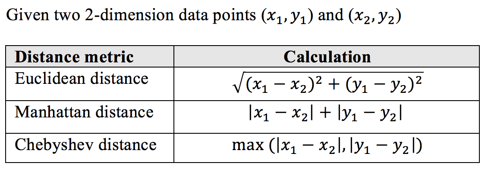
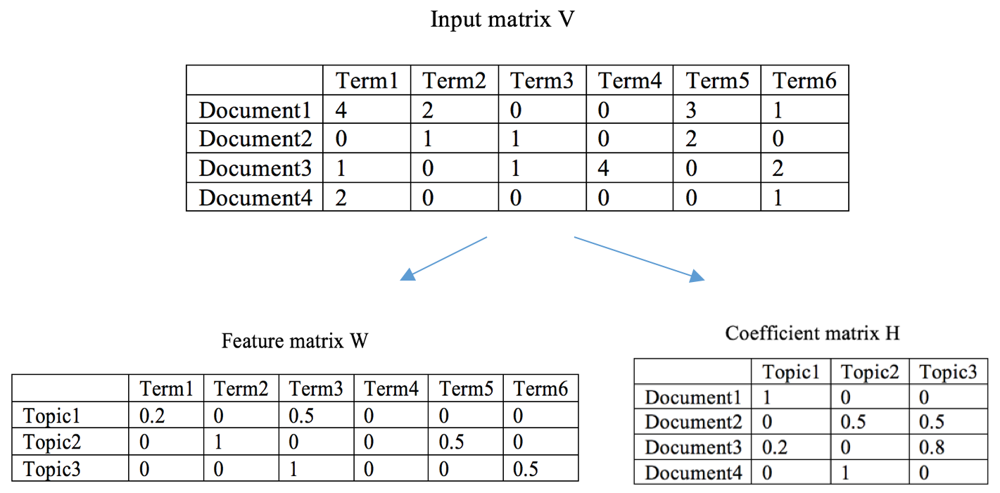
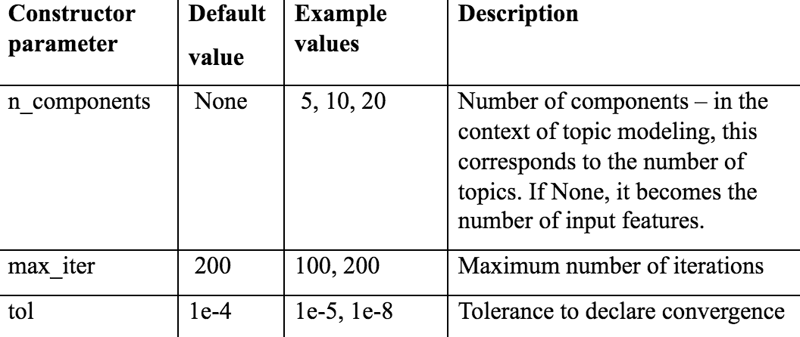
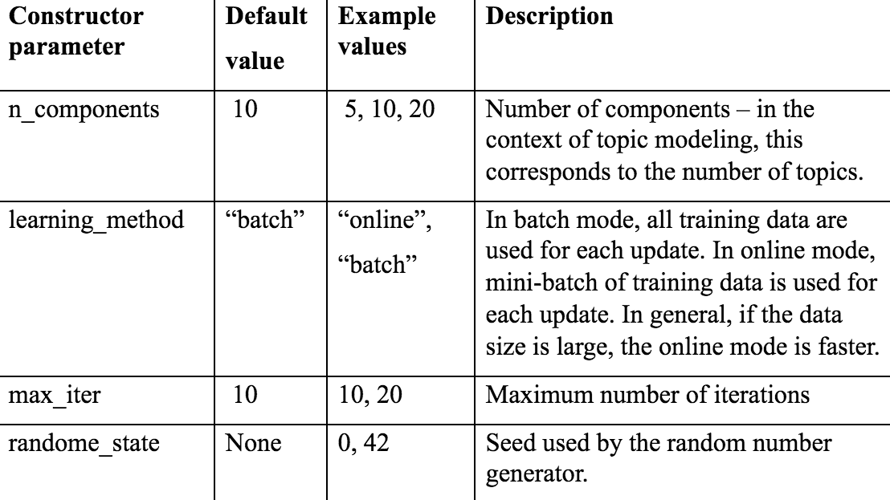

# Lab : Mining the 20 Newsgroups Dataset with Clustering and Topic Modeling Algorithms
In the previous chapter, we went through a text visualization using t-SNE. T-SNE, or any dimensionality reduction algorithm, is a type of unsupervised learning. Moving forward in this chapter, we will be continuing our unsupervised learning journey, specifically focusing specifically on clustering and topic modeling. We will start with how unsupervised learning learns without guidance and how it is good at discovering hidden information underneath data. Then we will talk about clustering as an important branch of unsupervised learning, which identifies different groups of observations from data. For instance, clustering is useful for market segmentation where consumers of similar behaviors are grouped into one segment for marketing purposes. We will perform clustering on the 20 newsgroups text dataset and see what clusters will be produced. Another unsupervised learning route we take is topic modeling, which is the process of extracting themes hidden in the dataset. You will be amused by how many interesting themes we are able to mine from the 20 newsgroups dataset.

We will cover the following topics:

- What is unsupervised learning?
- Types of unsupervised learning
- What is k-means clustering and how does it work?
- Implementing k-means clustering from scratch
- Implementing k-means with scikit-learn
- Optimizing k-means clustering models
- Term frequency-inverse document frequency
- Clustering newsgroups data using k-means
- What is topic modeling?
- Non-negative matrix factorization for topic modeling
- latent Dirichlet allocation for topic modeling
- Topic modeling on newsgroups data

#### Pre-reqs:
- Docker

#### Lab Environment
We will run Jupyter Notebook as a Docker container. This setup will take some time because of the size of the image. Run the following commands one by one:

`docker run -d --user root -p 8888:8888 --name jupyter -e GRANT_SUDO=yes jupyter/tensorflow-notebook:2ce7c06a61a1 start-notebook.sh`

`docker exec -it jupyter bash -c 'cd /home/jovyan/work && git clone https://github.com/athertahir/python-machine-learning-by-example.git && sudo && chmod +x ~/work/prepareContainer.sh && ~/prepareContainer.sh'`

`docker restart jupyter`

**Note:** After completing these steps, jupyter notebook will be accessible at port 8888 of the host machine.

All Notebooks are present in `work` folder.

#### Login
When the container is running, execute this statement:
`docker logs jupyter 2>&1 | grep -v "HEAD" `


This will show something like:

```
Copy/paste this URL into your browser when you connect for the first time, to login with a token:
    http://localhost:8888/?token=f89b02dd78479d52470b3c3a797408b20cc5a11e067e94b8
    THIS IS NOT YOUR TOKEN.  YOU HAVE TO SEARCH THE LOGS TO GET YOUR TOKEN
```

The token is the value behind `/?token=`. You need that for logging in.

**Note:** You can also run following command to get token directly:
`docker exec -it jupyter bash -c 'jupyter notebook list' | cut -d'=' -f 2 | cut -d' ' -f 1`


# Learning without guidance – unsupervised learning
In the previous chapter, we apply t-SNE to visualize the newsgroup text data in reduced 2 dimensions. T-SNE, or dimensionality reduction in general, is a type of unsupervised learning. Instead of having a teacher educating what particular output to produce, be it a class or membership (classification), be it a continuous value (regression), unsupervised learning identifies inherent structures or commonalities in the input data. Since there is no guidance in unsupervised learning, there is no clear answer on what is a right or wrong result. Unsupervised learning has the freedom to discover hidden information underneath input data.

An easy way to understand unsupervised learning is to think of going through many practice questions for an exam. In supervised learning, you are given answers to those practice questions. You basically figure out the relationship between the questions and answers and learn how to map the questions to the answers. Hopefully, you will do well in the actual exam in the end by giving the correct answers. However, in unsupervised learning, you are not provided with the answers to those practice questions. What you might do in this instance could include the following:

- Grouping similar practice questions so that you can later study related questions together at one time
- Finding questions that are highly repetitive so that you will not waste time on those
- Spotting rare questions so that you can be better prepared for them
- Extracting the key chunk of each question by removing boilerplate so you can cut to the point

You will notice that the outcomes of all these tasks are pretty open-ended. They are correct as long as they are able to describe the commonality, the structure underneath the data.

Practice questions are the features in machine learning, which are also often called attributes, observations, or predictive variables. Answers to questions are the labels in machine learning, which are also called targetsortarget variables. Practice questions with answers provided are labeled data. On the contrary, practice questions without answers are unlabeled data. Unsupervised learning works with unlabeled data and acts on that information without guidance.

Unsupervised learning can include the following types:

- **Clustering:** This means grouping data based on commonality, which is often used for exploratory data analysis. Grouping similar practice questions mentioned earlier is an example of clustering. Clustering techniques are widely used in customer segmentation or for grouping similar online behaviors for a marketing campaign.
- **Association:** This explores the co-occurrence of particular values of two or more features. Outlier detection (also called anomaly detection) is a typical case, where rare observations are identified. Spotting rare questions in the preceding example can be solved using outlier detection techniques.
- **Projection:** This maps the original feature space to a reduced dimensional space retaining or extracting a set of principal variables. Extracting the key chunk of practice questions is an example projection, or specifically a dimensionality reduction.

Unsupervised learning is extensively employed in the area of NLP mainly because of the difficulty of obtaining labeled text data. Unlike numerical data, such as house and stock data, online click streams, labeling text can sometimes be subjective, manual, and tedious. Unsupervised learning algorithms that do not require labels become effective when it comes to mining text data. In chapter 2 Exploring the 20 Newsgroups Dataset with Text Analysis Techniques, we have experienced using t-SNE to reduce dimensionality of text data. Now, let's explore text mining with clustering algorithms and topic modeling techniques. We start with clustering the newsgroups data.

# Clustering newsgroups data using k-means
The newsgroups data comes with labels, the categories of the newsgroups, and a number of categories that are closely related or even overlapping, for instance, the five computer groups: `comp.graphics`, `comp.os.ms-windows.misc`, `comp.sys.ibm.pc.hardware`, `comp.sys.mac.hardware`, and `comp.windows.x`, and the two religion-related ones, `alt.atheism` and `talk.religion.misc`.

Assuming those labels do not exist, will samples from related topics be clustered together? We, herein, resort to the k-means clustering algorithm.

#### How does k-means clustering work?
The goal of the k-means algorithm is to partition the data into k groups based on feature similarities. K is a predefined property of a k-means clustering model. Each of the k clusters are specified by a centroid (center of a cluster) and each data sample belongs to the cluster with the nearest centroid. During training, the algorithm iteratively updates the k centroids based on the data provided. Specifically, it involves the following steps:

**Specifying k:** The algorithm needs to know how many clusters to generate as an end result.
**Initializing centroids:** The algorithm starts with randomly selecting k samples from the dataset as centroids.
**Assigning clusters:** Now that we have k centroids, samples that share the same closest centroid constitute one cluster. K clusters are created as a result. Note that, closeness is usually measured by the Euclidean distance. Other metrics can also be used, such as the Manhattan distance and Chebyshev distance, which are listed in the following table:



**Updating centroids:** For each cluster, we need to recalculate its center point, which is the mean of all the samples in the cluster. K centroids are updated to be the means of corresponding clusters. This is why the algorithm is called k-means.
**Repeating step 3 and 4:** It keeps repeating assigning clusters and updating centroids until the model is converged where the centroids stop moving or move small enough, or enough iterations have been taken.

The outputs of a trained k-means clustering model include the following:

- The cluster ID of each training sample, ranging from 1 to k
- K centroids, which can be used to cluster new samples—the new sample will belong to the cluster of the closest centroid

It is very easy to understand the k-means clustering algorithm and its implementation is also straightforward, as we will discover next.

#### Implementing k-means from scratch
We use the iris dataset from scikit-learn as an example. Let's first load the data and visualize it.

##### Run Notebook
The Notebook opens in a new browser window. You can create a new notebook or open a local one. Check out the local folder `work/Chapter03` for several sample notebooks. Open and run `.ipynb` in the `work` folder.

You can open the Jupyter Notebook at `<host-ip>:8888/notebooks/work/Chapter03/kmeans_from_scratch.ipynb`

#### Implementing k-means with scikit-learn
Having developed our own k-means clustering model, we can now learn how to use scikit-learn for a quicker solution by performing the following steps:

##### Run Notebook
The Notebook opens in a new browser window. You can create a new notebook or open a local one. Check out the local folder `work/Chapter03` for several sample notebooks. Open and run `.ipynb` in the `work` folder.

You can open the Jupyter Notebook at `<host-ip>:8888/notebooks/work/Chapter03/kmeans_sklearn.ipynb`

#### Choosing the value of k
Let's return to our earlier discussion on what is the right value for k. In the preceding example, it is more intuitive to set it to 3 since we know there are three classes in total. However, in most cases, we don't know how many groups are sufficient or efficient, while the algorithm needs a specific value of k to start with. So, how can we choose the value for k? There is a famous approach called the Elbow method.

In the Elbow method, different values of k are chosen and corresponding models are trained; for each trained model, the sum of squared errors, or SSE (also called the sum of within-cluster distances) to centroids is calculated and is plotted against k. Note, for one cluster, the squared error (or the within-cluster distance) is computed as the sum of the squared distances from individual samples in the cluster to the centroid. The optimal k is chosen where the marginal drop of SSE starts to decrease dramatically. It means further clustering does not provide any substantial gain.

Let's apply the Elbow method to the example we covered in the previous section (that's what this book is all about). We perform k-means clustering under different values of k on the iris data:

##### Run Notebook
The Notebook opens in a new browser window. You can create a new notebook or open a local one. Check out the local folder `work/Chapter03` for several sample notebooks. Open and run `kmeans_elbow.ipynb` in the `work` folder.

#### Clustering newsgroups data using k-means
Up to this point, you should be very familiar with k-means clustering. Let's see what we are able to mine from the newsgroups dataset using this algorithm. We, herein, use all data from four categories as an example.

##### Run Notebook
The Notebook opens in a new browser window. You can create a new notebook or open a local one. Check out the local folder `work/Chapter03` for several sample notebooks. Open and run `kmeans_newsgroups.ipynb` in the `work` folder.

# Discovering underlying topics in newsgroups
A **topic model** is a type of statistical model for discovering the probability distributions of words linked to the topic. The topic in topic modeling does not exactly match the dictionary definition, but corresponds to a nebulous statistical concept, an abstraction occurs in a collection of documents.

When we read a document, we expect certain words appearing in the title or the body of the text to capture the semantic context of the document. An article about Python programming will have words such as class and function, while a story about snakes will have words such as eggs and afraid. Documents usually have multiple topics; for instance, this recipe is about three things, topic modeling, non-negative matrix factorization, and latent Dirichlet allocation, which we will discuss shortly. We can therefore define an additive model for topics by assigning different weights to topics.

**Topic modeling** is widely used for mining hidden semantic structures in given text data. There are two popular topic modeling algorithms—non-negative matrix factorization, and latent Dirichlet allocation. We will go through both of these in the next two sections.

# Topic modeling using NMF
**Non-negative matrix factorization (NMF)** relies heavily on linear algebra. It factorizes an input matrix, V, into a product of two smaller matrices, W and H, in such a way that these three matrices have no negative values. In the context of NLP, these three matrices have the following meanings:

- The input matrix V is the term counts or tf-idf matrix of size n * m, where n is the number of documents or samples, and m is the number of terms.
- The first decomposition output matrix W is the feature matrix of size t * m, where t is the number of topics specified. Each row of W represents a topic with each element in the row representing the rank of a term in the topic.
- The second decomposition output matrix H is the coefficient matrix of size n * t. Each row of H represents a document, with each element in the row representing the weight of a topic within the document.

How to derive the computation of W and H is beyond the scope of this book. However, you can refer to the following diagram to get a better sense of how NMF works:



If you are interested in reading more about NMF, feel free to check out the original paper Generalized Nonnegative Matrix Approximations with Bregman Divergences by Inderjit S. Dhillon and Suvrit Sra in NIPS 2005.

Let's now apply NMF to our newsgroups data. Scikit-learn has a nice module for decomposition that includes NMF:



##### Run Notebook
The Notebook opens in a new browser window. You can create a new notebook or open a local one. Check out the local folder `work/Chapter03` for several sample notebooks. Open and run `.ipynb` in the `work` folder.

You can open the Jupyter Notebook at `<host-ip>:8888/notebooks/work/Chapter03/nmf_newsgroups.ipynb`

# Topic modeling using LDA
Let's explore another popular topic modeling algorithm, latent Dirichlet allocation (LDA). LDA is a generative probabilistic graphical model that explains each input document by means of a mixture of topics with certain probabilities. Again, topic in topic modeling means a collection of words with a certain connection. In other words, LDA basically deals with two probability values, P(term | topic) and P(topic | document). This can be difficult to understand at the beginning. So, let's start from the bottom, the end result of an LDA model.

Let's take a look at the following set of documents:

```
Document 1: This restaurant is famous for fish and chips.
Document 2: I had fish and rice for lunch.
Document 3: My sister bought me a cute kitten.
Document 4: Some research shows eating too much rice is bad.
Document 5: I always forget to feed fish to my cat.
```

Now, let's say we want two topics. The topics derived from these documents may appear as follows:

```
Topic 1: 30% fish, 20% chip, 30% rice, 10% lunch, 10% restaurant (which we can interpret Topic 1 to be food related)
Topic 2: 40% cute, 40% cat, 10% fish, 10% feed (which we can interpret Topic 1 to be about pet)
```

Therefore, we find how each document is represented by these two topics:

```
Documents 1: 85% Topic 1, 15% Topic 2
Documents 2: 88% Topic 1, 12% Topic 2
Documents 3: 100% Topic 2
Documents 4: 100% Topic 1
Documents 5: 33% Topic 1, 67% Topic 2
```

After seeing a dummy example, we come back to its learning procedure:

- Specify the number of topics, T. Now we have topic 1, 2, …, and T.
- For each document, randomly assign one of the topics to each term in the document.
- For each document, calculate P(topic=t | document), which is the proportion of terms in the document that are assigned to the topic t.
- For each topic, calculate P(term=w | topic), which is the proportion of term w among all terms that are assigned to the topic.
- For each term w, reassign its topic based on the latest probabilities P(topic=t | document) and P(term=w | topic=t).
- Repeat steps 3 to step 5 under the latest topic distributions for each iteration. The training stops if the model converges or reaches the maximum number of iterations.

LDA is trained in a generative manner, where it tries to abstract from the documents a set of hidden topics that are likely to generate a certain collection of words.

With all this in mind, let's see LDA in action. The LDA model is also included in scikit-learn:

```
>>> from sklearn.decomposition import LatentDirichletAllocation
>>> t = 20
>>> lda = LatentDirichletAllocation(n_components=t, learning_method='batch',random_state=42)
```

Again, we specify 20 topics (n_components). The key parameters of the model are included in the following table:



##### Run Notebook
The Notebook opens in a new browser window. You can create a new notebook or open a local one. Check out the local folder `work/Chapter03` for several sample notebooks. Open and run `.ipynb` in the `work` folder.

You can open the Jupyter Notebook at `<host-ip>:8888/notebooks/work/Chapter03/lda_newsgroups.ipynb`

# Summary
The project in this chapter was about finding hidden similarity underneath newsgroups data, be it semantic groups, be it themes, or word clouds. We started with what unsupervised learning does and the typical types of unsupervised learning algorithms. We then introduced unsupervised learning clustering and studied a popular clustering algorithm, k-means, in detail. We also talked about tf-idf as a more efficient feature extraction tool for text data. After that, we performed k-means clustering on the newsgroups data and obtained four meaningful clusters. After examining the key terms in each resulting cluster, we went straight to extracting representative terms among original documents using topic modeling techniques. Two powerful topic modeling approaches, NMF and LDA, were discussed and implemented. Finally, we had some fun interpreting the topics we obtained from both methods.

# Exercises
- Perform k-means clustering on newsgroups data using different values of k, or use the Elbow method to find the optimal one. See if you get better grouping results.
- Try different numbers of topics, in either NMF or LDA, and see which one produces more meaningful topics in the end. It should be a fun exercise.
- Can you experiment with NMF or LDA on the entire 20 groups of newsgroups data? Are the resulting topics full of noise or gems?
