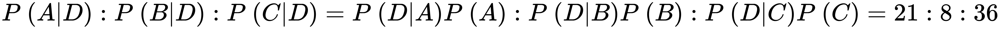
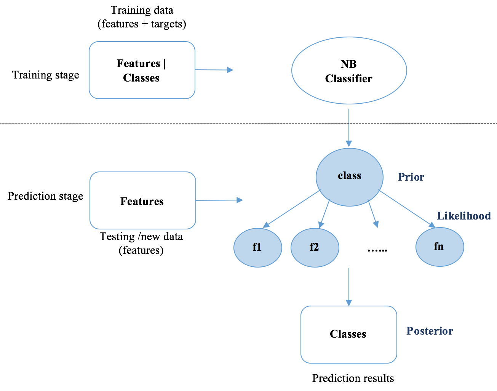
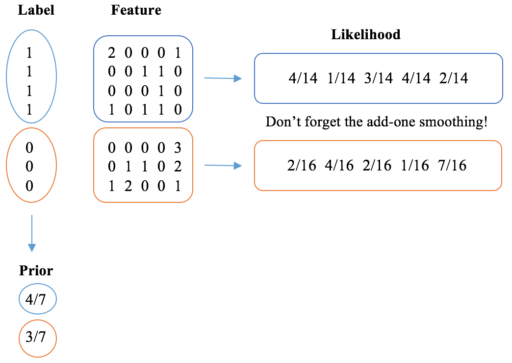

# Lab : Detecting Spam Email with Naive Bayes
As promised, in this chapter, we kick off our supervised learning journey with machine learning classification, specifically, binary classification. We will be learning with the goal of building a high-performing spam email detector. It is a good starting point to learn classification with a real-life example—our email service providers are already doing this for us, and so can we. We will be learning the fundamental concepts of classification, including what it does and its various types and applications, with a focus on solving spam detection using a simple yet powerful algorithm, Naïve Bayes. One last thing: we will be demonstrating how to fine-tune a model, which is an important skill for every data science or machine learning practitioner to learn.

We will get into detail on the following topics:

- What is machine learning classification?
- Types of classification
- Applications of text classification
- The Naïve Bayes classifier
- The mechanics of Naïve Bayes
- The Naïve Bayes implementations
- Spam email detection with Naïve Bayes
- Classification performance evaluation
- Cross-validation
- Tuning a classification model

#### Pre-reqs:
- Google Chrome (Recommended)

#### Lab Environment
Notebooks are ready to run. All packages have been installed. There is no requirement for any setup.

**Note:** Elev8ed Notebooks (powered by Jupyter) will be accessible at the port given to you by your instructor. Password for jupyterLab : `1234`

All Notebooks are present in `work/python-machine-learning-by-example` folder.

You can access jupyter lab at `<host-ip>:<port>/lab/workspaces/lab3_Naive_Bayes`

# Getting started with classification
Spam email detection is basically a machine learning classification problem. Let's get started by learning important concepts of machine learning classification. Classification is one of the main instances of supervised learning. Given a training set of data containing observations and their associated categorical outputs, the goal of classification is to learn a general rule that correctly maps the observations (also called features or predictivevariables) to the target categories (also called labels or classes). Put another way, a trained classification model will be generated after learning from features and targets of training samples, as shown in the first half of the following diagram. When new or unseen data comes in, the trained model will be able to determine their desired memberships. Class information will be predicted based on the known input features using the trained classification model, as displayed in the second half of the following diagram:


##### Types of classification
Based on the possibility of class output, machine learning classification can be categorized into binary classification, multiclass classification, and multilabel classification, as follows:

**Binary classification:** This classifies observations into one of two possible classes. The example of spam email filtering we mentioned earlier is a typical use case of binary classification, which identifies email messages (input observations) as spam or not spam (output classes). Customer churn prediction is another frequently mentioned example, where the prediction system takes in customer segment data and activity data from CRM systems and identifies which customers are likely to churn. Another application in the marketing and advertising industry is click-through prediction for online ads—that is, whether or not an ad will be clicked, given users' cookie information and browsing history. Last, but not least, binary classification has also been employed in biomedical science, for example, in early cancer diagnosis, classifying patients into high or low risk groups based on MRI images. As demonstrated in the following example, binary classification tries to find a way to separate data from two classes:


**Multiclass classification:** This classification is also called multinomial classification, and allows more than two possible classes, as opposed to only two in binary cases. Handwritten digit recognition is a common instance of classification and has a long history of research and development since the early 1900s. A classification system, for example, learns to read and understand handwritten ZIP codes (digits from 0 to 9 in most countries) by which envelopes are automatically sorted. Handwritten digit recognition has become a hello world in the journey of studying machine learning, and the scanned document dataset constructed from the National Institute of Standards and Technology, called MNIST (short for Modified National Institute of Standards and Technology), is a benchmark dataset frequently used to test and evaluate multiclass classification models. The following screenshot shows the four samples taken from the MNIST dataset:


In the following example, the multiclass classification model tries to find segregation boundaries to separate data from the following three different classes:


**Multi-label classification:** This classification is different from the first two types of classification, where target classes are disjointed. Research attention to this field has been increasingly drawn by the nature of the omnipresence of categories in modern applications. For example, a picture that captures a sea and sunset can simultaneously belong to both conceptual scenes, whereas it can only be an image of either cat or dog in a binary case, or one type of fruit among oranges, apples, and bananas in a multiclass case. Similarly, adventure films are often combined with other genres, such as fantasy, science fiction, horror, and drama. Another typical application is protein function classification, as a protein may have more than one function—storage, antibody, support, transport, and so on. One approach to solve an n label classification problem is to transform it into a set of n binary classifications problem, which is then handled by individual binary classifiers. Refer to the following diagram of restructuring a multi-label classification problem into multiple binary classification problems:


##### Applications of text classification
As was discussed in Chapter 3, Mining the 20 Newsgroups Dataset with Clustering and Topic Modeling Algorithms, unsupervised learning, including clustering and topic modeling, can be applied to text data. We will continue to see how supervised learning, specifically classification, is used in the text domain.

In fact, classification has been widely used in text analysis and news analytics. For instance, classification algorithms are used to identify news sentiment, positive or negative in a binary case, or positive, neutral, or negative in a multiclass classification case. News sentiment analysis provides a significant signal to trading in the stock market.

Another example that comes to mind is news topic classification, where classes may or may not be mutually exclusive. In the newsgroup example that we just worked on, classes are mutually exclusive (despite slight overlapping), such as computer graphics, motorcycles, baseball, hockey, space, and religion. We will demonstrate how to use machine learning algorithms to solve such multiclass classification problems in Chapter 5, Classifying Newsgroup Topic with Support Vector Machine. It is, however, good to realize that a news article is occasionally assigned multiple categories, where, properly speaking, multi-label classification is more suitable. For example, an article about the Olympic Games may be labeled as both sports and politics if there is an unexpected political involvement.

Finally, a text classification application that is perhaps difficult to realize is named-entity recognition (NER). Named entities are phrases of definitive categories, such as names of persons, companies, geographic locations, dates and times, quantities, and monetary values. NER is an important subtask of information extraction, to seek and identify such entities. For example, we can conduct NER on the following sentence: SpaceX[Organization], a California[Location]-based company founded by a famous tech entrepreneur Elon Musk[Person], announced that it would manufacture the next-generation, 9[Quantity]-meter-diameter launch vehicle and spaceship for the first orbital flight in 2020[Date].

To solve these problems, researchers have developed many power classification algorithms, among which Naïve Bayes and support vector machine (SVM) models are often used for text classification. In the following sections, we will cover the mechanics of Naïve Bayes and its in-depth implementation, along with other important concepts, including classifier tuning and classification performance evaluation.

# Exploring Naïve Bayes
The Naïve Bayes classifier belongs to the family of probabilistic classifiers that computes the probabilities of each predictive feature (also called attribute) of the data belonging to each class in order to make a prediction of probability distribution over all classes (of course, including the most likely class that the data sample is associated with). What it does, as its name indicates, is as follows:

- **Bayes:** As in, it maps the probabilities of observing input features given belonging classes, to the probability distribution over classes based on Bayes' theorem. We will explain Bayes' theorem with the later examples in this chapter
- **Naïve:** As in, it simplifies probability computation by assuming that predictive features are mutually independent.

## Learning Bayes' theorem by examples
It is important to understand Bayes' theorem before diving into the classifier. Let A and B denote two events. Events could be that it will rain tomorrow; 2 kings are drawn from a deck of cards; or a person has cancer. In Bayes' theorem, P(A |B) is the probability that A occurs given that B is true. It can be computed as follows:


Here, P(B|A) is the probability of observing B given that A occurs, while P(A) and P(B) are the probability that A and B occur, respectively. Too abstract? Let's look at some of the following concrete examples:

- **Example 1:** Given two coins, one is unfair with 90% of flips getting a head and 10% getting a tail, while the other one is fair. Randomly pick one coin and flip it. What is the probability that this coin is the unfair one, if we get a head?

We solve it by first denoting U for the event of picking the unfair coin, F for the fair coin, and H for the event of getting a head. So the probability that the unfair has been picked when we get a head, P(U|H) can be calculated with the following:


As we know P(H|U) is 90% . P(U) is 0.5 because we randomly pick a coin out of two. However, deriving the probability of getting a head P(H) is not that straightforward, as two events can lead to the following, where U  is when the unfair one is picked and F is when the fair coin is picked:


So P(U |H) becomes the following:


- **Example 2:** Suppose a physician reported the following cancer screening test scenario among 10,000 people:


It indicates for example 80 out of 100 cancer patients are correctly diagnosed, while the other 20 are not; cancer is falsely detected in 900 out of 9,900 healthy people.

If the result of this screening test on a person is positive, what is the probability that they actually has cancer?

Let's assign the event of having cancer and positive testing result as C and Pos respectively. Apply Bayes' theorem to calculate P(C|Pos):


Given a positive screening result, the chance that the subject has cancer is 8.16%, which is significantly higher than the one under general assumption (100/10000=1%) without undergoing the screening.

Example 3: Three machines A, B, and C in a factory account for 35%, 20%, and 45% of the bulb production. And the fraction of defective bulbs produced by each machine is 1.5%, 1%, and 2% respectively. A bulb produced by this factory was identified defective, which is denoted as event D. What are the probabilities that this bulb was manufactured by machine A, B, and C respectively?
   Again, simply just follow Bayes' theorem, as follows:


Also, either way, we do not even need to calculate P(D) since we know that the following is the case:



We too know the following concept:


So we have the following formula:


After making sense of Bayes' theorem as the backbone of Naïve Bayes, we can easily move forward with the classifier itself.

#### The mechanics of Naïve Bayes
Let's start with understanding the magic behind the algorithm—how Naïve Bayes works. Given a data sample x with n features, x1, x2, …, xn (x represents a feature vector and x = (x1, x2, …, xn)), the goal of Naïve Bayes is to determine the probabilities that this sample belongs to each of K possible classes y1, y2, …, yK, that is P( yk |x) or P(x1, x2, …, xn), where k = 1, 2, …, K. It looks no different from what we have just dealt with: x, or x1, x2, …, xn, is a joint event that the sample has features with valuesx1, x2, …, xn respectively, ykis an event that the sample belongs to class k. We can apply Bayes' theorem right away:


Let's look at each component in detail:

- P (yk) portrays how classes are distributed, provided with no further knowledge of observation features. Thus, it is also called prior in Bayesian probability terminology. Prior can be either predetermined (usually in a uniform manner where each class has an equal chance of occurrence) or learned from a set of training samples.
- P( yk |x), in contrast to prior P (yk), is the posterior with extra knowledge of observation.
- P(x | yk), or P(x1, x2, …, xn|yk) is the joint distribution of n features, given the sample belongs to class yk. This is how likely the features with such values co-occur. This is named likelihood in Bayesian terminology. Obviously, the likelihood will be difficult to compute as the number of features increases. 
In Naïve Bayes, this is solved thanks to the feature independence assumption. The joint conditional distribution of n features can be expressed as the joint product of individual feature conditional distributions:


Each conditional distribution can be efficiently learned from a set of training samples.

- P(x), also called evidence, solely depends on the overall distribution of features, which is not specific to certain classes and is therefore constant. As a result, posterior is proportional to prior and likelihood:


The following diagram summarizes how a Naïve Bayes classification model is trained and applied to new data:



Let's see a Naïve Bayes classifier in action through an example before we jump to its implementations. Given four (pseudo) emails shown in the following table, we are asked to predict how likely it is that a new email is spam:


First, define the S and NS events as an email being spam or not spam respectively. From the training set, we can easily get the following:


Or we can also impose an assumption of prior that P (S)= 1%.

To calculate P(S |x) where x = (free, setup, meeting, free), the first step is to compute P(free |S), P(setup |S), and P(meeting |S) based on the training set; that is, the ratio of the occurrence of a term to that of all terms in the S class. However, as the term free was not seen in the NS class training set, P(free |NS) will become 0, so will P(x |NS) and P(NS |x). It will be predicted as spam email, falsely. To eliminate the zero multiplication factor, the unseen term, we usually set each term frequency an initial value 1, that is, we start counting term occurrence from one. This technique is also called Laplacesmoothing. With this amendment, now we have the following:


Here, 9 is the total number of term occurrences from the S class (3+3+3), 4 is the total term occurrences from the NS class, and 6 comes from the 1 additional count per term (click, win, prize, meeting, setup, free). Similarly, we can compute the following:


Hence we have the following formula:


Also, remember this:


So, finally, we have the following:


There is 47.1% chance that the new email is spam.

#### Implementing Naïve Bayes from scratch
After a hand-calculating spam email detection example, as promised, we are going to code it through a genuine dataset, taken from the Enron email dataset http://www.aueb.gr/users/ion/data/enron-spam/. The specific dataset we are using can be directly downloaded via http://www.aueb.gr/users/ion/data/enron-spam/preprocessed/enron1.tar.gz. You can either unzip it using software, or run the following command line on your terminal:

`tar -xvz enron1.tar.gz`

The uncompressed folder includes a folder of ham, or non-spam, email text files, and a folder of spam email text files, as well as a summary description of the database:

```
enron1/
  ham/
    0001.1999-12-10.farmer.ham.txt
       0002.1999-12-13.farmer.ham.txt
       ……
       ……
    5172.2002-01-11.farmer.ham.txt
  spam/
    0006.2003-12-18.GP.spam.txt
       0008.2003-12-18.GP.spam.txt
       ……
       ……
       5171.2005-09-06.GP.spam.txt
  Summary.txt
```

Given a dataset for a classification problem, it is always good to keep in mind the number of samples per class and the proportion of samples from each class before applying any machine learning techniques. As written in the Summary.txt file, there are 3,672 ham (legitimate) emails and 1,500 spam emails so the spam: the legitimate-to-spam ratio is approximately 1:3 here. If such information was not given, you can also get the numbers by running the following commands:

```
ls -1 enron1/ham/*.txt | wc -l
3672
ls -1 enron1/spam/*.txt | wc -l
1500
```

Note
Class imbalance is critical to classification performance. Imagine if most samples are from one class—the classifier tends to only learn from the dominant class and neglect the minorities. Hence, paying extra attention to class imbalance is always recommended. If it does occur, we need to either downsample the majority class, or upsample the minor class, in order to mitigate the disproportion.

Let's have a look at a legitimate and a spam email by running the following scripts from the same path where the unzipped folder is located:

```
file_path = 'enron1/ham/0007.1999-12-14.farmer.ham.txt'
with open(file_path, 'r') as infile:
    ham_sample = infile.read()
print(ham_sample)
Subject: mcmullen gas for 11 / 99
jackie ,
since the inlet to 3 river plant is shut in on 10 / 19 / 99 ( the 
last day of flow ) :
at what meter is the mcmullen gas being diverted to ?
at what meter is hpl buying the residue gas ? ( this is the gas 
from teco ,vastar , vintage , tejones , and swift )
i still see active deals at meter 3405 in path manager for teco , 
vastar ,vintage , tejones , and swift
i also see gas scheduled in pops at meter 3404 and 3405 .
please advice . we need to resolve this as soon as possible so 
settlement can send out payments .
thanks
```

Similarly, the spam sample is as follows:

```
file_path = 'enron1/spam/0058.2003-12-21.GP.spam.txt'
with open(file_path, 'r') as infile:
   spam_sample = infile.read()
print(spam_sample)
Subject: stacey automated system generating 8 k per week parallelogram
people are
getting rich using this system ! now it ' s your
turn !
we ' ve
cracked the code and will show you . . . .
this is the
only system that does everything for you , so you can make
money
. . . . . . . .
because your
success is . . . completely automated !
let me show
you how !
click
here
to opt out click here % random _ text
```

Next, we read all of the email text files and keep the ham/spam class information in the labels variable, where 1 represents spam emails, and 0 is for ham.

First, import the necessary modules, glob and os, in order to find all the .txt email files, and initialize the variables, keeping the text data and labels:

```
import glob
import os
emails, labels = [], []
```

Then, to load the spam email files, run the following commands:

```
file_path = 'enron1/spam/'
for filename in glob.glob(os.path.join(file_path, '*.txt')):
    with open(filename, 'r', encoding="ISO-8859-1") as infile:
        emails.append(infile.read())
        labels.append(1)
        
```

Load the legitimate email files by running the following commands:

```
file_path = 'enron1/ham/'
for filename in glob.glob(os.path.join(file_path, '*.txt')):
    with open(filename, 'r', encoding="ISO-8859-1") as infile:
        emails.append(infile.read())
        labels.append(0)
len(emails)
5172
len(labels)
5172
```

The next step is to preprocess and clean the raw text data. To briefly recap, this includes the following:

- Number and punctuation removal
- Human name removal (optional)
- Stop-word removal
- Lemmatization

We herein reuse the code we developed in the previous two chapters:

```
from nltk.corpus import names
from nltk.stem import WordNetLemmatizer
def is_letter_only(word):
    return word.isalpha()
all_names = set(names.words())
lemmatizer = WordNetLemmatizer()
```

Put together a function performing text cleaning as follows:

```
def clean_text(docs):
    docs_cleaned = []
    for doc in docs:
        doc = doc.lower()
        doc_cleaned = ' '.join(lemmatizer.lemmatize(word)
                    for word in doc.split() if is_letter_only(word)
                    and word not in all_names)
        docs_cleaned.append(doc_cleaned)
    return docs_cleaned
emails_cleaned = clean_text(emails)
```

This leads to stop-word removal and term feature extraction, as follows:

```
from sklearn.feature_extraction.text import CountVectorizer
cv = CountVectorizer(stop_words="english", max_features=1000,
                                             max_df=0.5, min_df=2)
docs_cv = cv.fit_transform(emails_cleaned)
```

The max_features parameter is set to 1000, so it only considers the 1,000 most frequent terms, excluding those that are too common (50% max_df) and too rare (2 min_df). We can definitely tweak this parameter later on in order to achieve higher classification accuracy.

In case you forget what the resulting term vectors look like, let's take a peek:

```
print(docs_cv[0])
 (0, 932) 1
 (0, 968) 1
 (0, 715) 1
 (0, 151) 1
 (0, 585) 1
 (0, 864) 1
 (0, 506) 1
 (0, 691) 1
 (0, 897) 1
 (0, 476) 1
 (0, 72)  1
 (0, 86)  2
 (0, 997) 1
 (0, 103) 1
 (0, 361) 2
 (0, 229) 1
 (0, 363) 2
 (0, 482) 2
 (0, 265) 2
```

The sparse vector is in the form of the following:

```
  (row index, term index) term_frequency
```

We can also see what the corresponding terms are, as follows:

```
terms = cv.get_feature_names()
print(terms[932])
unsubscribe
print(terms[968])
website
print(terms[715])
read
```

With the docs_cv feature matrix just generated, we can now develop and train our Naïve Bayes model, from scratch as always.

Starting with the prior, we first group the data by label and record the index of samples:

```
def get_label_index(labels):
    from collections import defaultdict
    label_index = defaultdict(list)
    for index, label in enumerate(labels):
        label_index[label].append(index)
    return label_index
label_index = get_label_index(labels)
```

The resulting label_index looks like {0: [3000, 3001, 3002, 3003, …… 6670, 6671], 1: [0, 1, 2, 3, …., 2998, 2999]}, where training sample indices are grouped by class. With this, we calculate prior:

```
def get_prior(label_index):
    """
    Compute prior based on training samples
    @param label_index: grouped sample indices by class
    @return: dictionary, with class label as key, corresponding
                                                  prior as the value
    """
    prior = {label: len(index) for label, index in
                                       label_index.items()}
    total_count = sum(prior.values())
    for label in prior:
        prior[label] /= float(total_count)
    return prior
prior = get_prior(label_index)
print('Prior:', prior)
Prior: {1: 0.2900232018561485, 0: 0.7099767981438515}
```

With prior calculated, we continue with likelihood:

```
import numpy as np
def get_likelihood(term_matrix, label_index, smoothing=0):
    """
    Compute likelihood based on training samples
    @param term_matrix: sparse matrix of the term frequency features
    @param label_index: grouped sample indices by class
    @param smoothing: integer, additive Laplace smoothing parameter
    @return: dictionary, with class as key, corresponding conditional      
                 probability P(feature|class) vector as value
    """
    likelihood = {}
    for label, index in label_index.items():
        likelihood[label] = term_matrix[index, :].sum(axis=0) +
                                                           smoothing
        likelihood[label] = np.asarray(likelihood[label])[0]
        total_count = likelihood[label].sum()
        likelihood[label] = likelihood[label] /
                                            float(total_count)
    return likelihood
```

We set the smoothing value to 1 here, which can also be 0 for no smoothing, and any other positive value, as long as high classification performance is achieved:

```
smoothing = 1
likelihood = get_likelihood(docs_cv, label_index, smoothing)
len(likelihood[0])
1000
```

The likelihood[0] parameter is the conditional probability P(feature | legitimate) vector of length 1,000 (1,000 features) for the legitimate class. Probabilities P(feature | legitimate) for the first five features are as follows:

```
likelihood[0][:5]
[0.00024653 0.00090705 0.00080007 0.00032096 0.00073495]
```

And you can probably guess that likelihood[1] would be for the spam class. Similarly, the first five conditional probabilities P(feature | spam)are:

```
likelihood[1][:5]
[0.00063304 0.00078026 0.00101581 0.00022083 0.00326826]
```

If you ever find any of these confusing, feel free to check the following toy example to refresh (14 comes from 2 + 1 + 1 + 1 + 1 + 1 + 1 + smoothing 1 * 5, 16 comes from 1 + 1 + 2 + 1 + 3 + 2 + 1 + smoothing 1 * 5):



With prior and likelihood ready, we can now compute the posterior for the testing/new samples. There is a trick we use: instead of calculating the multiplication of hundreds of thousands of small value conditional probabilities of P(feature | class) (for example, 0.00024653, as we just saw), which may cause overflow error, we instead calculate the summation of their natural logarithms, then convert it back to its natural exponential value:

```
def get_posterior(term_matrix, prior, likelihood):
    """
    Compute posterior of testing samples, based on prior and likelihood
    @param term_matrix: sparse matrix of the term frequency features
    @param prior: dictionary, with class label as key,
                                  corresponding prior as the value
    @param likelihood: dictionary, with class label as key,
                     corresponding conditional probability vector as value
    @return: dictionary, with class label as key, corresponding
                                                  posterior as value
    """
    num_docs = term_matrix.shape[0]
    posteriors = []
    for i in range(num_docs):
        # posterior is proportional to prior * likelihood
        # = exp(log(prior * likelihood))
        # = exp(log(prior) + log(likelihood))
        posterior = {key: np.log(prior_label) for key,
                                      prior_label in prior.items()}
        for label, likelihood_label in likelihood.items():
            term_document_vector = term_matrix.getrow(i)
            counts = term_document_vector.data
            indices = term_document_vector.indices
            for count, index in zip(counts, indices):
                posterior[label] +=
                         np.log(likelihood_label[index]) * count
        # exp(-1000):exp(-999) will cause zero division error,
        # however it equates to exp(0):exp(1)
        min_log_posterior = min(posterior.values())
        for label in posterior:
            try:
                posterior[label] = np.exp(
                               posterior[label] - min_log_posterior)
            except:
                posterior[label] = float('inf')
        # normalize so that all sums up to 1
        sum_posterior = sum(posterior.values())
        for label in posterior:
            if posterior[label] == float('inf'):
                posterior[label] = 1.0
            else:
                posterior[label] /= sum_posterior
        posteriors.append(posterior.copy())
    return posteriors
```

The prediction function is finished. Let's take one ham and one spam sample from another Enron email dataset to quickly verify our algorithm:

```
emails_test = [
    '''Subject: flat screens
    hello ,
    please call or contact regarding the other flat screens
    requested .
    trisha tlapek - eb 3132 b
    michael sergeev - eb 3132 a
    also the sun blocker that was taken away from eb 3131 a .
    trisha should two monitors also michael .
    thanks
    kevin moore''',
    '''Subject: let ' s stop the mlm insanity !
    still believe you can earn $ 100 , 000 fast in mlm ? get real !
    get emm , a brand new system that replaces mlm with something that works !
    start earning 1 , 000 ' s now ! up to $ 10 , 000 per week doing simple 
    online tasks .
    free info - breakfree @ luxmail . com - type " send emm info " in the 
    subject box .
    this message is sent in compliance of the proposed bill section 301 . per 
    section 301 , paragraph ( a ) ( 2 ) ( c ) of s . 1618 . further transmission 
    to you by the sender of this e - mail may be stopped at no cost to you by        
    sending a reply to : " email address " with the word remove in the subject 
    line .''',
]
```

Go through the same cleaning and preprocessing steps as in training stage:

```
emails_cleaned_test = clean_text(emails_test)
term_docs_test = cv.transform(emails_cleaned_test)
posterior = get_posterior(term_docs_test, prior, likelihood)
print(posterior)
[{1: 5.958269329017321e-08, 0: 0.9999999404173067},
{1: 0.9999999999999948, 0: 5.2138625988879895e-15}]
```

For the first email, 99.5% legitimate; the second email nearly 100% spam. Both are predicted correctly.

Further, to comprehensively evaluate our classifier's performance, we can randomly split the original dataset into two sets, the training and testing sets, which simulate learning data and prediction data respectively. Generally, the proportion of the original dataset to include in the testing split can be 25%, 33.3%, or 40%. We use the train_test_split function from scikit-learn to do the random splitting and to preserve the percentage of samples for each class:

```
from sklearn.model_selection import train_test_split
X_train, X_test, Y_train, Y_test =
              train_test_split(emails_cleaned, labels, test_size=0.33,
              random_state=42)
```

Note
It is a good practice to assign a fixed random_state (for example, 42) during experiments and exploration in order to guarantee that the same training and testing sets are generated every time the program runs. This allows us to make sure that the classifier functions and performs well on a fixed dataset before we incorporate randomness and proceed further.

Check the training size and testing size as follows:

```
len(X_train), len(Y_train)
(3465, 3465)
len(X_test), len(Y_test)
(1707, 1707)
```

Retrain the term frequency CountVectorizer based on the training set and recompute prior and likelihood accordingly:

```
term_docs_train = cv.fit_transform(X_train)  
label_index = get_label_index(Y_train)
prior = get_prior(label_index)
likelihood = get_likelihood(term_docs_train, label_index, smoothing)
```

We then convert the testing documents into term matrix as follows:

```
term_docs_test = cv.transform(X_test)
```

Note
It is noted that we can't train CountVectorizer using both the training and testing sets. Otherwise, it will cause data leakage, as the testing set is supposed to be unknown beforehand to all feature extractors. Hence, the term pool and the term counter should be built solely on the training set.

Now, predict the posterior of the testing/new dataset as follows:

```
posterior = get_posterior(term_docs_test, prior, likelihood)
```

Finally, we evaluate the model's performance with classification accuracy, which is the proportion of correct prediction:

```
correct = 0.0
for pred, actual in zip(posterior, Y_test):
    if actual == 1:
        if pred[1] >= 0.5:
            correct += 1
    elif pred[0] > 0.5:
        correct += 1
print('The accuracy on {0} testing samples is:
         {1:.1f}%'.format(len(Y_test), correct/len(Y_test)*100))
```

The accuracy on 1707 testing samples is: 93.0%
The NaïveBayesclassifier we just developed line by line correctly classifies 93% emails!

Implementing Naïve Bayes with scikit-learn
Coding from scratch and implementing on your own solutions is the best way to learn about machine learning model. Of course, we can take a shortcut by directly using the MultinomialNB class from the scikit-learn API:

```
from sklearn.naive_bayes import MultinomialNB
```

Let's initialize a model with a smoothing factor (specified as alpha in scikit-learn) of 1.0, and prior learned from the training set (specified as fit_prior in scikit-learn):

```
clf = MultinomialNB(alpha=1.0, fit_prior=True)
```

To train the Naïve Bayes classifier with the fit method, use the following command:

```
clf.fit(term_docs_train, Y_train)
```

And to obtain the prediction results with the predict_proba method, use the following commands:

```
prediction_prob = clf.predict_proba(term_docs_test)
prediction_prob[0:10]
[[1.00000000e+00 3.96500362e-13]
[1.00000000e+00 2.15303766e-81]
[6.59774100e-01 3.40225900e-01]
[1.00000000e+00 2.28043493e-15]
[1.00000000e+00 1.77156705e-15]
[5.53261316e-05 9.99944674e-01]
[0.00000000e+00 1.00000000e+00]
[1.00000000e+00 3.49697719e-28]
[1.00000000e+00 4.43498548e-14]
[3.39263684e-01 6.60736316e-01]]
```

Do the following to directly acquire the predicted class values with the predict method (0.5 is the default threshold; if the predicted probability of class 1 is great than 0.5, class 1 is assigned, otherwise, 0 is used):

```
prediction = clf.predict(term_docs_test)
prediction[:10]
[0 0 0 0 0 1 1 0 0 1]
```

Finally, we measure the accuracy performance by calling the score method:

```
accuracy = clf.score(term_docs_test, Y_test)
print('The accuracy using MultinomialNB is:
                                {0:.1f}%'.format(accuracy*100))
```

The accuracy using MultinomialNB is: 93.0%

# Classification performance evaluation
So far, we have covered in depth the first machine learning classifier and evaluated its performance by prediction accuracy. Beyond accuracy, there are several measurements that give us more insight and allow us to avoid class imbalance effects. They are as follows:

- Confusion matrix
- Precision
- recall
- F1 score
- AUC

A confusion matrix summarizes testing instances by their predicted values and true values, presented as a contingency table:


To illustrate this, we compute the confusion matrix of our Naïve Bayes classifier. Herein, the confusion_matrix function of scikit-learn is used, but it is very easy to code it ourselves:

```
from sklearn.metrics import confusion_matrix
confusion_matrix(Y_test, prediction, labels=[0, 1])
[[1102   89]
[  31 485]]
```

Note that we consider 1, the spam class, to be positive. From the confusion matrix, for example, there are 93 false-positive cases (where it misinterprets a legitimate email as a spam one), and 43 false-negative cases (where it fails to detect a spam email). So, classification accuracy is just the proportion of all true cases:


Precision measures the fraction of positive calls that are correct, which is


 and


in our case.

Recall, on the other hand, measures the fraction of true positives that are correctly identified, which is


and


in our case. Recall is also called true positive rate.

The f1 score comprehensively includes both the precision and the recall, and equates to their harmonic mean:


. We tend to value the f1 score above precision or recall alone.

Let's compute these three measurements using corresponding functions from scikit-learn, as follows:

```
from sklearn.metrics import precision_score, recall_score, f1_score
precision_score(Y_test, prediction, pos_label=1)
0.8449477351916377
recall_score(Y_test, prediction, pos_label=1)
0.939922480620155
f1_score(Y_test, prediction, pos_label=1)
0.889908256880734
```

0, the legitimate class, can also be viewed as positive, depending on the context. For example, assign the 0 class as pos_label:

```
f1_score(Y_test, prediction, pos_label=0)
0.9483648881239244
```

To obtain the precision, recall, and f1 score for each class, instead of exhausting all class labels in the three function calls above, a quicker way is to call the classification_report function:

```
from sklearn.metrics import classification_report
report = classification_report(Y_test, prediction)
print(report)
          precision  recall f1-score support

      0       0.97    0.93     0.95    1191
      1       0.84    0.94     0.89     516

 micro avg    0.93    0.93     0.93    1707
 macro avg    0.91    0.93     0.92    1707
weighted avg  0.93    0.93     0.93    1707
```

Here, avg is the weighted average according to the proportions of the class.

The measurement report provides a comprehensive view on how the classifier performs on each class. It is, as a result, useful in imbalanced classification, where we can easily obtain a high accuracy by simply classifying every sample as the dominant class, while the precision, recall, and f1 score measurements for the minority class however will be significantly low.

Precision, recall, and f1 score are also applicable to the multiclass classification, where we can simply treat a class we are interested in as a positive case, and any other classes as negative cases.

During the process of tweaking a binary classifier (that is, trying out different combinations of hyperparameters, for example, term feature dimension, a smoothing factor in our spam email classifier), it would be perfect if there was a set of parameters in which the highest averaged and class individual f1 scores achieve at the same time. It is, however, usually not the case. Sometimes, a model has a higher average f1 score than another model, but a significantly low f1 score for a particular class; sometimes, two models have the same average f1 scores, but one has a higher f1 score for one class and lower score for another class. In situations like these, how can we judge which model works better? Area under the curve (AUC) of the receiver operating characteristic (ROC) is a united measurement frequently used in binary classification.

The ROC curve is a plot of the true positive rate versus the false positive rate at various probability thresholds, ranging from 0 to 1. For a testing sample, if the probability of a positive class is greater than the threshold, then a positive class is assigned; otherwise, we use negative. To recap, the true positive rate is equivalent to recall, and the false positive rate is the fraction of negatives that are incorrectly identified as positive. Let's code and exhibit the ROC curve (under thresholds of 0.0, 0.1, 0.2, …, 1.0) of our model:

```
pos_prob = prediction_prob[:, 1]
thresholds = np.arange(0.0, 1.2, 0.1)
true_pos, false_pos = [0]*len(thresholds), [0]*len(thresholds)
for pred, y in zip(pos_prob, Y_test):
    for i, threshold in enumerate(thresholds):
        if pred >= threshold:
               # if truth and prediction are both 1
            if y == 1:
                true_pos[i] += 1
               # if truth is 0 while prediction is 1
            else:
                false_pos[i] += 1
        else:
            break
```

Then calculate the true and false positive rates for all threshold settings (remember, there are 516.0 positive testing samples and 1191 negative ones):

```
true_pos_rate = [tp / 516.0 for tp in true_pos]
false_pos_rate = [fp / 1191.0 for fp in false_pos]
```

Now we can plot the ROC curve with matplotlib:

```
import matplotlib.pyplot as plt
plt.figure()
lw = 2
plt.plot(false_pos_rate, true_pos_rate, color='darkorange', lw=lw)
plt.plot([0, 1], [0, 1], color='navy', lw=lw, linestyle='--')
plt.xlim([0.0, 1.0])
plt.ylim([0.0, 1.05])
plt.xlabel('False Positive Rate')
plt.ylabel('True Positive Rate')
plt.title('Receiver Operating Characteristic')
plt.legend(loc="lower right")
plt.show()
```

Refer to the following screenshot for the resulting ROC curve:


In the graph, the dashed line is the baseline representing random guessing where the true positive rate increases linearly with the false positive rate. Its AUC is 0.5; the orange line is the ROC plot of our model, and its AUC is somewhat less than 1. In a perfect case, the true positive samples have a probability of 1, so that the ROC starts at the point with 100% true positive and 0 false positive. The AUC of such a perfect curve is 1. To compute the exact AUC of our model, we can resort to the roc_auc_score function of scikit-learn:

```
from sklearn.metrics import roc_auc_score
roc_auc_score(Y_test, pos_prob)
0.965361984912685
```

# Model tuning and cross-validation
Having learned what metrics to use to measure a classification model, we'll now study how to measure it properly. We simply can avoid adopting the classification results from one fixed testing set, which we did in experiments previously. Instead, we usually apply the k-fold cross-validation technique to assess how a model will generally perform in practice.

In the k-fold cross-validation setting, the original data is first randomly divided into the k equal-sized subsets, in which class proportion is often preserved. Each of these k subsets is then successively retained as the testing set for evaluating the model. During each trial, the rest k -1 subsets (excluding the one-fold holdout) form the training set for driving the model. Finally, the average performance across all k trials is calculated to generate an overall result:


Statistically, the averaged performance of k-fold cross-validation is an accurate estimate of how a model performs in general. Given different sets of parameters pertaining to a machine learning model and/or data preprocessing algorithms, or even two or more different models, the goal of model tuning and/or model selection is to pick a set of parameters of a classifier so that the best averaged performance is achieved. With these concepts in mind, we can now start to tweak our Naïve Bayes classifier, incorporating cross-validation and AUC of ROC measurement.

Note
In k-fold cross-validation, k is usually set 3, 5, or 10. If the training size is small, a large k (5 or 10) is recommended to ensure enough training samples in each fold. If the training size is large, a small value (such 3 or 4) works fine since a higher k will lead to even higher computational cost of training on large dataset.

We herein use the split() method from the StratifiedKFold class of scikit-learn to divide the data into chunks with preserved class fractions:

```
from sklearn.model_selection import StratifiedKFold
k = 10
k_fold = StratifiedKFold(n_splits=k, random_state=42)
cleaned_emails_np = np.array(cleaned_emails)
labels_np = np.array(labels)
```

After initializing a 10-fold generator, we choose to explore the following values for the following parameters:

max_features: This represents the n most frequent terms used as feature space
alpha: This represents the smoothing factor, the initial count for a term
fit_prior: This represents whether or not to use prior tailored to the training data
We start with the following options:

```
max_features_option = [2000, 8000, None]
smoothing_factor_option = [0.5, 1.0, 2.0, 4.0]
fit_prior_option = [True, False]
auc_record = {}
```

Then, for each fold generated by the split() method of the k_fold object, repeat the process of term count feature extraction, classifier training, and prediction with one of the aforementioned combinations of parameters, and record the resulting AUCs:

```
for train_indices, test_indices in k_fold.split(emails_cleaned,
                                                            labels):
    X_train, X_test = cleaned_emails_np[train_indices],
                                cleaned_emails_np[test_indices]
    Y_train, Y_test = labels_np[train_indices],
                                  labels_np[test_indices]
    for max_features in max_features_option:
        if max_features not in auc_record:
            auc_record[max_features] = {}
        cv = CountVectorizer(stop_words="english",
                    max_features=max_features, max_df=0.5, min_df=2)
        term_docs_train = cv.fit_transform(X_train)
        term_docs_test = cv.transform(X_test)
        for alpha in smoothing_factor_option:
            if alpha not in auc_record[max_features]:
                auc_record[max_features][alpha] = {}
            for fit_prior in fit_prior_option:
                clf = MultinomialNB(alpha=alpha, fit_prior=fit_prior)
                clf.fit(term_docs_train, Y_train)
                prediction_prob = clf.predict_proba(term_docs_test)
                pos_prob = prediction_prob[:, 1]
                auc = roc_auc_score(Y_test, pos_prob)
                auc_record[max_features][alpha][fit_prior] = 
                                auc+ auc_record[max_features][alpha].get(
                                fit_prior, 0.0)
```

Finally, we present the results as follows:

```
print('max features  smoothing fit prior auc')
for max_features, max_feature_record in auc_record.items():
    for smoothing, smoothing_record in max_feature_record.items():
        for fit_prior, auc in smoothing_record.items():
            print(' {0}      {1}   {2}
                   {3:.5f}'.format(
                   max_features, smoothing, fit_prior, auc/k))
max features  smoothing   fit prior   auc
        2000      0.5      False     0.97421
        2000      1.0      True      0.97237
        2000      1.0      False     0.97238
        2000      2.0 .    True      0.97043
        2000      2.0      False     0.97057
        2000      4.0      True      0.96853
        2000      4.0      False     0.96843
        8000      0.5      True      0.98533
        8000      0.5      False     0.98530
        8000      1.0      True      0.98428
        8000      1.0      False     0.98430
        8000      2.0      True      0.98338
        8000      2.0      False     0.98337
        8000      4.0      True      0.98291
        8000      4.0      False     0.98296
        None      0.5      True      0.98890
        None      0.5      False     0.98884
        None      1.0      True      0.98899
        None      1.0      False     0.98904
        None      2.0      True      0.98906
        None      2.0      False     0.98915
        None      4.0      True      0.98965
        None      4.0      False     0.98969
```

The (None, 4.0, False) set enables the best AUC, at 0.98969. In fact, not limiting the maximal number of features outperforms doing so, as 4.0, the highest smoothing factor, always beats other values. Hence, we conduct a second tweak, with the following options for greater values of smoothing factor:

```
max_features_option = [None]
smoothing_factor_option = [4.0, 10, 16, 20, 32]
fit_prior_option = [True, False]
```

Repeat the cross-validation process and we get the following results:

```
max features  smoothing   fit prior   auc
      None       4.0        True    0.98965
      None       4.0        False   0.98969
      None       10         True    0.99208
      None       10         False   0.99211
      None       16         True    0.99329
      None       16         False   0.99329
      None       20         True    0.99362
      None       20         False   0.99362
      None       32         True    0.99307
      None       32         False   0.99307
```

The (None, 20, False) set enables the best AUC, at 0.99362!

##### Run Notebook
Open and run Jupyter Notebook `email_spam.ipynb`

# Summary
In this chapter, we acquired the fundamental and important concepts of machine learning classification, including types of classification, classification performance evaluation, cross-validation, and model tuning,as well as learning about the simple yet powerful classifier, Naïve Bayes. We went in depth through the mechanics and implementations of Naïve Bayes with couple of examples and the most important one, the spam email detection project. In the end, we developed a high-performing spam detector with AUC score close to 1.

Binary classification is our main talking point of this chapter, and as you can imagine, multiclass classification will be that of the next chapter. Specifically, we will talk about support vector machines (SVMs) for classification.