# Lab : Classifying Newsgroup Topics with Support Vector Machines
In the previous chapter, we built a spam email detector with Naïve Bayes. This chapter continues our journey of supervised learning and classification. Specifically, we will be focusing on multiclass classification and support vector machine classifiers. The support vector machine has been one of the most popular algorithms when it comes to text classification. The goal of the algorithm is to search for a decision boundary in order to separate data from different classes. We will be discussing in detail how that works. Also, we will be implementing the algorithm with scikit-learn and TensorFlow, and applying it to solve various real-life problems, including newsgroup topic classification, fetal state categorization on cardiotocography, as well as breast cancer prediction.

We will go into detail as regards the topics mentioned:

- What is support vector machine?
- The mechanics of SVM through three cases
- The implementations of SVM with scikit-learn
- Multiclass classification strategies
- The kernel method
- SVM with non-linear kernels
- How to choose between linear and Gaussian kernels
- Overfitting and reducing overfitting in SVM
- Newsgroup topic classification with SVM
- Tuning with grid search and cross-validation
- Fetal state categorization using SVM with non-linear kernel
- Breast cancer prediction with TensorFlow

#### Pre-reqs:
- Google Chrome (Recommended)

#### Lab Environment
Notebooks are ready to run. All packages have been installed. There is no requirement for any setup.

**Note:** Elev8ed Notebooks (powered by Jupyter) will be accessible at the port given to you by your instructor. Password for jupyterLab : `1234`

All Notebooks are present in `work` folder.

Finding separating boundary with support vector machines
--------------------------------------------------------

* * * * *

After introducing a powerful, yet simple classifier Naïve Bayes, we will
continue with another great classifier that is popular for text
classification, the **support vector machine** (**SVM**).

In machine learning classification, SVM finds an optimal hyperplane that
best segregates observations from different classes. A **hyperplane** is
a plane of *n -1* dimension that separates the *n* dimensional feature
space of the observations into two spaces. For example, the hyperplane
in a two-dimensional feature space is a line, and a surface in a
three-dimensional feature space. The optimal hyperplane is picked so
that the distance from its nearest points in each space to itself is
maximized. And these nearest points are the so-called **support
vectors**. The following toy example demonstrates what support vector
and a separating hyperplane (along with the distance margin which we
will explain later) look like in a binary classification case:

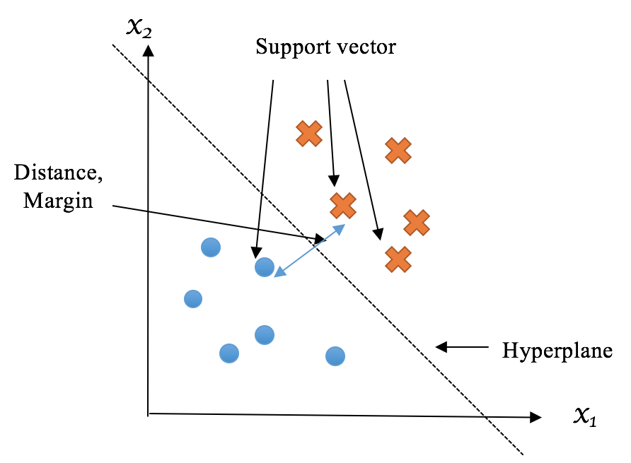

### Understanding how SVM works through different use cases

Based on the preceding stated definition of SVM, there can be an
infinite number of feasible hyperplanes. How can we identify the optimal
one? Let's discuss the logic behind SVM in further detail through a few
cases. 

#### Case 1 – identifying a separating hyperplane

First, we need to understand what qualifies for a separating hyperplane.
In the following example, hyperplane **C** is the only correct one, as
it successfully segregates observations by their labels, while
hyperplanes **A** and **B** fail:

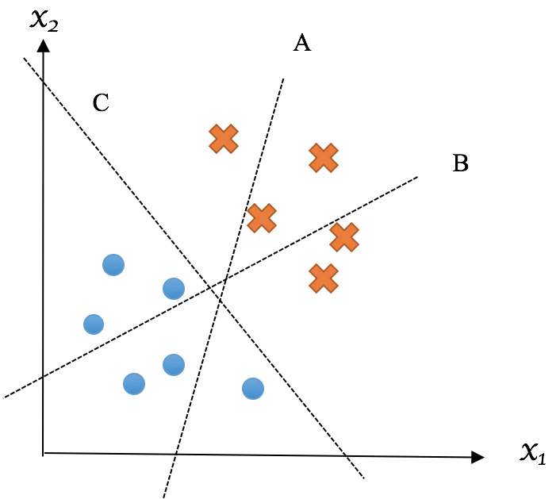

This is an easy observation. Let's express a separating hyperplane in a
formal or mathematical way.

In a two-dimensional space, a line can be defined by a slope vector *w*
(represented as a two-dimensional vector), and an
intercept *b.* Similarly, in a space of *n* dimensions, a hyperplane can
be defined by an *n*-dimensional vector *w*, and an intercept *b*. Any
data point *x *on the hyperplane satisfies *wx + b = 0*. A hyperplane is
a separating hyperplane if the following conditions are satisfied:

-   For any data point *x* from one class, it satisfies *wx + b \> 0*
-   For any data point *x *from another class, it satisfies *wx + b \<
    0*

However, there can be countless possible solutions for *w* and *b*. You
can move or rotate hyperplane **C** to certain extents and it still
remains a separating hyperplane. So next, we will learn how to identify
the best hyperplane among possible separating hyperplanes.

#### Case 2 – determining the optimal hyperplane

Look at the following example, hyperplane **C** is the preferred one as
it enables the maximum sum of the distance between the nearest data
point in the positive side to itself and the distance between the
nearest data point in the negative side to itself:

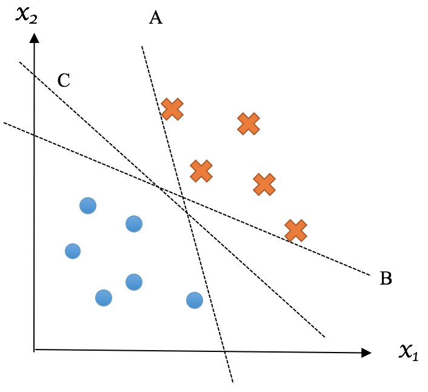

The nearest point(s) in the positive side can constitute a hyperplane
parallel to the decision hyperplane, which we call a **Positive
hyperplane**; on the other hand, the nearest point(s) in the negative
side constitute the **Negative hyperplane**. The perpendicular distance
between the positive and negative hyperplanes is called the **Margin**,
whose value equates to the sum of the two aforementioned distances. A
**Decision** hyperplane is deemed **optimal** if the margin is
maximized.

The optimal (also called maximum-margin) hyperplane and distance margins
for a trained SVM model are illustrated in the following diagram. Again,
samples on the margin (two from one class, and one from another class,
as shown) are the so-called support vectors:

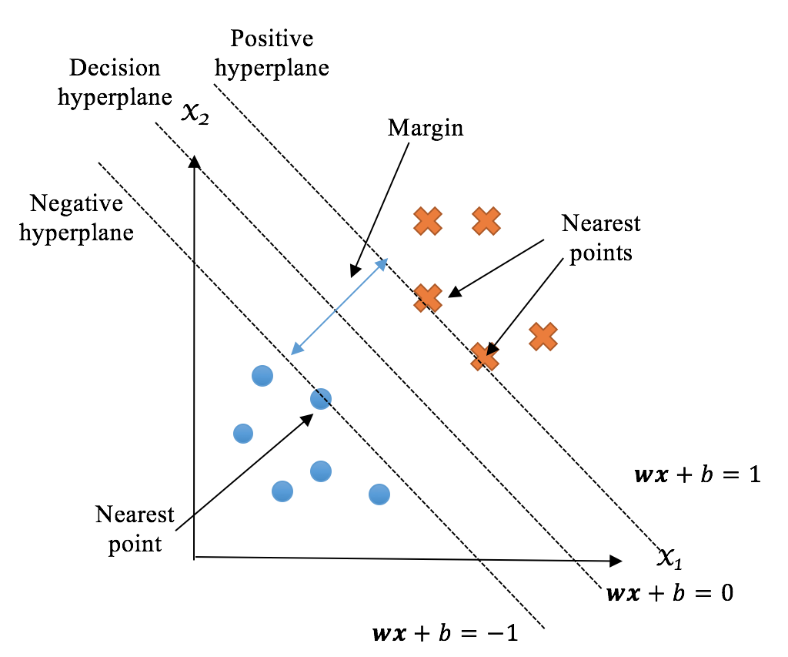

We can interpret it in a mathematical way by first describing the
positive and negative hyperplanes as follows:


Here, 

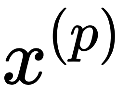

 is a data point on the positive hyperplane, and

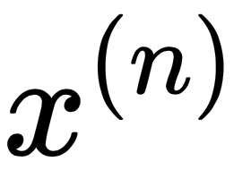

 a data point on the negative hyperplane, respectively.

The distance between a point


to the decision hyperplane can be calculated as follows:


Similarly, the distance between a point


to the decision hyperplane is as follows:

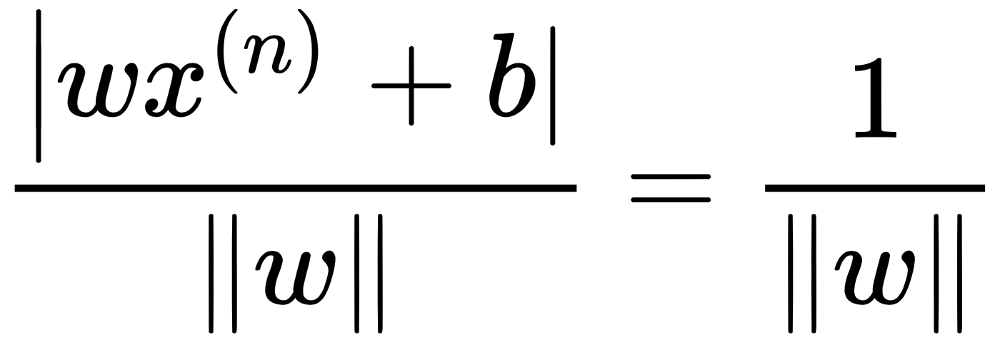

So the margin becomes ~~

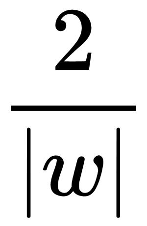

. As a result, we need to minimize |w| in order to maximize the margin.
Importantly, to comply with the fact that the support vectors on the
positive and negative hyperplanes are the nearest data points to the
decision hyperplane, we add a condition that no data point falls between
the positive and negative hyperplanes:

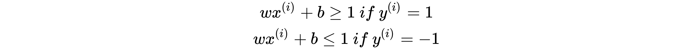

Here, ~~


 is an observation. And this can be combinedfurther into the following:

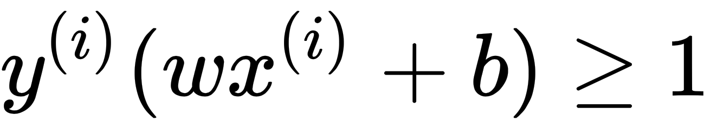

To summarize, *w* and *b*, which determine the SVM decision hyperplane,
are trained and solved by the following optimization problem:

-   Minimizing ~~
    
-   Subject to ~~
    
    , for a training set of ~~
    
    , ~~
    
    ,… ~~
    
    …,
    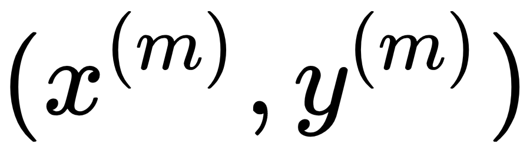

To solve this optimization problem, we need to resort to quadratic
programming techniques, which are beyond the scope of our learning
journey. Therefore, we will not cover the computation methods in detail
and will implement the classifier using the `SVC`
and `LinearSVC` modules from scikit-learn, which are realized
respectively based on `libsvm`
([https://www.csie.ntu.edu.tw/\~cjlin/libsvm/](https://www.csie.ntu.edu.tw/~cjlin/libsvm/))
and `liblinear`
([https://www.csie.ntu.edu.tw/\~cjlin/liblinear/](https://www.csie.ntu.edu.tw/~cjlin/liblinear/))
as two popular open source SVM machine learning libraries. But it is
always encouraging to understand the concepts of computing SVM.

### Note

*Shai Shalev-Shwartz et al.* "*Pegasos: Primal estimated sub-gradient
solver for SVM" (Mathematical Programming, March 2011, volume 127, issue
1, pp. 3-30),* and *Cho-Jui Hsieh et al.* "*A dual coordinate descent
method for large-scale linear SVM" (Proceedings of the 25th
international conference on machine learning, pp 408-415)* would be
great learning materials. They cover two modern approaches, sub-gradient
descent and coordinate descent, accordingly.

The learned model parameters *w* and *b* are then used to classify a new
sample *x'*, based on the following conditions:

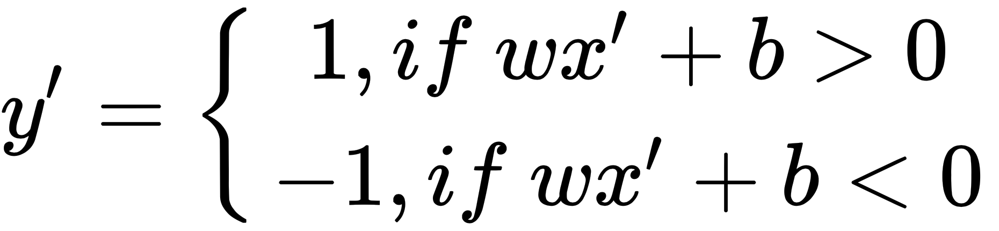

Moreover, |*wx'+b|* can be portrayed as the distance from the data
point *x' *to the decision hyperplane, and also interpreted as the
confidence of prediction: the higher the value, the further away from
the decision boundary, hence the higher prediction certainty.

Although you might be eager to implement the SVM algorithm, let's take a
step back and look at a common scenario where data points are not
linearly separable, in a strict way. Try to find a separating hyperplane
in the following example:

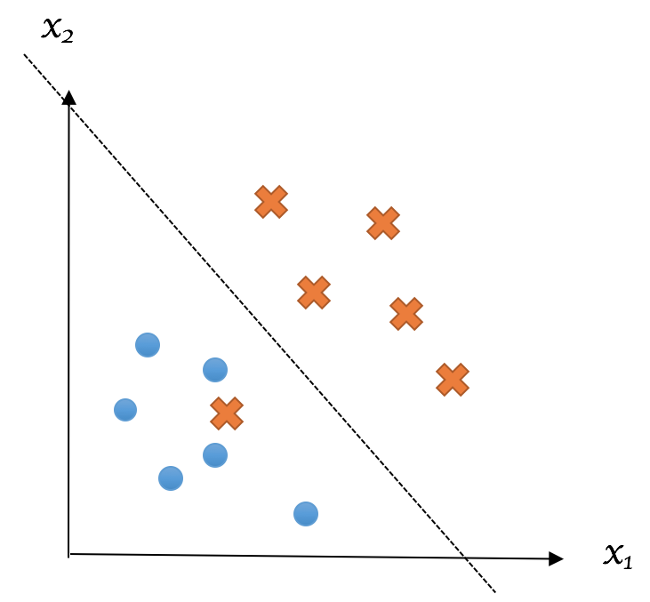

#### Case 3 – handling outliers

How can we deal with cases where it is unable to linearly segregate a
set of observations containing outliers? We can actually allow
misclassification of such outliers and try to minimize the error
introduced. The misclassification error ~~

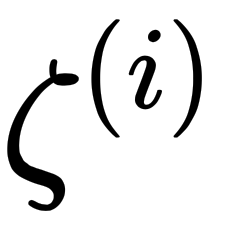

 (also called **hinge loss**) for a sample

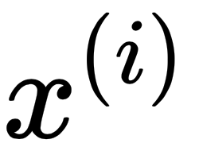

 can be expressed as follows:

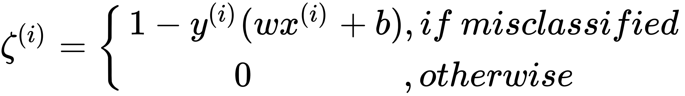

Together with the ultimate term ‖*w*‖ to reduce, the final objective
value we want to minimize becomes the following:

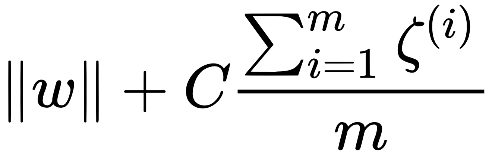

 

As regards a training set of *m* samples ~~


,~~


,…~~


…,


, where the hyperparameter **C** controls the trade-off between two
terms:

-   If a large value of **C** is chosen, the penalty for
    misclassification becomes relatively high. It means the thumb rule
    of data segregation becomes stricter and the model might be prone to
    overfit, since few mistakes are allowed during training. An SVM
    model with a large **C** has a low bias, but it might suffer high
    variance.

-   Conversely, if the value of **C** is sufficiently small, the
    influence of misclassification becomes fairly low. The model allows
    more misclassified data points than the model with large **C** does.
    Thus, data separation becomes less strict. Such a model has a low
    variance, but it might be compromised by a high bias.

A comparison between a large and small **C** is shown in the following
diagram:

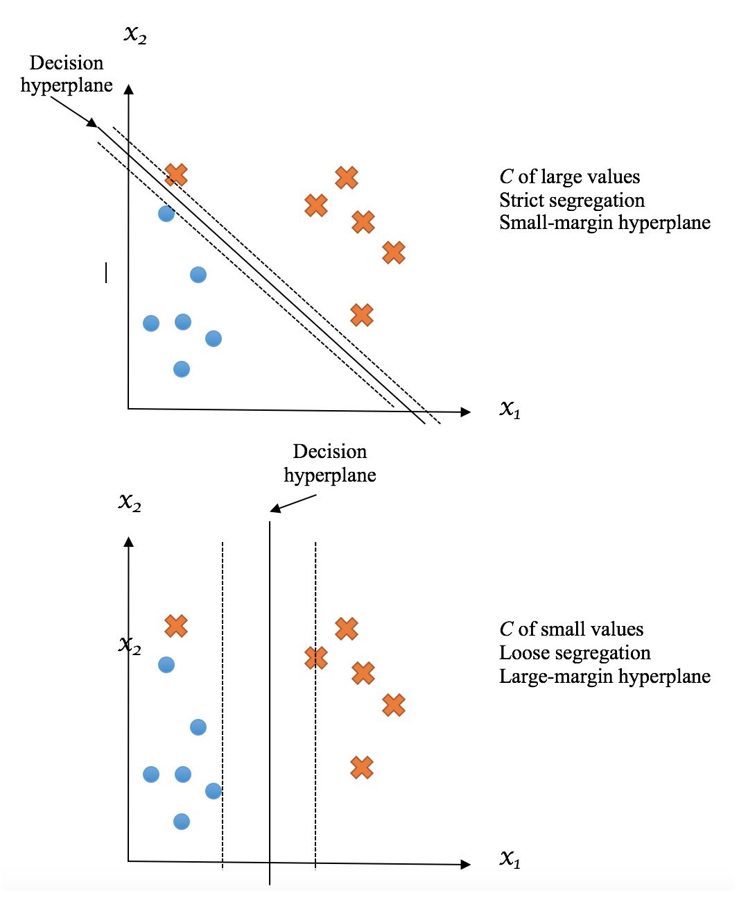

The parameter **C** determines the balance between bias and variance. It
can be fine-tuned with cross-validation, which we will practice shortly.

### Implementing SVM

We have largely covered the fundamentals of the SVM classifier. Now,
let's apply it right away to newsgroup topic classification. We start
with a binary case classifying two topics – `comp.graphics`
and `sci.space`:

Let's take a look at the following steps:

1.  First, we load the training and testing subset of the computer
    graphics and science space newsgroup data respectively:


```
>>> from sklearn.datasets import fetch_20newsgroups
>>> categories = ['comp.graphics', 'sci.space']
>>> data_train = fetch_20newsgroups(subset='train',
                          categories=categories, random_state=42)
>>> data_test = fetch_20newsgroups(subset='test',
                          categories=categories, random_state=42)
```

### Note

Don't forget to specify a random state in order to reproduce
experiments.

2.  Clean the text data using the `clean_text` function we
    developed in previous chapters and retrieve the label information:


```
>>> cleaned_train = clean_text(data_train.data)
>>> label_train = data_train.target
>>> cleaned_test = clean_text(data_test.data)
>>> label_test = data_test.target
>>> len(label_train), len(label_test)
(1177, 783)
```

There are 1,177 training samples and 783 testing ones.

3.  By way of good practice, check whether the two classes are
    imbalanced:


```
>>> from collections import Counter
>>> Counter(label_train)
Counter({1: 593, 0: 584})
>>> Counter(label_test)
Counter({1: 394, 0: 389})
```

They are quite balanced.

 

4.  Next, we extract the tf-idf features from the cleaned text data:


```
>>> from sklearn.feature_extraction.text import TfidfVectorizer
>>> tfidf_vectorizer = TfidfVectorizer(stop_words='english', max_features=None)
>>> term_docs_train = tfidf_vectorizer.fit_transform(cleaned_train)
>>> term_docs_test = tfidf_vectorizer.transform(cleaned_test)
```

5.  We can now apply the SVM classifier to the data. We first initialize
    an `SVC` model with the `kernel` parameter set
    to `linear` (we will explain what kernel means in the next
    section) and the penalty hyperparameter `C` set to the
    default value, `1.0`:


```
>>> from sklearn.svm import SVC
>>> svm = SVC(kernel='linear', C=1.0, random_state=42)
```

6.  We then fit our model on the training set as follows:


```
>>> svm.fit(term_docs_train, label_train)
SVC(C=1.0, cache_size=200, class_weight=None, coef0=0.0,
 decision_function_shape=None, degree=3, gamma='auto',
 kernel='linear',max_iter=-1, probability=False, random_state=42, 
 shrinking=True, tol=0.001, verbose=False)
```

7.  And we predict on the testing set with the trained model and obtain
    the prediction accuracy directly:


```
>>> accuracy = svm.score(term_docs_test, label_test)
>>> print('The accuracy of binary classification is:
                                             {0:.1f}%'.format(accuracy*100))
The accuracy of binary classification is: 96.4%
```

Our first SVM model works just great, achieving an accuracy
of `96.4%`. How about more than two topics? How does SVM
handle multiclass classification?

#### Case 4 – dealing with more than two classes

SVM and many other classifiers can be applied to cases with more than
two classes. There are two typical approaches we can take,
**one-vs-rest** (also called one-versus-all), and **one-vs-one**.

In the one-vs-rest setting, for a *K*-class problem, it constructs *K*
different binary SVM classifiers. For the *k^th^* classifier, it treats
the *k^th^* class as the positive case and the remaining *K-1* classes
as the negative case as a whole; the hyperplane denoted as ~~

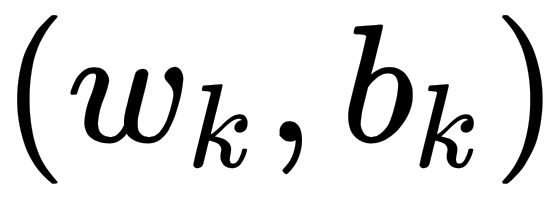

 is trained to separate these two cases. To predict the class of a new
sample, *x'*, it compares the resulting predictions


 from *K* individual classifiers from *1* to *k*. As we discussed in the
previous section, the larger value of

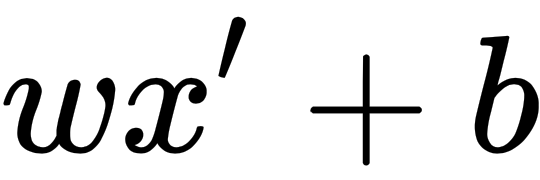

 means higher confidence that *x'* belongs to the positive case.
Therefore, it assigns *x'* to the class *i* where

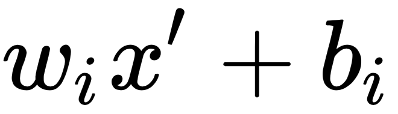

 has the largest value among all prediction results:

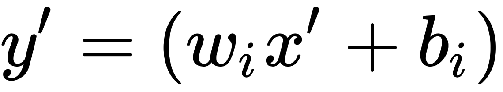

The following diagram presents how the one-vs-rest strategy works in a
three-class case:

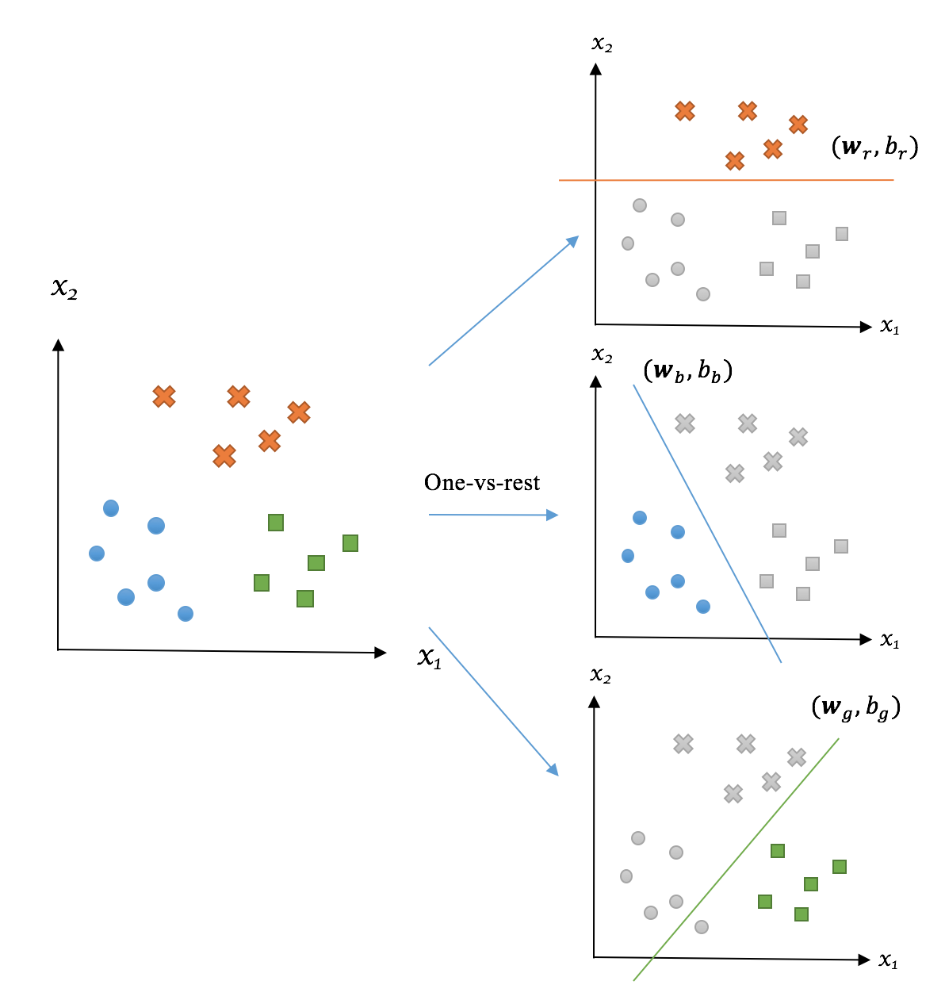

For instance, if we have the following (*r*, *b*, and *g* denote the
red, blue, and green classes respectively):

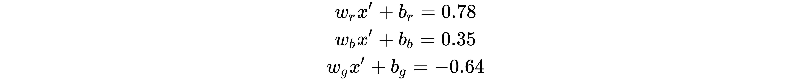

We can say *x'* belongs to the red class since *0.78* \> *0.35* \>
*-0.64*. If we have the following:


Then, we can determine that *x'* belongs to the blue class regardless of
the sign since -0.35 \> -0.64 \> -0.78.

In the one-vs-one strategy, it conducts pairwise comparison by building
a set of SVM classifiers distinguishing data points from each pair of
classes. This will result in~~

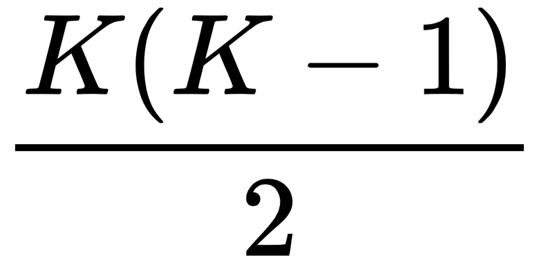

 different classifiers.

For a classifier associated with classes *i* and *j*, the hyperplane
denoted as ~~


 is trained only on the basis of observations from *i* (can be viewed as
a positive case) and *j* (can be viewed as a negative case); it then
assigns the class, either *i* or *j*, to a new sample, *x'*, based on
the sign of ~~


. Finally, the class with the highest number of assignments is
considered the predicting result of *x'*. The winner is the one that
gets the most votes.

The following diagram presents how the one-vs-one strategy works in a
three-class case:

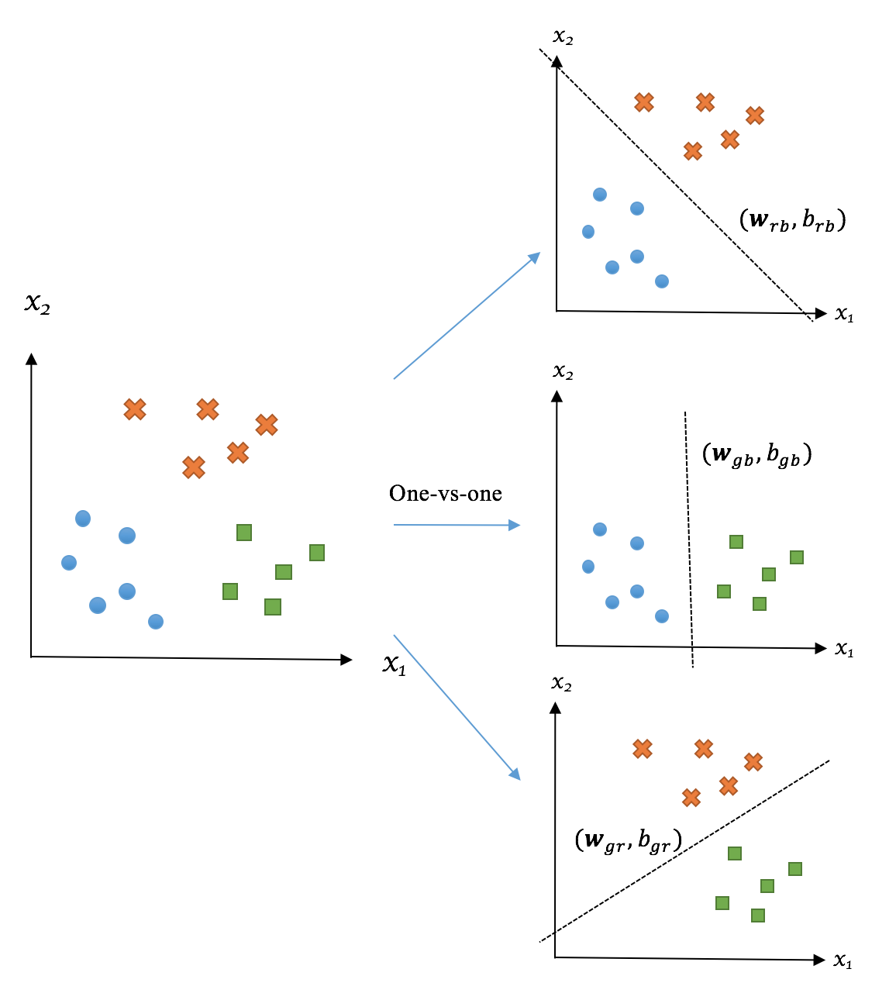

In general, an SVM classifier with one-vs-rest and with one-vs-one
setting perform comparably in terms of accuracy. The choice between
these two strategies is largely computational. Although one-vs-one
requires more classifiers ~~

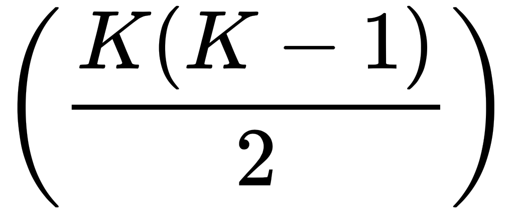

 than one-vs-rest *(K)*, each pairwise classifier only needs to learn on
a small subset of data, as opposed to the entire set in the one-vs-rest
setting. As a result, training an SVM model in the one-vs-one setting is
generally more memory-efficient and less computationally expensive, and
hence more preferable for practical use, as argued in *Chih-Wei Hsu* and
*Chih-Jen Lin*'s *A comparison of methods for multiclass support vector
machines* (*IEEE Transactions on Neural Networks*, *March 2002*, *Volume
13, pp. 415-425*).

In `scikit-learn`, classifiers handle multiclass cases
internally, and we do not need to explicitly write any additional codes
to enable it. We can see how simple it is in the following example of
classifying five topics - `comp.graphics`,
`sci.space`, `alt.atheism`,
`talk.religion.misc`, and `rec.sport.hockey`:


```
>>> categories = [
...     'alt.atheism',
...     'talk.religion.misc',
...     'comp.graphics',
...     'sci.space',
...     'rec.sport.hockey'
... ]
>>> data_train = fetch_20newsgroups(subset='train',
                          categories=categories, random_state=42)
>>> data_test = fetch_20newsgroups(subset='test',
                          categories=categories, random_state=42)
>>> cleaned_train = clean_text(data_train.data)
>>> label_train = data_train.target
>>> cleaned_test = clean_text(data_test.data)
>>> label_test = data_test.target
>>> term_docs_train = tfidf_vectorizer.fit_transform(cleaned_train)
>>> term_docs_test = tfidf_vectorizer.transform(cleaned_test)
```

In an `SVC` model, multiclass support is implicitly handled
according to the one-vs-one scheme:


```
>>> svm = SVC(kernel='linear', C=1.0, random_state=42)
>>> svm.fit(term_docs_train, label_train)
>>> accuracy = svm.score(term_docs_test, label_test)
>>> print('The accuracy of 5-class classification is:
                                 {0:.1f}%'.format(accuracy*100))
The accuracy on testing set is: 88.6%
```

We also check how it performs for individual classes:


```
>>> from sklearn.metrics import classification_report
>>> prediction = svm.predict(term_docs_test)
>>> report = classification_report(label_test, prediction)
>>> print(report)
             precision recall  f1-score support


          0 0.79      0.77 0.78   319
          1 0.92      0.96 0.94   389
          2 0.98      0.96 0.97   399
          3 0.93      0.94 0.93   394
          4 0.74      0.73 0.73   251


  micro avg       0.89 0.89    0.89 1752
  macro avg       0.87 0.87    0.87 1752
weighted avg      0.89 0.89    0.89 1752
```

Not bad! Also, we could further tweak the values of the
hyperparameters `kernel` and `C`. As discussed, the
factor `C` controls the strictness of separation, and it can
be tuned to achieve the best trade-off between bias and variance. How
about the kernel? What does it mean and what are the alternatives to a
`linear` kernel?

### The kernels of SVM

In this section, we will answer those two questions we raised in the
preceding case as a result of the fifth case. You will see how the
kernel trick makes SVM so powerful.

#### Case 5 – solving linearly non-separable problems

The hyperplanes we have found up till now are linear, for instance, a
line in a two-dimensional feature space, or a surface in a
three-dimensional one. However, in the following example, we are not
able to find any linear hyperplane that can separate two classes:

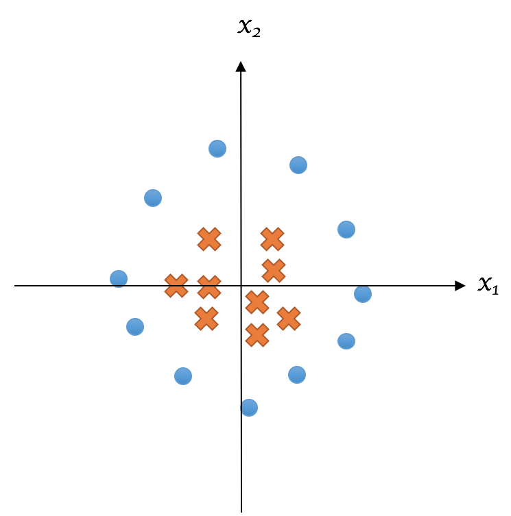

Intuitively, we observe that data points from one class are closer to
the origin than those from another class. The distance to the origin
provides distinguishable information. So we add a new feature, ~~

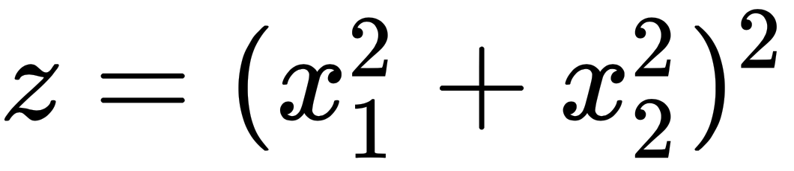

, and transform the original two-dimensional space into a
three-dimensional one. In the new space, as displayed in the following,
we can find a surface hyperplane separating the data, or a line in the
two-dimension view. With the additional feature, the dataset becomes
linearly separable in the higher dimensional space, ~~

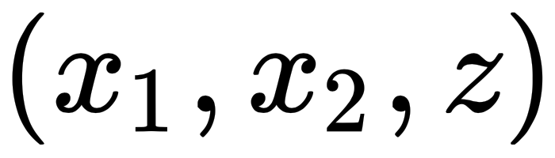

:

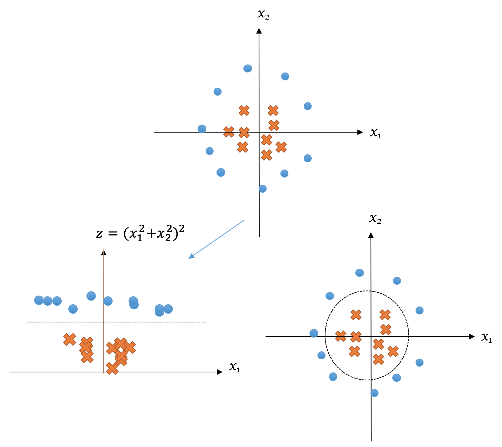

Based upon similar logics, **SVMs with kernels** are invented to solve
non-linear classification problems by converting the original feature
space, 


, to a higher dimensional feature space with a transformation
function, ~~

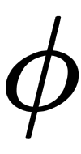

, such that the transformed dataset ~~

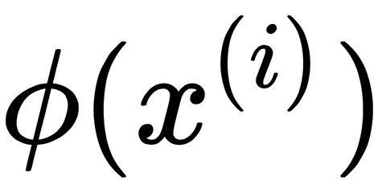

 is linearly separable. A linear hyperplane ~~


is then learned using observations ~~


. For an unknown sample 

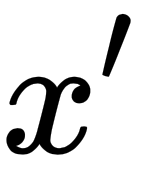

, it is first transformed into ~~


; the predicted class is determined by ~~

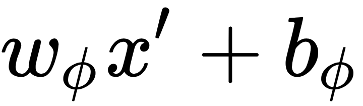

.

An SVM with kernels enables non-linear separation. But it does not
explicitly map each original data point to the high-dimensional space
and then perform expensive computation in the new space. Instead, it
approaches this in a **tricky** way:

During the course of solving the SVM quadratic optimization problems,
feature vectors ~~


are involved only in the form of a pairwise dot product ~~

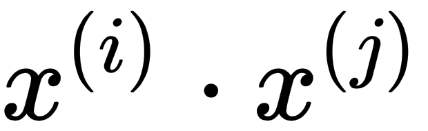

, although we will not expand this mathematically in this book. With
kernels, the new feature vectors are ~~

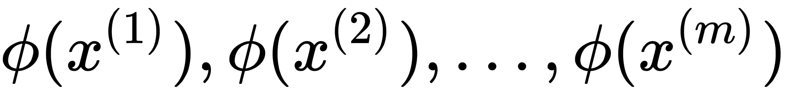

 and their pairwise dot products can be expressed as ~~

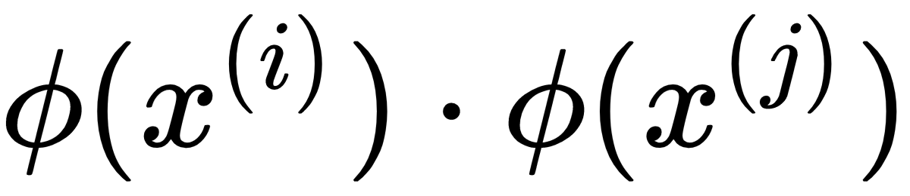

. It would be computationally efficient if we can first implicitly
conduct pairwise operation on two low-dimensional vectors and later map
the result to the high-dimensional space. In fact, a function *K* that
satisfies this does exist:

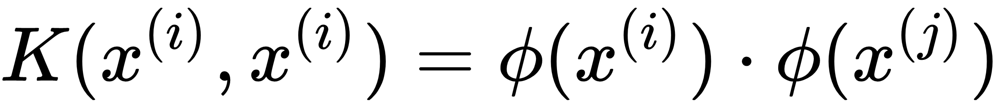

The function *K* is the so-called **kernel function**. With this trick,
the transformation 


becomes implicit, and the non-linear decision boundary can be
efficiently learned by simply replacing the term ~~


 with ~~

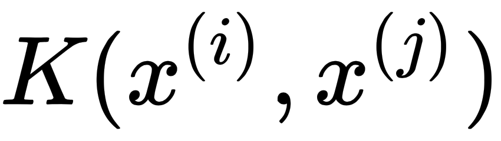

.

The most popular kernel function is probably the **radial basis
function** (**RBF**) kernel (also called the **Gaussian** kernel), which
is defined as follows:

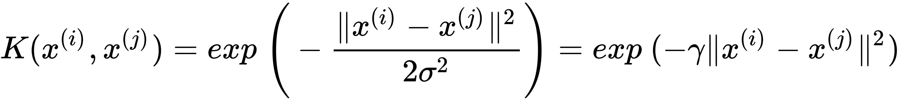

Here, ~~

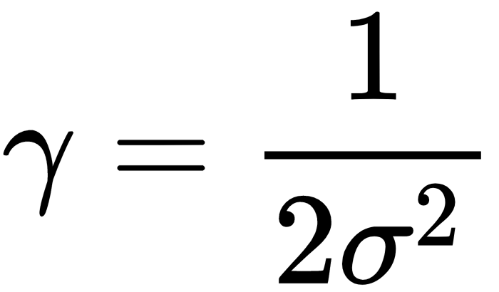

. In the Gaussian function, the standard deviation

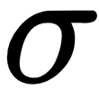

 controls the amount of variation or dispersion allowed: the higher 


 (or lower

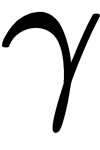

), the larger width of the bell, the wider range of data points allowed
to spread out over. Therefore,


 as the **kernel coefficient** determines how particularly or generally
the kernel function fits the observations. A large


implies a small variance allowed and a relatively exact fit on the
training samples, which might lead to overfitting. On the other hand, a
small


 implies a high variance allowed and a loose fit on the training
samples, which might cause underfitting. To illustrate this trade-off,
let's apply the RBF kernel with different values to a toy dataset:


```
>>> import numpy as np
>>> import matplotlib.pyplot as plt
>>> X = np.c_[# negative class
...           (.3, -.8),
...           (-1.5, -1),
...           (-1.3, -.8),
...           (-1.1, -1.3),
...           (-1.2, -.3),
...           (-1.3, -.5),
...           (-.6, 1.1),
...           (-1.4, 2.2),
...           (1, 1),
...           # positive class
...           (1.3, .8),
...           (1.2, .5),
...           (.2, -2),
...           (.5, -2.4),
...           (.2, -2.3),
...           (0, -2.7),
...           (1.3, 2.1)].T
>>> Y = [-1] * 8 + [1] * 8
```

Eight data points are from one class, and eight from another. We take
three values, `1`, `2`, and `4`, for
kernel coefficient as an example:


```
>>> gamma_option = [1, 2, 4]
```

Under each kernel coefficient, we fit an individual SVM classifier and
visualize the trained decision boundary:


```
>>> import matplotlib.pyplot as plt
>>> gamma_option = [1, 2, 4]
>>> for i, gamma in enumerate(gamma_option, 1):
... svm = SVC(kernel='rbf', gamma=gamma)
... svm.fit(X, Y)
... plt.scatter(X[:, 0], X[:, 1], c=['b']*8+['r']*8, zorder=10, cmap=plt.cm.Paired)
... plt.axis('tight')
... XX, YY = np.mgrid[-3:3:200j, -3:3:200j]
... Z = svm.decision_function(np.c_[XX.ravel(), YY.ravel()])
... Z = Z.reshape(XX.shape)
... plt.pcolormesh(XX, YY, Z > 0, cmap=plt.cm.Paired)
... plt.contour(XX, YY, Z, colors=['k', 'k', 'k'],
                      linestyles=['--', '-', '--'], levels=[-.5, 0, .5])
... plt.title('gamma = %d' % gamma)
... plt.show()
```

##### Run Notebook
The Notebook opens in a new browser window. You can create a new notebook or open a local one. Check out the local folder `work/Chapter05` for several sample notebooks. Open and run `.ipynb` in the `work` folder.

You can open the Jupyter Notebook at `<host-ip>:<port>/notebooks/work/Chapter05/plot_rbf_kernels.ipynb`

Refer to the following screenshot for the end results:

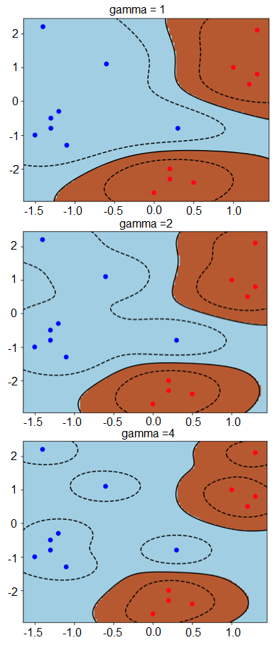

We can observe that a larger 


 results in a stricter fit on the dataset. Of course,


 can be fine-tuned through cross-validation to obtain the best
performance.

Some other common kernel functions include **polynomial** kernel and
**sigmoid** kernel:

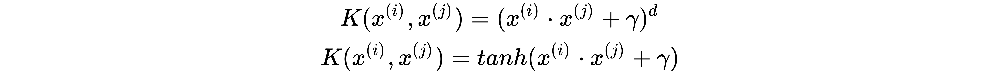

In the absence of prior knowledge of the distribution, the RBF kernel is
usually preferable in practical usage, as there is an additional
parameter to tweak in the polynomial kernel (polynomial degree *d*) and
the empirical sigmoid kernel can perform approximately on a par with the
RBF, but only under certain parameters. Hence, we come to a debate
between linear (also considered no kernel) and RBF kernel given a
dataset.

### Choosing between linear and RBF kernels

Of course, linear separability is the rule of thumb when choosing the
right kernel to start with. However, most of the time, this is very
difficult to identify, unless you have sufficient prior knowledge of the
dataset, or its features are of low dimensions (1 to 3).

### Note

Some general prior knowledge we have include: text data is often
linearly separable, while data generated from the `XOR`
function is not.

Now, let's look at the following three scenarios where linear kernel is
favored over RBF:

**Scenario 1**: Both the numbers of features and instances are large
(more than 10^4^ or 10^5^). Since the dimension of the feature space is
high enough, additional features as a result of RBF transformation will
not provide any performance improvement, but will increase computational
expense. Some examples from the UCI machine learning repository are of
this type:

-   *URL Reputation Dataset*:
    [https://archive.ics.uci.edu/ml/datasets/URL+Reputation](https://archive.ics.uci.edu/ml/datasets/URL+Reputation)
    (number of instances: 2,396,130; number of features: 3,231,961).
    This is designed for malicious URL detection based on their lexical
    and host information.
-   *YouTube Multiview Video Games
    Dataset*:* *[https://archive.ics.uci.edu/ml/datasets/YouTube+Multiview+Video+Games+Dataset](https://archive.ics.uci.edu/ml/datasets/YouTube+Multiview+Video+Games+Dataset)
    (number of instances: 120,000; number of features: 1,000,000). This
    is designed for topic classification.

**Scenario 2**: The number of features is noticeably large compared to
the number of training samples. Apart from the reasons stated in
*scenario 1*, the RBF kernel is significantly more prone to overfitting.
Such a scenario occurs, for example, in the following referral links:

-   *Dorothea Dataset*:
    [https://archive.ics.uci.edu/ml/datasets/Dorothea](https://archive.ics.uci.edu/ml/datasets/Dorothea)
    (number of instances: 1,950; number of features: 100,000). This is
    designed for drug discovery that classifies chemical compounds as
    active or inactive according to their structural molecular features.
-   *Arcene
    Dataset*: [https://archive.ics.uci.edu/ml/datasets/Arcene](https://archive.ics.uci.edu/ml/datasets/Arcene)
    (number of instances: 900; number of features: 10,000). This
    represents a mass-spectrometry dataset for cancer detection.

**Scenario 3**: The number of instances is significantly large compared
to the number of features. For a dataset of low dimension, the RBF
kernel will, in general, boost the performance by mapping it to a
higher-dimensional space. However, due to the training complexity, it
usually becomes no longer efficient on a training set with more than
10^6^ or 10^7^  samples. Example datasets include the following:

-   *Heterogeneity Activity Recognition Dataset*:
    [https://archive.ics.uci.edu/ml/datasets/Heterogeneity+Activity+Recognition](https://archive.ics.uci.edu/ml/datasets/Heterogeneity+Activity+Recognition)
    (number of instances: 43,930,257; number of features: 16). This is
    designed for human activity recognition.
-   *HIGGS Dataset*:
    [https://archive.ics.uci.edu/ml/datasets/HIGGS](https://archive.ics.uci.edu/ml/datasets/HIGGS)
    (number of instances: 11,000,000; number of features: 28). This is
    designed to distinguish between a signal process producing Higgs
    bosons or a background process

Aside from these three scenarios, RBF is ordinarily the first choice.

The rules for choosing between linear and RBF kernel can be summarized
as follows:

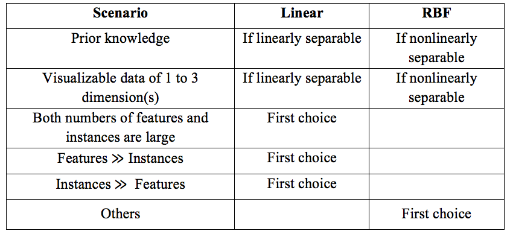

Once again, **first choice** means what we can **begin****with** this
option; it does not mean that this is the only option moving forward.


* * * * *


# Classifying newsgroup topics with SVMs
Finally, it is time to build our state-of-the-art SVM-based newsgroup topic classifier using everything we just learned.

First we load and clean the dataset with the entire 20 groups as follows:

```
>>> categories = None
>>> data_train = fetch_20newsgroups(subset='train',
                          categories=categories, random_state=42)
>>> data_test = fetch_20newsgroups(subset='test',
                          categories=categories, random_state=42)
>>> cleaned_train = clean_text(data_train.data)
>>> label_train = data_train.target
>>> cleaned_test = clean_text(data_test.data)
>>> label_test = data_test.target
>>> term_docs_train = tfidf_vectorizer.fit_transform(cleaned_train)
>>> term_docs_test = tfidf_vectorizer.transform(cleaned_test)
```

As we have seen that the linear kernel is good at classifying text data, we will continue using linear as the value of the kernel hyperparameter so we only need to tune the penalty C, through cross-validation:

```
>>> svc_libsvm = SVC(kernel='linear')
```

The way we have conducted cross-validation so far is to explicitly split data into folds and repetitively write a for loop to consecutively examine each hyperparameter. To make this less redundant, we introduce a more elegant approach utilizing the GridSearchCV module from scikit-learn. GridSearchCV handles the entire process implicitly, including data splitting, fold generation, cross training and validation, and finally, an exhaustive search over the best set of parameters. What is left for us is just to specify the hyperparameter(s) to tune and the values to explore for each individual hyperparameter:

```
>>> parameters = {'C': (0.1, 1, 10, 100)}
>>> from sklearn.model_selection import GridSearchCV
>>> grid_search = GridSearchCV(svc_libsvm, parameters, n_jobs=-1, cv=5)
```

The GridSearchCV model we just initialized will conduct five-fold cross-validation (cv=5) and will run in parallel on all available cores (n_jobs=-1). We then perform hyperparameter tuning by simply applying the fit method, and record the running time:

```
>>> import timeit
>>> start_time = timeit.default_timer()
>>> grid_search.fit(term_docs_train, label_train)
>>> print("--- %0.3fs seconds ---" % (timeit.default_timer() - start_time))
--- 525.728s seconds ---
```

We can obtain the optimal set of parameters (the optimal C in this case) using the following code:

```
>>> grid_search.best_params_
{'C': 10}
```

And the best five-fold averaged performance under the optimal set of parameters by using the following code:

```
>>> grid_search.best_score_
0.<port>987095633728
```

We then retrieve the SVM model with the optimal hyperparameter and apply it to the testing set:

```
>>> svc_libsvm_best = grid_search.best_estimator_
>>> accuracy = svc_libsvm_best.score(term_docs_test, label_test)
>>> print('The accuracy of 20-class classification is:   
                                 {0:.1f}%'.format(accuracy*100))
The accuracy of 20-class classification is: 78.7%
```

It should be noted that we tune the model based on the original training set, which is divided into folds for cross training and validation, and that we adopt the optimal model to the original testing set. We examine the classification performance in this manner in order to measure how well generalized the model is to make correct predictions on a completely new dataset. An accuracy of 78.7% is achieved with our first SVC model.

There is another SVM classifier, LinearSVC, from scikit-learn. How will we perform this? LinearSVC is similar to SVC with linear kernels, but it is implemented based on the liblinear library, which is better optimized than libsvm with linear kernel. We then repeat the same preceding process with LinearSVC as follows:

```
>>> from sklearn.svm import LinearSVC
>>> svc_linear = LinearSVC()
>>> grid_search = GridSearchCV(svc_linear, parameters,
                                               n_jobs=-1, cv=5))
>>> start_time = timeit.default_timer()
>>> grid_search.fit(term_docs_train, label_train)
>>> print("--- %0.3fs seconds ---" %
                           (timeit.default_timer() - start_time))
--- 19.915s seconds ---
>>> grid_search.best_params_
{'C': 1}
>>> grid_search.best_score_
0.894643804136468
>>> svc_linear_best = grid_search.best_estimator_
>>> accuracy = svc_linear_best.score(term_docs_test, label_test)
>>> print('The accuracy of 20-class classification is:   
                                 {0:.1f}%'.format(accuracy*100))
The accuracy on testing set is: 79.9%
```

The LinearSVC model outperforms SVC, and its training is more than 26 times faster. This is because the liblinear library with high scalability is designed for large datasets, while the libsvm library with more than quadratic computation complexity is not able to scale well with more than 

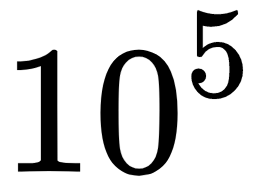

training instances.

We can also tweak the feature extractor, the TfidfVectorizer model, to further improve the performance. Feature extraction and classification as two consecutive steps should be cross-validated collectively. We utilize the pipeline API from scikit-learn to facilitate this.

The tfidf feature extractor and linear SVM classifier are first assembled in the pipeline:

```
>>> from sklearn.pipeline import Pipeline
>>> pipeline = Pipeline([
...     ('tfidf', TfidfVectorizer(stop_words='english')),
...     ('svc', LinearSVC()),
... ])
```

The hyperparameters to tune are defined as follows, with a pipeline step name joined with a parameter name by a __ as the key, and a tuple of corresponding options as the value:

```
>>> parameters_pipeline = {
...     'tfidf__max_df': (0.25, 0.5, 1.0),
...     'tfidf__max_features': (10000, None),
...     'tfidf__sublinear_tf': (True, False),
...     'tfidf__smooth_idf': (True, False),
...     'svc__C': (0.3, 1, 3),
... }
```

Besides the penalty C, for the SVM classifier, we tune the tfidf feature extractor in terms of the following:

max_df: The maximum document frequency of a term to be allowed, in order to avoid common terms generally occurring in documents
max_features: The number of top features to consider
sublinear_tf: Whether scaling term frequency with the logarithm function or not
smooth_idf: Adding an initial 1 to the document frequency or not, similar to smoothing factor for the term frequency
The grid search model searches for the optimal set of parameters throughout the entire pipeline:

```
>>> grid_search = GridSearchCV(pipeline, parameters_pipeline,
                                             n_jobs=-1, cv=5)
>>> start_time = timeit.default_timer()
>>> grid_search.fit(cleaned_train, label_train)
>>> print("--- %0.3fs seconds ---" %
                       (timeit.default_timer() - start_time))
--- 333.761s seconds ---
>>> grid_search.best_params_
{'svc__C': 1, 'tfidf__max_df': 0.5, 'tfidf__max_features': None,
'tfidf__smooth_idf': False, 'tfidf__sublinear_tf': True}
>>> grid_search.best_score_
0.9018914619056037
>>> pipeline_best = grid_search.best_estimator_
```

Finally, the optimal model is applied to the testing set as follows:

```
>>> accuracy = pipeline_best.score(cleaned_test, label_test)
>>> print('The accuracy of 20-class classification is:
                              {0:.1f}%'.format(accuracy*100))
The accuracy of 20-class classification is: 81.0%
```

The set of hyperparameters, {max_df: 0.5, smooth_idf: False, max_features: 40000, sublinear_tf: True, C: 1}, facilitates the best classification accuracy, 81.0%, on the entire 20 groups of text data.

##### Run Notebook
The Notebook opens in a new browser window. You can create a new notebook or open a local one. Check out the local folder `work/Chapter05` for several sample notebooks. Open and run `.ipynb` in the `work` folder.

You can open the Jupyter Notebook at `<host-ip>:<port>/notebooks/work/Chapter05/topic_categorization.ipynb`

# More example – fetal state classification on cardiotocography
After a successful application of SVM with linear kernel, we will look at one more example of an SVM with RBF kernel to start with.

We are going to build a classifier that helps obstetricians categorize cardiotocograms (CTGs) into one of the three fetal states (normal, suspect, and pathologic). The cardiotocography dataset we use is from https://archive.ics.uci.edu/ml/datasets/Cardiotocography under the UCI Machine Learning Repository and it can be directly downloaded from https://archive.ics.uci.edu/ml/machine-learning-databases/00193/CTG.xls as an .xls Excel file. The dataset consists of measurements of fetal heart rate and uterine contraction as features, and the fetal state class code (1=normal, 2=suspect, 3=pathologic) as a label. There are in total 2,126 samples with 23 features. Based on the numbers of instances and features (2,126 is not far more than 23), the RBF kernel is the first choice.

We work with the Excel file using pandas, which is suitable for table data. It might request an additional installation of the xlrd package when you run the following lines of codes, since its Excel module is built based on xlrd. If so, just run pip install xlrd in the terminal to install xlrd. 

We first read the data located in the sheet named Raw Data:

```
>>> import pandas as pd
>>> df = pd.read_excel('CTG.xls', "Raw Data")
```

Then, we take these 2,126 data samples, and assign the feature set (from columns D to AL in the spreadsheet), and label set (column AN) respectively:

```
>>> X = df.ix[1:2126, 3:-2].values
>>> Y = df.ix[1:2126, -1].values
```

Don't forget to check the class proportions:

```
>>> Counter(Y)
```

Counter({1.0: 1655, 2.0: 295, 3.0: 176})
We set aside 20% of the original data for final testing:

```
>>> from sklearn.model_selection import train_test_split
>>> X_train, X_test, Y_train, Y_test = train_test_split(X, Y,
                                                test_size=0.2, random_state=42)
```

Now, we tune the RBF-based SVM model in terms of the penalty C, and the kernel coefficient:


```
>>> svc = SVC(kernel='rbf')
>>> parameters = {'C': (100, 1e3, 1e4, 1e5),
...               'gamma': (1e-08, 1e-7, 1e-6, 1e-5)}
>>> grid_search = GridSearchCV(svc, parameters, n_jobs=-1, cv=5)
>>> start_time = timeit.default_timer()
>>> grid_search.fit(X_train, Y_train)
>>> print("--- %0.3fs seconds ---" %
                     (timeit.default_timer() - start_time))
--- 11.751s seconds ---
>>> grid_search.best_params_
{'C': 100000.0, 'gamma': 1e-07}
>>> grid_search.best_score_
0.9547058823529412
>>> svc_best = grid_search.best_estimator_
```

Finally, we apply the optimal model to the testing set:

```
>>> accuracy = svc_best.score(X_test, Y_test)
>>> print('The accuracy on testing set is:
                              {0:.1f}%'.format(accuracy*100))
The accuracy on testing set is: 96.5%
```

Also, we have to check the performance for individual classes since the data is not quite balanced:

```
>>> prediction = svc_best.predict(X_test)
>>> report = classification_report(Y_test, prediction)
>>> print(report)
           precision recall f1-score  support

       1.0    0.98    0.98     0.98     333
       2.0    0.89    0.91     0.90     64
       3.0    0.96    0.93     0.95     29

micro avg     0.96    0.96     0.96     426
macro avg     0.95    0.94     0.94     426
weighted avg  0.96    0.96     0.96     426
```


##### Run Notebook
The Notebook opens in a new browser window. You can create a new notebook or open a local one. Check out the local folder `work/Chapter05` for several sample notebooks. Open and run `.ipynb` in the `work` folder.

You can open the Jupyter Notebook at `<host-ip>:<port>/notebooks/work/Chapter05/ctg.ipynb`


# A further example – breast cancer classification using SVM with TensorFlow
So far, we have been using scikit-learn to implement SVMs. Let's now look at how to do so with TensorFlow. Note that, up until now (the end of 2018), the only SVM API provided in TensorFlow is with linear kernel for binary classification.

We are using the breast cancer dataset (https://archive.ics.uci.edu/ml/datasets/Breast+Cancer+Wisconsin+(Diagnostic)) as an example. Its feature space is 30-dimensional, and its target variable is binary. Let's see how it's done by performing the following steps:

First, import the requisite modules and load the dataset as well as check its class distribution:

```
>>> import tensorflow as tf
>>> from sklearn import datasets
>>> cancer_data = datasets.load_breast_cancer()
>>> X = cancer_data.data
>>> Y = cancer_data.target
>>> print(Counter(Y))
Counter({1: 357, 0: 212})
```

Split the data into training and testing sets as follows:

```
>>> np.random.seed(42)
>>> train_indices = np.random.choice(len(Y), round(len(Y) * 0.8), replace=False)
>>> test_indices = np.array(list(set(range(len(Y))) - set(train_indices)))
>>> X_train = X[train_indices]
>>> X_test = X[test_indices]
>>> Y_train = Y[train_indices]
>>> Y_test = Y[test_indices]
```

Now, initialize the SVM classifier as follows:

```
>>> svm_tf = tf.contrib.learn.SVM(
feature_columns=(tf.contrib.layers.real_valued_column(column_name='x'),),
example_id_column='example_id')
```

Then, we construct the input function for training data, before calling the fit method:

```
>>> input_fn_train = tf.estimator.inputs.numpy_input_fn(
...     x={'x': X_train, 
           'example_id': np.array(['%d' % i for i in range(len(Y_train))])},
...     y=Y_train,
...     num_epochs=None,
...     batch_size=100,
...     shuffle=True)
```

The example_id is something different to scikit-learn. It is basically a placeholder for the id of samples.

Fit the model on the training set as follows:

```
>>> svm_tf.fit(input_fn=input_fn_train, max_steps=100)
```

Evaluate the classification accuracy on the training set as follows:

```
>>> metrics = svm_tf.evaluate(input_fn=input_fn_train, steps=1)
>>> print('The training accuracy is:
                     {0:.1f}%'.format(metrics['accuracy']*100))
The training accuracy is: 94.0%
```

To predict on the testing set, we construct the input function for testing data in a similar way:

```
>>> input_fn_test = tf.estimator.inputs.numpy_input_fn(
...     x={'x': X_test, 
           'example_id': np.array(
                       ['%d' % (i + len(Y_train)) for i in range(len(X_test))])},
...     y=Y_test,
...     num_epochs=None,
...     shuffle=False)
```

Finally, evaluate its classification accuracy as follows:

```
>>> metrics = svm_tf.evaluate(input_fn=input_fn_test, steps=1)
>>> print('The testing accuracy is:
                    {0:.1f}%'.format(metrics['accuracy']*100))
The testing accuracy is: 90.6%
```

##### Run Notebook
The Notebook opens in a new browser window. You can create a new notebook or open a local one. Check out the local folder `work/Chapter05` for several sample notebooks. Open and run `.ipynb` in the `work` folder.

You can open the Jupyter Notebook at `<host-ip>:<port>/notebooks/work/Chapter05/svm_tf.ipynb`


Note, you will get different results every time you run the codes. This is because, for the underlying optimization of the tf.contrib.learn.SVM module, the Stochastic Dual Coordinate Ascent (SDCA) method is used, which incorporates inevitable randomness.


# Summary
In this chapter, we continued our journey of classifying news data with the SVM classifier, where we acquired the mechanics of an SVM, kernel techniques and implementations of SVM, and other important concepts of machine learning classification, including multiclass classification strategies and grid search, as well as useful tips for using an SVM (for example, choosing between kernels and tuning parameters). Then, we finally put into practice what we had learned in the form of two use cases: news topic classification and fetal state classification.

We have learned and adopted two classification algorithms so far, Naïve Bayes and SVM. Naïve Bayes is a simple algorithm (as its name implies). For a dataset with independent, or close to independent, features, Naïve Bayes will usually perform well. SVM is versatile and adaptive to the linear separability of data. In general, high accuracy can be achieved by SVM with the right kernel and parameters. However, this might be at the expense of intense computation and high memory consumption. When it comes to text classification, since text data is, in general, linearly separable, an SVM with linear kernels and Naïve Bayes often end up performing in a comparable way. In practice, we can simply try both and select the better one with optimal parameters.

In the next chapter, we will look at online advertising and predict whether a user will click through an ad. This will be accomplished by means of tree-based algorithms, including decision tree and random forest.