Finding separating boundary with support vector machines
--------------------------------------------------------

* * * * *

After introducing a powerful, yet simple classifier Naïve Bayes, we will
continue with another great classifier that is popular for text
classification, the **support vector machine** (**SVM**).

In machine learning classification, SVM finds an optimal hyperplane that
best segregates observations from different classes. A **hyperplane** is
a plane of *n -1* dimension that separates the *n* dimensional feature
space of the observations into two spaces. For example, the hyperplane
in a two-dimensional feature space is a line, and a surface in a
three-dimensional feature space. The optimal hyperplane is picked so
that the distance from its nearest points in each space to itself is
maximized. And these nearest points are the so-called **support
vectors**. The following toy example demonstrates what support vector
and a separating hyperplane (along with the distance margin which we
will explain later) look like in a binary classification case:

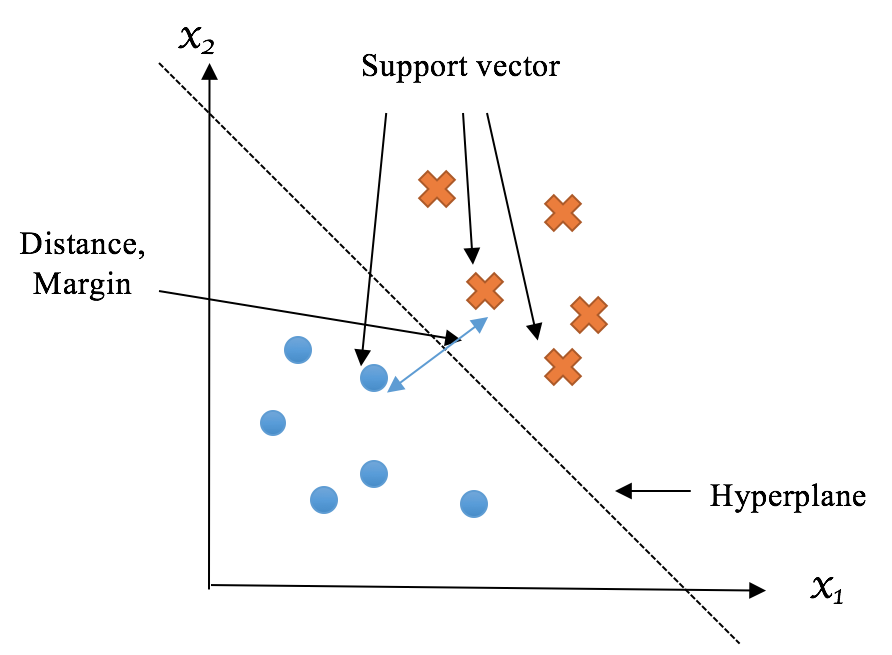

### Understanding how SVM works through different use cases

Based on the preceding stated definition of SVM, there can be an
infinite number of feasible hyperplanes. How can we identify the optimal
one? Let's discuss the logic behind SVM in further detail through a few
cases. 

#### Case 1 – identifying a separating hyperplane

First, we need to understand what qualifies for a separating hyperplane.
In the following example, hyperplane **C** is the only correct one, as
it successfully segregates observations by their labels, while
hyperplanes **A** and **B** fail:

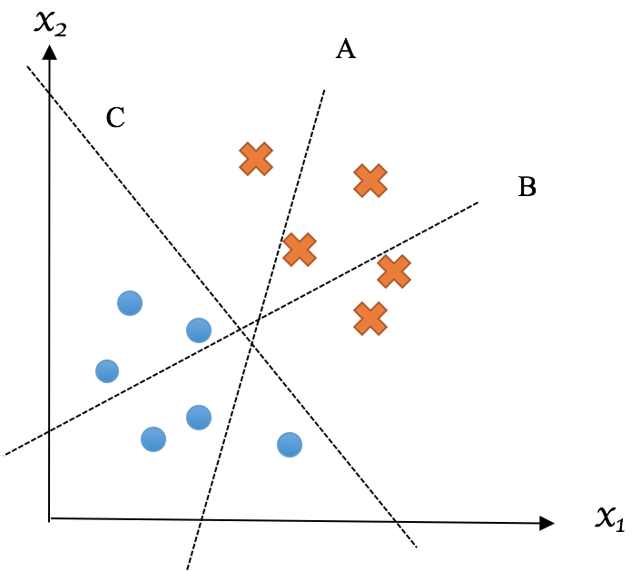

This is an easy observation. Let's express a separating hyperplane in a
formal or mathematical way.

In a two-dimensional space, a line can be defined by a slope vector *w*
(represented as a two-dimensional vector), and an
intercept *b.* Similarly, in a space of *n* dimensions, a hyperplane can
be defined by an *n*-dimensional vector *w*, and an intercept *b*. Any
data point *x *on the hyperplane satisfies *wx + b = 0*. A hyperplane is
a separating hyperplane if the following conditions are satisfied:

-   For any data point *x* from one class, it satisfies *wx + b \> 0*
-   For any data point *x *from another class, it satisfies *wx + b \<
    0*

However, there can be countless possible solutions for *w* and *b*. You
can move or rotate hyperplane **C** to certain extents and it still
remains a separating hyperplane. So next, we will learn how to identify
the best hyperplane among possible separating hyperplanes.

#### Case 2 – determining the optimal hyperplane

Look at the following example, hyperplane **C** is the preferred one as
it enables the maximum sum of the distance between the nearest data
point in the positive side to itself and the distance between the
nearest data point in the negative side to itself:

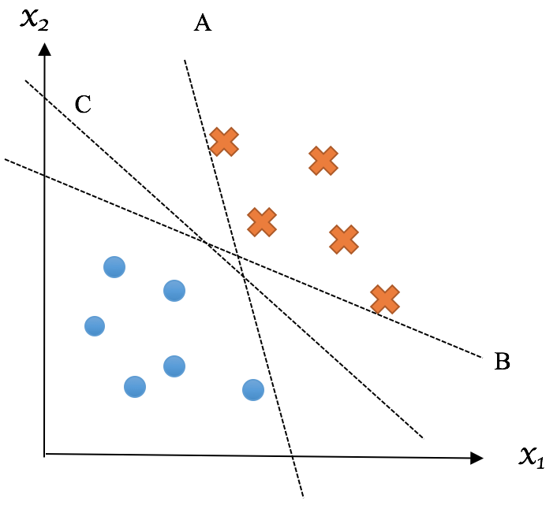

The nearest point(s) in the positive side can constitute a hyperplane
parallel to the decision hyperplane, which we call a **Positive
hyperplane**; on the other hand, the nearest point(s) in the negative
side constitute the **Negative hyperplane**. The perpendicular distance
between the positive and negative hyperplanes is called the **Margin**,
whose value equates to the sum of the two aforementioned distances. A
**Decision** hyperplane is deemed **optimal** if the margin is
maximized.

The optimal (also called maximum-margin) hyperplane and distance margins
for a trained SVM model are illustrated in the following diagram. Again,
samples on the margin (two from one class, and one from another class,
as shown) are the so-called support vectors:

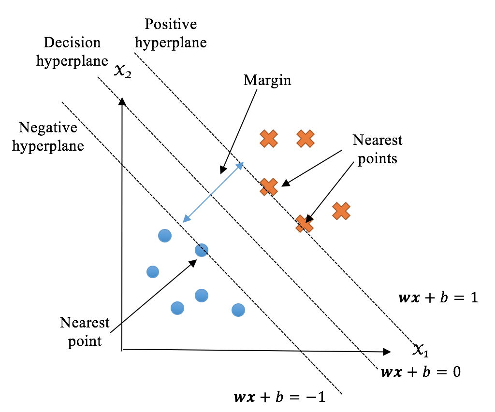

We can interpret it in a mathematical way by first describing the
positive and negative hyperplanes as follows:


Here, 


 is a data point on the positive hyperplane, and


 a data point on the negative hyperplane, respectively.

The distance between a point

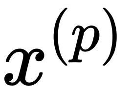

to the decision hyperplane can be calculated as follows:


Similarly, the distance between a point

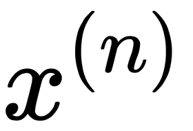

to the decision hyperplane is as follows:

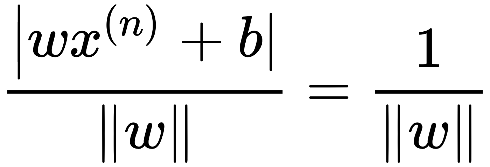

So the margin becomes ~~

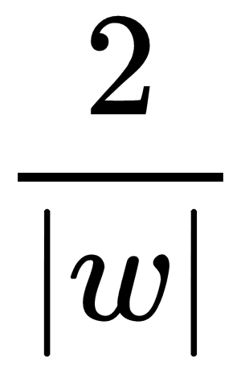

. As a result, we need to minimize |w| in order to maximize the margin.
Importantly, to comply with the fact that the support vectors on the
positive and negative hyperplanes are the nearest data points to the
decision hyperplane, we add a condition that no data point falls between
the positive and negative hyperplanes:

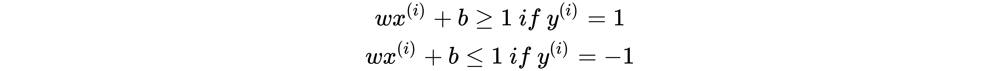

Here, ~~


 is an observation. And this can be combinedfurther into the following:

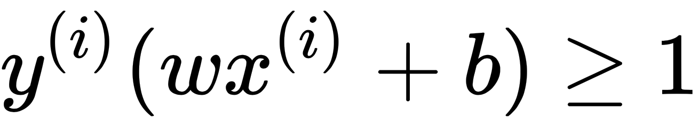

To summarize, *w* and *b*, which determine the SVM decision hyperplane,
are trained and solved by the following optimization problem:

-   Minimizing ~~
    
-   Subject to ~~
    
    , for a training set of ~~
    
    , ~~
    
    ,… ~~
    
    …,
    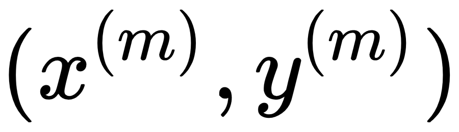

To solve this optimization problem, we need to resort to quadratic
programming techniques, which are beyond the scope of our learning
journey. Therefore, we will not cover the computation methods in detail
and will implement the classifier using the `SVC`{.literal}
and `LinearSVC`{.literal} modules from scikit-learn, which are realized
respectively based on `libsvm`{.literal}
([https://www.csie.ntu.edu.tw/\~cjlin/libsvm/](https://www.csie.ntu.edu.tw/~cjlin/libsvm/))
and `liblinear`{.literal}
([https://www.csie.ntu.edu.tw/\~cjlin/liblinear/](https://www.csie.ntu.edu.tw/~cjlin/liblinear/))
as two popular open source SVM machine learning libraries. But it is
always encouraging to understand the concepts of computing SVM.

### Note

*Shai Shalev-Shwartz et al.* "*Pegasos: Primal estimated sub-gradient
solver for SVM" (Mathematical Programming, March 2011, volume 127, issue
1, pp. 3-30),* and *Cho-Jui Hsieh et al.* "*A dual coordinate descent
method for large-scale linear SVM" (Proceedings of the 25th
international conference on machine learning, pp 408-415)* would be
great learning materials. They cover two modern approaches, sub-gradient
descent and coordinate descent, accordingly.

The learned model parameters *w* and *b* are then used to classify a new
sample *x'*, based on the following conditions:

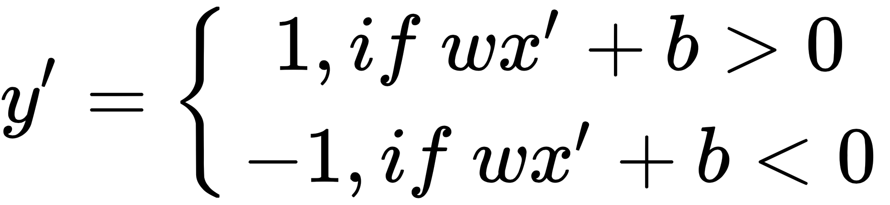

Moreover, |*wx'+b|* can be portrayed as the distance from the data
point *x' *to the decision hyperplane, and also interpreted as the
confidence of prediction: the higher the value, the further away from
the decision boundary, hence the higher prediction certainty.

Although you might be eager to implement the SVM algorithm, let's take a
step back and look at a common scenario where data points are not
linearly separable, in a strict way. Try to find a separating hyperplane
in the following example:

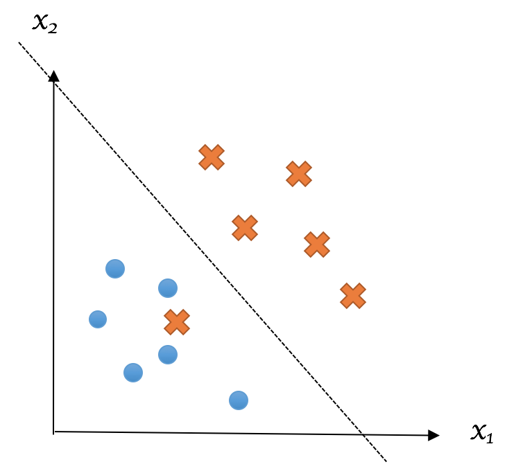

#### Case 3 – handling outliers

How can we deal with cases where it is unable to linearly segregate a
set of observations containing outliers? We can actually allow
misclassification of such outliers and try to minimize the error
introduced. The misclassification error ~~

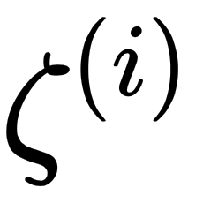

 (also called **hinge loss**) for a sample

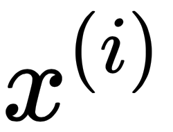

 can be expressed as follows:

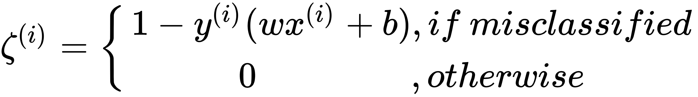

Together with the ultimate term ‖*w*‖ to reduce, the final objective
value we want to minimize becomes the following:

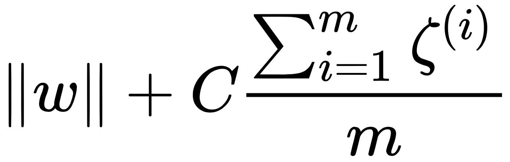

 

As regards a training set of *m* samples ~~


,~~


,…~~


…,


, where the hyperparameter **C** controls the trade-off between two
terms:

-   If a large value of **C** is chosen, the penalty for
    misclassification becomes relatively high. It means the thumb rule
    of data segregation becomes stricter and the model might be prone to
    overfit, since few mistakes are allowed during training. An SVM
    model with a large **C** has a low bias, but it might suffer high
    variance.

-   Conversely, if the value of **C** is sufficiently small, the
    influence of misclassification becomes fairly low. The model allows
    more misclassified data points than the model with large **C** does.
    Thus, data separation becomes less strict. Such a model has a low
    variance, but it might be compromised by a high bias.

A comparison between a large and small **C** is shown in the following
diagram:


The parameter **C** determines the balance between bias and variance. It
can be fine-tuned with cross-validation, which we will practice shortly.

### Implementing SVM

We have largely covered the fundamentals of the SVM classifier. Now,
let's apply it right away to newsgroup topic classification. We start
with a binary case classifying two topics – `comp.graphics`{.literal}
and `sci.space`{.literal}:

Let's take a look at the following steps:

1.  First, we load the training and testing subset of the computer
    graphics and science space newsgroup data respectively:


```
>>> from sklearn.datasets import fetch_20newsgroups
>>> categories = ['comp.graphics', 'sci.space']
>>> data_train = fetch_20newsgroups(subset='train',
                          categories=categories, random_state=42)
>>> data_test = fetch_20newsgroups(subset='test',
                          categories=categories, random_state=42)
```

### Note

Don't forget to specify a random state in order to reproduce
experiments.

2.  Clean the text data using the `clean_text`{.literal} function we
    developed in previous chapters and retrieve the label information:


```
>>> cleaned_train = clean_text(data_train.data)
>>> label_train = data_train.target
>>> cleaned_test = clean_text(data_test.data)
>>> label_test = data_test.target
>>> len(label_train), len(label_test)
(1177, 783)
```

There are 1,177 training samples and 783 testing ones.

3.  By way of good practice, check whether the two classes are
    imbalanced:


```
>>> from collections import Counter
>>> Counter(label_train)
Counter({1: 593, 0: 584})
>>> Counter(label_test)
Counter({1: 394, 0: 389})
```

They are quite balanced.

 

4.  Next, we extract the tf-idf features from the cleaned text data:


```
>>> from sklearn.feature_extraction.text import TfidfVectorizer
>>> tfidf_vectorizer = TfidfVectorizer(stop_words='english', max_features=None)
>>> term_docs_train = tfidf_vectorizer.fit_transform(cleaned_train)
>>> term_docs_test = tfidf_vectorizer.transform(cleaned_test)
```

5.  We can now apply the SVM classifier to the data. We first initialize
    an `SVC`{.literal} model with the `kernel`{.literal} parameter set
    to `linear`{.literal} (we will explain what kernel means in the next
    section) and the penalty hyperparameter `C`{.literal} set to the
    default value, `1.0`{.literal}:


```
>>> from sklearn.svm import SVC
>>> svm = SVC(kernel='linear', C=1.0, random_state=42)
```

6.  We then fit our model on the training set as follows:


```
>>> svm.fit(term_docs_train, label_train)
SVC(C=1.0, cache_size=200, class_weight=None, coef0=0.0,
 decision_function_shape=None, degree=3, gamma='auto',
 kernel='linear',max_iter=-1, probability=False, random_state=42, 
 shrinking=True, tol=0.001, verbose=False)
```

7.  And we predict on the testing set with the trained model and obtain
    the prediction accuracy directly:


```
>>> accuracy = svm.score(term_docs_test, label_test)
>>> print('The accuracy of binary classification is:
                                             {0:.1f}%'.format(accuracy*100))
The accuracy of binary classification is: 96.4%
```

Our first SVM model works just great, achieving an accuracy
of `96.4%`{.literal}. How about more than two topics? How does SVM
handle multiclass classification?

#### Case 4 – dealing with more than two classes

SVM and many other classifiers can be applied to cases with more than
two classes. There are two typical approaches we can take,
**one-vs-rest** (also called one-versus-all), and **one-vs-one**.

In the one-vs-rest setting, for a *K*-class problem, it constructs *K*
different binary SVM classifiers. For the *k^th^* classifier, it treats
the *k^th^* class as the positive case and the remaining *K-1* classes
as the negative case as a whole; the hyperplane denoted as ~~

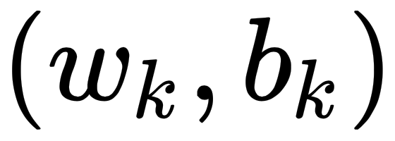

 is trained to separate these two cases. To predict the class of a new
sample, *x'*, it compares the resulting predictions


 from *K* individual classifiers from *1* to *k*. As we discussed in the
previous section, the larger value of

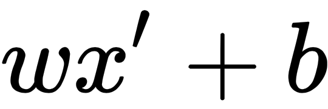

 means higher confidence that *x'* belongs to the positive case.
Therefore, it assigns *x'* to the class *i* where

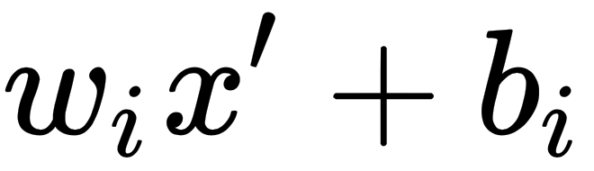

 has the largest value among all prediction results:

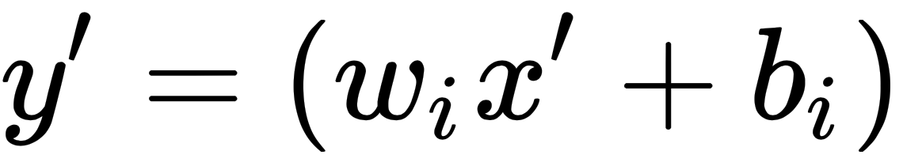

The following diagram presents how the one-vs-rest strategy works in a
three-class case:

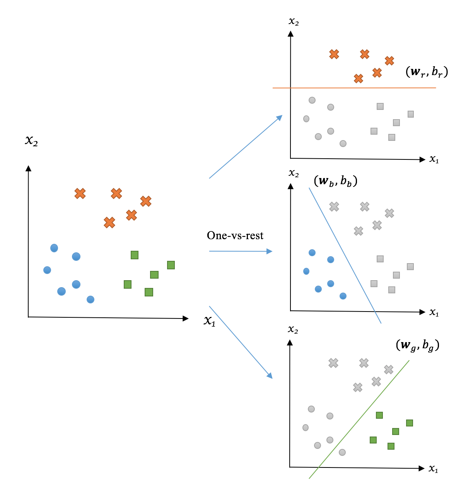

For instance, if we have the following (*r*, *b*, and *g* denote the
red, blue, and green classes respectively):


We can say *x'* belongs to the red class since *0.78* \> *0.35* \>
*-0.64*. If we have the following:

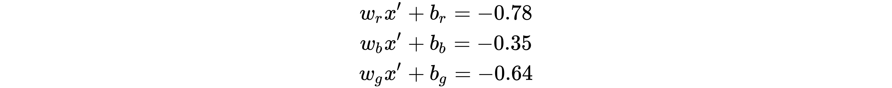

Then, we can determine that *x'* belongs to the blue class regardless of
the sign since -0.35 \> -0.64 \> -0.78.

In the one-vs-one strategy, it conducts pairwise comparison by building
a set of SVM classifiers distinguishing data points from each pair of
classes. This will result in~~

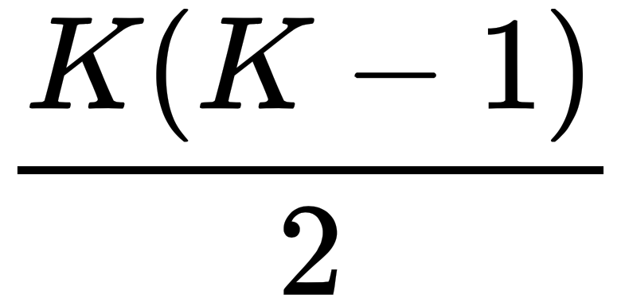

 different classifiers.

For a classifier associated with classes *i* and *j*, the hyperplane
denoted as ~~


 is trained only on the basis of observations from *i* (can be viewed as
a positive case) and *j* (can be viewed as a negative case); it then
assigns the class, either *i* or *j*, to a new sample, *x'*, based on
the sign of ~~


. Finally, the class with the highest number of assignments is
considered the predicting result of *x'*. The winner is the one that
gets the most votes.

The following diagram presents how the one-vs-one strategy works in a
three-class case:

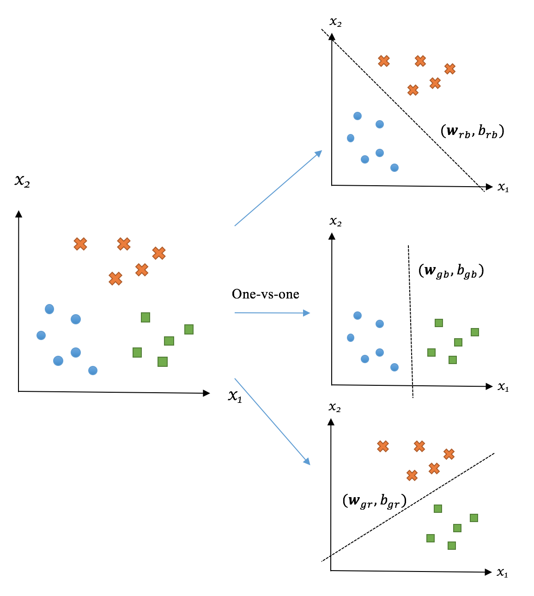

In general, an SVM classifier with one-vs-rest and with one-vs-one
setting perform comparably in terms of accuracy. The choice between
these two strategies is largely computational. Although one-vs-one
requires more classifiers ~~

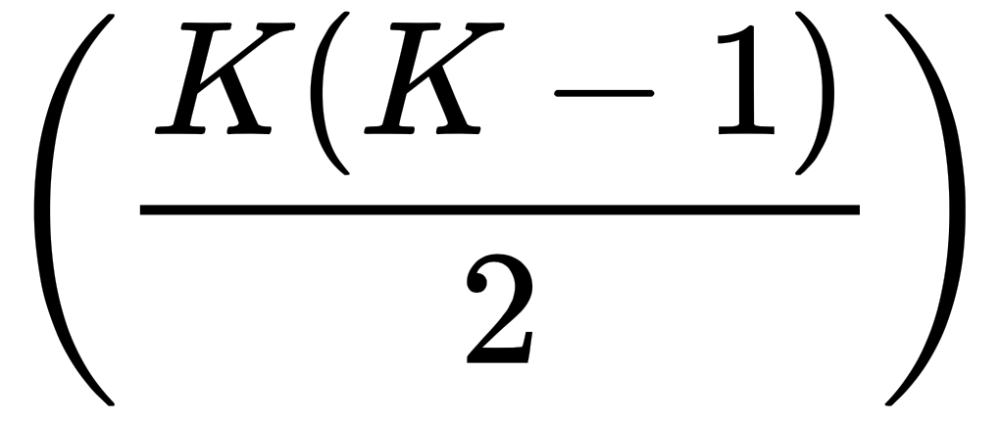

 than one-vs-rest *(K)*, each pairwise classifier only needs to learn on
a small subset of data, as opposed to the entire set in the one-vs-rest
setting. As a result, training an SVM model in the one-vs-one setting is
generally more memory-efficient and less computationally expensive, and
hence more preferable for practical use, as argued in *Chih-Wei Hsu* and
*Chih-Jen Lin*'s *A comparison of methods for multiclass support vector
machines* (*IEEE Transactions on Neural Networks*, *March 2002*, *Volume
13, pp. 415-425*).

In `scikit-learn`{.literal}, classifiers handle multiclass cases
internally, and we do not need to explicitly write any additional codes
to enable it. We can see how simple it is in the following example of
classifying five topics - `comp.graphics`{.literal},
`sci.space`{.literal}, `alt.atheism`{.literal},
`talk.religion.misc`{.literal}, and `rec.sport.hockey`{.literal}:


```
>>> categories = [
...     'alt.atheism',
...     'talk.religion.misc',
...     'comp.graphics',
...     'sci.space',
...     'rec.sport.hockey'
... ]
>>> data_train = fetch_20newsgroups(subset='train',
                          categories=categories, random_state=42)
>>> data_test = fetch_20newsgroups(subset='test',
                          categories=categories, random_state=42)
>>> cleaned_train = clean_text(data_train.data)
>>> label_train = data_train.target
>>> cleaned_test = clean_text(data_test.data)
>>> label_test = data_test.target
>>> term_docs_train = tfidf_vectorizer.fit_transform(cleaned_train)
>>> term_docs_test = tfidf_vectorizer.transform(cleaned_test)
```

In an `SVC`{.literal} model, multiclass support is implicitly handled
according to the one-vs-one scheme:


```
>>> svm = SVC(kernel='linear', C=1.0, random_state=42)
>>> svm.fit(term_docs_train, label_train)
>>> accuracy = svm.score(term_docs_test, label_test)
>>> print('The accuracy of 5-class classification is:
                                 {0:.1f}%'.format(accuracy*100))
The accuracy on testing set is: 88.6%
```

We also check how it performs for individual classes:


```
>>> from sklearn.metrics import classification_report
>>> prediction = svm.predict(term_docs_test)
>>> report = classification_report(label_test, prediction)
>>> print(report)
             precision recall  f1-score support


          0 0.79      0.77 0.78   319
          1 0.92      0.96 0.94   389
          2 0.98      0.96 0.97   399
          3 0.93      0.94 0.93   394
          4 0.74      0.73 0.73   251


  micro avg       0.89 0.89    0.89 1752
  macro avg       0.87 0.87    0.87 1752
weighted avg      0.89 0.89    0.89 1752
```

Not bad! Also, we could further tweak the values of the
hyperparameters `kernel`{.literal} and `C`{.literal}. As discussed, the
factor `C`{.literal} controls the strictness of separation, and it can
be tuned to achieve the best trade-off between bias and variance. How
about the kernel? What does it mean and what are the alternatives to a
`linear`{.literal} kernel?

### The kernels of SVM

In this section, we will answer those two questions we raised in the
preceding case as a result of the fifth case. You will see how the
kernel trick makes SVM so powerful.

#### Case 5 – solving linearly non-separable problems

The hyperplanes we have found up till now are linear, for instance, a
line in a two-dimensional feature space, or a surface in a
three-dimensional one. However, in the following example, we are not
able to find any linear hyperplane that can separate two classes:

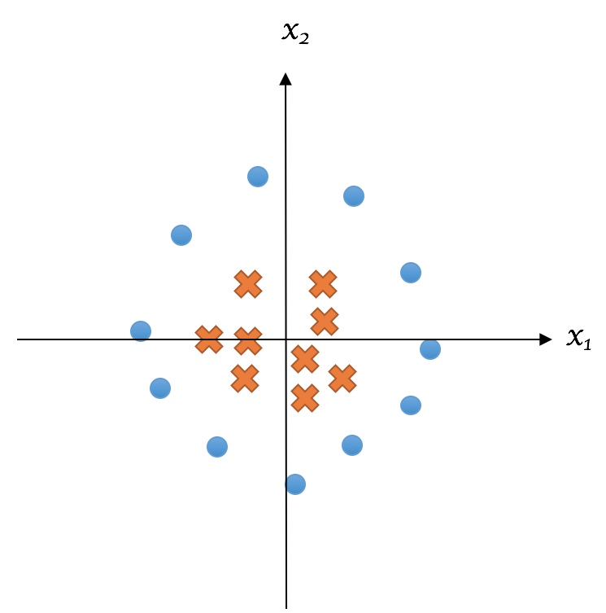

Intuitively, we observe that data points from one class are closer to
the origin than those from another class. The distance to the origin
provides distinguishable information. So we add a new feature, ~~

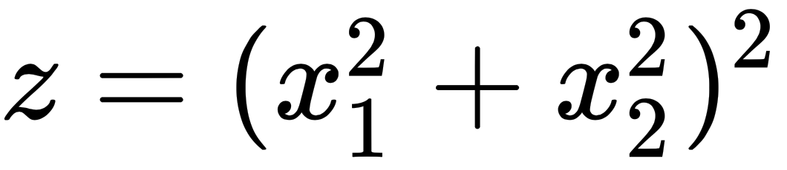

, and transform the original two-dimensional space into a
three-dimensional one. In the new space, as displayed in the following,
we can find a surface hyperplane separating the data, or a line in the
two-dimension view. With the additional feature, the dataset becomes
linearly separable in the higher dimensional space, ~~

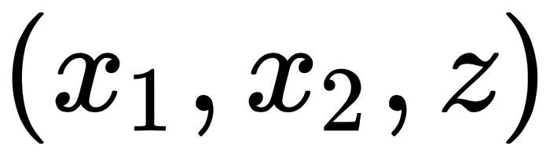

:

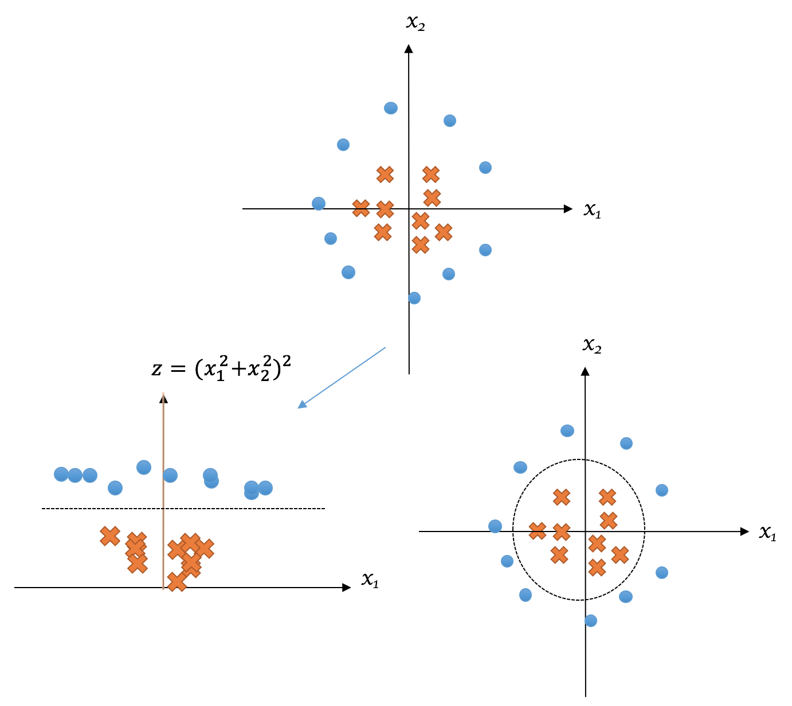

Based upon similar logics, **SVMs with kernels** are invented to solve
non-linear classification problems by converting the original feature
space, 


, to a higher dimensional feature space with a transformation
function, ~~

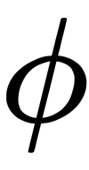

, such that the transformed dataset ~~

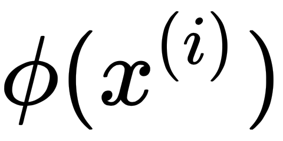

 is linearly separable. A linear hyperplane ~~


is then learned using observations ~~


. For an unknown sample 

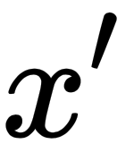

, it is first transformed into ~~

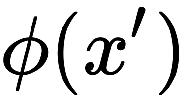

; the predicted class is determined by ~~

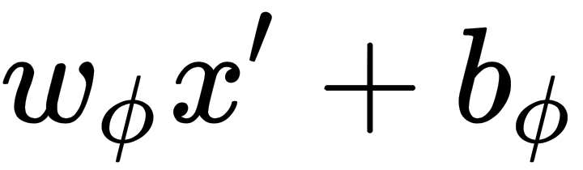

.

An SVM with kernels enables non-linear separation. But it does not
explicitly map each original data point to the high-dimensional space
and then perform expensive computation in the new space. Instead, it
approaches this in a **tricky** way:

During the course of solving the SVM quadratic optimization problems,
feature vectors ~~


are involved only in the form of a pairwise dot product ~~

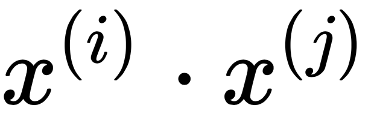

, although we will not expand this mathematically in this book. With
kernels, the new feature vectors are ~~

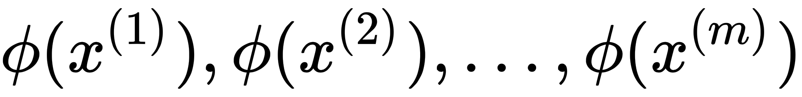

 and their pairwise dot products can be expressed as ~~


. It would be computationally efficient if we can first implicitly
conduct pairwise operation on two low-dimensional vectors and later map
the result to the high-dimensional space. In fact, a function *K* that
satisfies this does exist:

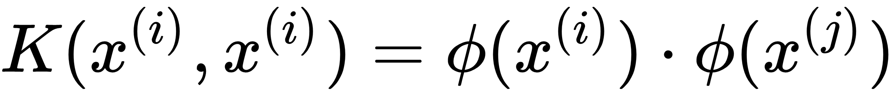

The function *K* is the so-called **kernel function**. With this trick,
the transformation 


becomes implicit, and the non-linear decision boundary can be
efficiently learned by simply replacing the term ~~

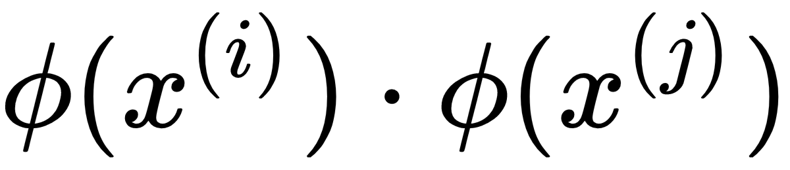

 with ~~


.

The most popular kernel function is probably the **radial basis
function** (**RBF**) kernel (also called the **Gaussian** kernel), which
is defined as follows:

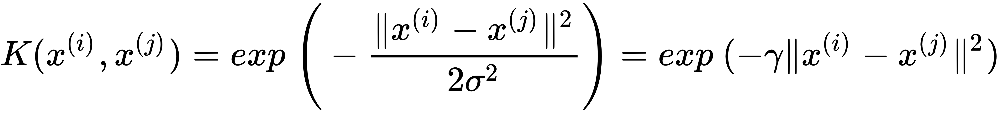

Here, ~~

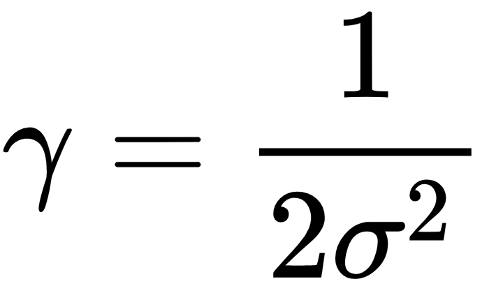

. In the Gaussian function, the standard deviation

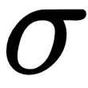

 controls the amount of variation or dispersion allowed: the higher 


 (or lower


), the larger width of the bell, the wider range of data points allowed
to spread out over. Therefore,


 as the **kernel coefficient** determines how particularly or generally
the kernel function fits the observations. A large


implies a small variance allowed and a relatively exact fit on the
training samples, which might lead to overfitting. On the other hand, a
small


 implies a high variance allowed and a loose fit on the training
samples, which might cause underfitting. To illustrate this trade-off,
let's apply the RBF kernel with different values to a toy dataset:


```
>>> import numpy as np
>>> import matplotlib.pyplot as plt
>>> X = np.c_[# negative class
...           (.3, -.8),
...           (-1.5, -1),
...           (-1.3, -.8),
...           (-1.1, -1.3),
...           (-1.2, -.3),
...           (-1.3, -.5),
...           (-.6, 1.1),
...           (-1.4, 2.2),
...           (1, 1),
...           # positive class
...           (1.3, .8),
...           (1.2, .5),
...           (.2, -2),
...           (.5, -2.4),
...           (.2, -2.3),
...           (0, -2.7),
...           (1.3, 2.1)].T
>>> Y = [-1] * 8 + [1] * 8
```

Eight data points are from one class, and eight from another. We take
three values, `1`{.literal}, `2`{.literal}, and `4`{.literal}, for
kernel coefficient as an example:


```
>>> gamma_option = [1, 2, 4]
```

Under each kernel coefficient, we fit an individual SVM classifier and
visualize the trained decision boundary:


```
>>> import matplotlib.pyplot as plt
>>> gamma_option = [1, 2, 4]
>>> for i, gamma in enumerate(gamma_option, 1):
... svm = SVC(kernel='rbf', gamma=gamma)
... svm.fit(X, Y)
... plt.scatter(X[:, 0], X[:, 1], c=['b']*8+['r']*8, zorder=10, cmap=plt.cm.Paired)
... plt.axis('tight')
... XX, YY = np.mgrid[-3:3:200j, -3:3:200j]
... Z = svm.decision_function(np.c_[XX.ravel(), YY.ravel()])
... Z = Z.reshape(XX.shape)
... plt.pcolormesh(XX, YY, Z > 0, cmap=plt.cm.Paired)
... plt.contour(XX, YY, Z, colors=['k', 'k', 'k'],
                      linestyles=['--', '-', '--'], levels=[-.5, 0, .5])
... plt.title('gamma = %d' % gamma)
... plt.show()
```

Refer to the following screenshot for the end results:

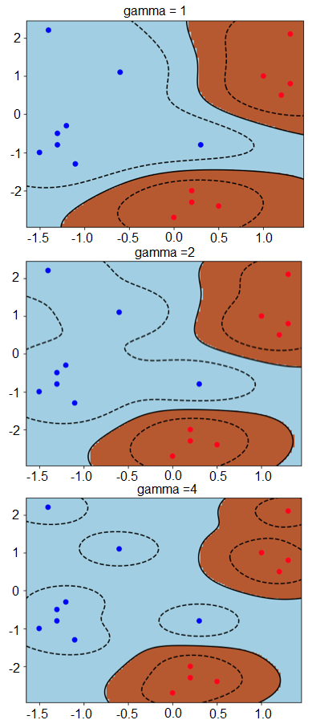

We can observe that a larger 

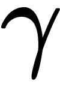

 results in a stricter fit on the dataset. Of course,


 can be fine-tuned through cross-validation to obtain the best
performance.

Some other common kernel functions include **polynomial** kernel and
**sigmoid** kernel:

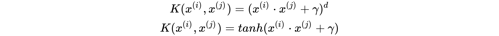

In the absence of prior knowledge of the distribution, the RBF kernel is
usually preferable in practical usage, as there is an additional
parameter to tweak in the polynomial kernel (polynomial degree *d*) and
the empirical sigmoid kernel can perform approximately on a par with the
RBF, but only under certain parameters. Hence, we come to a debate
between linear (also considered no kernel) and RBF kernel given a
dataset.

### Choosing between linear and RBF kernels

Of course, linear separability is the rule of thumb when choosing the
right kernel to start with. However, most of the time, this is very
difficult to identify, unless you have sufficient prior knowledge of the
dataset, or its features are of low dimensions (1 to 3).

### Note

Some general prior knowledge we have include: text data is often
linearly separable, while data generated from the `XOR`{.literal}
function is not.

Now, let's look at the following three scenarios where linear kernel is
favored over RBF:

**Scenario 1**: Both the numbers of features and instances are large
(more than 10^4^ or 10^5^). Since the dimension of the feature space is
high enough, additional features as a result of RBF transformation will
not provide any performance improvement, but will increase computational
expense. Some examples from the UCI machine learning repository are of
this type:

-   *URL Reputation Dataset*:
    [https://archive.ics.uci.edu/ml/datasets/URL+Reputation](https://archive.ics.uci.edu/ml/datasets/URL+Reputation)
    (number of instances: 2,396,130; number of features: 3,231,961).
    This is designed for malicious URL detection based on their lexical
    and host information.
-   *YouTube Multiview Video Games
    Dataset*:* *[https://archive.ics.uci.edu/ml/datasets/YouTube+Multiview+Video+Games+Dataset](https://archive.ics.uci.edu/ml/datasets/YouTube+Multiview+Video+Games+Dataset)
    (number of instances: 120,000; number of features: 1,000,000). This
    is designed for topic classification.

**Scenario 2**: The number of features is noticeably large compared to
the number of training samples. Apart from the reasons stated in
*scenario 1*, the RBF kernel is significantly more prone to overfitting.
Such a scenario occurs, for example, in the following referral links:

-   *Dorothea Dataset*:
    [https://archive.ics.uci.edu/ml/datasets/Dorothea](https://archive.ics.uci.edu/ml/datasets/Dorothea)
    (number of instances: 1,950; number of features: 100,000). This is
    designed for drug discovery that classifies chemical compounds as
    active or inactive according to their structural molecular features.
-   *Arcene
    Dataset*: [https://archive.ics.uci.edu/ml/datasets/Arcene](https://archive.ics.uci.edu/ml/datasets/Arcene)
    (number of instances: 900; number of features: 10,000). This
    represents a mass-spectrometry dataset for cancer detection.

**Scenario 3**: The number of instances is significantly large compared
to the number of features. For a dataset of low dimension, the RBF
kernel will, in general, boost the performance by mapping it to a
higher-dimensional space. However, due to the training complexity, it
usually becomes no longer efficient on a training set with more than
10^6^ or 10^7^  samples. Example datasets include the following:

-   *Heterogeneity Activity Recognition Dataset*:
    [https://archive.ics.uci.edu/ml/datasets/Heterogeneity+Activity+Recognition](https://archive.ics.uci.edu/ml/datasets/Heterogeneity+Activity+Recognition)
    (number of instances: 43,930,257; number of features: 16). This is
    designed for human activity recognition.
-   *HIGGS Dataset*:
    [https://archive.ics.uci.edu/ml/datasets/HIGGS](https://archive.ics.uci.edu/ml/datasets/HIGGS)
    (number of instances: 11,000,000; number of features: 28). This is
    designed to distinguish between a signal process producing Higgs
    bosons or a background process

Aside from these three scenarios, RBF is ordinarily the first choice.

The rules for choosing between linear and RBF kernel can be summarized
as follows:

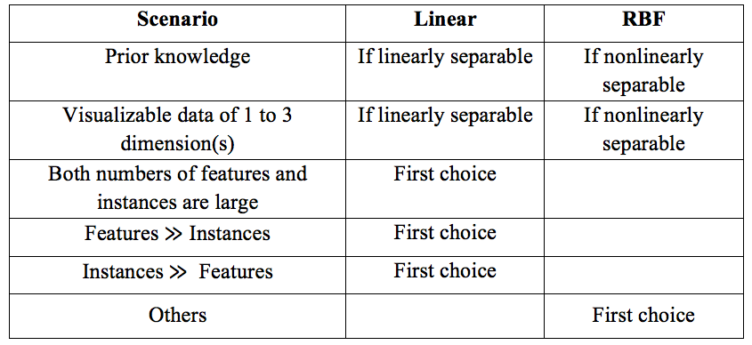

Once again, **first choice** means what we can **begin****with** this
option; it does not mean that this is the only option moving forward.


* * * * *
