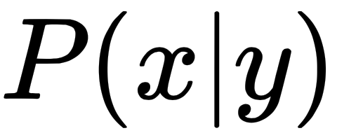
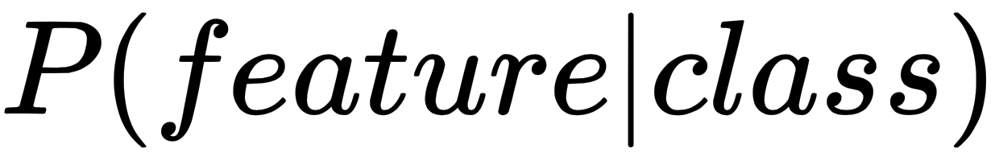
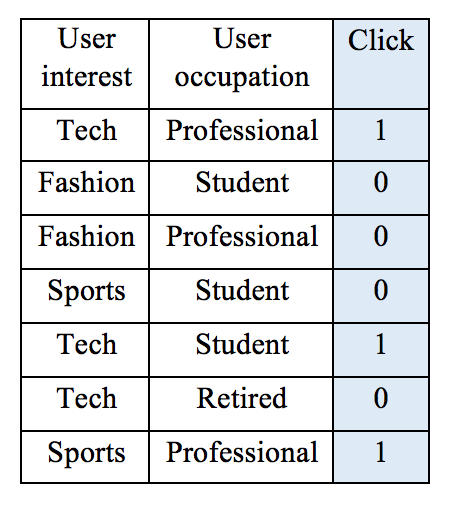
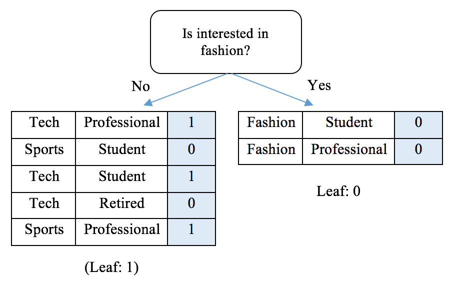
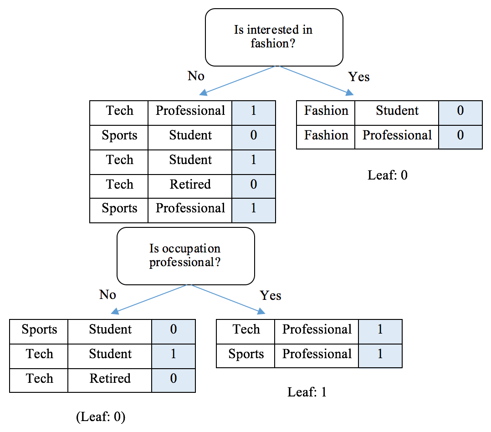
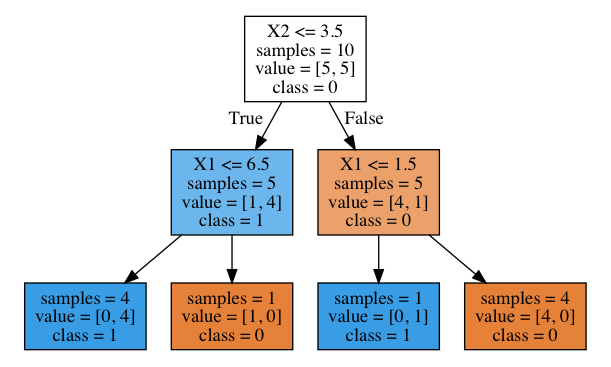

# Lab : Predicting Online Ad Click-Through with Tree-Based Algorithms
In this chapter and the next, we will be solving one of the most data-driven problems in digital advertising: ad click-through prediction - given a user and the page he/she is visiting, this predicts how likely it is that they will click on a given ad. We will be focusing on learning tree-based algorithms (decision tree and random forest) and utilizing them to tackle this billion-dollar problem. We will be exploring decision trees from the root to the leaves, as well as the aggregated version, a forest of trees. This won't be a bland chapter, as there are a lot of hand-calculations and implementations of tree models from scratch, and using scikit-learn and TensorFlow.

We will cover the following topics in this chapter:

- Introduction to online advertising click-through
- Two types of feature: numerical and categorical
- What is decision tree
- The mechanics of a decision tree classifier
- The construction of decision tree
- The implementation of decision tree from scratch
- The implementation of decision tree using scikit-learn
- Click-through predictions with decision tree
- What is random forest?
- The mechanics of random forest
- Click-through predictions with random forest
- Tuning a tree model using grid search and cross-validation
- The implementation of random forest using TensorFlow


#### Pre-reqs:
- Google Chrome (Recommended)

#### Lab Environment
Notebooks are ready to run. All packages have been installed. There is no requirement for any setup.

**Note:** Elev8ed Notebooks (powered by Jupyter) will be accessible at the port given to you by your instructor. Password for jupyterLab : `1234`

All Notebooks are present in `work` folder.

# Brief overview of advertising click-through prediction
Display online advertising is a multibillion-dollar industry. It comes in different formats, including banner ads composed of text, images, flash, and rich media such as audio and video. Advertisers or their agencies place advertisements on a variety of websites, even mobile apps, across the internet to reach potential customers and deliver an advertising message.

Display online advertising has served as one of the greatest examples of machine learning utilization. Obviously, advertisers and consumers are keenly interested in well-targeted ads. The industry has relied heavily on the ability of machine learning models to predict the effectiveness of ad targeting: how likely it is that an audience in a certain age group will be interested in this product, customers with a certain household income will purchase this product after seeing the ad, frequent sports site visitors will spend more time reading this ad, and so on. The most common measurement of effectiveness is the click-through rate (CTR), which is the ratio of clicks on a specific ad to its total number of views. The higher the CTR in general, the better targeted an ad is, and the more successful an online advertising campaign is.  

Click-through prediction entails both promise and challenges for machine learning. It mainly involves binary classification of whether a given ad on a given page (or app) will be clicked by a given user, with predictive features from the following three aspects:

- Ad content and information (category, position, text, format, and so on)
- Page content and publisher information (category, context, domain, and so on)
- User information (age, gender, location, income, interests, search history, browsing history, device, and so on)

Suppose we as an agency are operating ads on behalf of several advertisers, and our job is to place the right ads for the right audience. With an existing dataset in hand (the following small chunk is an example; the number of predictive features can easily go into the thousands in reality) taken from millions records of campaigns running a month ago (let's say), we need to develop a classification model to learn and predict future ad placement outcomes:


# Getting started with two types of data – numerical and categorical
At first glance, the features in the preceding dataset are categorical, for example, male or female, one of four age groups, one of the predefined site categories, and whether or not the user is interested in sports. Such data is different from the numerical feature data we have worked with till now.

Categorical (also called qualitative) features represent characteristics, distinct groups, and a countable number of options. Categorical features may or may not have logical order. For example, household income from low, median, to high is an ordinal feature, while the category of an ad is not ordinal. Numerical (also called quantitative) features, on the other hand, have mathematical meaning as a measurement and, of course, are ordered. For instance, term frequency and the tf-idf variant are discrete and continuous numerical features respectively; the cardiotocography dataset contains both discrete (such as number of accelerations per second and number of fetal movements per second) and continuous (such as the mean value of long-term variability) numerical features.

Categorical features can also take on numerical values. For example, 1 to 12 can represent months of the year, and 1 and 0 can indicate male and female. Still, these values do not have mathematical implications.

Of the two classification algorithms we learned previously, Naïve Bayes and SVM, the Naïve Bayes classifier works for both numerical and categorical features as likelihoods




or



are calculated in the same way, while SVM requires features to be numerical in order to compute and maximize distance margins.
Now, we are thinking of predicting click-through using Naïve Bayes, and trying to explain the model to our advertising clients. However, our clients may find it difficult to understand the prior and the likelihood of individual attributes, and their multiplication. Is there a classifier that is easy to interpret and explain to clients, and is also able to directly handle categorical data? Decision trees are the answer!  


Exploring decision tree from root to leaves
-------------------------------------------

* * * * *

A decision tree is a tree-like graph, a sequential diagram illustrating
all of the possible decision alternatives and the corresponding
outcomes. Starting from the **root** of a tree, every internal **node**
represents the basis on which a decision is made; each branch of a node
represents how a choice may lead to the next nodes; and finally, each
**terminal node**, the **leaf**, represents the outcome produced.

For example, we have just made a couple of decisions that brought us to
the point of using a decision tree to solve our advertising problem:


The first condition, or the root is whether the feature type is
numerical or categorical. Ad click stream data contain mostly
categorical features, so it goes to the right branch. In the next node,
our work needs to be interpretable by non-technical clients. So, it goes
to the right branch and reaches the leaf of choosing the decision tree
classifier. You can also look at paths and see what kinds of problems
they can fit in.

Decision tree classifier operates in a form of a decision tree, which
maps observations to class assignments (symbolized as leaf nodes)
through a series of tests (represented as internal nodes) based on
feature values and corresponding conditions (represented as branches).
In each node, a question regarding the values and characteristics of a
feature is asked; depending on the answer to the question, observations
are split into subsets. Sequential tests are conducted until a
conclusion about the observations' target label is reached. The paths
from root to end leaves represent the decision-making process, the
classification rules.

In a much simplified scenario, shown in the following diagram, where we
want to predict Click or No click on a self-driven car ad, we manually
construct a decision tree classifier that works for an available
dataset. For example, if a user is interested in technology and has a
car, they will tend to click on the ad; for a person outside of this
subset, if the person is a high-income woman, then she is unlikely to
click on the ad. We then use the trained tree to predict two new inputs,
whose results are Click and No click respectively:


After a decision tree has been constructed, classifying a new sample is
straightforward, as we just saw: starting from the root, apply the test
condition and follow the branch accordingly until a leaf node is
reached, and the class label associated will be assigned to the new
sample.

So, how can we build an appropriate decision tree?

### Constructing a decision tree

A decision tree is constructed by partitioning the training samples into
successive subsets. The partitioning process is repeated in a recursive
fashion on each subset. For each partitioning at a node, a condition
test is conducted based on the value of a feature of the subset. When
the subset shares the same class label, or no further splitting can
improve the class purity of this subset, recursive partitioning on this
node is finished.

Theoretically, for a partitioning on a feature (numerical or
categorical) with *n* different values, there are *n* different ways of
binary splitting (yes or no to the condition test), not to mention other
ways of splitting. Without considering the order of features
partitioning is taking place on, there are already *n^m^* possible trees
for an *m*-dimension dataset:


Many algorithms have been developed to efficiently construct an accurate
decision tree. Popular ones include the following:

-   **Iterative Dichotomiser 3 (ID3)**: This algorithm uses a greedy
    search in a top-down manner by selecting the best attribute to split
    the dataset on each iteration without backtracking.
-   **C4.5**: An improved version on ID3 that introduces backtracking;
    it traverses the constructed tree and replaces branches with leaf
    nodes if purity is improved this way.
-   **Classification and Regression Tree (CART)**: It constructs the
    tree using binary splitting, which we will discuss in detail
    shortly.

 

-   **CHi-squared Automatic Interaction Detector (CHAID)**: This
    algorithm is often used in direct marketing. It involves complicated
    statistical concepts, but basically determines the optimal way of
    merging predictive variables in order to best explain the outcome.

The basic idea of these algorithms is to grow the tree greedily by
making a series of local optimizations on choosing the most significant
feature to use to partition the data. The dataset is then split based on
the optimal value of that feature. We will discuss the measurement of a
significant feature and the optimal splitting value of a feature in the
next section.

We now study the CART algorithm in detail and will implement it as the
most notable decision tree algorithm after. It constructs the tree using
binary splitting and growing each node into left and right children. In
each partition, it greedily searches for the most significant
combination of a feature and its value; all different possible
combinations are tried and tested using a measurement function. With the
selected feature and value as a splitting point, it then divides the
dataset as follows:

-   Samples with the feature of this value (for a categorical feature)
    or a greater value (for a numerical feature) become the right child
-   The remainder becomes the left child

This partitioning process repeats and recursively divides up the input
samples into two subgroups. When the dataset becomes unmixed, a
splitting process stops at a subgroup where either of the following two
criteria are met:

-   **The minimum number of samples for a new node**: When the number of
    samples is not greater than the minimum number of samples required
    for a further split, the partitioning stops in order to prevent the
    tree from excessively tailoring to the training set and, as a
    result, overfitting.
-   **The maximum depth of the tree**: A node stops growing when its
    depth, which is defined as the number of partitioning taking place
    from the top down, starting from the root node ending in a terminal
    node, is not less than the maximum tree depth. Deeper trees are more
    specific to the training set and lead to overfitting.

A node with no branches becomes a leaf, and the dominant class of
samples at this node is the prediction. Once all splitting processes
finish, the tree is constructed and is portrayed with the assigned
labels at the terminal nodes and the splitting points (feature + value)
at all the internal nodes above.

We will implement the CART decision tree algorithm from scratch after
studying the metrics of selecting the optimal splitting feature and
value, as promised.

### The metrics for measuring a split

When selecting the best combination of feature and value as the
splitting point, two criteria such as **Gini Impurity** and
**Information Gain**** **can be used to measure the quality of
separation. 

Gini Impurity, as its name implies, measures the impurity rate of the
class distribution of data points, or the class mixture rate. For a
dataset with *K* classes, suppose data from class ~~


take up a fraction ~~


of the entire dataset, the *Gini Impurity* of this dataset is written as
follows:


Lower Gini Impurity indicates a purer dataset. For example, when the
dataset contains only one class, say the fraction of this class is **1**
and that of others is **0**, its Gini Impurity becomes ~~


. In another example, a dataset records a large number of coin flips,
and heads and tails each take up half of the samples. The Gini Impurity
is ~~


##### Run Notebook
The Notebook opens in a new browser window. You can create a new notebook or open a local one. Check out the local folder `work/Chapter06` for several sample notebooks. Open and run `.ipynb` in the `work` folder.

You can open the Jupyter Notebook at `<host-ip>:<port>/notebooks/work/Chapter06/decision_tree_submit.ipynb`

. In binary cases, Gini Impurity under different values of the positive
class' fraction can be visualized by the following code blocks:

```
>>> import matplotlib.pyplot as plt
>>> import numpy as np
```

The fraction of the positive class varies from 0 to 1:

```
>>> pos_fraction = np.linspace(0.00, 1.00, 1000)
```

Gini Impurity is calculated accordingly, followed by the plot of
`Gini Impurity` versus `Positive fraction`:

```
>>> gini = 1 – pos_fraction**2 – (1-pos_fraction)**2
>>> plt.plot(pos_fraction, gini)
>>> plt.ylim(0, 1)
>>> plt.xlabel(‘Positive fraction')
>>> plt.ylabel(‘Gini Impurity')
>>> plt.show()
```

Refer to the following screenshot for the end result:


Given the labels of a dataset, we can implement
the `Gini Impurity` calculation function as follows:

```
>>> def gini_impurity(labels):
...     # When the set is empty, it is also pure
...     if not labels:
...         return 0
...     # Count the occurrences of each label
...     counts = np.unique(labels, return_counts=True)[1]
...     fractions = counts / float(len(labels))
...     return 1 - np.sum(fractions ** 2)
```

Test it out with some examples:

```
>>> print('{0:.4f}'.format(gini_impurity([1, 1, 0, 1, 0])))
0.4800
>>> print('{0:.4f}'.format(gini_impurity([1, 1, 0, 1, 0, 0])))
0.5000
>>> print('{0:.4f}'.format(gini_impurity([1, 1, 1, 1])))
0.0000
```

In order to evaluate the quality of a split, we simply add up the Gini
Impurity of all resulting subgroups, combining the proportions of each
subgroup as corresponding weight factors. And again, the smaller the
weighted sum of Gini Impurity, the better the split.

Take a look at the following self-driving car ad example, where we split
the data based on user's gender and interest in technology respectively:


The weighted Gini Impurity of the first split can be calculated as
follows:


The second split is as follows:


Thus, splitting based on the user's interest in technology is a better
strategy than gender.

Another metric, **Information Gain**, measures the improvement of purity
after splitting, or in other words, the reduction of uncertainty due to
a split. Higher Information Gain implies better splitting. We obtain the
Information Gain of a split by comparing the **entropy** before and
after the split.

**Entropy** is the probabilistic measure of uncertainty. Given a
*K*-class dataset, and ~~


denoted as the fraction of data from class ~~


, the e*ntropy* of the dataset is defined as follows:


Lower entropy implies a purer dataset with less ambiguity. In a perfect
case where the dataset contains only one class, the entropy is ~~


. In the coin flip example, the entropy becomes ~~


.

Similarly, we can visualize how entropy changes with different values of
the positive class's fraction in binary cases using the following lines
of codes:

```
>>> pos_fraction = np.linspace(0.00, 1.00, 1000)
>>> ent = - (pos_fraction * np.log2(pos_fraction) +
            (1 - pos_fraction) * np.log2(1 - pos_fraction))
>>> plt.plot(pos_fraction, ent)
>>> plt.xlabel('Positive fraction')
>>> plt.ylabel('Entropy')
>>> plt.ylim(0, 1)
>>> plt.show()
```

This will give us the following output:


Given the labels of a dataset, the `entropy` calculation
function can be implemented as follows:

```
>>> def entropy(labels):
...     if not labels:
...         return 0
...     counts = np.unique(labels, return_counts=True)[1]
...     fractions = counts / float(len(labels))
...     return - np.sum(fractions * np.log2(fractions))
```

Test it out with some examples:

```
>>> print('{0:.4f}'.format(entropy([1, 1, 0, 1, 0])))
0.9710
>>> print('{0:.4f}'.format(entropy([1, 1, 0, 1, 0, 0])))
1.0000
>>> print('{0:.4f}'.format(entropy([1, 1, 1, 1])))
-0.0000
```

Now that we have fully understood entropy, we can look into how
Information Gain measures how much uncertainty was reduced after
splitting, which is defined as the difference in entropy before a split
(parent) and after the split (children):


Entropy after a split is calculated as the weighted sum of the entropy
of each child, similarly to the weighted Gini Impurity.

During the process of constructing a node at a tree, our goal is to
search for the splitting point where the maximum Information Gain is
obtained. As the entropy of the parent node is unchanged, we just need
to measure the entropy of the resulting children due to a split. The
best split is the one with the lowest entropy of its resulting children.

To understand it better, let's look at the self-driving car ad example
again.

For the first option, the *entropy* after the split can be calculated as
follows:


The second way of splitting is as follows:


For exploration, we can also calculate their *Information Gain* by:


According to the Information Gain = entropy-based evaluation, the second
split is preferable, which is the conclusion of the Gini Impurity
criterion.

In general, the choice of two metrics, Gini Impurity and Information
Gain, has little effect on the performance of the trained decision tree.
They both measure the weighted impurity of the children after a split.
We can combine them into one function to calculate the weighted
impurity:

```
>>> criterion_function = {'gini': gini_impurity,
                         'entropy': entropy}
>>> def weighted_impurity(groups, criterion='gini'):
...     """
...     Calculate weighted impurity of children after a split
...     @param groups: list of children, and a child consists a
                        list of class labels
...     @param criterion: metric to measure the quality of a split,
          'gini' for Gini Impurity or 'entropy' for Information Gain
...     @return: float, weighted impurity
...     """
...     total = sum(len(group) for group in groups)
...     weighted_sum = 0.0
...     for group in groups:
...         weighted_sum += len(group) / float(total) *
                              criterion_function[criterion](group)
...     return weighted_sum
```

Test it with the example we just hand-calculated, as follows:

```
>>> children_1 = [[1, 0, 1], [0, 1]]
>>> children_2 = [[1, 1], [0, 0, 1]]
>>> print('Entropy of #1 split:
        {0:.4f}'.format(weighted_impurity(children_1, 'entropy')))
Entropy of #1 split: 0.9510
>>> print('Entropy of #2 split:
        {0:.4f}'.format(weighted_impurity(children_2, 'entropy')))
Entropy of #2 split: 0.5510
```


Implementing a decision tree from scratch
-----------------------------------------

* * * * *

With a solid understanding of partitioning evaluation metrics, let's
practice the CART tree algorithm by hand on a toy dataset:



To begin, we decide on the first splitting point, the root, by trying
out all possible values for each of the two features. We utilize the
`weighted_impurity` function we just defined to calculate the
weighted Gini Impurity for each possible combination as follows:

Gini(interest, tech) = weighted\_impurity([[1, 1, 0], [0, 0, 0, 1]]) =
0.405 Gini(interest, Fashion) = weighted\_impurity([[0, 0], [1, 0, 1, 0,
1]]) = 0.343 Gini(interest, Sports) = weighted\_impurity([[0, 1], [1, 0,
0, 1, 0]]) = 0.486 Gini(occupation, professional) =
weighted\_impurity([[0, 0, 1, 0], [1, 0, 1]]) = 0.405 Gini(occupation,
student) = weighted\_impurity([[0, 0, 1, 0], [1, 0, 1]]) = 0.405
Gini(occupation, retired) = weighted\_impurity([[1, 0, 0, 0, 1, 1],
[1]]) = 0.429

The root goes to the user interest feature with the fashion value, as
this combination achieves the lowest weighted impurity, or the highest
Information Gain. We can now build the first level of the tree as
follows:



If we are satisfied with a one-level-deep tree, we can stop here by
assigning the right branch label **0** and the left branch label **1**
as the majority class. Alternatively, we can go further down the road,
constructing the second level from the left branch (the right branch
cannot be further split):

Gini(interest, tech) = weighted\_impurity([[0, 1], [1, 1, 0]]) = 0.467
Gini(interest, Sports) = weighted\_impurity([[1, 1, 0], [0, 1]]) = 0.467
Gini(occupation, professional) = weighted\_impurity([[0, 1, 0], [1, 1]])
= 0.267 Gini(occupation, student) = weighted\_impurity([[1, 0, 1], [0,
1]]) = 0.467 Gini(occupation, retired) = weighted\_impurity([[1, 0, 1,
1], [0]]) = 0.300

With the second splitting point specified by (`occupation`,
`professional`) with the lowest Gini Impurity, our tree
becomes this:



We can repeat the splitting process as long as the tree does not exceed
the maximum depth and the node contains enough samples.

It is now time for coding after the process of tree construction has
been made clear.

We start with the criterion of the best splitting point; the calculation
of the weighted impurity of two potential children is what we defined
previously, while that of two metrics are slightly different. The inputs
now become NumPy arrays for computational efficiency:

```
>>> def gini_impurity_np(labels):
...     # When the set is empty, it is also pure
...     if labels.size == 0:
...         return 0
...     # Count the occurrences of each label
...     counts = np.unique(labels, return_counts=True)[1]
...     fractions = counts / float(len(labels))
...     return 1 - np.sum(fractions ** 2)
```

Also, take a look at the following code:

```
>>> def entropy_np(labels):
...     # When the set is empty, it is also pure
...     if labels.size == 0:
...         return 0
...     counts = np.unique(labels, return_counts=True)[1]
...     fractions = counts / float(len(labels))
...     return - np.sum(fractions * np.log2(fractions))
```

Also update the `weighted_impurity` function as follows:

```
>>> def weighted_impurity(groups, criterion='gini'):
...     """
...     Calculate weighted impurity of children after a split
...     @param groups: list of children, and a child consists a list
                         of class labels
...     @param criterion: metric to measure the quality of a split,
          'gini' for Gini Impurity or 'entropy' for Information Gain
...     @return: float, weighted impurity
...     """
...     total = sum(len(group) for group in groups)
...     weighted_sum = 0.0
...     for group in groups:
...         weighted_sum += len(group) / float(total) *
                             criterion_function_np[criterion](group)
...     return weighted_sum
```

Next, we define a utility function to split a node into left and right
children based on a feature and a value:

```
>>> def split_node(X, y, index, value):
...     """
...     Split dataset X, y based on a feature and a value
...     @param X: numpy.ndarray, dataset feature
...     @param y: numpy.ndarray, dataset target
...     @param index: int, index of the feature used for splitting
...     @param value: value of the feature used for splitting
...     @return: list, list, left and right child, a child is in the
                format of [X, y]
...     """
...     x_index = X[:, index]
...     # if this feature is numerical
...     if X[0, index].dtype.kind in ['i', 'f']:
...         mask = x_index >= value
...     # if this feature is categorical
...     else:
...         mask = x_index == value
...     # split into left and right child
...     left = [X[~mask, :], y[~mask]]
...     right = [X[mask, :], y[mask]]
...     return left, right
```

### Note

We check whether the feature is numerical or categorical and split the
data accordingly.

With the splitting measurement and generation functions available, we
now define the greedy search function, which tries out all possible
splits and returns the best one given a selection criterion, along with
the resulting children:

```
>>> def get_best_split(X, y, criterion):
...     """
...     Obtain the best splitting point and resulting children for
                                                  the dataset X, y
...     @param X: numpy.ndarray, dataset feature
...     @param y: numpy.ndarray, dataset target
...     @param criterion: gini or entropy
...     @return: dict {index: index of the feature, value: feature  
                      value, children: left and right children}
...     """
...     best_index, best_value, best_score, children =
                                           None, None, 1, None
...     for index in range(len(X[0])):
...         for value in np.sort(np.unique(X[:, index])):
...             groups = split_node(X, y, index, value)
...             impurity = weighted_impurity(
                         [groups[0][1], groups[1][1]], criterion)
...             if impurity < best_score:
...                 best_index, best_value, best_score, children =
                                   index, value, impurity, groups
...     return {'index': best_index, 'value': best_value,
               'children': children}
```

The selection and splitting process occurs in a recursive manner on each
of the subsequent children. When a stopping criterion is met, the
process stops at a node and the major label will be assigned to this
leaf node:

```
>>> def get_leaf(labels):
...     # Obtain the leaf as the majority of the labels
...     return np.bincount(labels).argmax()
```

And finally, the recursive function links all these together:

-   It assigns a leaf node if one of two child nodes is empty
-   It assigns a leaf node if the current branch depth exceeds the
    maximum depth allowed
-   It assigns a leaf node if it does not contain sufficient samples
    required for a further split
-   Otherwise, it proceeds with a further split with the optimal
    splitting point

This is done with the following function:

```
>>> def split(node, max_depth, min_size, depth, criterion):
...     """
...     Split children of a node to construct new nodes or assign
        them terminals
...     @param node: dict, with children info
...     @param max_depth: int, maximal depth of the tree
...     @param min_size: int, minimal samples required to further
                         split a child
...     @param depth: int, current depth of the node
...     @param criterion: gini or entropy
...     """
...     left, right = node['children']
...     del (node['children'])
...     if left[1].size == 0:
...         node['right'] = get_leaf(right[1])
...         return
...     if right[1].size == 0:
...         node['left'] = get_leaf(left[1])
...         return
...     # Check if the current depth exceeds the maximal depth
...     if depth >= max_depth:
...         node['left'], node['right'] =
                            get_leaf(left[1]), get_leaf(right[1])
...         return
...     # Check if the left child has enough samples
...     if left[1].size <= min_size:
...         node['left'] = get_leaf(left[1])
...     else:
...         # It has enough samples, we further split it
...         result = get_best_split(left[0], left[1], criterion)
...         result_left, result_right = result['children']
...         if result_left[1].size == 0:
...             node['left'] = get_leaf(result_right[1])
...         elif result_right[1].size == 0:
...             node['left'] = get_leaf(result_left[1])
...         else:
...             node['left'] = result
...             split(node['left'], max_depth, min_size,
                                          depth + 1, criterion)
...     # Check if the right child has enough samples
...     if right[1].size <= min_size:
...         node['right'] = get_leaf(right[1])
...     else:
...         # It has enough samples, we further split it
...         result = get_best_split(right[0], right[1], criterion)
...         result_left, result_right = result['children']
...         if result_left[1].size == 0:
...             node['right'] = get_leaf(result_right[1])
...         elif result_right[1].size == 0:
...             node['right'] = get_leaf(result_left[1])
...         else:
...             node['right'] = result
...             split(node['right'], max_depth, min_size,
                                            depth + 1, criterion)
```

Finally, the entry point of the tree's construction is as follows:

```
>>> def train_tree(X_train, y_train, max_depth, min_size,
                  criterion='gini'):
...     """
...     Construction of a tree starts here
...     @param X_train: list of training samples (feature)
...     @param y_train: list of training samples (target)
...     @param max_depth: int, maximal depth of the tree
...     @param min_size: int, minimal samples required to further
                         split a child
...     @param criterion: gini or entropy
...     """
...     X = np.array(X_train)
...     y = np.array(y_train)
...     root = get_best_split(X, y, criterion)
...     split(root, max_depth, min_size, 1, criterion)
...     return root
```

Now, let's test it with the preceding hand-calculated example:

```
>>> X_train = [['tech', 'professional'],
...            ['fashion', 'student'],
...            ['fashion', 'professional'],
...            ['sports', 'student'],
...            ['tech', 'student'],
...            ['tech', 'retired'],
...            ['sports', 'professional']]
>>> y_train = [1, 0, 0, 0, 1, 0, 1]
>>> tree = train_tree(X_train, y_train, 2, 2)
```

To verify that the resulting tree from the model is identical to what we
constructed by hand, we writea function displaying the tree:

```
>>> CONDITION = {'numerical': {'yes': '>=', 'no': '<'},
...              'categorical': {'yes': 'is', 'no': 'is not'}}
>>> def visualize_tree(node, depth=0):
...     if isinstance(node, dict):
...         if node['value'].dtype.kind in ['i', 'f']:
...             condition = CONDITION['numerical']
...         else:
...             condition = CONDITION['categorical']
...         print('{}|- X{} {} {}'.format(depth * '  ',
               node['index'] + 1, condition['no'], node['value']))
...         if 'left' in node:
...             visualize_tree(node['left'], depth + 1)
...         print('{}|- X{} {} {}'.format(depth * '  ',
              node['index'] + 1, condition['yes'], node['value']))
...         if 'right' in node:
...             visualize_tree(node['right'], depth + 1)
...     else:
...         print('{}[{}]'.format(depth * '  ', node))
>>> visualize_tree(tree)
|- X1 is not fashion
 |- X2 is not professional
   [0]
 |- X2 is professional
   [1]
|- X1 is fashion
 [0]
```

We can test it with a numerical example as follows:

```
>>> X_train_n = [[6, 7],
...             [2, 4],
...             [7, 2],
...             [3, 6],
...             [4, 7],
...             [5, 2],
...             [1, 6],
...             [2, 0],
...             [6, 3],
...             [4, 1]]
>>> y_train_n = [0, 0, 0, 0, 0, 1, 1, 1, 1, 1]
>>> tree = train_tree(X_train_n, y_train_n, 2, 2)
>>> visualize_tree(tree)
|- X2 < 4
 |- X1 < 7
   [1]
 |- X1 >= 7
   [0]
|- X2 >= 4
 |- X1 < 2
   [1]
 |- X1 >= 2
   [0]
```

The resulting trees from our decision tree model are the same as those
we hand-crafted.

Now that we have a more solid understanding of decision trees by
implementing one from scratch, we can try the decision tree package from
`scikit-learn`, which is already well developed and optimized:

```
>>> from sklearn.tree import DecisionTreeClassifier
>>> tree_sk = DecisionTreeClassifier(criterion='gini',
                                max_depth=2, min_samples_split=2)
>>> tree_sk.fit(X_train_n, y_train_n)
```

To visualize the tree we just built, we utilize the built-in
`export_graphviz`function, as follows:

```
>>> export_graphviz(tree_sk, out_file='tree.dot',
       feature_names=['X1', 'X2'], impurity=False, filled=True,
       class_names=['0', '1'])
```

Running this will generate a file called `tree.dot`, which can
be converted to a PNG image file using **Graphviz** (introduction and
installation instructions can be found
at [http://www.graphviz.org)](http://www.graphviz.org/)) by running the
following command in the terminal:

```
dot -Tpng tree.dot -o tree.png
```

Refer to the following screenshot for the result:



The generated tree is essentially the same as the one we had before.
