Exploring decision tree from root to leaves
-------------------------------------------

* * * * *

A decision tree is a tree-like graph, a sequential diagram illustrating
all of the possible decision alternatives and the corresponding
outcomes. Starting from the **root** of a tree, every internal **node**
represents the basis on which a decision is made; each branch of a node
represents how a choice may lead to the next nodes; and finally, each
**terminal node**, the **leaf**, represents the outcome produced.

For example, we have just made a couple of decisions that brought us to
the point of using a decision tree to solve our advertising problem:

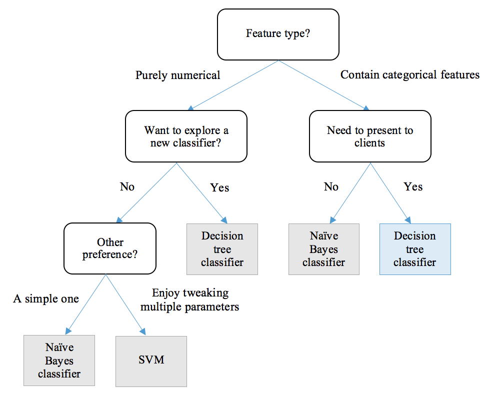

The first condition, or the root is whether the feature type is
numerical or categorical. Ad click stream data contain mostly
categorical features, so it goes to the right branch. In the next node,
our work needs to be interpretable by non-technical clients. So, it goes
to the right branch and reaches the leaf of choosing the decision tree
classifier. You can also look at paths and see what kinds of problems
they can fit in.

Decision tree classifier operates in a form of a decision tree, which
maps observations to class assignments (symbolized as leaf nodes)
through a series of tests (represented as internal nodes) based on
feature values and corresponding conditions (represented as branches).
In each node, a question regarding the values and characteristics of a
feature is asked; depending on the answer to the question, observations
are split into subsets. Sequential tests are conducted until a
conclusion about the observations' target label is reached. The paths
from root to end leaves represent the decision-making process, the
classification rules.

In a much simplified scenario, shown in the following diagram, where we
want to predict Click or No click on a self-driven car ad, we manually
construct a decision tree classifier that works for an available
dataset. For example, if a user is interested in technology and has a
car, they will tend to click on the ad; for a person outside of this
subset, if the person is a high-income woman, then she is unlikely to
click on the ad. We then use the trained tree to predict two new inputs,
whose results are Click and No click respectively:

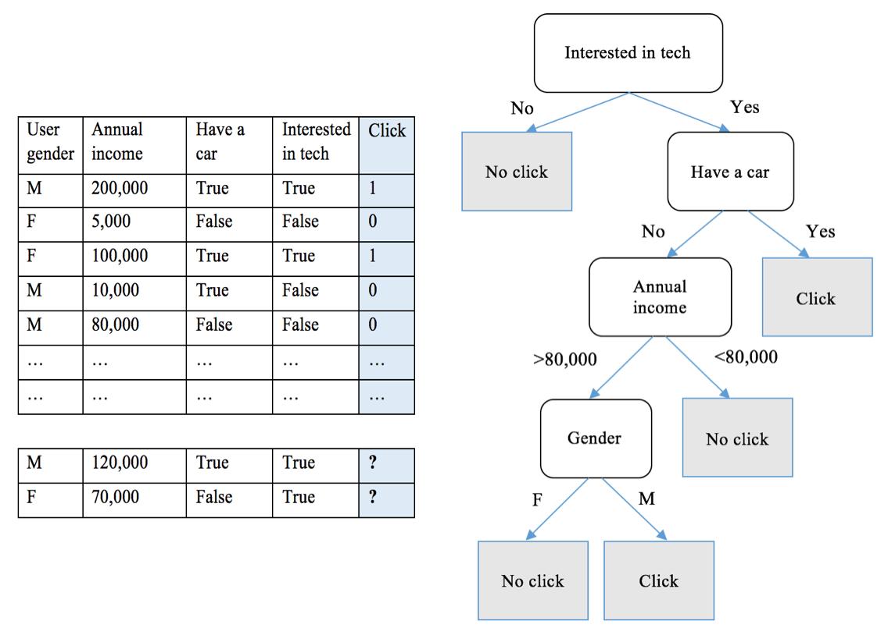

After a decision tree has been constructed, classifying a new sample is
straightforward, as we just saw: starting from the root, apply the test
condition and follow the branch accordingly until a leaf node is
reached, and the class label associated will be assigned to the new
sample.

So, how can we build an appropriate decision tree?

### Constructing a decision tree

A decision tree is constructed by partitioning the training samples into
successive subsets. The partitioning process is repeated in a recursive
fashion on each subset. For each partitioning at a node, a condition
test is conducted based on the value of a feature of the subset. When
the subset shares the same class label, or no further splitting can
improve the class purity of this subset, recursive partitioning on this
node is finished.

Theoretically, for a partitioning on a feature (numerical or
categorical) with *n* different values, there are *n* different ways of
binary splitting (yes or no to the condition test), not to mention other
ways of splitting. Without considering the order of features
partitioning is taking place on, there are already *n^m^* possible trees
for an *m*-dimension dataset:

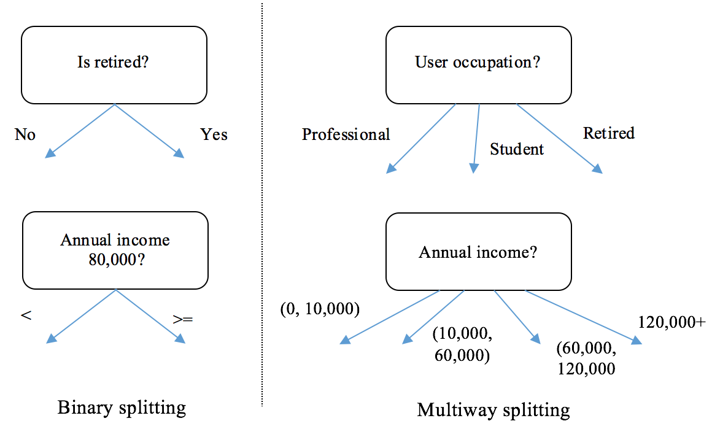

Many algorithms have been developed to efficiently construct an accurate
decision tree. Popular ones include the following:

-   **Iterative Dichotomiser 3 (ID3)**: This algorithm uses a greedy
    search in a top-down manner by selecting the best attribute to split
    the dataset on each iteration without backtracking.
-   **C4.5**: An improved version on ID3 that introduces backtracking;
    it traverses the constructed tree and replaces branches with leaf
    nodes if purity is improved this way.
-   **Classification and Regression Tree (CART)**: It constructs the
    tree using binary splitting, which we will discuss in detail
    shortly.

 

-   **CHi-squared Automatic Interaction Detector (CHAID)**: This
    algorithm is often used in direct marketing. It involves complicated
    statistical concepts, but basically determines the optimal way of
    merging predictive variables in order to best explain the outcome.

The basic idea of these algorithms is to grow the tree greedily by
making a series of local optimizations on choosing the most significant
feature to use to partition the data. The dataset is then split based on
the optimal value of that feature. We will discuss the measurement of a
significant feature and the optimal splitting value of a feature in the
next section.

We now study the CART algorithm in detail and will implement it as the
most notable decision tree algorithm after. It constructs the tree using
binary splitting and growing each node into left and right children. In
each partition, it greedily searches for the most significant
combination of a feature and its value; all different possible
combinations are tried and tested using a measurement function. With the
selected feature and value as a splitting point, it then divides the
dataset as follows:

-   Samples with the feature of this value (for a categorical feature)
    or a greater value (for a numerical feature) become the right child
-   The remainder becomes the left child

This partitioning process repeats and recursively divides up the input
samples into two subgroups. When the dataset becomes unmixed, a
splitting process stops at a subgroup where either of the following two
criteria are met:

-   **The minimum number of samples for a new node**: When the number of
    samples is not greater than the minimum number of samples required
    for a further split, the partitioning stops in order to prevent the
    tree from excessively tailoring to the training set and, as a
    result, overfitting.
-   **The maximum depth of the tree**: A node stops growing when its
    depth, which is defined as the number of partitioning taking place
    from the top down, starting from the root node ending in a terminal
    node, is not less than the maximum tree depth. Deeper trees are more
    specific to the training set and lead to overfitting.

A node with no branches becomes a leaf, and the dominant class of
samples at this node is the prediction. Once all splitting processes
finish, the tree is constructed and is portrayed with the assigned
labels at the terminal nodes and the splitting points (feature + value)
at all the internal nodes above.

We will implement the CART decision tree algorithm from scratch after
studying the metrics of selecting the optimal splitting feature and
value, as promised.

### The metrics for measuring a split

When selecting the best combination of feature and value as the
splitting point, two criteria such as **Gini Impurity** and
**Information Gain**** **can be used to measure the quality of
separation. 

Gini Impurity, as its name implies, measures the impurity rate of the
class distribution of data points, or the class mixture rate. For a
dataset with *K* classes, suppose data from class ~~

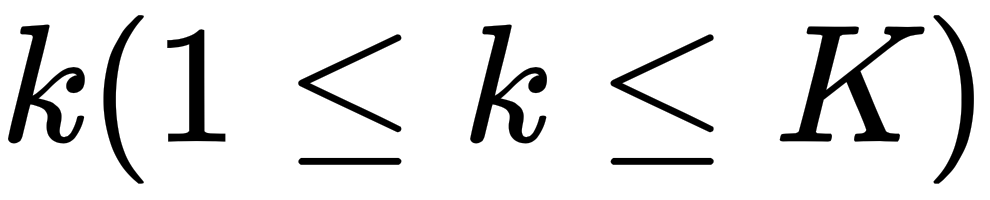

take up a fraction ~~


of the entire dataset, the *Gini Impurity* of this dataset is written as
follows:


Lower Gini Impurity indicates a purer dataset. For example, when the
dataset contains only one class, say the fraction of this class is **1**
and that of others is **0**, its Gini Impurity becomes ~~


. In another example, a dataset records a large number of coin flips,
and heads and tails each take up half of the samples. The Gini Impurity
is ~~

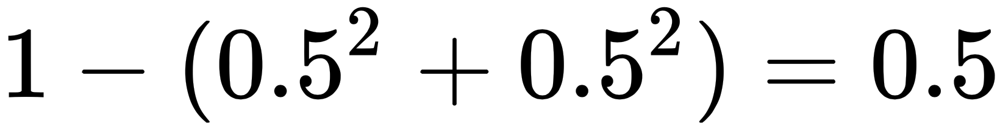

. In binary cases, Gini Impurity under different values of the positive
class' fraction can be visualized by the following code blocks:

Copy

```
>>> import matplotlib.pyplot as plt
>>> import numpy as np
```

The fraction of the positive class varies from 0 to 1:

Copy

```
>>> pos_fraction = np.linspace(0.00, 1.00, 1000)
```

Gini Impurity is calculated accordingly, followed by the plot of
`Gini Impurity`{.literal} versus `Positive fraction`{.literal}:

Copy

```
>>> gini = 1 – pos_fraction**2 – (1-pos_fraction)**2
>>> plt.plot(pos_fraction, gini)
>>> plt.ylim(0, 1)
>>> plt.xlabel(‘Positive fraction')
>>> plt.ylabel(‘Gini Impurity')
>>> plt.show()
```

Refer to the following screenshot for the end result:

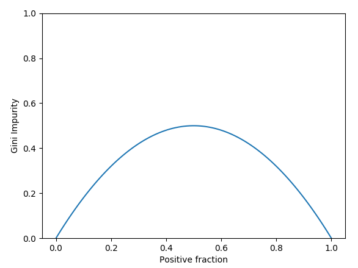

Given the labels of a dataset, we can implement
the `Gini Impurity`{.literal} calculation function as follows:

Copy

```
>>> def gini_impurity(labels):
...     # When the set is empty, it is also pure
...     if not labels:
...         return 0
...     # Count the occurrences of each label
...     counts = np.unique(labels, return_counts=True)[1]
...     fractions = counts / float(len(labels))
...     return 1 - np.sum(fractions ** 2)
```

Test it out with some examples:

Copy

```
>>> print('{0:.4f}'.format(gini_impurity([1, 1, 0, 1, 0])))
0.4800
>>> print('{0:.4f}'.format(gini_impurity([1, 1, 0, 1, 0, 0])))
0.5000
>>> print('{0:.4f}'.format(gini_impurity([1, 1, 1, 1])))
0.0000
```

In order to evaluate the quality of a split, we simply add up the Gini
Impurity of all resulting subgroups, combining the proportions of each
subgroup as corresponding weight factors. And again, the smaller the
weighted sum of Gini Impurity, the better the split.

Take a look at the following self-driving car ad example, where we split
the data based on user's gender and interest in technology respectively:

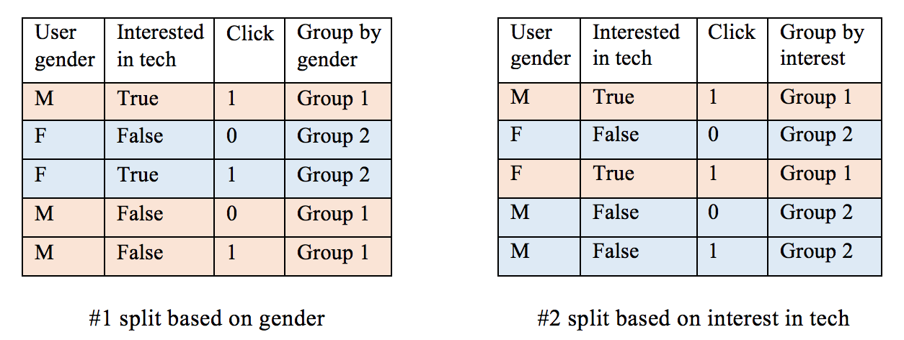

The weighted Gini Impurity of the first split can be calculated as
follows:

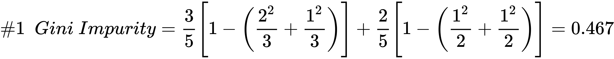

The second split is as follows:

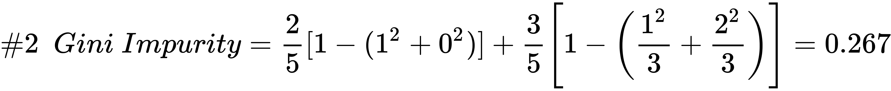

Thus, splitting based on the user's interest in technology is a better
strategy than gender.

Another metric, **Information Gain**, measures the improvement of purity
after splitting, or in other words, the reduction of uncertainty due to
a split. Higher Information Gain implies better splitting. We obtain the
Information Gain of a split by comparing the **entropy** before and
after the split.

**Entropy** is the probabilistic measure of uncertainty. Given a
*K*-class dataset, and ~~

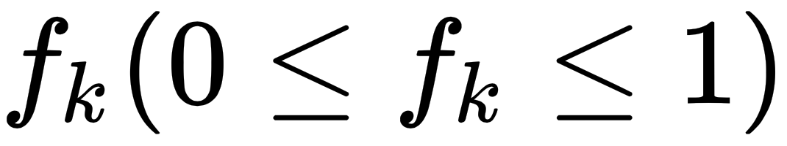

denoted as the fraction of data from class ~~


, the e*ntropy* of the dataset is defined as follows:

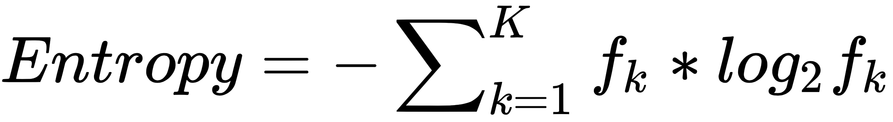

Lower entropy implies a purer dataset with less ambiguity. In a perfect
case where the dataset contains only one class, the entropy is ~~


. In the coin flip example, the entropy becomes ~~


.

Similarly, we can visualize how entropy changes with different values of
the positive class's fraction in binary cases using the following lines
of codes:

Copy

```
>>> pos_fraction = np.linspace(0.00, 1.00, 1000)
>>> ent = - (pos_fraction * np.log2(pos_fraction) +
            (1 - pos_fraction) * np.log2(1 - pos_fraction))
>>> plt.plot(pos_fraction, ent)
>>> plt.xlabel('Positive fraction')
>>> plt.ylabel('Entropy')
>>> plt.ylim(0, 1)
>>> plt.show()
```

This will give us the following output:


Given the labels of a dataset, the `entropy`{.literal} calculation
function can be implemented as follows:

Copy

```
>>> def entropy(labels):
...     if not labels:
...         return 0
...     counts = np.unique(labels, return_counts=True)[1]
...     fractions = counts / float(len(labels))
...     return - np.sum(fractions * np.log2(fractions))
```

Test it out with some examples:

Copy

```
>>> print('{0:.4f}'.format(entropy([1, 1, 0, 1, 0])))
0.9710
>>> print('{0:.4f}'.format(entropy([1, 1, 0, 1, 0, 0])))
1.0000
>>> print('{0:.4f}'.format(entropy([1, 1, 1, 1])))
-0.0000
```

Now that we have fully understood entropy, we can look into how
Information Gain measures how much uncertainty was reduced after
splitting, which is defined as the difference in entropy before a split
(parent) and after the split (children):

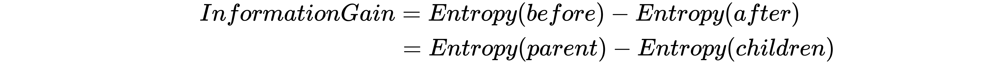

Entropy after a split is calculated as the weighted sum of the entropy
of each child, similarly to the weighted Gini Impurity.

During the process of constructing a node at a tree, our goal is to
search for the splitting point where the maximum Information Gain is
obtained. As the entropy of the parent node is unchanged, we just need
to measure the entropy of the resulting children due to a split. The
best split is the one with the lowest entropy of its resulting children.

To understand it better, let's look at the self-driving car ad example
again.

For the first option, the *entropy* after the split can be calculated as
follows:


The second way of splitting is as follows:


For exploration, we can also calculate their *Information Gain* by:

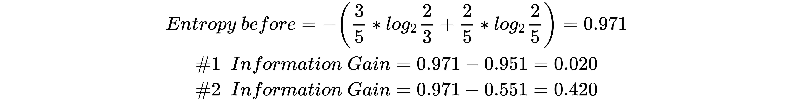

According to the Information Gain = entropy-based evaluation, the second
split is preferable, which is the conclusion of the Gini Impurity
criterion.

In general, the choice of two metrics, Gini Impurity and Information
Gain, has little effect on the performance of the trained decision tree.
They both measure the weighted impurity of the children after a split.
We can combine them into one function to calculate the weighted
impurity:

Copy

```
>>> criterion_function = {'gini': gini_impurity,
                         'entropy': entropy}
>>> def weighted_impurity(groups, criterion='gini'):
...     """
...     Calculate weighted impurity of children after a split
...     @param groups: list of children, and a child consists a
                        list of class labels
...     @param criterion: metric to measure the quality of a split,
          'gini' for Gini Impurity or 'entropy' for Information Gain
...     @return: float, weighted impurity
...     """
...     total = sum(len(group) for group in groups)
...     weighted_sum = 0.0
...     for group in groups:
...         weighted_sum += len(group) / float(total) *
                              criterion_function[criterion](group)
...     return weighted_sum
```

Test it with the example we just hand-calculated, as follows:

Copy

```
>>> children_1 = [[1, 0, 1], [0, 1]]
>>> children_2 = [[1, 1], [0, 0, 1]]
>>> print('Entropy of #1 split:
        {0:.4f}'.format(weighted_impurity(children_1, 'entropy')))
Entropy of #1 split: 0.9510
>>> print('Entropy of #2 split:
        {0:.4f}'.format(weighted_impurity(children_2, 'entropy')))
Entropy of #2 split: 0.5510
```
