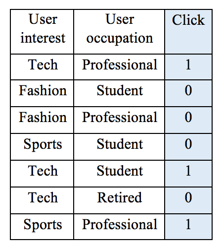
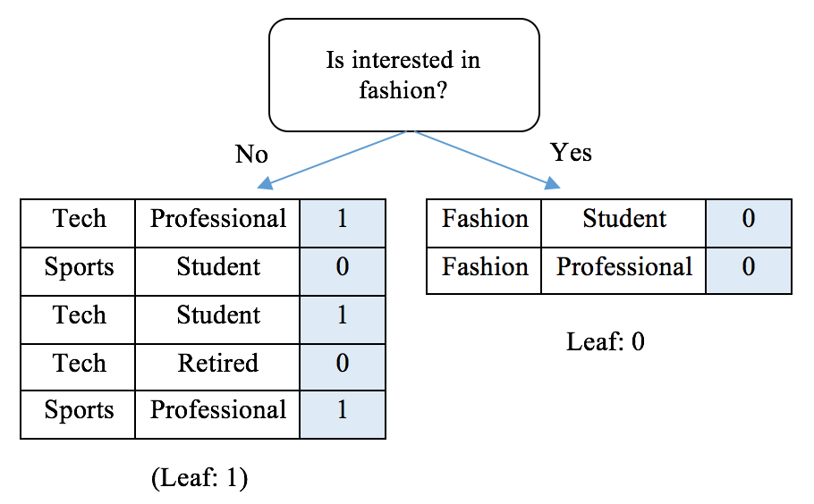
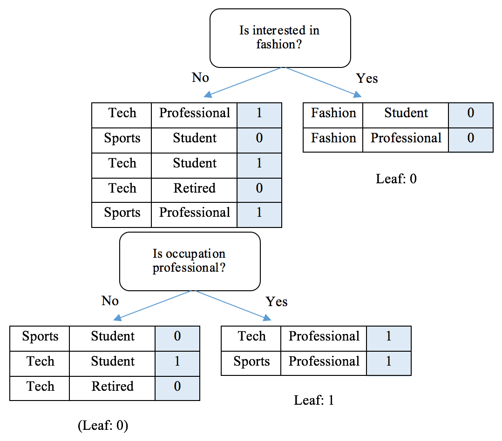
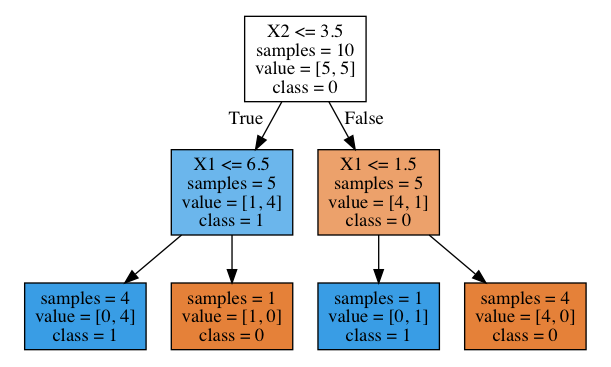

Implementing a decision tree from scratch
-----------------------------------------

* * * * *

With a solid understanding of partitioning evaluation metrics, let's
practice the CART tree algorithm by hand on a toy dataset:



To begin, we decide on the first splitting point, the root, by trying
out all possible values for each of the two features. We utilize the
`weighted_impurity`{.literal} function we just defined to calculate the
weighted Gini Impurity for each possible combination as follows:

Gini(interest, tech) = weighted\_impurity([[1, 1, 0], [0, 0, 0, 1]]) =
0.405 Gini(interest, Fashion) = weighted\_impurity([[0, 0], [1, 0, 1, 0,
1]]) = 0.343 Gini(interest, Sports) = weighted\_impurity([[0, 1], [1, 0,
0, 1, 0]]) = 0.486 Gini(occupation, professional) =
weighted\_impurity([[0, 0, 1, 0], [1, 0, 1]]) = 0.405 Gini(occupation,
student) = weighted\_impurity([[0, 0, 1, 0], [1, 0, 1]]) = 0.405
Gini(occupation, retired) = weighted\_impurity([[1, 0, 0, 0, 1, 1],
[1]]) = 0.429

The root goes to the user interest feature with the fashion value, as
this combination achieves the lowest weighted impurity, or the highest
Information Gain. We can now build the first level of the tree as
follows:



If we are satisfied with a one-level-deep tree, we can stop here by
assigning the right branch label **0** and the left branch label **1**
as the majority class. Alternatively, we can go further down the road,
constructing the second level from the left branch (the right branch
cannot be further split):

Gini(interest, tech) = weighted\_impurity([[0, 1], [1, 1, 0]]) = 0.467
Gini(interest, Sports) = weighted\_impurity([[1, 1, 0], [0, 1]]) = 0.467
Gini(occupation, professional) = weighted\_impurity([[0, 1, 0], [1, 1]])
= 0.267 Gini(occupation, student) = weighted\_impurity([[1, 0, 1], [0,
1]]) = 0.467 Gini(occupation, retired) = weighted\_impurity([[1, 0, 1,
1], [0]]) = 0.300

With the second splitting point specified by (`occupation`{.literal},
`professional`{.literal}) with the lowest Gini Impurity, our tree
becomes this:



We can repeat the splitting process as long as the tree does not exceed
the maximum depth and the node contains enough samples.

It is now time for coding after the process of tree construction has
been made clear.

We start with the criterion of the best splitting point; the calculation
of the weighted impurity of two potential children is what we defined
previously, while that of two metrics are slightly different. The inputs
now become NumPy arrays for computational efficiency:

```
>>> def gini_impurity_np(labels):
...     # When the set is empty, it is also pure
...     if labels.size == 0:
...         return 0
...     # Count the occurrences of each label
...     counts = np.unique(labels, return_counts=True)[1]
...     fractions = counts / float(len(labels))
...     return 1 - np.sum(fractions ** 2)
```

Also, take a look at the following code:

```
>>> def entropy_np(labels):
...     # When the set is empty, it is also pure
...     if labels.size == 0:
...         return 0
...     counts = np.unique(labels, return_counts=True)[1]
...     fractions = counts / float(len(labels))
...     return - np.sum(fractions * np.log2(fractions))
```

Also update the `weighted_impurity`{.literal} function as follows:

```
>>> def weighted_impurity(groups, criterion='gini'):
...     """
...     Calculate weighted impurity of children after a split
...     @param groups: list of children, and a child consists a list
                         of class labels
...     @param criterion: metric to measure the quality of a split,
          'gini' for Gini Impurity or 'entropy' for Information Gain
...     @return: float, weighted impurity
...     """
...     total = sum(len(group) for group in groups)
...     weighted_sum = 0.0
...     for group in groups:
...         weighted_sum += len(group) / float(total) *
                             criterion_function_np[criterion](group)
...     return weighted_sum
```

Next, we define a utility function to split a node into left and right
children based on a feature and a value:

```
>>> def split_node(X, y, index, value):
...     """
...     Split dataset X, y based on a feature and a value
...     @param X: numpy.ndarray, dataset feature
...     @param y: numpy.ndarray, dataset target
...     @param index: int, index of the feature used for splitting
...     @param value: value of the feature used for splitting
...     @return: list, list, left and right child, a child is in the
                format of [X, y]
...     """
...     x_index = X[:, index]
...     # if this feature is numerical
...     if X[0, index].dtype.kind in ['i', 'f']:
...         mask = x_index >= value
...     # if this feature is categorical
...     else:
...         mask = x_index == value
...     # split into left and right child
...     left = [X[~mask, :], y[~mask]]
...     right = [X[mask, :], y[mask]]
...     return left, right
```

### Note

We check whether the feature is numerical or categorical and split the
data accordingly.

With the splitting measurement and generation functions available, we
now define the greedy search function, which tries out all possible
splits and returns the best one given a selection criterion, along with
the resulting children:

```
>>> def get_best_split(X, y, criterion):
...     """
...     Obtain the best splitting point and resulting children for
                                                  the dataset X, y
...     @param X: numpy.ndarray, dataset feature
...     @param y: numpy.ndarray, dataset target
...     @param criterion: gini or entropy
...     @return: dict {index: index of the feature, value: feature  
                      value, children: left and right children}
...     """
...     best_index, best_value, best_score, children =
                                           None, None, 1, None
...     for index in range(len(X[0])):
...         for value in np.sort(np.unique(X[:, index])):
...             groups = split_node(X, y, index, value)
...             impurity = weighted_impurity(
                         [groups[0][1], groups[1][1]], criterion)
...             if impurity < best_score:
...                 best_index, best_value, best_score, children =
                                   index, value, impurity, groups
...     return {'index': best_index, 'value': best_value,
               'children': children}
```

The selection and splitting process occurs in a recursive manner on each
of the subsequent children. When a stopping criterion is met, the
process stops at a node and the major label will be assigned to this
leaf node:

```
>>> def get_leaf(labels):
...     # Obtain the leaf as the majority of the labels
...     return np.bincount(labels).argmax()
```

And finally, the recursive function links all these together:

-   It assigns a leaf node if one of two child nodes is empty
-   It assigns a leaf node if the current branch depth exceeds the
    maximum depth allowed
-   It assigns a leaf node if it does not contain sufficient samples
    required for a further split
-   Otherwise, it proceeds with a further split with the optimal
    splitting point

This is done with the following function:

```
>>> def split(node, max_depth, min_size, depth, criterion):
...     """
...     Split children of a node to construct new nodes or assign
        them terminals
...     @param node: dict, with children info
...     @param max_depth: int, maximal depth of the tree
...     @param min_size: int, minimal samples required to further
                         split a child
...     @param depth: int, current depth of the node
...     @param criterion: gini or entropy
...     """
...     left, right = node['children']
...     del (node['children'])
...     if left[1].size == 0:
...         node['right'] = get_leaf(right[1])
...         return
...     if right[1].size == 0:
...         node['left'] = get_leaf(left[1])
...         return
...     # Check if the current depth exceeds the maximal depth
...     if depth >= max_depth:
...         node['left'], node['right'] =
                            get_leaf(left[1]), get_leaf(right[1])
...         return
...     # Check if the left child has enough samples
...     if left[1].size <= min_size:
...         node['left'] = get_leaf(left[1])
...     else:
...         # It has enough samples, we further split it
...         result = get_best_split(left[0], left[1], criterion)
...         result_left, result_right = result['children']
...         if result_left[1].size == 0:
...             node['left'] = get_leaf(result_right[1])
...         elif result_right[1].size == 0:
...             node['left'] = get_leaf(result_left[1])
...         else:
...             node['left'] = result
...             split(node['left'], max_depth, min_size,
                                          depth + 1, criterion)
...     # Check if the right child has enough samples
...     if right[1].size <= min_size:
...         node['right'] = get_leaf(right[1])
...     else:
...         # It has enough samples, we further split it
...         result = get_best_split(right[0], right[1], criterion)
...         result_left, result_right = result['children']
...         if result_left[1].size == 0:
...             node['right'] = get_leaf(result_right[1])
...         elif result_right[1].size == 0:
...             node['right'] = get_leaf(result_left[1])
...         else:
...             node['right'] = result
...             split(node['right'], max_depth, min_size,
                                            depth + 1, criterion)
```

Finally, the entry point of the tree's construction is as follows:

```
>>> def train_tree(X_train, y_train, max_depth, min_size,
                  criterion='gini'):
...     """
...     Construction of a tree starts here
...     @param X_train: list of training samples (feature)
...     @param y_train: list of training samples (target)
...     @param max_depth: int, maximal depth of the tree
...     @param min_size: int, minimal samples required to further
                         split a child
...     @param criterion: gini or entropy
...     """
...     X = np.array(X_train)
...     y = np.array(y_train)
...     root = get_best_split(X, y, criterion)
...     split(root, max_depth, min_size, 1, criterion)
...     return root
```

Now, let's test it with the preceding hand-calculated example:

```
>>> X_train = [['tech', 'professional'],
...            ['fashion', 'student'],
...            ['fashion', 'professional'],
...            ['sports', 'student'],
...            ['tech', 'student'],
...            ['tech', 'retired'],
...            ['sports', 'professional']]
>>> y_train = [1, 0, 0, 0, 1, 0, 1]
>>> tree = train_tree(X_train, y_train, 2, 2)
```

To verify that the resulting tree from the model is identical to what we
constructed by hand, we writea function displaying the tree:

```
>>> CONDITION = {'numerical': {'yes': '>=', 'no': '<'},
...              'categorical': {'yes': 'is', 'no': 'is not'}}
>>> def visualize_tree(node, depth=0):
...     if isinstance(node, dict):
...         if node['value'].dtype.kind in ['i', 'f']:
...             condition = CONDITION['numerical']
...         else:
...             condition = CONDITION['categorical']
...         print('{}|- X{} {} {}'.format(depth * '  ',
               node['index'] + 1, condition['no'], node['value']))
...         if 'left' in node:
...             visualize_tree(node['left'], depth + 1)
...         print('{}|- X{} {} {}'.format(depth * '  ',
              node['index'] + 1, condition['yes'], node['value']))
...         if 'right' in node:
...             visualize_tree(node['right'], depth + 1)
...     else:
...         print('{}[{}]'.format(depth * '  ', node))
>>> visualize_tree(tree)
|- X1 is not fashion
 |- X2 is not professional
   [0]
 |- X2 is professional
   [1]
|- X1 is fashion
 [0]
```

We can test it with a numerical example as follows:

```
>>> X_train_n = [[6, 7],
...             [2, 4],
...             [7, 2],
...             [3, 6],
...             [4, 7],
...             [5, 2],
...             [1, 6],
...             [2, 0],
...             [6, 3],
...             [4, 1]]
>>> y_train_n = [0, 0, 0, 0, 0, 1, 1, 1, 1, 1]
>>> tree = train_tree(X_train_n, y_train_n, 2, 2)
>>> visualize_tree(tree)
|- X2 < 4
 |- X1 < 7
   [1]
 |- X1 >= 7
   [0]
|- X2 >= 4
 |- X1 < 2
   [1]
 |- X1 >= 2
   [0]
```

The resulting trees from our decision tree model are the same as those
we hand-crafted.

Now that we have a more solid understanding of decision trees by
implementing one from scratch, we can try the decision tree package from
`scikit-learn`{.literal}, which is already well developed and optimized:

```
>>> from sklearn.tree import DecisionTreeClassifier
>>> tree_sk = DecisionTreeClassifier(criterion='gini',
                                max_depth=2, min_samples_split=2)
>>> tree_sk.fit(X_train_n, y_train_n)
```

To visualize the tree we just built, we utilize the built-in
`export_graphviz`{.literal}function, as follows:

```
>>> export_graphviz(tree_sk, out_file='tree.dot',
       feature_names=['X1', 'X2'], impurity=False, filled=True,
       class_names=['0', '1'])
```

Running this will generate a file called `tree.dot`{.literal}, which can
be converted to a PNG image file using **Graphviz** (introduction and
installation instructions can be found
at [http://www.graphviz.org)](http://www.graphviz.org/)) by running the
following command in the terminal:

```
dot -Tpng tree.dot -o tree.png
```

Refer to the following screenshot for the result:



The generated tree is essentially the same as the one we had before.


* * * * *

[** Previous
Section](https://subscription.packtpub.com/book/big_data_and_business_intelligence/9781789616729/6/ch06lvl1sec47/exploring-decision-tree-from-root-to-leaves)
[Next Section
**](https://subscription.packtpub.com/book/big_data_and_business_intelligence/9781789616729/6/ch06lvl1sec49/predicting-ad-click-through-with-decision-tree)

* * * * *

[Next Section
**](https://subscription.packtpub.com/book/big_data_and_business_intelligence/9781789616729/6/ch06lvl1sec49/predicting-ad-click-through-with-decision-tree)

* * * * *

[** Previous
Section](https://subscription.packtpub.com/book/big_data_and_business_intelligence/9781789616729/6/ch06lvl1sec47/exploring-decision-tree-from-root-to-leaves)
[Complete Course
**](https://subscription.packtpub.com/book/big_data_and_business_intelligence/9781789616729)

* * * * *

##### Something went wrong, please check your internet connection and try again... {.mb20}

[Retry](https://subscription.packtpub.com/#)

* * * * *

×

#### Just Checking... {.modal-title ng-show="!productController.claimTokenError"}

#### Sorry... {.modal-title .ng-hide ng-show="productController.claimTokenError"}

Are you sure you would like to use one of your credits to purchase this
title?

No

Yes

#### Create Playlist

Playlist name

Cancel

Create

×

#### Something went wrong {.ng-binding}

Please try again

Close

eBooks & Videos

-   [Web
    Development](https://subscription.packtpub.com/search?released=Available&category=Web%20Development)
-   [Programming](https://subscription.packtpub.com/search?released=Available&category=Programming)
-   [Data](https://subscription.packtpub.com/search?released=Available&category=Data)
-   [Cloud &
    Networking](https://subscription.packtpub.com/search?released=Available&category=Cloud%20%26%20Networking)
-   [Mobile](https://subscription.packtpub.com/search?released=Available&category=Mobile)
-   [Security](https://subscription.packtpub.com/search?released=Available&category=Security)
-   [IoT &
    Hardware](https://subscription.packtpub.com/search?released=Available&category=IoT%20%26%20Hardware)
-   [Game
    Development](https://subscription.packtpub.com/search?released=Available&category=Game%20Development)
-   [Business &
    Other](https://subscription.packtpub.com/search?released=Available&category=Business%20%26%20Other)
-   [View
    All](https://subscription.packtpub.com/search?released=Available)

Useful Links

-   [Books](https://subscription.packtpub.com/search?products=Book&released=Available)
-   [Videos](https://subscription.packtpub.com/search?products=Video&released=Available)
-   [Learning Paths](https://subscription.packtpub.com/learning-paths)
-   [Code Downloads](https://www.packtpub.com/support/code-downloads)
-   [Contact Us](https://www.packtpub.com/contact)

eBooks & Videos

-   [Web
    Development](https://subscription.packtpub.com/search?released=Available&category=Web%20Development)
-   [Programming](https://subscription.packtpub.com/search?released=Available&category=Programming)
-   [Data](https://subscription.packtpub.com/search?released=Available&category=Data)
-   [Cloud &
    Networking](https://subscription.packtpub.com/search?released=Available&category=Cloud%20%26%20Networking)
-   [Mobile](https://subscription.packtpub.com/search?released=Available&category=Mobile)

-   [Security](https://subscription.packtpub.com/search?released=Available&category=Security)
-   [IoT &
    Hardware](https://subscription.packtpub.com/search?released=Available&category=IoT%20%26%20Hardware)
-   [Game
    Development](https://subscription.packtpub.com/search?released=Available&category=Game%20Development)
-   [Business &
    Other](https://subscription.packtpub.com/search?released=Available&category=Business%20%26%20Other)
-   [View
    All](https://subscription.packtpub.com/search?released=Available)

Useful Links

-   [Books](https://subscription.packtpub.com/search?products=Book&released=Available)
-   [Videos](https://subscription.packtpub.com/search?products=Video&released=Available)
-   [Learning Paths](https://subscription.packtpub.com/learning-paths)
-   [Code Downloads](https://www.packtpub.com/support/code-downloads)
-   [Contact Us](https://www.packtpub.com/contact)

Packt

Sign up to our emails for the latest subscription updates.

**

Submitting...

[](https://apps.apple.com/app/packt/id1376577776?ls=1)
[](https://play.google.com/store/apps/details?id=com.packtpub.reader)

© 2019 Packt Publishing Limited All Rights Reserved | [Privacy
Policy](https://www.packtpub.com/about/privacy-policy) | [Terms &
Conditions](https://www.packtpub.com/about/terms-and-conditions)

Feedback

Help us improve by sharing your feedback. We are constantly improving
the site and really appreciate your feedback!

What do you think of our navigation menu?

Hate

Dislike

Neutral

Like

Love

Select an element on the page.

false

We are constantly improving the site and really appreciate your
feedback!

Connecting your feedback with data related to your visits
(device-specific, usage data, cookies, behavior and interactions) will
help us improve faster. Do you give us your consent to do so for your
previous and future visits? [More
information](https://www.hotjarconsent.com/)

**

**

Not using
[Hotjar](https://www.hotjar.com/incoming-feedback?utm_source=client&utm_medium=incoming_feedback&utm_campaign=insights)
yet?

Skip

Send

Select an element on the page.


