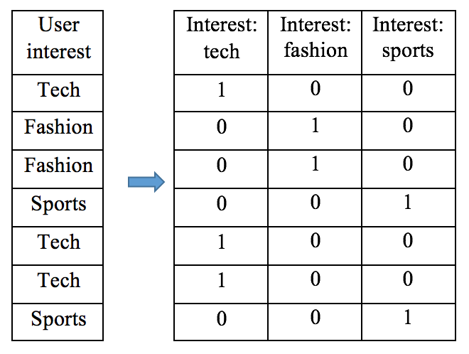
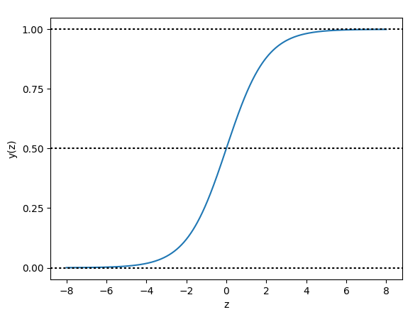
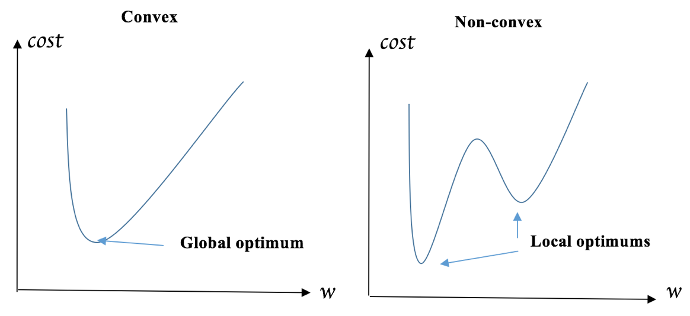
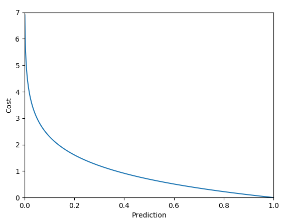
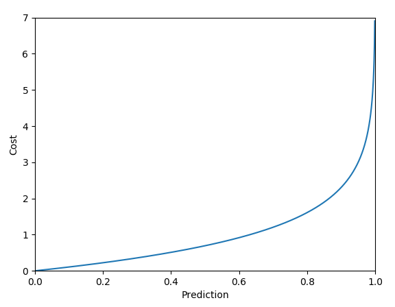
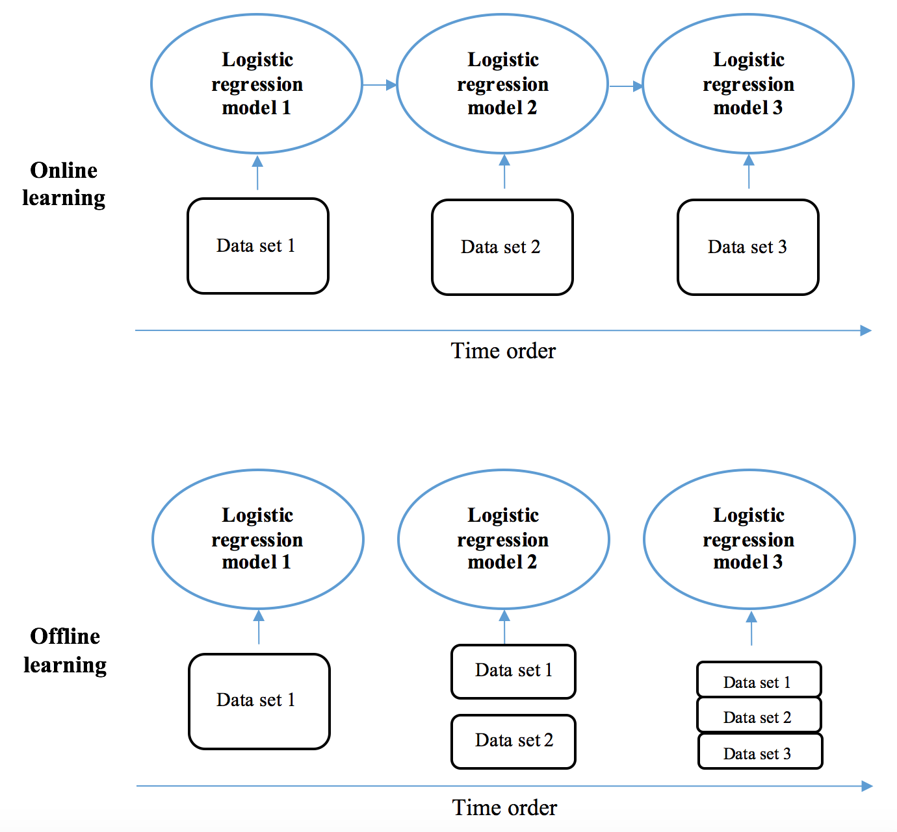

# Lab : Predicting Online Ad Click-Through with Logistic Regression
In this chapter, we will be continuing our journey of tackling the billion-dollar worth problem of advertising click-through prediction. We will be focusing on learning a very (probably the most) scalable classification model—logistic regression. We will be exploring what logistic function is, how to train a logistic regression model, adding regularization to the model, and variants of logistic regression that are applicable to very large datasets. Besides the application in classification, we will also be discussing how logistic regression and random forest are used in picking significant features. Again, you won't get bored as there will be lots of implementations from scratch, and with scikit-learn and TensorFlow.

In this chapter, we will cover the following topics:

- Categorical feature encoding
- Logistic function
- What is logistic regression
- Training a logistic regression model via gradient descent
- Training a logistic regression model via stochastic gradient descent
- The implementations of logistic regression with scikit-learn
- Click-through prediction with logistic regression
- Logistic regression with L1 and L2 regularization
- Logistic regression for feature selection
- Online learning
- Another way to select features—random forest

#### Pre-reqs:
- Docker

#### Lab Environment
We will run Jupyter Notebook as a Docker container. This setup will take some time because of the size of the image. Run the following commands one by one:

`docker run -d --user root -p 8888:8888 --name jupyter -e GRANT_SUDO=yes jupyter/tensorflow-notebook:2ce7c06a61a1 start-notebook.sh`

`docker exec -it jupyter bash -c 'cd /home/jovyan/work && git clone https://github.com/athertahir/python-machine-learning-by-example.git && sudo && chmod +x ~/work/prepareContainer.sh && ~/prepareContainer.sh'`

`docker restart jupyter`

**Note:** After completing these steps, jupyter notebook will be accessible at port 8888 of the host machine.

All Notebooks are present in `work` folder.

#### Login
When the container is running, execute this statement:
`docker logs jupyter 2>&1 | grep -v "HEAD" `


This will show something like:

```
Copy/paste this URL into your browser when you connect for the first time, to login with a token:
    http://localhost:8888/?token=f89b02dd78479d52470b3c3a797408b20cc5a11e067e94b8
    THIS IS NOT YOUR TOKEN.  YOU HAVE TO SEARCH THE LOGS TO GET YOUR TOKEN
```

The token is the value behind `/?token=`. You need that for logging in.

**Note:** You can also run following command to get token directly:
`docker exec -it jupyter bash -c 'jupyter notebook list' | cut -d'=' -f 2 | cut -d' ' -f 1`


Converting categorical features to numerical – one-hot encoding and ordinal encoding
------------------------------------------------------------------------------------

* * * * *

In the previous chapter, *Predicting Online Ads Click-through with
Tree-Based Algorithms*, we mentioned how **one-hot encoding** transforms
categorical features to numerical features in order to be used in the
tree algorithms in scikit-learn and TensorFlow. This will not limit our
choice to tree-based algorithms if we can adopt one-hot encoding to any
other algorithms that only take in numerical features.

The simplest solution we can think of in terms of transforming a
categorical feature with *k* possible values is to map it to a numerical
feature with values from 1 to *k*. For example, [*Tech*, *Fashion*,
*Fashion*, *Sports*, *Tech*, *Tech*, *Sports*] becomes [1, 2, 2, 3, 1,
1, 3]. However, this will impose an ordinal characteristic, such as
*Sports* being greater than *Tech*, and a distance property, such as
*Sports* being closer to *Fashion* than to *Tech*.

Instead, one-hot encoding converts the categorical feature to *k* binary
features. Each binary feature indicates the presence or absence of a
corresponding possible value. Hence, the preceding example becomes the
following:



Previously, we have used `OneHotEncoder` from scikit-learn to
convert a matrix of string into a binary matrix, but here, let's take a
look at another module, `DictVectorizer`, which also provides
an efficient conversion. It transforms dictionary objects (categorical
feature: value) into one-hot encoded vectors.

For example, take a look at the following codes:

```
>>> from sklearn.feature_extraction import DictVectorizer
>>> X_dict = [{'interest': 'tech', 'occupation': 'professional'},
...           {'interest': 'fashion', 'occupation': 'student'},
...           {'interest': 'fashion','occupation':'professional'},
...           {'interest': 'sports', 'occupation': 'student'},
...           {'interest': 'tech', 'occupation': 'student'},
...           {'interest': 'tech', 'occupation': 'retired'},
...           {'interest': 'sports','occupation': 'professional'}]
>>> dict_one_hot_encoder = DictVectorizer(sparse=False)
>>> X_encoded = dict_one_hot_encoder.fit_transform(X_dict)
>>> print(X_encoded)
[[ 0.  0. 1. 1.  0. 0.]
 [ 1.  0. 0. 0.  0. 1.]
 [ 1.  0. 0. 1.  0. 0.]
 [ 0.  1. 0. 0.  0. 1.]
 [ 0.  0. 1. 0.  0. 1.]
 [ 0.  0. 1. 0.  1. 0.]
 [ 0.  1. 0. 1.  0. 0.]]
```

We can also see the mapping by executing the following:

```
>>> print(dict_one_hot_encoder.vocabulary_)
{'interest=fashion': 0, 'interest=sports': 1,
'occupation=professional': 3, 'interest=tech': 2,
'occupation=retired': 4, 'occupation=student': 5}
```

When it comes to new data, we can transform it by:

```
>>> new_dict = [{'interest': 'sports', 'occupation': 'retired'}]
>>> new_encoded = dict_one_hot_encoder.transform(new_dict)
>>> print(new_encoded)
[[ 0. 1. 0. 0. 1. 0.]]
```

We can inversely transform the encoded features back to the original
features by:

```
>>> print(dict_one_hot_encoder.inverse_transform(new_encoded))
[{'interest=sports': 1.0, 'occupation=retired': 1.0}]
```

One important thing to note is that if a new (not seen in training data)
category is encountered in new data, it should be ignored.
`DictVectorizer` handles this implicitly (while
`OneHotEncoder` needs to
specify parameter `ignore`):

```
>>> new_dict = [{'interest': 'unknown_interest',
               'occupation': 'retired'},
...             {'interest': 'tech', 'occupation':
               'unseen_occupation'}]
>>> new_encoded = dict_one_hot_encoder.transform(new_dict)
>>> print(new_encoded)
[[ 0.  0. 0. 0.  1. 0.]
 [ 0.  0. 1. 0.  0. 0.]]
```

Sometimes, we do prefer transforming a categorical feature with *k*
possible values into a numerical feature with values ranging from *1* to
*k*. We conduct **ordinal encoding** in order to employ ordinal or
ranking knowledge in our learning; for example, *large*, *medium*, and
*small* become 3, 2, and 1 respectively, *good* and *bad* become 1 and
0, while one-hot encoding fails to preserve such useful information. We
can realize ordinal encoding easily through the use of
`pandas`, for example:

```
>>> import pandas as pd
>>> df = pd.DataFrame({'score': ['low',
...                              'high',
...                              'medium',
...                              'medium',
...                              'low']})
>>> print(df)
   score
0     low
1    high
2  medium
3  medium
4     low
>>> mapping = {'low':1, 'medium':2, 'high':3}
>>> df['score'] = df['score'].replace(mapping)
>>> print(df)
  score
0      1
1      3
2      2
3      2
4      1
```

We convert the string feature into ordinal values based on the mapping
we define.


##### Run Notebook
The Notebook opens in a new browser window. You can create a new notebook or open a local one. Check out the local folder `work/Chapter07` for several sample notebooks. Open and run `.ipynb` in the `work` folder.

You can open the Jupyter Notebook at `<host-ip>:8888/notebooks/work/Chapter07/encoding.ipynb`

Classifying data with logistic regression
-----------------------------------------

* * * * *

As seen in the last chapter, we trained the tree-based models only based
on the first 300,000 samples out of 40 million. We did so simply because
training a tree on a large dataset is extremely computationally
expensive and time-consuming. Since we are now not limited to algorithms
directly taking in categorical features thanks to one-hot encoding, we
should turn to a new algorithm with high scalability to large datasets.
Logistic regression is one of the most, or perhaps the most, scalable
classification algorithms.

### Getting started with the logistic function

Let's start with an introduction to the **logistic function** (which is
more commonly referred to as the **sigmoid****function**) as the
algorithm core before we dive into the algorithm itself. It basically
maps an input to an output of a value between *0* and *1*, and is
defined as follows:


We can visualize what it looks like by performing the following steps:

1.  Define the logistic function:

```
>>> import numpy as np
>>> def sigmoid(input):
...     return 1.0 / (1 + np.exp(-input))
```

2.  Input variables from `-8` to `8`, and the
    corresponding output, as follows:

```
>>> z = np.linspace(-8, 8, 1000)
>>> y = sigmoid(z)
>>> import matplotlib.pyplot as plt
>>> plt.plot(z, y)
>>> plt.axhline(y=0, ls='dotted', color='k')
>>> plt.axhline(y=0.5, ls='dotted', color='k')
>>> plt.axhline(y=1, ls='dotted', color='k')
>>> plt.yticks([0.0, 0.25, 0.5, 0.75, 1.0])
>>> plt.xlabel('z')
>>> plt.ylabel('y(z)')
>>> plt.show()
```

Refer to the following screenshot for the end result:



In the S-shaped curve, all inputs are transformed into the range from 0
to 1. For positive inputs, a greater value results in an output closer
to 1; for negative inputs, a smaller value generates an output closer to
0; when the input is 0, the output is the midpoint, 0.5.

### Jumping from the logistic function to logistic regression

Now that we have some knowledge of the logistic function, it is easy to
map it to the algorithm that stems from it. In logistic regression, the
function input *z *becomes the weighted sum of features. Given a data
sample *x *with *n* features, *x~1~, x~2~, …, x~n~* (*x* represents a
feature vector and ***x** = (x~1~, x~2~, …, x~n~*)), and **weights**
(also called **coefficients**) of the model ***w*** (***w*** represents
a vector (*w~1~, w~2~, …, w~n~*)), *z* is expressed as follows:


Also, occasionally, the model comes with an **intercept** (also called
**bias**), *w~0~*. In this instance, the preceding linear relationship
becomes:


As for the output *y(z)* in the range of 0 to 1, in the algorithm, it
becomes the probability of the target being *1* or the positive class:


Hence, logistic regression is a probabilistic classifier, similar to the
Naïve Bayes classifier.

A logistic regression model or, more specifically, its weight
vector ***w*** is learned from the training data, with the goal of
predicting a positive sample as close to *1* as possible and predicting
a negative sample as close to 0 as possible. In mathematical language,
the weights are trained so as to minimize the cost defined as the **mean
squared error** (**MSE**), which measures the average of squares of
difference between the truth and the prediction. Given *m* training
samples, (*x^(1)^, y^(1)^*), (*x^(2)^,y^(2)^*), … (*x^(i)^, y^(i)^*)…,
(*x^(m)^*, *y^(m)^*), where *y^(i)^* is either *1* (positive class) or
*0* (negative class), the cost function *J(w)* regarding the weights to
be optimized is expressed as follows:


However, the preceding cost function is **non-convex**, which means
that, when searching for the optimal ***w***, many local (suboptimal)
optimums are found and the function does not converge to a global
optimum.

Examples of the **convex** and **non-convex** functions are plotted
respectively below:



To overcome this, the cost function in practice is defined as follows:


We can take a closer look at the cost of a single training sample:


If *y^(i)^*=1, when it predicts correctly (positive class in 100%
probability), the sample cost *j* is *0*; the cost keeps increasing when
it is less likely to be the positive class; when it incorrectly predicts
that there is no chance to be the positive class, the cost is infinitely
high. We can visualize it as follows:

```
>>> y_hat = np.linspace(0, 1, 1000)
>>> cost = -np.log(y_hat)
>>> plt.plot(y_hat, cost)
>>> plt.xlabel('Prediction')
>>> plt.ylabel('Cost')
>>> plt.xlim(0, 1)
>>> plt.ylim(0, 7)
>>> plt.show()
```

Refer to the following screenshot for the end result:



On the contrary, if *y^(i)^=0*, when it predicts correctly (positive
class in *0* probability, or negative class in 100% probability), the
sample cost *j* is *0*; the cost keeps increasing when it is more likely
to be the positive class; when it incorrectly predicts that there is no
chance to be the negative class, the cost goes infinitely high. We can
visualize it using the following codes:

```
>>> y_hat = np.linspace(0, 1, 1000)
>>> cost = -np.log(1 - y_hat)
>>> plt.plot(y_hat, cost)
>>> plt.xlabel('Prediction')
>>> plt.ylabel('Cost')
>>> plt.xlim(0, 1)
>>> plt.ylim(0, 7)
>>> plt.show()
```

The following screenshot is the resultant output:



Minimizing this alternative cost function is actually equivalent to
minimizing the MSE-based cost function. The advantages of choosing it
over the other one include the following:

-   Obviously, being convex, so that the optimal model weights can be
    found
-   A summation of the logarithms of prediction ~~
    
     or ~~
    
     simplifies the calculation of its derivative with respect to the
    weights, which we will talk about later

Due to the logarithmic function, the cost function 


 is also called **logarithmic loss**, or simply **log loss****.**

##### Run Notebook
The Notebook opens in a new browser window. You can create a new notebook or open a local one. Check out the local folder `work/Chapter07` for several sample notebooks. Open and run `.ipynb` in the `work` folder.

You can open the Jupyter Notebook at `<host-ip>:8888/notebooks/work/Chapter07/logistic_function.ipynb`

Training on large datasets with online learning
-----------------------------------------------

* * * * *

So far, we have trained our model on no more than 300,000 samples. If we
go beyond this figure, memory might be overloaded since it holds too
much data, and the program will crash. In this section, we will be
presenting how to train on a large-scale dataset with **online
learning**.

Stochastic gradient descent grows from gradient descent by sequentially
updating the model with individual training samples one at a time,
instead of the complete training set at once. We can scale up stochastic
gradient descent further with online learning techniques. In online
learning, new data for training is available in a sequential order or in
real time, as opposed to all at once in an **offline learning**
environment. A relatively small chunk of data is loaded and preprocessed
for training at a time, which releases the memory used to hold the
entire large dataset. Besides better computational feasibility, online
learning is also used because of its adaptability to cases where new
data is generated in real time and needed in modernizing the model. For
instance, stock price prediction models are updated in an online
learning manner with timely market data; click-through prediction models
need to include the most recent data reflecting users' latest behaviors
and tastes; spam email detectors have to be reactive to the
ever-changing spammers by considering new features that are dynamically
generated.

The existing model trained by previous datasets is now updated based on
the most recently available dataset only, instead of rebuilt from
scratch based on previous and recent datasets together, as in offline
learning:



The `SGDClassifier` module in scikit-learn implements online
learning with the `partial_fit` method (while
the `fit` method is applied in offline learning, as we have
seen). We train the model with 1,000,000 samples, where we feed in
100,000 samples at one time to simulate an online learning environment.
And we will test the trained model on the next 100,000 samples as
follows:

```
>>> n_rows = 100000 * 11
>>> df = pd.read_csv("train", nrows=n_rows)
>>> X = df.drop(['click', 'id', 'hour', 'device_id', 'device_ip'], 
                                                      axis=1).values
>>> Y = df['click'].values
>>> n_train = 100000 * 10
>>> X_train = X[:n_train]
>>> Y_train = Y[:n_train]
>>> X_test = X[n_train:]
>>> Y_test = Y[n_train:]
```

Fit the encoder on the whole training set as follows:

```
>>> enc = OneHotEncoder(handle_unknown='ignore')
>>> enc.fit(X_train)
```

Initialize an SGD logistic regression model where we set the number of
iterations to `1` in order to partially fit the model and
enable online learning:

```
>>> sgd_lr_online = SGDClassifier(loss='log', penalty=None, 
                                fit_intercept=True, n_iter=1, 
                                learning_rate='constant', eta0=0.01)
```

Loop over every `100000` samples and partially fit the model:

```
>>> start_time = timeit.default_timer()
>>> for i in range(10):
... x_train = X_train[i*100000:(i+1)*100000]
... y_train = Y_train[i*100000:(i+1)*100000]
... x_train_enc = enc.transform(x_train)
... sgd_lr_online.partial_fit(x_train_enc.toarray(), y_train, 
                                                    classes=[0, 1])
```

Again, we use the `partial_fit` method for online learning.
Also, we specify the `classes` parameter, which is required in
online learning:

```
>>> print("--- %0.3fs seconds ---" % (timeit.default_timer() - 
                                                     start_time))
--- 167.399s seconds ---
```

Apply the trained model on the testing set, the next 100,000 samples, as
follows:

```
>>> x_test_enc = enc.transform(X_test)
>>> pred = sgd_lr_online.predict_proba(x_test_enc.toarray())[:, 1]
>>> print('Training samples: {0}, AUC on testing set: 
          {1:.3f}'.format(n_train * 10, roc_auc_score(Y_test, pred)))
Training samples: 10000000, AUC on testing set: 0.761
```

With online learning, training based on a total of 1 million samples
only takes 167 seconds and yields better accuracy.


Handling multiclass classification
----------------------------------

* * * * *

One last thing worth noting is how logistic regression algorithms deal
with multiclass classification. Although we interact with the
scikit-learn classifiers in multiclass cases the same way as in binary
cases, it is encouraging to understand how logistic regression works in
multiclass classification.

Logistic regression for more than two classes is also called
**multinomial logistic regression**, or better known latterly as
**softmax regression**. As we have seen in the binary case, the model is
represented by one weight vector ***w***, the probability of the target
being *1* or the positive class is written as follows:


In the *K *class case, the model is represented by *K* weight
vectors, *w~1~, w~2~, …, w~K~*, and the probability of the target being
class *k* is written as follows:


Note that the term ~~


 normalizes probabilities ~~


(*k* from *1* to *K*) so that they total *1*. The cost function in the
binary case is expressed as follows:


Similarly, the cost function in the multiclass case becomes the
following:


Here, function *1*{*y^(i)^*=*j*} is *1* only if *y^(i)^*=*j* is true,
otherwise *0*.

With the cost function defined, we obtain the step *∆w~j~*, for the *j*
weight vector in the same way we derived the step *∆w* in the binary
case:


In a similar manner, all *K* weight vectors are updated in each
iteration. After sufficient iterations, the learned weight vectors
*w~1~, w~2~, …, w~K~* are then used to classify a new sample *x'* by
means of the following equation:


To have a better sense, we experiment on it with a classic dataset, the
handwritten digits for classification:

```
>>> from sklearn import datasets
>>> digits = datasets.load_digits()
>>> n_samples = len(digits.images)
```

As the image data is stored in 8\*8 matrices, we need to flatten them,
as follows:

```
>>> X = digits.images.reshape((n_samples, -1))
>>> Y = digits.target
```

We then split the data as follows:

```
>>> from sklearn.model_selection import train_test_split
>>> X_train, X_test, Y_train, Y_test = train_test_split(X, Y, 
                                    test_size=0.2, random_state=42)
```

We then combine grid search and cross-validation to find the optimal
multiclass logistic regression model as follows:

```
>>> from sklearn.model_selection import GridSearchCV
>>> parameters = {'penalty': ['l2', None],
...               'alpha': [1e-07, 1e-06, 1e-05, 1e-04],
...               'eta0': [0.01, 0.1, 1, 10]}
>>> sgd_lr = SGDClassifier(loss='log', learning_rate='constant', 
                          eta0=0.01, fit_intercept=True, n_iter=10)
>>> grid_search = GridSearchCV(sgd_lr, parameters, 
                               n_jobs=-1, cv=3)
>>> grid_search.fit(term_docs_train, label_train)
>>> print(grid_search.best_params_)
{'alpha': 1e-07, 'eta0': 0.1, 'penalty': None}
```

To predict using the optimal model, we apply the following:

```
>>> sgd_lr_best = grid_search.best_estimator_
>>> accuracy = sgd_lr_best.score(term_docs_test, label_test)
>>> print('The accuracy on testing set is: 
                              {0:.1f}%'.format(accuracy*100))
The accuracy on testing set is: 94.2%
```

It doesn't look much different from the previous example, since
`SGDClassifier` handles multiclass internally.


##### Run Notebook
The Notebook opens in a new browser window. You can create a new notebook or open a local one. Check out the local folder `work/Chapter07` for several sample notebooks. Open and run `.ipynb` in the `work` folder.

You can open the Jupyter Notebook at `<host-ip>:8888/notebooks/work/Chapter07/scikit_logistic_regression.ipynb`

Feature selection using random forest
-------------------------------------

* * * * *

We have seen how feature selection works with L1-regularized logistic
regression in one of the previous sections, where weights of unimportant
features are compressed to close to, or exactly, 0. Besides
L1-regularized logistic regression, random forest is another frequently
used feature selection technique.

To recap, random forest is bagging over a set of individual decision
trees. Each tree considers a random subset of the features when
searching for the best splitting point at each node. And, as an essence
of the decision tree algorithm, only those significant features (along
with their splitting values) are used to constitute tree nodes. Consider
the forest as a whole: the more frequently a feature is used in a tree
node, the more important it is. In other words, we can rank the
importance of features based on their occurrences in nodes among all
trees, and select the top most important ones.

A trained `RandomForestClassifier`{.literal} module in scikit-learn
comes with an attribute, `feature_importances_`{.literal}, indicating
the feature importance, which are calculated as the proportions of
occurrences in tree nodes. Again, we examine feature selection with
random forest on the dataset with 100,000 ad click samples:

```
>>> from sklearn.ensemble import RandomForestClassifier
>>> random_forest = RandomForestClassifier(n_estimators=100, 
                   criterion='gini', min_samples_split=30, n_jobs=-1)
>>> random_forest.fit(X_train_enc.toarray(), Y_train)
```

After fitting the random forest model, we obtain the feature
importance scores by:

```
>>> feature_imp = random_forest.feature_importances_
>>> print(feature_imp)
[1.60540750e-05 1.71248082e-03 9.64485853e-04 ... 5.41025913e-04
 7.78878273e-04 8.24041944e-03]
```

Take a look at the bottom 10 feature scores and the corresponding 10
least important features:

```
>>> feature_names = enc.get_feature_names()
>>> print(np.sort(feature_imp)[:10])
[0. 0. 0. 0. 0. 0. 0. 0. 0. 0.]
>>> bottom_10 = np.argsort(feature_imp)[:10]
>>> print('10 least important features are:\n', feature_names[bottom_10])
10 least important features are:
 ['x8_ea4912eb' 'x8_c2d34e02' 'x6_2d332391' 'x2_ca9b09d0' 
'x2_0273c5ad' 'x8_92bed2f3' 'x8_eb3f4b48' 'x3_535444a1' 'x8_8741c65a' 
'x8_46cb77e5']
```

And now, take a look at the top 10 feature scores and the corresponding
10 most important features:

```
>>> print(np.sort(feature_imp)[-10:])
[0.00809279 0.00824042 0.00885188 0.00897925 0.01080301 0.01088246
 0.01270395 0.01392431 0.01532718 0.01810339]
>>> top_10 = np.argsort(feature_imp)[-10:]
>>> print('10 most important features are:\n', feature_names[top_10])
10 most important features are:
 ['x17_-1' 'x18_157' 'x12_300' 'x13_250' 'x3_98572c79' 'x8_8a4875bd'
 'x14_1993' 'x15_2' 'x2_d9750ee7' 'x18_33']
```

##### Run Notebook
The Notebook opens in a new browser window. You can create a new notebook or open a local one. Check out the local folder `work/Chapter07` for several sample notebooks. Open and run `.ipynb` in the `work` folder.

You can open the Jupyter Notebook at `<host-ip>:8888/notebooks/work/Chapter07/random_forest_feature_selection.ipynb`