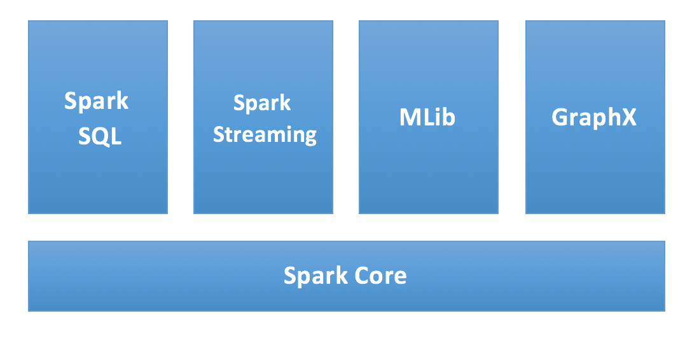
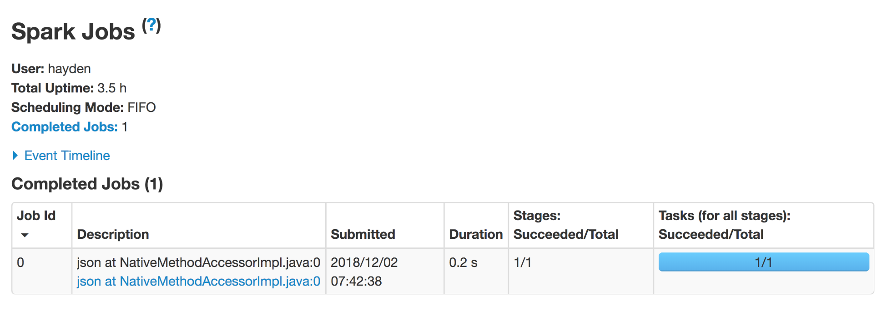
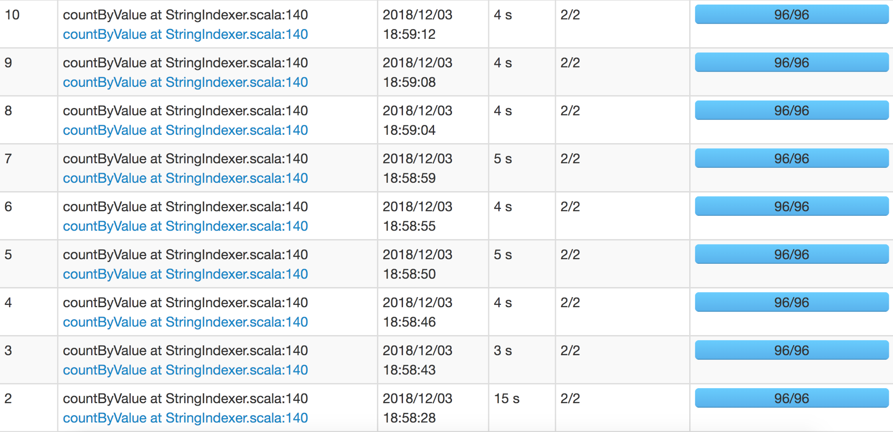
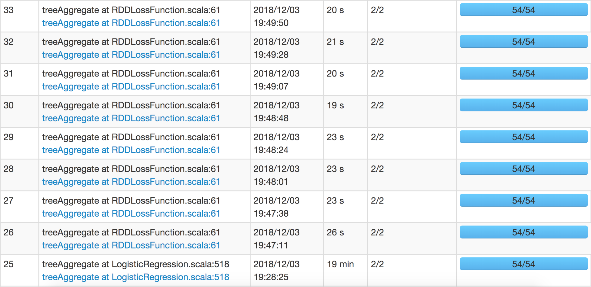
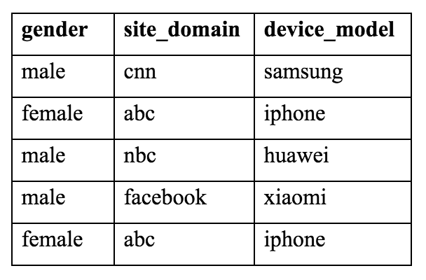
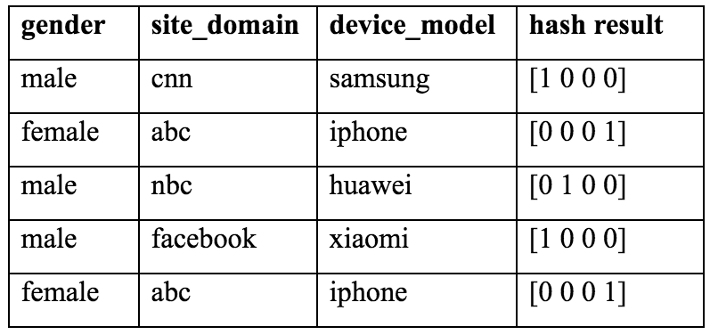
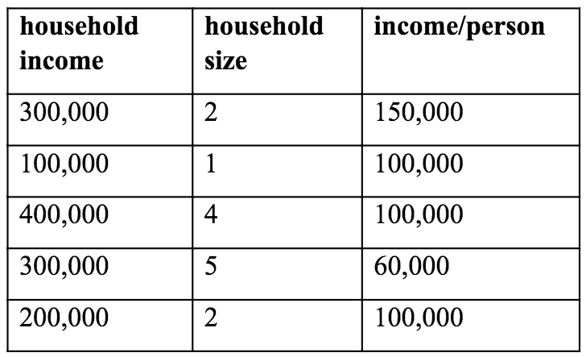
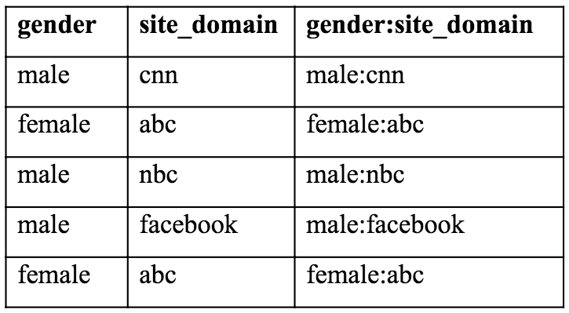

# Lab : Scaling Up Prediction to Terabyte Click Logs
In the previous chapter, we accomplished developing an ad click-through predictor using a logistic regression classifier. We proved that the algorithm is highly scalable by training efficiently on up to 1 million click log samples. Moving on to this chapter, we will be further boosting the scalability of the ad click-through predictor by utilizing a powerful parallel computing (or, more specifically, distributed computing) tool called Apache Spark. We will be demystifying how Apache Spark is used to scale up learning on massive data, as opposed to limiting model learning to one single machine. We will be using PySpark, which is the Python API, to explore the click log data, to develop classification solutions based on the entire click log dataset, and to evaluate performance, all in a distributed manner. Aside from this, we will be introducing two approaches to play around with the categorical features; one is related to hashing in computer science, while the other fuses multiple features. They will be implemented in Spark as well.

In this chapter, we will cover the following topics:

- The main components of Apache Spark
- Spark installation
- Deployment of Spark application
- Fundamental data structures in PySpark
- Core programming in PySpark
- The implementations of ad click-through predictions in PySpark
- Data exploratory analysis in PySpark
- Caching and persistence in Spark
- What feature hashing is 
- The implementations of feature hashing in PySpark
- What is feature interaction?
- The implementations of feature interaction in PySpark

#### Pre-reqs:
- Docker

#### Lab Environment
We will run Jupyter Notebook as a Docker container. This setup will take some time because of the size of the image. Run the following commands one by one:

```
docker run -d --user root -p 8888:8888 --name jupyter -e GRANT_SUDO=yes 
jupyter/tensorflow-notebook:2ce7c06a61a1 start-notebook.sh
```

```
docker exec -it jupyter bash -c 'cd /home/jovyan/work 
&& git clone https://github.com/athertahir/python-machine-learning-by-example.git && sudo && chmod +x ~/work/prepareContainer.sh && ~/prepareContainer.sh'
```

`docker restart jupyter`

**Note:** After completing these steps, jupyter notebook will be accessible at port 8888 of the host machine.

All Notebooks are present in `work` folder.

#### Login
When the container is running, execute this statement:
`docker logs jupyter 2>&1 | grep -v "HEAD" `


This will show something like:

```
Copy/paste this URL into your browser when you connect for the first time, to login with a token:
    http://localhost:8888/?token=f89b02dd78479d52470b3c3a797408b20cc5a11e067e94b8
    THIS IS NOT YOUR TOKEN.  YOU HAVE TO SEARCH THE LOGS TO GET YOUR TOKEN
```

The token is the value behind `/?token=`. You need that for logging in.

**Note:** You can also run following command to get token directly:
`docker exec -it jupyter bash -c 'jupyter notebook list' | cut -d'=' -f 2 | cut -d' ' -f 1`


# Learning the essentials of Apache Spark
Apache Spark is a distributed cluster-computing framework designed for fast and general-purpose computation. It is an open-source technology originally developed by Berkeley's AMPLab at the University of California. It provides an easy-to-use interface for programming interactive queries and stream processing of data. What makes it a popular big data analytics tool is its implicit data parallelism, where it automates operation on data in parallel across processors in the computing cluster. Users only need to focus on how they like to manipulate the data without worrying about how data is distributed among all computing nodes, or which part of the data a node is responsible for.

Bear in mind that this book is mainly about machine learning. Hence, we will only brief on the fundamentals of Spark, including its components, installation, deployment, data structure, and core programming.

#### Breaking down Spark
We start with the main components of Spark, which are depicted in the following diagram:



Now, let's explore all the main components of Spark:

- **Spark Core:** This is the foundation and the execution engine of the overall platform. It provides task distribution, scheduling, and in-memory computing. As its name implies, Spark Core is where all the other functionalities are built on top. It can also be exposed through an API of multiple languages, including Python, Java, Scala, and R.
- **Spark SQL:** This is a component built upon Spark Core that introduces a high-level data abstraction called dataframes. We will talk about data structures in Spark soon. Spark SQL supports SQL-like data manipulation in Python, Java, and Scala, which works great with structured and semi-structured data. We will be using modules from Spark SQL in this chapter.
- **Spark Streaming:** This performs real-time (or nearly real-time) data analytics by leveraging Spark Core's fast scheduling and in-memory computing capabilities.
- **MLlib:** Short formachine learning library, this is a distributed machine learning framework built on top of Spark Core. It allows learning on large-scale data efficiently thanks to the distributed architecture and in-memory computing capability. In in-memory computation, data are kept in the random-access memory (RAM) if it has sufficient capacity, instead of disk. This largely reduces the cost of memory and of reloading data back and forward during the iterative process. The training of a machine learning model is basically an iterative learning process. Hence, the in-memory computing capability of Spark makes it extremely applicable to machine learning modeling. According to major performance benchmarks, learning using MLlib is nearly ten times as fast as the disk-based solution. In this chapter, we will be using modules from Spark MLlib.
- **GraphX:** This is an another functionality built on top of Spark Core that focuses on distributed graph-based processing. PageRank and Pregel abstraction are two typical use cases.

**Note**

The main goal of this section is to understand Spark as distributed cluster computing designed for fast computation, and which facilitates both data analytics and iterative learning. If you are looking for more detailed information on Spark, there is a lot of useful documentation along with tutorials available online, such as https://spark.apache.org/docs/latest/quick-start.html.

#### Installing Spark

We need following packages to perform the lab exercise: 
- Java Development Kit
- pyspark


#### JAVA

Run the following commands to download and install JDK.

`apt-get update` 

`apt-get --assume-yes install default-jdk` 

Verify the installation with: `java -version`

You'll see the following output:

```
java version "1.8.0_201"
Java(TM) SE Runtime Environment (build 1.8.0_201-b09)
Java HotSpot(TM) 64-Bit Server VM (build 25.201-b09, mixed mode)
```


#### Install pyspark
PySpark is available in pypi. To install just run `pip install pyspark`

##### Web UI
We can access the Spark web interface to monitor the execution of Spark applications through a web browser. The wen interface can by accessed by navigating to the following URL at port `4040`. 

`host-ip:4040`

**Step 1:** Open a terminal and start the spark-shell by entering the following command.

`spark-shell`

The Spark shell should show you that the web interface is available `locally` at the following URL as shown below.


**Step 2:** Once you navigate to the web interface URL. You should see the Spark web interface as shown in the screenshot below.


Since there is no job running, you won't be able to see any metrics.


#### Programming in PySpark
This section provides a quick introduction to programming with Python in Spark. We will start with the basic data structures in Spark.

Resilient Distributed Datasets (RDD) is the primary data structure in Spark. It is a distributed collection of objects and has the following three main features:

- **Resilient:** When any node fails, affected partitions will be reassigned to healthy nodes, which makes Spark fault-tolerant
- **Distributed:** Data resides on one or more nodes in a cluster, which can be operated on in parallel
- **Dataset:** This contains a collection of partitioned data with their values or metadata
RDD was the main data structure in Spark before version 2.0. After that, it is replaced by the DataFrame , which is also a distributed collection of data but organized into named columns. DataFrame utilizes the optimized execution engine of Spark SQL. Therefore, it is conceptually similar to a table in a relational database or a DataFrame object in the Python pandas library.

Note
Although the current version of Spark still supports RDD, programming with DataFrames is highly recommended. Hence, we won't spent too much time here on programming with RDD. Refer to https://spark.apache.org/docs/latest/rdd-programming-guide.html if you are interested. We will go through the basics of programming with a dataframe.

The entry point to a Spark program is creating a Spark session, which can be done by using the following lines:

```
from pyspark.sql import SparkSession
spark = SparkSession.builder.appName("test").getOrCreate()
```

Note that this is not needed if you run it in PySpark shell. Right after we spin up a PySpark shell, a Spark session is automatically created. We can check the running Spark application at the following link: localhost:4040/jobs/. Refer to the following screenshot for the resulting page:


With a Spark session spark, a DataFrame object can be created by reading a file (which is usually the case) or manual input. In the following example, we create a DataFrame object from a CSV file:

`df = spark.read.csv("people.csv", header=True, sep=';')`
												
Columns in the CSV file people.csv are separated by ;.

Once this is done, we can see an accomplished job in localhost:4040/jobs/:

**Step 1:** After you see the output in the console, navigate back to the browser and refresh the Spark web interface. You should see a completed job as shown in the screenshot below.



**Step 2:** You can click on the collect link below the Description column and you will be taken to stages. Click on the collect link again to check more information as shown in the screenshot below.


**Step 3:** Click on the DAG Visualization link to view the DAG.


We can display the content of the DataFrame object by using the following command:

`df.show()`


+-----+---+---------+
| name|age|      job|
+-----+---+---------+
|Jorge| 30|Developer|
|  Bob| 32|Developer|
+-----+---+---------+

We can count the number of rows by using the following command:

`df.count()`

The schema of the DataFrame object can be displayed using the following command:

`df.printSchema()`

root
 |-- name: string (nullable = true)
 |-- age: string (nullable = true)
 |-- job: string (nullable = true)
 
 
One or more columns can be selected as follows:

`df.select("name").show()`

+-----+
| name|
+-----+
|Jorge|
|  Bob|
+-----+

`df.select(["name", "job"]).show()`

+-----+---------+
| name|      job|
+-----+---------+
|Jorge|Developer|
|  Bob|Developer|
+-----+---------+

We can filter rows by condition, for instance, by the value of one column using the following command:

`df.filter(df['age'] > 31).show()`

+----+---+---------+
|name|age|      job|
+----+---+---------+
| Bob| 32|Developer|
+----+---+---------+


**Important:** Type `exit` to quit spark shell.

We will continue programming in PySpark in the next section, where we use Spark to solve the ad click-through problem.


Learning on massive click logs with Spark
-----------------------------------------

* * * * *

Normally, in order to take advantage of Spark, data is stored in
a **Hadoop Distributed File System** (**HDFS**), which is a distributed
filesystem designed to store large volumes of data, and computation
occurs over multiple nodes on clusters. For demonstration purposes, we
are keeping the data on a local machine and running Spark locally. It is
no different from running it on a distributed computing cluster.

### Loading click logs

To train a model on massive click logs, we first need to load the data
in Spark. We do so by taking the following steps: 

1.  First, we spin up the PySpark shell by using the following command:

```
./bin/pyspark --master local[*]  --driver-memory 20G
```

Here, we specify a large driver memory as we are dealing with a dataset
of more than 6 GB.

2.  Start a Spark session with an application named `CTR`:

```
>>> spark = SparkSession\
...     .builder\
...     .appName("CTR")\
...     .getOrCreate()
```

3.  Then, we load the click log data from the `train` file
    into a DataFrame object. Note, the data load
    function `spark.read.csv` allows custom schema, which
    guarantees data is loaded as expected, as opposed to inferring by
    default. So first, we define the schema:

```
>>> from pyspark.sql.types import StructField, StringType, 
         StructType, IntegerType
>>> schema = StructType([
...     StructField("id", StringType(), True),
...     StructField("click", IntegerType(), True),
...     StructField("hour", IntegerType(), True),
...     StructField("C1", StringType(), True),
...     StructField("banner_pos", StringType(), True),
...     StructField("site_id", StringType(), True),
...     StructField("site_domain", StringType(), True),
...     StructField("site_category", StringType(), True),
...     StructField("app_id", StringType(), True),
...     StructField("app_domain", StringType(), True),
...     StructField("app_category", StringType(), True),
...     StructField("device_id", StringType(), True),
...     StructField("device_ip", StringType(), True),
...     StructField("device_model", StringType(), True),
...     StructField("device_type", StringType(), True),
...     StructField("device_conn_type", StringType(), True),
...     StructField("C14", StringType(), True),
...     StructField("C15", StringType(), True),
...     StructField("C16", StringType(), True),
...     StructField("C17", StringType(), True),
...     StructField("C18", StringType(), True),
...     StructField("C19", StringType(), True),
...     StructField("C20", StringType(), True),
...     StructField("C21", StringType(), True),
... ])
```

Each field of the schema contains the name of the column (such as
`id`, `click`, and `hour`), the data type
(such as `integer`, and `string`), and whether
missing values are allowed (allowed in this case).

With the defined schema, we create a DataFrame object:

```
>>> df = spark.read.csv("file://path_to_file/train", schema=schema, 
                                                      header=True)
```

### Note

Remember to replace `path_to_file` with the absolute path of
where the `train` data file is located. The
`file://` prefix indicates that data is read from a local
file. Another prefix, `dbfs://`, is used for data stored in
HDFS.

4.  We will now double-check the schema as follows:

```
>>> df.printSchema()
root
 |-- id: string (nullable = true)
 |-- click: integer (nullable = true)
 |-- hour: integer (nullable = true)
 |-- C1: string (nullable = true)
 |-- banner_pos: string (nullable = true)
 |-- site_id: string (nullable = true)
 |-- site_domain: string (nullable = true)
 |-- site_category: string (nullable = true)
 |-- app_id: string (nullable = true)
 |-- app_domain: string (nullable = true)
 |-- app_category: string (nullable = true)
 |-- device_id: string (nullable = true)
 |-- device_ip: string (nullable = true)
 |-- device_model: string (nullable = true)
 |-- device_type: string (nullable = true)
 |-- device_conn_type: string (nullable = true)
 |-- C14: string (nullable = true)
 |-- C15: string (nullable = true)
 |-- C16: string (nullable = true)
 |-- C17: string (nullable = true)
 |-- C18: string (nullable = true)
 |-- C19: string (nullable = true)
 |-- C20: string (nullable = true)
 |-- C21: string (nullable = true)
```

5.  And the data size is checked as follows:

```
>>> df.count()
40428967
```

6.  Also, we need to drop several columns that provide little
    information. We will use the following code to do that:

```
>>> df = 
    df.drop('id').drop('hour').drop('device_id').drop('device_ip')
```

7.  We rename the column from `click` to `label`, as
    this will be consumed more often in the downstream operations:

```
>>> df = df.withColumnRenamed("click", "label")
```

8.  Let's look at the current columns in the DataFrame object:

```
>>> df.columns
['label', 'C1', 'banner_pos', 'site_id', 'site_domain', 'site_category', 'app_id', 'app_domain', 'app_category', 'device_model', 'device_type', 'device_conn_type', 'C14', 'C15', 'C16', 'C17', 'C18', 'C19', 'C20', 'C21']
```

### Splitting and caching the data

Here, we split the data into a training and testing set, as follows:

```
>>> df_train, df_test = df.randomSplit([0.7, 0.3], 42)
```

Here, 70% of samples are used for training and the remaining for
testing, with a random seed specified, as always, for reproduction.

Before we perform any heavy lifting (such as model learning) on the
training set, `df_train`, it is good practice to cache the
object. In Spark, **caching** and **persistence** is an optimization
technique that reduces the computation overhead. It saves the
intermediate results of RDD or DataFrame operations in memory and/or on
disk. Without caching or persistence, whenever an intermediate DataFrame
is needed, it will be recalculated again according to how it was created
originally. Depending on the storage level, persistence behaves
differently:

-   `MEMORY_ONLY`: The object is only stored in memory. If it
    does not fit in memory, the remaining part will be recomputed each
    time it is needed.
-   `DISK_ONLY`: The object is only kept on disk. A persisted
    object can be extracted directly from storage without being
    recalculated.

-   `MEMORY_AND_DISK`: The object is stored in memory, and
    might be on disk as well. If the full object does not fit in memory,
    the remaining partition will be stored on disk, instead of being
    recalculated every time it is needed. This is the default mode for
    caching and persistence in Spark. It takes advantage of both fast
    retrieval of in-memory storage and the high accessibility and
    capacity of disk storage.

In PySpark, caching is simple. All that is required is a
`cache` method.

Let's cache both the training and testing DataFrame:

```
>>> df_train.cache()
DataFrame[label: int, C1: string, banner_pos: string, site_id: string, site_domain: string, site_category: string, app_id: string, app_domain: string, app_category: string, device_model: string, device_type: string, device_conn_type: string, C14: string, C15: string, C16: string, C17: string, C18: string, C19: string, C20: string, C21: string]
>>> df_train.count()
28297027
>>> df_test.cache()
DataFrame[label: int, C1: string, banner_pos: string, site_id: string, site_domain: string, site_category: string, app_id: string, app_domain: string, app_category: string, device_model: string, device_type: string, device_conn_type: string, C14: string, C15: string, C16: string, C17: string, C18: string, C19: string, C20: string, C21: string]
>>> df_test.count()
12131940
```

Now, we have the training and testing data ready for downstream
analysis.

### One-hot encoding categorical features

Similar to the previous chapter, we need to encode categorical features
into sets of multiple binary features by executing the following steps:

1.  In our case, the categorical features include the following:

```
>>> categorical = df_train.columns
>>> categorical.remove('label')
>>> print(categorical)
['C1', 'banner_pos', 'site_id', 'site_domain', 'site_category', 'app_id', 'app_domain', 'app_category', 'device_model', 'device_type', 'device_conn_type', 'C14', 'C15', 'C16', 'C17', 'C18', 'C19', 'C20', 'C21']
```

In PySpark, one-hot encoding is not as direct as scikit-learn
(specifically, with the `OneHotEncoder` module). 

2.  We first need to index each categorical column using
    the `StringIndexer` module:

```
>>> from pyspark.ml.feature import StringIndexer
>>> indexers = [
...       StringIndexer(inputCol=c, outputCol=
             "{0}_indexed".format(c)).setHandleInvalid("keep")
...                                        for c in categorical
... ]
```

The `setHandleInvalid("keep")` handle makes sure it won't
crash if any new categorical value occurs. Try to omit it and you will
see error messages related to unknown values.

3.  Then, we perform one-hot encoding on each individual indexed
    categorical column using
    the `OneHotEncoderEstimator` module:

```
>>> from pyspark.ml.feature import OneHotEncoderEstimator
>>> encoder = OneHotEncoderEstimator(
...     inputCols=[indexer.getOutputCol() for indexer in indexers],
...     outputCols=["{0}_encoded".format(indexer.getOutputCol()) 
                                          for indexer in indexers]
... )
```

4.  Next, we concatenate all sets of generated binary vectors into a
    single one using the `VectorAssembler` module:

```
>>> from pyspark.ml.feature import VectorAssembler
>>> assembler = VectorAssembler(
...                     inputCols=encoder.getOutputCols(),
...                     outputCol="features"
... )
```

This creates the final encoded vector column called
`features`.

5.  We chain all these three stages together into a pipeline with
    the `Pipeline` module in PySpark, which better organizes
    our one-hot encoding workflow:

```
>>> stages = indexers + [encoder, assembler]
>>> from pyspark.ml import Pipeline
>>> pipeline = Pipeline(stages=stages)
```

6.  Finally, we can fit the `pipeline` one-hot encoding model
    over the training set:

```
>>> one_hot_encoder = pipeline.fit(df_train)
```

7.  Once this is done, we use the trained encoder to transform both the
    training and testing sets. For the training set, we use the
    following code:

```
>>> df_train_encoded = one_hot_encoder.transform(df_train)
>>> df_train_encoded.show()
```

At this point, we skip displaying the results as there are dozens of
columns with several additional ones added on top
of `df_train`.

8.  However, we can see the one we are looking for, the
    `features` column, which contains the one-hot encoded
    results. Hence, we only select this column along with the target
    variable:

```
>>> df_train_encoded = df_train_encoded.select(
                                ["label", "features"])
>>> df_train_encoded.show()
+-----+--------------------+
|label|            features|
+-----+--------------------+
|    0|(31458,[5,7,3527,...|
|    0|(31458,[5,7,788,4...|
|    0|(31458,[5,7,788,4...|
|    0|(31458,[5,7,788,4...|
|    0|(31458,[5,7,788,4...|
|    0|(31458,[5,7,788,4...|
|    0|(31458,[5,7,788,4...|
|    0|(31458,[5,7,788,4...|
|    0|(31458,[5,7,788,4...|
|    0|(31458,[5,7,788,4...|
|    0|(31458,[5,7,788,4...|
|    0|(31458,[5,7,788,4...|
|    0|(31458,[5,7,788,4...|
|    0|(31458,[5,7,1271,...|
|    0|(31458,[5,7,1271,...|
|    0|(31458,[5,7,1271,...|
|    0|(31458,[5,7,1271,...|
|    0|(31458,[5,7,1532,...|
|    0|(31458,[5,7,4366,...|
|    0|(31458,[5,7,14,45...|
+-----+--------------------+
only showing top 20 rows
```

The feature column contains sparse vectors of size 31,458.

9.  Don't forget to cache `df_train_encoded`, as we will be
    using it to iteratively train our classification model:

```
>>> df_train_encoded.cache()
DataFrame[label: int, features: vector]
```

10. To release some space, we uncache `df_train`, since we
    will no longer need it:

```
>>> df_train.unpersist()
DataFrame[label: int, C1: string, banner_pos: string, site_id: string, site_domain: string, site_category: string, app_id: string, app_domain: string, app_category: string, device_model: string, device_type: string, device_conn_type: string, C14: string, C15: string, C16: string, C17: string, C18: string, C19: string, C20: string, C21: string]
```

11. Now, we will repeat the preceding steps for the testing set:

```
>>> df_test_encoded = one_hot_encoder.transform(df_test)
>>> df_test_encoded = df_test_encoded.select(["label", "features"])
>>> df_test_encoded.show()
+-----+--------------------+
|label|            features|
+-----+--------------------+
|    0|(31458,[5,7,788,4...|
|    0|(31458,[5,7,788,4...|
|    0|(31458,[5,7,788,4...|
|    0|(31458,[5,7,788,4...|
|    0|(31458,[5,7,788,4...|
|    0|(31458,[5,7,14,45...|
|    0|(31458,[5,7,14,45...|
|    0|(31458,[5,7,14,45...|
|    0|(31458,[5,7,14,45...|
|    0|(31458,[5,7,14,45...|
|    0|(31458,[5,7,14,45...|
|    0|(31458,[5,7,14,45...|
|    0|(31458,[5,7,14,45...|
|    0|(31458,[5,7,14,45...|
|    0|(31458,[5,7,14,45...|
|    0|(31458,[5,7,14,45...|
|    0|(31458,[5,7,14,45...|
|    0|(31458,[5,7,14,45...|
|    0|(31458,[5,7,2859,...|
|    0|(31458,[1,7,651,4...|
+-----+--------------------+
only showing top 20 rows
>>> df_test_encoded.cache()
DataFrame[label: int, features: vector]
>>> df_test.unpersist()
DataFrame[label: int, C1: string, banner_pos: string, site_id: string, site_domain: string, site_category: string, app_id: string, app_domain: string, app_category: string, device_model: string, device_type: string, device_conn_type: string, C14: string, C15: string, C16: string, C17: string, C18: string, C19: string, C20: string, C21: string]
```

12. If you check the Spark UI `localhost:4040/jobs/` in your
    browser, you will see several completed jobs, such as the following:



### Training and testing a logistic regression model

With the encoded training and testing set ready, we can now train our
classification model. We use logistic regression as an example, but
there are many other classification models supported in PySpark, such as
decision tree classifiers, random forests, neural networks (which we
will be studying in [Chapter
9](https://subscription.packtpub.com/book/big_data_and_business_intelligence/9781789616729/9), *Stock
Price Prediction with Regression Algorithms*), linear SVM, and Naïve
Bayes. For further details, please refer to the following
link: [https://spark.apache.org/docs/latest/ml-classification-regression.html\#classification](https://spark.apache.org/docs/latest/ml-classification-regression.html#classification).

We train and test a logistic regression model by the following steps:

We can run the code now. Run `cat python-machine-learning-by-example/Chapter08/ctr.py` to view file.

#### Run Code
Now, run the python code by running: `python ctr.py`

1.  We first import the logistic regression module and initialize a
    model:

```
>>> from pyspark.ml.classification import LogisticRegression
>>> classifier = LogisticRegression(maxIter=20, regParam=0.001, 
                                    elasticNetParam=0.001)
```

Here, we set the maximum iterations as `20`, and the
regularization parameter as `0.001`.

2.  Now, fit the model on the encoded training set:

```
>>> lr_model = classifier.fit(df_train_encoded)
```

Be aware that this might take a while. You can check the running or
completed jobs in the Spark UI in the meantime. Refer to the following
screenshot for some completed jobs:



Note that each **`RDDLossFunction`** represents an iteration of
optimizing the logistic regression classifier.

3.  After all iterations, we apply the trained model on the testing set:

```
>>> predictions = lr_model.transform(df_test_encoded)
```

4.  Cache the prediction results, as we will compute the prediction's
    performance:

```
>>> predictions.cache()
DataFrame[label: int, features: vector, rawPrediction: vector, probability: vector, prediction: double]
Take a look at the prediction DataFrame:
>>> predictions.show()
+-----+--------------------+--------------------+--------------------+----------+
|label|            features|       rawPrediction|         probability|prediction|
+-----+--------------------+--------------------+--------------------+----------+
|    0|(31458,[5,7,788,4...|[2.80267740289335...|[0.94282033454271...|       0.0|
|    0|(31458,[5,7,788,4...|[2.72243908463177...|[0.93833781006061...|       0.0|
|    0|(31458,[5,7,788,4...|[2.72243908463177...|[0.93833781006061...|       0.0|
|    0|(31458,[5,7,788,4...|[2.82083664358057...|[0.94379146612755...|       0.0|
|    0|(31458,[5,7,788,4...|[2.82083664358057...|[0.94379146612755...|       0.0|
|    0|(31458,[5,7,14,45...|[4.44920221201642...|[0.98844714081261...|       0.0|
|    0|(31458,[5,7,14,45...|[4.44920221201642...|[0.98844714081261...|       0.0|
|    0|(31458,[5,7,14,45...|[4.44920221201642...|[0.98844714081261...|       0.0|
|    0|(31458,[5,7,14,45...|[4.54759977096521...|[0.98951842852058...|       0.0|
|    0|(31458,[5,7,14,45...|[4.54759977096521...|[0.98951842852058...|       0.0|
|    0|(31458,[5,7,14,45...|[4.38991492595212...|[0.98775013592573...|       0.0|
|    0|(31458,[5,7,14,45...|[4.38991492595212...|[0.98775013592573...|       0.0|
|    0|(31458,[5,7,14,45...|[4.38991492595212...|[0.98775013592573...|       0.0|
|    0|(31458,[5,7,14,45...|[4.38991492595212...|[0.98775013592573...|       0.0|
|    0|(31458,[5,7,14,45...|[5.58870435258071...|[0.99627406423617...|       0.0|
|    0|(31458,[5,7,14,45...|[5.66066729150822...|[0.99653187592454...|       0.0|
|    0|(31458,[5,7,14,45...|[5.66066729150822...|[0.99653187592454...|       0.0|
|    0|(31458,[5,7,14,45...|[5.61336061100621...|[0.99636447866332...|       0.0|
|    0|(31458,[5,7,2859,...|[5.47553763410082...|[0.99582948965297...|       0.0|
|    0|(31458,[1,7,651,4...|[1.33424801682849...|[0.79154243844810...|       0.0|
+-----+--------------------+--------------------+--------------------+----------+
only showing top 20 rows
```

This contains the predictive features, ground truth, probabilities of
the two classes, and the final prediction (with a decision threshold of
0.5).

5.  We evaluate the AUC of ROC on the testing set using
    the `BinaryClassificationEvaluator` function with the
    `areaUnderROC` evaluation metric:

```
>>> from pyspark.ml.evaluation import BinaryClassificationEvaluator
>>> ev = BinaryClassificationEvaluator(rawPredictionCol = 
                  "rawPrediction", metricName = "areaUnderROC")
>>> print(ev.evaluate(predictions))
0.7488839207716323
```

We are hereby able to obtain an AUC of 74.89%.


Feature engineering on categorical variables with Spark
-------------------------------------------------------

* * * * *

We have demonstrated how to build an ad click predictor that learns from
massive click logs using Spark. Thus far, we have been using one-hot
encoding to employ the categorical inputs. In this section, we will be
talking about two popular feature engineering techniques: feature
hashing and feature interaction. One is an alternative to one-hot
encoding, another is a variant of one-hot encoding. **Feature
engineering** means generating new features based on domain knowledge or
defined rules, in order to improve learning performance achieved with
existing feature space.

### Hashing categorical features

In machine learning, **feature hashing** (also called **hashing trick**)
is an efficient way to encode categorical features. It is based on
hashing functions in computer science that map data of variable sizes to
data of a fixed (and usually smaller) size. It is easier to understand
feature hashing through an example.

Let's say we have three features—**gender**, **site\_domain**, and
**device\_model**, for example:



With one-hot encoding, this will become feature vectors of size 9, which
come from 2 (from **gender**) + 4 (from **site\_domain**) + 3 (from
**device\_model**). With feature hashing, we want to obtain a feature
vector of size 4. We define a hash function as the sum of Unicode code
points of each character, and then divide the result by 4 and take the
remainder as the hashed output. Take the first row as an example,
*ord(m) + ord(a) + ord(l) + ord(e) + … + ord(s) + ord(u) + ord(n) +
ord(g) = 109 + 97 + 108 + 101 + … + 115 + 117 + 110 + 103 = 1500*, then
1500 % 4 = 0, which means **[1 0 0 0]**. If the remainder is 1, a sample
is hashed into [0, 1, 0, 0]; [0, 0, 1, 0] for a sample with 2 as
the remainder;  [0, 0, 0, 1] for a sample with 3 as the remainder.

Similarly, for other rows, we have the following:



In the end, we use the four-dimension hashed vectors to represent the
original data, instead of the nine-dimension one-hot encoded ones.

There are a few things to note about feature hashing:

-   The same input will always be converted to the same output, for
    instance, the second and fifth rows.
-   Two different inputs might be converted to the same output, such as
    the first and fourth rows. This phenomenon is called **hashing
    collision**.

-   Hence, the choice of the resulting fixed size is important. It will
    result in serious collision and information loss if the size is too
    small. If it is too large, it is basically a redundant one-hot
    encoding. With the correct size, it will make it space-efficient
    and, at the same time, preserve important information, which further
    benefits downstream tasks.
-   Hashing is one-way, which means we cannot revert the output to its
    input; while one-hot encoding is two-way mapping.

Let's now adopt feature hashing to our click prediction project. Recall
that the one-hot encoded vectors are of size 31,458. If we choose 10,000
as the fixed hashing size, we will be able to cut the space to less than
one third, and reduce the memory consumed by training the classification
model. Also, we will see how quick it is to perform feature hashing
compared to one-hot encoding, as there is no need to keep track of all
unique values across all columns. It just maps each individual row of
string values to a sparse vector through internal hash functions as
follows:


We can run the code now. Run `cat python-machine-learning-by-example/Chapter08/ctr_hashing.py` to view file.

#### Run Code
Now, run the python code by running: `python ctr_hashing.py`

1.  We begin by importing the feature hashing module from PySpark and
    initialize a feature hasher with an output size
    of `10,000`:

```
>>> from pyspark.ml.feature import FeatureHasher
>>> hasher = FeatureHasher(numFeatures=10000, 
                inputCols=categorical, outputCol="features")
```

```
```

2.  Use the defined hasher to convert the input DataFrame:

```
>>> hasher.transform(df_train).select("features").show()
+--------------------+
|            features|
+--------------------+
|(10000,[1228,1289...|
|(10000,[1228,1289...|
|(10000,[1228,1289...|
|(10000,[1228,1289...|
|(10000,[1228,1289...|
|(10000,[1228,1289...|
|(10000,[29,1228,1...|
|(10000,[1228,1289...|
|(10000,[1228,1289...|
|(10000,[1228,1289...|
|(10000,[1228,1289...|
|(10000,[1228,1289...|
|(10000,[1228,1289...|
|(10000,[1228,1289...|
|(10000,[1228,1289...|
|(10000,[1228,1289...|
|(10000,[1228,1289...|
|(10000,[746,1060,...|
|(10000,[675,1228,...|
|(10000,[1289,1695...|
+--------------------+
only showing top 20 rows
```

As we can see, the size of the resulting column, `features`,
is 10,000. Again, there is no training or fitting in feature hashing.
The hasher is a predefined mapping.

3.  For better organization of the entire workflow, we chain the hasher
    and classification model together into a pipeline:

```
>>> classifier = LogisticRegression(maxIter=20, regParam=0.000, 
                                    elasticNetParam=0.000)
>>> stages = [hasher, classifier]
>>> pipeline = Pipeline(stages=stages)
```

4.  Fit the pipelined model on the training set as follows:

```
>>> model = pipeline.fit(df_train)
```

5.  Apply the trained model on the testing set and record the prediction
    results:

```
>>> predictions = model.transform(df_test)
>>> predictions.cache()
```

 

6.  Evaluate its performance in terms of AUC of ROC:

```
>>> ev = BinaryClassificationEvaluator(rawPredictionCol = 
                   "rawPrediction", metricName = "areaUnderROC")
>>> print(ev.evaluate(predictions))
0.7448097180769776
```

We are able to achieve an AUC of 74.48%, which is close to the previous
one of 74.89% with one-hot encoding. At the end of the day, we save a
substantial amount of computational resources and attain a comparable
prediction accuracy. That is a win.

### Note

With feature hashing, we lose interpretability but gain computational
advantage.

### Combining multiple variables – feature interaction

Among all the features of the click log data, some are very weak signals
in themselves. For example, gender itself doesn't tell you much
regarding whether someone will click an ad, and the device model itself
doesn't provide much information either. However, by combining multiple
features, we will be able to create a stronger synthesized signal.
**Feature interaction** is introduced for this purpose. For numerical
features, it usually generates new features by multiplying multiples of
them. We can also define whatever integration rules we want. For
example, we generate an additional feature, **income/person****,** from
two original features, **household income** and **household size**:



For categorical features, feature interaction becomes an AND operation
on two or more features. In the following example, we generate an
additional feature, **gender:site\_domain**, from two original
features, **gender** and **site\_domain**:



We then use one-hot encoding to transform string values. On top of six
one-hot encoded features (two from **gender** and four from
**site\_domain**), feature interaction between **gender** and
**site\_domain** adds eight further features (two by four).

Let's now adopt feature interaction to our click prediction project. We
take two features, `C14` and `C15`, as an example of
AND interaction:

We can run the code now. Run `cat python-machine-learning-by-example/Chapter08/ctr_interaction.py` to view file.

#### Run Code
Now, run the python code by running: `python ctr_interaction.py`

1.  First, we will import the feature interaction
    module, `RFormula`, from PySpark:

```
>>> from pyspark.ml.feature import RFormula
```

An `RFormula` model takes in a formula that describes how
features interact. For instance, `y ~ a + b` means it takes in
input features, *a* and *b*, and outputs *y*;
`y ~ a + b + a:b` means it predicts y based on features *a*,
*b*, and iteration term, *a* AND *b*; `y ~ a + b + c + a:b`
means it predicts *y* based on features *a*, *b*, *c*, and iteration
terms, *a *AND* b*.

2.  We need to define an interaction formula accordingly:

```
>>> cat_inter = ['C14', 'C15']
>>> cat_no_inter = [c for c in categorical if c not in cat_inter]
>>> concat = '+'.join(categorical)
>>> interaction = ':'.join(cat_inter)
>>> formula = "label ~ " + concat + '+' + interaction
>>> print(formula)
label ~ C1+banner_pos+site_id+site_domain+site_category+app_id+app_domain+app_category+device_model+device_type+device_conn_type+C14+C15+C16+C17+C18+C19+C20+C21+C14:C15
```

3.  Now, we can initialize a feature interactor with this formula:

```
>>> interactor = RFormula(
...     formula=formula,
...     featuresCol="features",
...     labelCol="label").setHandleInvalid("keep")
```

Again, the `setHandleInvalid("keep")` handle here makes sure
it won't crash if any new categorical value occurs.

4.  Use the defined feature interactor to fit and transform the input
    DataFrame:

```
>>> interactor.fit(df_train).transform(df_train).select("features").
                                                               show()
+--------------------+
|            features|
+--------------------+
|(54930,[5,7,3527,...|
|(54930,[5,7,788,4...|
|(54930,[5,7,788,4...|
|(54930,[5,7,788,4...|
|(54930,[5,7,788,4...|
|(54930,[5,7,788,4...|
|(54930,[5,7,788,4...|
|(54930,[5,7,788,4...|
|(54930,[5,7,788,4...|
|(54930,[5,7,788,4...|
|(54930,[5,7,788,4...|
|(54930,[5,7,788,4...|
|(54930,[5,7,788,4...|
|(54930,[5,7,1271,...|
|(54930,[5,7,1271,...|
|(54930,[5,7,1271,...|
|(54930,[5,7,1271,...|
|(54930,[5,7,1532,...|
|(54930,[5,7,4366,...|
|(54930,[5,7,14,45...|
+--------------------+
only showing top 20 rows
```

More than 20,000 features are added to the feature space due to the
interaction term of `C14` and `C15`.

5.  Again, we chain the feature interactor and classification model
    together into a pipeline for better organizing the entire workflow:

```
>>> classifier = LogisticRegression(maxIter=20, regParam=0.000, 
                                    elasticNetParam=0.000)
>>> stages = [interactor, classifier]
>>> pipeline = Pipeline(stages=stages)
>>> model = pipeline.fit(df_train)
>>> predictions = model.transform(df_test)
>>> predictions.cache()
>>> from pyspark.ml.evaluation import BinaryClassificationEvaluator
>>> ev = BinaryClassificationEvaluator(rawPredictionCol = 
                     "rawPrediction", metricName = "areaUnderROC")
>>> print(ev.evaluate(predictions))
0.7490392990518315
```

An AUC of 74.90%, with additional interaction between features
`C14` and `C15`, is a boost from 74.89% without any
interaction.


# Summary
In this chapter, we continued working on the online advertising click-through prediction project. This time, we were able to train the classifier on the entire dataset with millions of records, with the help of the parallel computing tool, Apache Spark. We have discussed the basics of Spark, including its major components, deployment of Spark programs, programming essentials of PySpark, and the Python interface of Spark. And we programmed using PySpark to explore the click log data, perform one-hot encoding, cache intermediate results, develop classification solutions based on the entire click log dataset, and evaluate performance. In addition, we introduced two feature engineering techniques, feature hashing and feature interaction, in order to improve prediction performance. We had fun implementing them in PySpark as well.

Looking back on our learning journey, we have been working on classification problems since Chapter 4, Detecting Spam Email with Naive Bayes. Actually, we have covered all powerful and popular classification models in machine learning. And yes, we will move on to solving regression problems in the chapter, which is the sibling of classification in supervised learning. We will resort to regression models, including linear regression, decision trees for regression, and support vector regression, which all sound very familiar, as well as neural networks that have gained significantly in popularity recently.

# Exercises
- In the one-hot encoding solution, can you use different classifiers supported in PySpark instead of logistic regression, such as decision tree, random forest, and linear SVM?
- In the feature hashing solution, can you try other hash sizes, such as 5,000, and 20,000? What do you observe?
- In the feature interaction solution, can you try other interactions, such as C1 and C20?
- Can you first use feature interaction and then feature hashing in order to lower the expanded dimension? Are you able to obtain higher AUC?