# Lab : Stock Price Prediction with Regression Algorithms
In this chapter, we will be solving a problem that absolutely interests everyone—predicting stock prices. Getting wealthy by means of smart investment—who isn't interested?! In fact, stock market movements and stock price predictions have been actively researched by a large number of financial, trading, and even technology corporations. A variety of methods have been developed to predict stock prices using machine learning techniques. Herein, we will be focusing on learning several popular regression algorithms, including linear regression, regression tree and regression forest, and support vector regression, as well as neural networks, and utilizing them to tackle this billion (or trillion) dollar problem.

We will cover the following topics in this chapter:

- An introduction to the stock market and stock prices
- What is regression
- Feature engineering
- Acquiring stock data and generating predictive features
- What is linear regression
- Mechanics of linear regression
- Implementations of linear regression (from scratch, and using scikit-learn and TensorFlow)
- What is decision tree regression
- Mechanics of regression tree
- Implementations of regression tree (from scratch and using scikit-learn)
- From regression tree to regression forest
- Implementations of regression forest (using scikit-learn and TensorFlow)
- What is support vector regression
- Mechanics of support vector regression
- Implementations of support vector regression with scikit-learn
- What is a neural network
- Mechanics of neural networks
- Implementations of neural networks (from scratch, and using scikit-learn, TensorFlow, and Keras)
- Regression performance evaluation
- Predicting stock prices with regression algorithms

#### Pre-reqs:
- Google Chrome (Recommended)

#### Lab Environment
Notebooks are ready to run. All packages have been installed. There is no requirement for any setup.

**Note:** Elev8ed Notebooks (powered by Jupyter) will be accessible at the port given to you by your instructor. Password for jupyterLab : `1234`

All Notebooks are present in `work/python-machine-learning-by-example` folder.

You can access jupyter lab at `<host-ip>:<port>/lab/workspaces/lab8_Regression_Algorithms`

Brief overview of the stock market and stock prices 
---------------------------------------------------

* * * * *

The stock of a corporation signifies ownership in the corporation. A
single share of the stock represents a claim on fractional assets and
earnings of the corporation in proportion to the total number of shares.
For example, if an investor owns 50 shares of stock in a company that
has, in total, 1,000 outstanding shares, that investor (or shareholder)
would own and have claim on 5% of the company's assets and earnings.

Stocks of a company can be traded between shareholders and other parties
via stock exchanges and organizations. Major stock exchanges include New
York Stock Exchange, NASDAQ, London Stock Exchange Group, Shanghai Stock
Exchange, and Hong Kong Stock Exchange. The prices that a stock is
traded at fluctuate essentially due to the law of supply and demand. At
any one moment, the supply is the number of shares that are in the hands
of public investors, the demand is the number of shares investors want
to buy, and the price of the stock moves up and down in order to attain
and maintain equilibrium.

In general, investors want to buy low and sell high. This sounds simple
enough but it's very challenging to implement as it's monumentally
difficult to say whether a stock price will go up or down. There are two
main streams of studies attempting to understand factors and conditions
that lead to price changes or even to forecast future stock prices,
**fundamental analysis** and **technical analysis**:

-   **Fundamental analysis**: This stream focuses on underlying factors
    that influence a company's value and business, including overall
    economy and industry conditions from macro perspectives, the
    company's financial conditions, management, and competitors from
    micro perspectives.
-   **Technical analysis**: On the other hand, this stream predicts
    future price movements through the statistical study of past trading
    activity, including price movement, volume, and market data.
    Predicting prices via machine learning techniques is an important
    topic in technical analysis nowadays. Many quant trading firms have
    been using machine learning to empower automated and algorithmic
    trading. In this chapter, we'll be working as a quantitative
    analyst/researcher, exploring how to predict stock prices with
    several typical **machine learning regression** algorithms.

What is regression? 
-------------------

* * * * *

**Regression** is another main instance of supervised learning in
machine learning. Given a training set of data containing observations
and their associated continuous output values, the goal of regression is
to explore the relationships between the observations (also called
features) and the targets, and to output a **continuous** value based on
the input features of an unknown sample, which is depicted in the
following diagram:

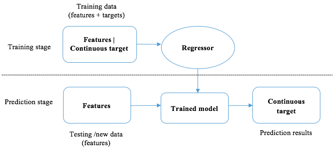

The major difference between regression and classification is that the
output values in regression are continuous while they are discrete in
classification. This leads to different application areas for these two
supervised learning methods. Classification is basically used in
determining the desired memberships or characteristics as we've seen in
previous chapters, such as email being spam or not, newsgroup topics, ad
click-through or not. On the other hand, regression mainly involves
estimating an outcome or forecasting a response. An example of
estimating continuous targets with linear regression is depicted as
follows:

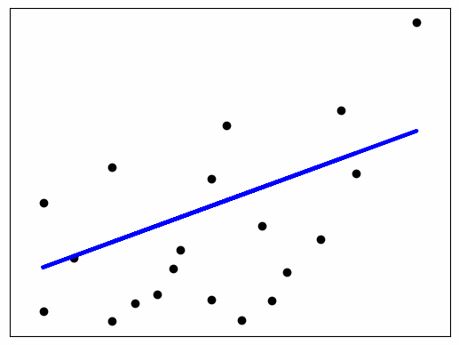

Typical machine learning regression problems include the following:

-   Predicting house prices based on location, square footage, number of
    bedrooms, and bathrooms
-   Estimating power consumption based on information of a system's
    processes and memory
-   Forecasting retail inventory
-   And of course, predicting stock prices

Mining stock price data 
-----------------------

* * * * *

In theory, we can apply regression techniques in predicting prices of a
particular stock. However, it's difficult to ensure the stock we pick is
suitable enough for learning purposes—its price should follow some
learnable patterns and it hasn't been affected by unprecedented
instances or irregular events. Hence, we'll herein be focusing on one of
the most popular **stock indexes** to better illustrate and generalize
our price regression approach.

 

 

Let's first cover what an index is. A **stock index** is a statistical
measure of the value of a portion of the overall stock market. An index
includes several stocks that are diverse enough to represent a section
of the whole market. And the price of an index is typically computed as
the weighted average of the prices of selected stocks.

The **Dow Jones Industrial Average** (**DJIA**) is one of the longest
established and most commonly watched indexes in the world. It consists
of 30 of the most significant stocks in the U.S., such as Microsoft,
Apple, General Electric, and the Walt Disney Company, and represents
around a quarter of the value of the entire U.S. market. We can view its
daily prices and performance in Yahoo Finance
at [https://finance.yahoo.com/quote/%5EDJI/history?p=%5EDJI](https://finance.yahoo.com/quote/%5EDJI/history?p=%5EDJI):

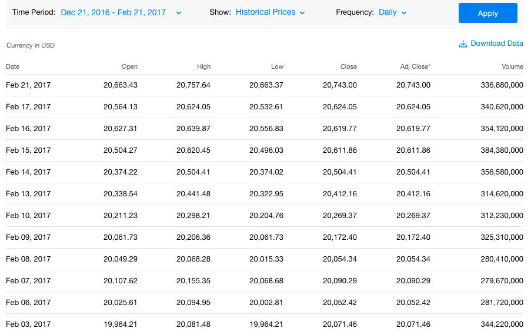

 

In each trading day, price of a stock changes and is recorded in real
time. Five values illustrating movements in the price over one unit of
time (usually one day, but can also be one week or one month) are key
trading indicators. They are as follows:

-   **`Open`**: The starting price for a given trading day
-   **`Close`**: The final price on that day
-   **`High`**: The highest prices at which the stock traded on that day
-   **`Low`**: The lowest prices at which the stock traded on that day
-   **`Volume`**: The total number of shares traded before the market is
    closed on that day

Other major indexes besides DJIA include the following:

-   **S&P 500** (short for **S**tandard & Poor's 500) Index is made up
    of 500 of the most commonly traded stocks in the U.S., representing
    80% of the value of the entire U.S. market
    ([https://finance.yahoo.com/quote/%5EGSPC/history?p=%5EGSPC](https://finance.yahoo.com/quote/%5EGSPC/history?p=%5EGSPC)).
-   **`NASDAQ Composite`** is composed of all stocks traded on NASDAQ
    ([https://finance.yahoo.com/quote/%5EIXIC/history?p=%5EIXIC](https://finance.yahoo.com/quote/%5EIXIC/history?p=%5EIXIC)).
-   **`Russell 2000 (RUT)`** index is a collection of the last 2,000 out
    of 3,000 largest publicly-traded companies in the U.S.
    ([https://finance.yahoo.com/quote/%5ERUT/history?p=%5ERUT](https://finance.yahoo.com/quote/%5ERUT/history?p=%5ERUT)).
-   London FTSE-100 is composed of the top 100 companies in market
    capitalization listed on the London Stock Exchange
    ([https://finance.yahoo.com/quote/%5EFTSE/](https://finance.yahoo.com/quote/%5EFTSE/)).

We will be focusing on DJIA and using its historical prices and
performance to predict future prices. In the following sections, we will
be exploring how to develop price prediction models, specifically
regression models, and what can be used as indicators or predictive
features.

### Getting started with feature engineering

When it comes to a machine learning algorithm, the first question to ask
is usually what features are available or what the predictive variables
are.

The driving factors that are used to predict future prices of DJIA, the
**close** prices, include historical and current **open** prices as well
as historical performance (**high**, **low**, and **volume**). Note that
current or same-day performance (**high**, **low**, and **volume**)
shouldn't be included because we simply can't foresee the highest and
lowest prices at which the stock traded or the total number of shares
traded before the market is closed on that day.

 

Predicting the close price with only those preceding four indicators
doesn't seem promising and might lead to underfitting. So we need to
think of ways to generate more features in order to increase predictive
power. To recap, in machine learning, **feature engineering** is the
process of creating domain-specific features based on existing features
in order to improve the performance of a machine learning algorithm.
Feature engineering usually requires sufficient domain knowledge and can
be very difficult and time-consuming. In reality, features used to solve
a machine learning problem are not usually directly available and need
to be particularly designed and constructed, for example, term frequency
or tf-idf features in spam email detection and newsgroup classification.
Hence, feature engineering is essential in machine learning and is
usually where we spend most efforts in solving a practical problem.

When making an investment decision, investors usually look at historical
prices over a period of time, not just the price the day before.
Therefore, in our stock price prediction case, we can compute the
average close price over the past week (five trading days), over the
past month and over the past year as three new features. We can also
customize the time window to the size we want, such as the past quarter
or the past six months. On top of these three averaged price features,
we can generate new features associated with the price trend by
computing the ratios between each pair of average prices in three
different time frames. For instance, the ratio between the average price
over the past week and that over the past year. Besides prices, volume
is another important factor that investors analyze. Similarly, we can
generate new volume-based features by computing the average volumes in
several different time frames and ratios between each pair of averaged
values.

Besides historical averaged values in a time window, investors also
greatly consider stock volatility. Volatility describes the degree of
variation of prices for a given stock or index over time. In statistical
term, it's basically the standard deviation of the close prices. We can
easily generate new sets of features by computing the standard deviation
of close prices in a particular time frame, as well as the standard
deviation of volumes traded. In a similar manner, ratios between each
pair of standard deviation values can be included in our engineered
feature pool.

Last but not least, return is a significant financial metric that
investors closely watch for. Return is the percentage of gain or loss of
close price for a stock/index in a particular period. For example, daily
return and annual return are financial terms we frequently hear. They
are calculated as follows:

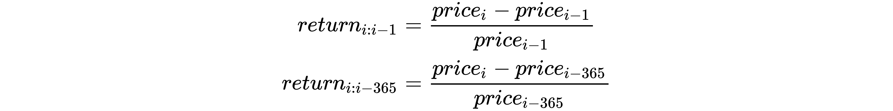

 

Here, *price~i~* is the price on the *i^th^* day and *price~i~*~-~*~1~*
is the price on the day before. Weekly and monthly returns can be
computed in a similar way. Based on daily returns, we can produce a
moving average over a particular number of days. For instance, given
daily returns of the past week, *return~i:i-1~*, *return~i-1:i-2~*,
*return~i-2:i-3~*, *return~i-3:i-4~*, *return~i-4:i-5~*, we can
calculate the moving average over that week as follows:

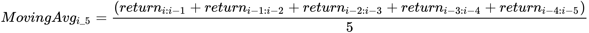

In summary, we can generate the following predictive variables by
applying feature engineering techniques:

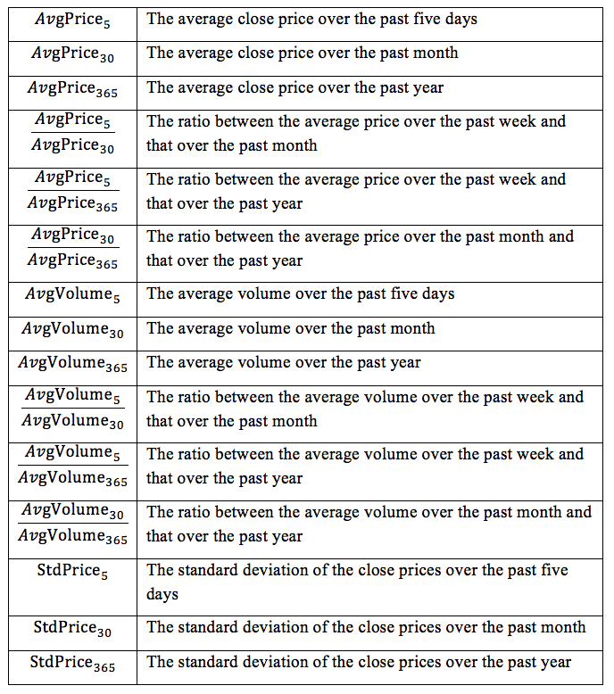

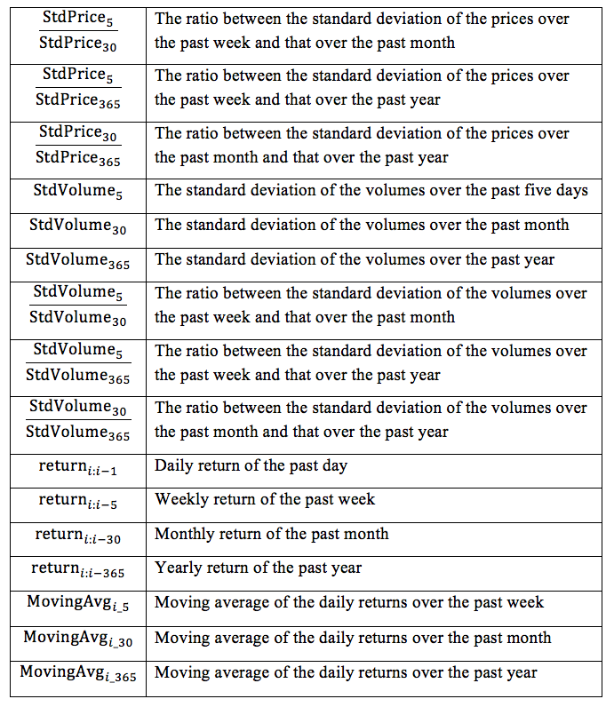

Eventually, we are able to generate in total 31 sets of features, along
with the following six original features:

-   *OpenPrice~i~*: This feature represents the open price 
-   *OpenPrice~i-1~*: This feature represents the open price on the past
    day 
-   *ClosePrice~i-1~*:*~ ~*This feature representstheclose price on the
    past day 
-   *HighPrice~i-1~*: This feature represents the highest price on the
    past day 
-   *LowPrice~i-1~*: This feature represents the lowest price on the
    past day 
-   *Volume~i-1~*: This feature represents the volume on the past day 

 

### Acquiring data and generating features

For easier reference, we will implement the code for generating features
here rather than in later sections. We will start with obtaining the
dataset we need for our project.

Throughout the entire project, we acquire stock index price and
performance data from Yahoo Finance. For example, in the
**`Historical Data`**
page,[http](https://finance.yahoo.com/quote/%5EDJI/history?p=%5EDJI)[s://finance.yahoo.com/quote/%5EDJI/history?p=%5EDJI](https://finance.yahoo.com/quote/%5EDJI/history?p=%5EDJI),
we can change the **`Time Period`** to **`Dec 01, 2005 - Dec10, 2005`**,
select **`Historical Prices`** in **`Show`**, and **`Daily`** in
**`Frequency`** (or open this
link directly: [https://finance.yahoo.com/quote/%5EDJI/history?period1=1133413200&amp;period2=1134190800&amp;interval=1d&amp;filter=history&amp;frequency=1d](https://finance.yahoo.com/quote/%5EDJI/history?period1=1133413200&period2=1134190800&interval=1d&filter=history&frequency=1d)),
then click on the **`Apply`** button. Click the **`Download data`**
button to download the data and name the file
`20051201_20051210.csv`.

We can load the data we just downloaded as follows:

```
mydata = pd.read_csv('20051201_20051210.csv', index_col='Date')
mydata
               Open         High         Low          Close 
Date
2005-12-01 10806.030273 10934.900391 10806.030273 10912.570312
2005-12-02 10912.009766 10921.370117 10861.660156 10877.509766
2005-12-05 10876.950195 10876.950195 10810.669922 10835.009766
2005-12-06 10835.410156 10936.200195 10835.410156 10856.860352
2005-12-07 10856.860352 10868.059570 10764.009766 10810.910156
2005-12-08 10808.429688 10847.250000 10729.669922 10755.120117
2005-12-09 10751.759766 10805.950195 10729.910156 10778.580078

              Volume    Adjusted Close
Date
2005-12-01 256980000.0   10912.570312
2005-12-02 214900000.0   10877.509766
2005-12-05 237340000.0   10835.009766
2005-12-06 264630000.0   10856.860352
2005-12-07 243490000.0   10810.910156
2005-12-08 253290000.0   10755.120117
2005-12-09 238930000.0   10778.580078
```

Note the output is a `pandas``dataframe` object. The
`Date` column is the index column, and the rest columns are
the corresponding financial variables. If you have not installed
`pandas`, the powerful package designed to simplify data
analysis on **relational** (or table-like) data, you can do so via the
following command line:

```
 pip install pandas
```

 

Next, we implement feature generation by starting with a sub-function
that directly creates features from the original six features, as
follows:

```
def add_original_feature(df, df_new):
    df_new['open'] = df['Open']
    df_new['open_1'] = df['Open'].shift(1)
    df_new['close_1'] = df['Close'].shift(1)
    df_new['high_1'] = df['High'].shift(1)
    df_new['low_1'] = df['Low'].shift(1)
    df_new['volume_1'] = df['Volume'].shift(1)
```

Then we develop a sub-function that generates six features related to
average close prices:

```
def add_avg_price(df, df_new):
    df_new['avg_price_5'] = df['Close'].rolling(5).mean().shift(1)
    df_new['avg_price_30'] = df['Close'].rolling(21).mean().shift(1)
    df_new['avg_price_365'] = df['Close'].rolling(252).mean().shift(1)
    df_new['ratio_avg_price_5_30'] = 
                          df_new['avg_price_5'] / df_new['avg_price_30']
    df_new['ratio_avg_price_5_365'] = 
                          df_new['avg_price_5'] / df_new['avg_price_365']
    df_new['ratio_avg_price_30_365'] = 
                          df_new['avg_price_30'] / df_new['avg_price_365']
```

Similarly, a sub-function that generates six features related to average
volumes is as follows:

```
def add_avg_volume(df, df_new):
    df_new['avg_volume_5'] = df['Volume'].rolling(5).mean().shift(1)
    df_new['avg_volume_30'] = df['Volume'].rolling(21).mean().shift(1)
    df_new['avg_volume_365'] = 
                        df['Volume'].rolling(252).mean().shift(1)
    df_new['ratio_avg_volume_5_30'] = 
                        df_new['avg_volume_5'] / df_new['avg_volume_30']
    df_new['ratio_avg_volume_5_365'] = 
                        df_new['avg_volume_5'] / df_new['avg_volume_365']
    df_new['ratio_avg_volume_30_365'] = 
                        df_new['avg_volume_30'] / df_new['avg_volume_365']
```

As for the standard deviation, we develop the following sub-function for
the price-related features:

```
def add_std_price(df, df_new):
    df_new['std_price_5'] = df['Close'].rolling(5).std().shift(1)
    df_new['std_price_30'] = df['Close'].rolling(21).std().shift(1)
    df_new['std_price_365'] = df['Close'].rolling(252).std().shift(1)
    df_new['ratio_std_price_5_30'] = 
                          df_new['std_price_5'] / df_new['std_price_30']
    df_new['ratio_std_price_5_365'] = 
                          df_new['std_price_5'] / df_new['std_price_365']
    df_new['ratio_std_price_30_365'] = 
                          df_new['std_price_30'] / df_new['std_price_365']
```

Similarly, a sub-function that generates six volume-based standard
deviation features is as follows:

```
def add_std_volume(df, df_new):
    df_new['std_volume_5'] = df['Volume'].rolling(5).std().shift(1)
    df_new['std_volume_30'] = df['Volume'].rolling(21).std().shift(1)
    df_new['std_volume_365'] = df['Volume'].rolling(252).std().shift(1)
    df_new['ratio_std_volume_5_30'] = 
                        df_new['std_volume_5'] / df_new['std_volume_30']
    df_new['ratio_std_volume_5_365'] = 
                        df_new['std_volume_5'] / df_new['std_volume_365']
    df_new['ratio_std_volume_30_365'] = 
                        df_new['std_volume_30'] / df_new['std_volume_365']
```

And seven return-based features are generated using the following
sub-function:

```
def add_return_feature(df, df_new):
    df_new['return_1'] = ((df['Close'] - df['Close'].shift(1)) /         
                                    df['Close'].shift(1)).shift(1)
    df_new['return_5'] = ((df['Close'] - df['Close'].shift(5)) /     
                                    df['Close'].shift(5)).shift(1)
    df_new['return_30'] = ((df['Close'] - df['Close'].shift(21)) / 
                                    df['Close'].shift(21)).shift(1)
    df_new['return_365'] = ((df['Close'] - df['Close'].shift(252)) / 
                                    df['Close'].shift(252)).shift(1)
    df_new['moving_avg_5'] = 
                        df_new['return_1'].rolling(5).mean().shift(1)
    df_new['moving_avg_30'] = 
                        df_new['return_1'].rolling(21).mean().shift(1)
    df_new['moving_avg_365'] = 
                        df_new['return_1'].rolling(252).mean().shift(1)
```

Finally, we put together the main feature generation function that calls
all preceding sub-functions: 

```
def generate_features(df):
    """
    Generate features for a stock/index based on historical price 
           and performance
    @param df: dataframe with columns "Open", "Close", "High", 
                   "Low", "Volume", "Adjusted Close"
    @return: dataframe, data set with new features
    """
    df_new = pd.DataFrame()
    # 6 original features
    add_original_feature(df, df_new)
    # 31 generated features
    add_avg_price(df, df_new)
    add_avg_volume(df, df_new)
    add_std_price(df, df_new)
    add_std_volume(df, df_new)
    add_return_feature(df, df_new)
    # the target
    df_new['close'] = df['Close']
    df_new = df_new.dropna(axis=0)
    return df_new
```

It is noted that the window sizes here are 5, 21, and 252, instead of 7,
30, and 365 representing the weekly, monthly, and yearly window. This is
because there are 252 (rounded) trading days in a year, 21 trading days
in a month, and 5 in a week.

We can apply this feature engineering strategy on the DJIA data queried
from 1988 to 2016 as follows:

```
data_raw = pd.read_csv('19880101_20161231.csv', index_col='Date')
data = generate_features(data_raw)
```

Take a look at what the data with the new features looks like:

```
print(data.round(decimals=3).head(5))
```

The preceding command line generates the following output:

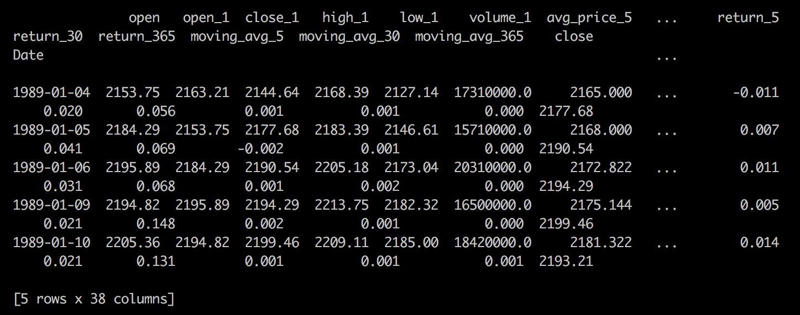

Since all features and driving factors are ready, we should now focus on
regression algorithms that estimate the continuous target variables
based on these predictive features.

Estimating with linear regression 
---------------------------------

* * * * *

The first regression model that comes to our mind is **linear
regression**. Does it mean fitting data points using a linear function,
as its name implies? Let's explore it.

### How does linear regression work?

In simple terms, linear regression tries to fit as many of the data
points as possible with a line in two-dimensional space or a plane in
three-dimensional space, and so on. It explores the linear relationship
between observations and targets and the relationship is represented in
a linear equation or weighted sum function. Given a data sample ***x***
with *n* features, *x~1~, x~2~, …, x~n~* (***x*** represents a feature
vector and ***x** =* (*x~1~, x~2~, …, x~n~*)), and **weights** (also
called **coefficients**) of the linear regression model ***w*** (***w***
represents a vector (*w~1~, w~2~, …, w~n~*)), the target *y* is
expressed as follows:

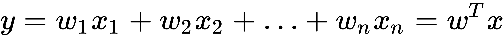

Also, sometimes, the linear regression model comes with an **intercept**
(also called **bias**) *w*~0~, so the preceding linear relationship
becomes as follows:


Doesn't it look familiar? The **logistic****regression** algorithm we
learned in *Predicting Online Ads Click-through with Logistic Regression*, is just
an addition of logistic transformation on top of the linear regression,
which maps the continuous weighted sum to *0* (negative) or *1*
(positive) class. Similarly, a linear regression model, or specifically,
its weight vector ***w*** is learned from the training data, with the
goal of minimizing the estimation error defined as **mean squared
error** (**MSE**), which measures the average of squares of difference
between the truth and prediction. Give *m* training samples,
(*x^(1)^,y^(1)^*), (*x^(2)^,y^(2)^*),… (*x^(i)^,y^(i)^*)…,
(*x^(m)^,y^(m)^*), the cost function *J(**w**)* regarding the weights to
be optimized is expressed as follows:

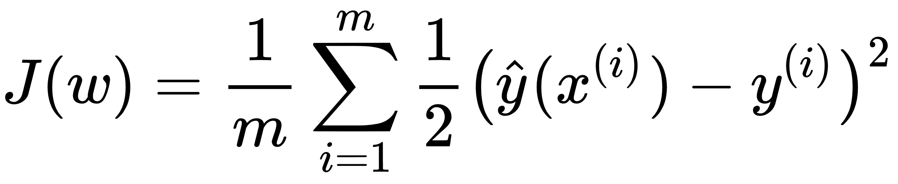

Here, ~~

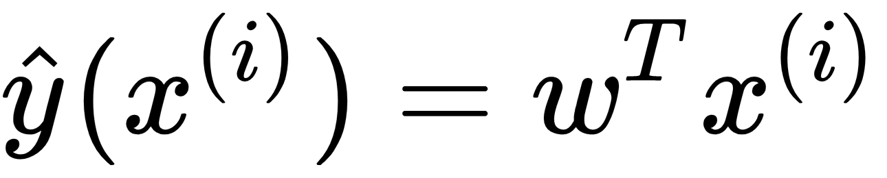

 is the prediction.

Again, we can obtain the optimal *w* so that *J(w)* is minimized using
gradient descent. The first-order derivative, the gradient *∆w*, is
derived as follows:

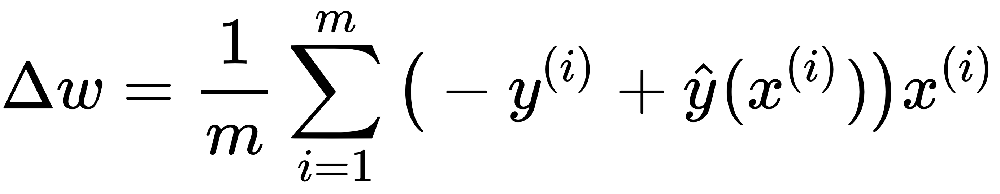

Combined with the gradient and learning rate η, the weight vector
***w*** can be updated in each step as follows:

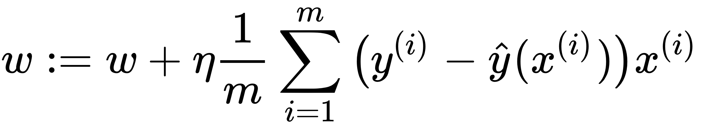

After a substantial number of iterations, the learned ***w*** is then
used to predict a new sample *x'* as follows:

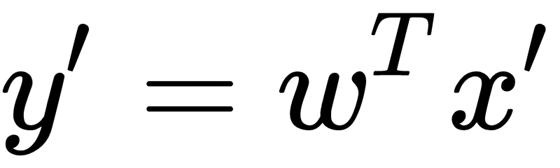

### Implementing linear regression

With a thorough understanding of the gradient descent based linear
regression, we'll now implement it from scratch.

We start with defining the function computing the prediction ~~

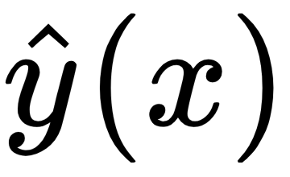

with the current weights:

```
def compute_prediction(X, weights):
    """ Compute the prediction y_hat based on current weights
    Args:
        X (numpy.ndarray)
        weights (numpy.ndarray)
    Returns:
        numpy.ndarray, y_hat of X under weights
    """
    predictions = np.dot(X, weights)
    return predictions
```

 

 

Then, we can continue with the function updating the weight ***w*** by
one step in a gradient descent manner, as follows:

```
def update_weights_gd(X_train, y_train, weights, learning_rate):
    """ Update weights by one step
    Args:
        X_train, y_train (numpy.ndarray, training data set)
        weights (numpy.ndarray)
        learning_rate (float)
    Returns:
        numpy.ndarray, updated weights
    """
    predictions = compute_prediction(X_train, weights)
    weights_delta = np.dot(X_train.T, y_train - predictions)
    m = y_train.shape[0]
    weights += learning_rate / float(m) * weights_delta
    return weights
```

Then we add the function that calculates the cost *J(**w**)* as well:

```
def compute_cost(X, y, weights):
    """ Compute the cost J(w)
    Args:
        X, y (numpy.ndarray, data set)
        weights (numpy.ndarray)
    Returns:
        float
    """
    predictions = compute_prediction(X, weights)
    cost = np.mean((predictions - y) ** 2 / 2.0)
    return cost
```

Now, put all functions together with a model training function by
performing the following tasks:

1.  Update the weight vector in each iteration
2.  Print out the current cost for every 100 (or can be any) iterations
    to ensure cost is decreasing and things are on the right track

 

 

Let's see how it's done by executing the following commands:

```
def train_linear_regression(X_train, y_train, max_iter, 
                             learning_rate, fit_intercept=False):
    """ Train a linear regression model with gradient descent
    Args:
        X_train, y_train (numpy.ndarray, training data set)
        max_iter (int, number of iterations)
        learning_rate (float)
        fit_intercept (bool, with an intercept w0 or not)
    Returns:
        numpy.ndarray, learned weights
    """
    if fit_intercept:
        intercept = np.ones((X_train.shape[0], 1))
        X_train = np.hstack((intercept, X_train))
    weights = np.zeros(X_train.shape[1])
    for iteration in range(max_iter):
        weights = update_weights_gd(
                         X_train, y_train, weights, learning_rate)
        # Check the cost for every 100 (for example) iterations
        if iteration % 100 == 0:
            print(compute_cost(X_train, y_train, weights))
    return weights
```

Finally, predict the results of new input values using the trained model
as follows:

```
def predict(X, weights):
    if X.shape[1] == weights.shape[0] - 1:
        intercept = np.ones((X.shape[0], 1))
        X = np.hstack((intercept, X))
    return compute_prediction(X, weights)
```

Implementing linear regression is very similar to logistic regression as
we just saw. Let's examine it with a small example:

```
X_train = np.array([[6], [2], [3], [4], [1], 
                        [5], [2], [6], [4], [7]])
y_train = np.array([5.5, 1.6, 2.2, 3.7, 0.8, 
                        5.2, 1.5, 5.3, 4.4, 6.8])
```

Train a linear regression model by `100` iterations, at a
learning rate of `0.01` based on intercept-included weights:

```
weights = train_linear_regression(X_train, y_train,
            max_iter=100, learning_rate=0.01, fit_intercept=True)
```

Check the model's performance on new samples as follows:

```
X_test = np.array([[1.3], [3.5], [5.2], [2.8]])
predictions = predict(X_test, weights)
import matplotlib.pyplot as plt
plt.scatter(X_train[:, 0], y_train, marker='o', c='b')
plt.scatter(X_test[:, 0], predictions, marker='*', c='k')
plt.xlabel('x')
plt.ylabel('y')
plt.show()
```

Refer to the following screenshot for the end result:

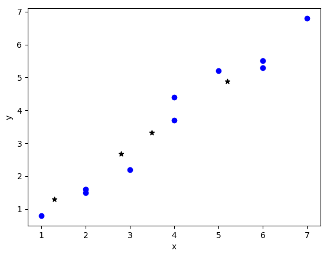

The model we trained correctly predicts new samples (depicted by the
stars).

Let's try it on another dataset, the diabetes dataset from scikit-learn:

```
from sklearn import datasets
diabetes = datasets.load_diabetes()
print(diabetes.data.shape)
(442, 10)
num_test = 30 
X_train = diabetes.data[:-num_test, :]
y_train = diabetes.target[:-num_test]
```

Train a linear regression model by `5000` iterations, at a
learning rate of `1` based on intercept-included weights (the
cost is displayed every 500 iterations):

```
weights = train_linear_regression(X_train, y_train, 
              max_iter=5000, learning_rate=1, fit_intercept=True)
2960.1229915
1539.55080927
1487.02495658
1480.27644342
1479.01567047
1478.57496091
1478.29639883
1478.06282572
1477.84756968
1477.64304737
X_test = diabetes.data[-num_test:, :]
y_test = diabetes.target[-num_test:]
predictions = predict(X_test, weights)
print(predictions)
[ 232.22305668 123.87481969 166.12805033 170.23901231 
  228.12868839 154.95746522 101.09058779 87.33631249 
  143.68332296 190.29353122 198.00676871 149.63039042 
   169.56066651 109.01983998 161.98477191 133.00870377 
   260.1831988 101.52551082 115.76677836 120.7338523
   219.62602446 62.21227353 136.29989073 122.27908721 
   55.14492975 191.50339388 105.685612 126.25915035 
   208.99755875 47.66517424]
print(y_test)
[ 261. 113. 131. 174. 257. 55. 84. 42. 146. 212. 233. 
  91. 111. 152. 120. 67. 310. 94. 183. 66. 173. 72. 
  49. 64. 48. 178. 104. 132. 220. 57.]
```

The estimate is pretty close to the ground truth.

So far, we have been using gradient descent in weight optimization but,
the same as logistic regression, linear regression is also open to
**stochastic gradient descent** (**SGD**). To realize it, we can simply
replace the `update_weights_gd` function with `update_weights_sgd`.

We can also directly use the SGD-based regression
algorithm, `SGDRegressor`, from scikit-learn:

```
from sklearn.linear_model import SGDRegressor
regressor = SGDRegressor(loss='squared_loss', penalty='l2',
  alpha=0.0001, learning_rate='constant', eta0=0.01, n_iter=1000)
```

 

 

Here `'squared_loss'` for the `loss` parameter
indicates the cost function is MSE; `penalty` is the
regularization term and it can be `None`, `l1`,
or`l2`, which is similar to `SGDClassifier` in order to reduce
overfitting; `n_iter` is the number of iterations; and the
remaining two parameters mean the learning rate is `0.01` and
unchanged during the course of training. Train the model and output
prediction on the testing set as follows:

```
regressor.fit(X_train, y_train)
predictions = regressor.predict(X_test)
print(predictions)
[ 231.03333725 124.94418254 168.20510142 170.7056729 
  226.52019503 154.85011364 103.82492496 89.376184 
  145.69862538 190.89270871 197.0996725 151.46200981 
  170.12673917 108.50103463 164.35815989 134.10002755 
  259.29203744 103.09764563 117.6254098 122.24330421
  219.0996765 65.40121381 137.46448687 123.25363156 
  57.34965405 191.0600674 109.21594994 128.29546226 
  207.09606669 51.10475455]
```

Of course, we won't miss its implementation in TensorFlow. First, we
import TensorFlow and specify the parameters of the model, including
`1000` iterations during the training process and
a `0.5` learning rate:

```
import tensorflow as tf
n_features = int(X_train.shape[1])
learning_rate = 0.5
n_iter = 1000
```

Then, we define `placeholder` and `Variable`,
including the weights and bias of the model as follows:

```
x = tf.placeholder(tf.float32, shape=[None, n_features])
y = tf.placeholder(tf.float32, shape=[None])
W = tf.Variable(tf.ones([n_features, 1]))
b = tf.Variable(tf.zeros([1]))
```

Construct the model by computing the prediction as follows:

```
pred = tf.add(tf.matmul(x, W), b)[:, 0]
```

After assembling the graph for the model, we define the loss function,
the MSE, and a gradient descent optimizer that searches for the best
coefficients by minimizing the loss:

```
cost = tf.losses.mean_squared_error(labels=y, predictions=pred)
optimizer =
    tf.train.GradientDescentOptimizer(learning_rate).minimize(cost)
```

Now we can initialize the variables and start a TensorFlow session:

```
init_vars = tf.initialize_all_variables()
sess = tf.Session()
sess.run(init_vars)
```

Finally, we start the training process and print out loss after every
100 iterations as follows:

```
for i in range(1, n_iter+1):
    _, c = sess.run([optimizer, cost], 
                       feed_dict={x: X_train, y: y_train})
    if i % 100 == 0:
        print('Iteration %i, training loss: %f' % (i, c))
Iteration 100, training loss: 3984.505859
Iteration 200, training loss: 3465.406494
Iteration 300, training loss: 3258.358398
Iteration 400, training loss: 3147.374023
Iteration 500, training loss: 3080.261475
Iteration 600, training loss: 3037.964111
Iteration 700, training loss: 3010.845947
Iteration 800, training loss: 2993.270752
Iteration 900, training loss: 2981.771240
Iteration 1000, training loss: 2974.175049
Apply the trained model on the testing set:
predictions = sess.run(pred, feed_dict={x: X_test})
print(predictions)
[230.2237 124.89581 170.9626 170.43433 224.11993 153.07018
 105.98048 90.66377 149.22597 191.74197 194.04721 153.0992
 170.85931 104.24113 169.2757 135.45589 260.55713 102.38674
 118.585556 123.41965 219.20732 67.479996 138.3001 122.41016
  57.012245 189.88608 114.48331 131.13383 202.2418 53.08335 ]
```

Estimating with decision tree regression 
----------------------------------------

* * * * *

After linear regression, the next regression algorithm we'll be learning
is **decision tree regression**, which is also called **regression
tree**. It is easy to understand regression trees by comparing it with
its sibling, the classification  trees, which you are familiar with. 

 

 

### Transitioning from classification trees to regression trees

In classification, a decision tree is constructed by recursive binary
splitting and growing each node into left and right children. In each
partition, it greedily searches for the most significant combination of
feature and its value as the optimal splitting point. The quality of
separation is measured by the weighted purity of labels of two resulting
children, specifically via metric **Gini Impurity** or **Information
Gain**. In regression, the tree construction process is almost identical
to the classification one, with only two differences due to the fact
that the target becomes continuous:

-   The quality of splitting point is now measured by the
    **weighted****mean squared error** (**MSE**) of two children; the
    MSE of a child is equivalent to the variance of all target values,
    and the smaller the weighted MSE, the better the split.
-   The **average** value of targets in a terminal node becomes the leaf
    value, instead of the majority of labels in the classification tree.

To make sure we understand regression tree, let's work on a small
example of house price estimation:

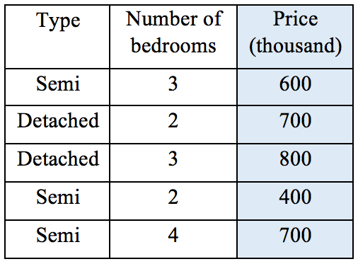

We first define the MSE and weighted MSE computation functions as
they'll be used in our calculation:

```
def mse(targets):
    # When the set is empty
    if targets.size == 0:
        return 0
    return np.var(targets)
def weighted_mse(groups):
    """ Calculate weighted MSE of children after a split
    Args:
        groups (list of children, and a child consists a list 
                    of targets)
    Returns:
        float, weighted impurity
    """
    total = sum(len(group) for group in groups)
    weighted_sum = 0.0
    for group in groups:
        weighted_sum += len(group) / float(total) * mse(group)
    return weighted_sum
```

Test things out by executing the following commands:

```
print('{0:.4f}'.format(mse(np.array([1, 2, 3]))))
0.6667
print('{0:.4f}'.format(weighted_mse([np.array([1, 2, 3]), 
                                         np.array([1, 2])])))
0.5000
```

To build the house price regression tree, we first exhaust all possible
pairs of feature and value and compute the corresponding MSE:

MSE(type, *semi*) = `weighted_mse`([[600, 400, 700], [700,
800]]) = 10333 MSE(bedroom, *2*) = `weighted_mse`([[700, 400],
[600, 800, 700]]) = 13000 MSE(bedroom, *3*) =
`weighted_mse`([[600, 800], [700, 400, 700]]) = 16000
MSE(bedroom, *4*) = `weighted_mse`([[700], [600, 700, 800,
400]]) = 17500

The lowest MSE is achieved with the `type, semi` pair, and the
root node is then formed by such a splitting point:

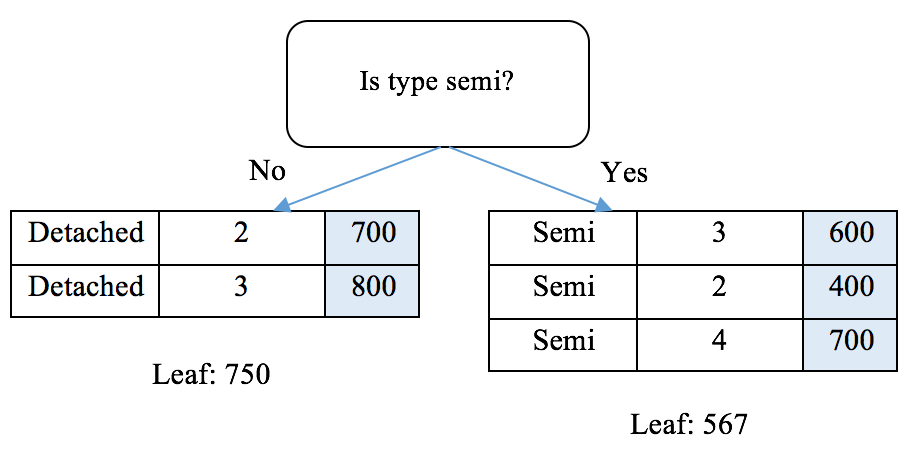

If we are satisfied with a one level deep regression tree, we can stop
here by assigning both branches as leaf nodes with value as the average
of targets of the samples included. Alternatively, we can go further
down the road constructing the second level from the right branch (the
left branch can't be further split):

MSE(bedroom, *2*) = weighted\_mse([[], [600, 400, 700]]) = 15556
MSE(bedroom, *3*) = weighted\_mse([[400], [600, 700]]) = 1667
MSE(bedroom, *4*) = weighted\_mse([[400, 600], [700]]) = 6667

With the second splitting point specified by the `bedroom, 3`
pair with the least MSE, our tree becomes as shown in the following
diagram:

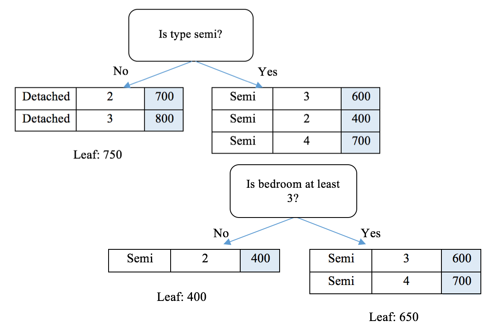

We can finish up the tree by assigning average values to both leaf
nodes.

### Implementing decision tree regression

It's now time for coding after we're clear about the regression tree
construction process.

The node splitting utility function we define as follow is identical to
what we had in *Predicting Online Ads Click-through with Tree-Based Algorithms*, which
separates samples in a node into left and right branches based on a pair
of feature and value:

```
def split_node(X, y, index, value):
    """ Split data set X, y based on a feature and a value
    Args:
        X, y (numpy.ndarray, data set)
        index (int, index of the feature used for splitting)
        value (value of the feature used for splitting)
    Returns:
        list, list: left and right child, a child is in the 
                        format of [X, y]
    """
    x_index = X[:, index]
    # if this feature is numerical
    if type(X[0, index]) in [int, float]:
        mask = x_index >= value
    # if this feature is categorical
    else:
    mask = x_index == value
    # split into left and right child
    left = [X[~mask, :], y[~mask]]
    right = [X[mask, :], y[mask]]
    return left, right
```

Next, we define the greedy search function trying out all possible
splits and returning the one with the least weighted MSE:

```
def get_best_split(X, y):
    """ Obtain the best splitting point and resulting children 
            for the data set X, y
    Args:
        X, y (numpy.ndarray, data set)
        criterion (gini or entropy)
    Returns:
        dict {index: index of the feature, value: feature 
                  value, children: left and right children}
    """
    best_index, best_value, best_score, children = 
                                       None, None, 1e10, None
    for index in range(len(X[0])):
        for value in np.sort(np.unique(X[:, index])):
            groups = split_node(X, y, index, value)
            impurity = weighted_mse([groups[0][1], 
                                         groups[1][1]])
            if impurity < best_score:
                best_index, best_value, best_score, children = 
                                    index, value, impurity, groups
    return {'index': best_index, 'value': best_value, 
                                           'children': children}
```

 

 

The preceding selection and splitting process occurs in a recursive
manner on each of subsequent children. When a stopping criterion is met,
the process at a node stops, and the mean value of the
sample `targets` will be assigned to this terminal node:

```
def get_leaf(targets):
    # Obtain the leaf as the mean of the targets
    return np.mean(targets)
```

And finally, the recursive function split that links all of these
preceding together by checking whether any of stopping criteria is met
and assigning the leaf node if so or proceeding with further separation
otherwise:

```
def split(node, max_depth, min_size, depth):
    """ Split children of a node to construct new nodes or 
            assign them terminals
    Args:
        node (dict, with children info)
        max_depth (int, maximal depth of the tree)
        min_size (int, minimal samples required to further 
                      split a child)
        depth (int, current depth of the node)
    """
    left, right = node['children']
    del (node['children'])
    if left[1].size == 0:
        node['right'] = get_leaf(right[1])
        return
    if right[1].size == 0:
        node['left'] = get_leaf(left[1])
        return
    # Check if the current depth exceeds the maximal depth
    if depth >= max_depth:
        node['left'], node['right'] = 
                          get_leaf(left[1]), get_leaf(right[1])
        return
    # Check if the left child has enough samples
    if left[1].size <= min_size:
        node['left'] = get_leaf(left[1])
    else:
        # It has enough samples, we further split it
        result = get_best_split(left[0], left[1])
        result_left, result_right = result['children']
        if result_left[1].size == 0:
            node['left'] = get_leaf(result_right[1])
        elif result_right[1].size == 0:
            node['left'] = get_leaf(result_left[1])
        else:
            node['left'] = result
            split(node['left'], max_depth, min_size, 
                                                  depth + 1)
    # Check if the right child has enough samples
    if right[1].size <= min_size:
        node['right'] = get_leaf(right[1])
    else:
        # It has enough samples, we further split it
        result = get_best_split(right[0], right[1])
        result_left, result_right = result['children']
        if result_left[1].size == 0:
            node['right'] = get_leaf(result_right[1])
        elif result_right[1].size == 0:
            node['right'] = get_leaf(result_left[1])
        else:
            node['right'] = result
            split(node['right'], max_depth, min_size, 
                                                   depth + 1)
```

Finally, the entry point of the regression tree construction is as
follows:

```
def train_tree(X_train, y_train, max_depth, min_size):
    """ Construction of a tree starts here
    Args:
        X_train, y_train (list, list, training data)
        max_depth (int, maximal depth of the tree)
        min_size (int, minimal samples required to further 
                      split a child)
    """
    root = get_best_split(X_train, y_train)
    split(root, max_depth, min_size, 1)
    return root
```

Now, let's test it with the preceding hand-calculated example:

```
X_train = np.array([['semi', 3],
                    ['detached', 2],
                    ['detached', 3],
                    ['semi', 2],
                    ['semi', 4]], dtype=object)
y_train = np.array([600, 700, 800, 400, 700])
tree = train_tree(X_train, y_train, 2, 2)
```

To verify the trained tree is identical to what we constructed by hand,
we write a function displaying the tree:

```
CONDITION = {'numerical': {'yes': '>=', 'no': '<'},
             'categorical': {'yes': 'is', 'no': 'is not'}}
def visualize_tree(node, depth=0):
    if isinstance(node, dict):
        if type(node['value']) in [int, float]:
            condition = CONDITION['numerical']
        else:
            condition = CONDITION['categorical']
        print('{}|- X{} {} {}'.format(depth * ' ', 
                  node['index'] + 1, condition['no'], node['value']))
        if 'left' in node:
            visualize_tree(node['left'], depth + 1)
        print('{}|- X{} {} {}'.format(depth * ' ', 
                 node['index'] + 1, condition['yes'], node['value']))
        if 'right' in node:
            visualize_tree(node['right'], depth + 1)
    else:
        print('{}[{}]'.format(depth * ' ', node))

visualize_tree(tree)
|- X1 is not detached
  |- X2 < 3
    [400.0]
  |- X2 >= 3
    [650.0]
|- X1 is detached
  [750.0]
```

Now that we have a better understanding of regression tree by realizing
it from scratch, we can directly use the
`DecisionTreeRegressor`package from `scikit-learn`.
Apply it on an example of predicting Boston house prices as follows:

```
boston = datasets.load_boston()
num_test = 10 # the last 10 samples as testing set
X_train = boston.data[:-num_test, :]
y_train = boston.target[:-num_test]
X_test = boston.data[-num_test:, :]
y_test = boston.target[-num_test:]
from sklearn.tree import DecisionTreeRegressor
regressor = DecisionTreeRegressor(max_depth=10, 
                                      min_samples_split=3)
regressor.fit(X_train, y_train)
predictions = regressor.predict(X_test)
print(predictions)
[12.7 20.9 20.9 20.2 20.9 30.8
 20.73076923 24.3 28.2 20.73076923]
```

 

 

 

 

Compare predictions with the ground truth as follows:

```
print(y_test)
[ 19.7  18.3 21.2  17.5 16.8 22.4  20.6 23.9 22. 11.9]
```

### Implementing regression forest

As seen in Online Ads Click-through with Tree-Based Algorithms*, we introduced
**random forest** as an ensemble learning method by combining multiple
decision trees that are separately trained and randomly subsampling
training features in each node of a tree. In classification, a random
forest makes a final decision by majority vote of all tree decisions.
Applied to regression, a random forest regression model (also called
**regression forest**) assigns the average of regression results from
all decision trees to the final decision.

Here, we'll use the regression forest
package, `RandomForestRegressor`, from scikit-learn and deploy
it to our Boston house price prediction example:

```
from sklearn.ensemble import RandomForestRegressor
regressor = RandomForestRegressor(n_estimators=100, 
                           max_depth=10, min_samples_split=3)
regressor.fit(X_train, y_train)
predictions = regressor.predict(X_test)
print(predictions)
[ 19.34404351 20.93928947 21.66535354 19.99581433 20.873871
  25.52030056 21.33196685 28.34961905 27.54088571 21.32508585]
```

As a bonus section, we implement regression forest with TensorFlow. It
is actually quite similar to the implementation of random forest in *Predicting
Online Ads Click-through with Tree-Based Algorithms*. First, we import
the necessary modules as follows:

```
import tensorflow as tf
from tensorflow.contrib.tensor_forest.python import tensor_forest
from tensorflow.python.ops import resources
```

And we specify the parameters of the model, including `20`
iterations during training process, `10` trees in total, and
`30000` maximal splitting nodes:

```
n_iter = 20
n_features = int(X_train.shape[1])
n_trees = 10
max_nodes = 30000
```

 

 

Next, we create placeholders and build the TensorFlow graph:

```
x = tf.placeholder(tf.float32, shape=[None, n_features])
y = tf.placeholder(tf.float32, shape=[None])
hparams = tensor_forest.ForestHParams(num_classes=1,
                     regression=True, num_features=n_features, 
                     num_trees=n_trees, max_nodes=max_nodes, 
                     split_after_samples=30).fill()
forest_graph = tensor_forest.RandomForestGraphs(hparams)
```

Note we need to set `num_classes` to `1` and
`regression` to `True` as the forest is used for
regression.

After defining the graph for the regression forest model, we specify the
training graph and loss and the MSE:

```
train_op = forest_graph.training_graph(x, y)
loss_op = forest_graph.training_loss(x, y)
infer_op, _, _ = forest_graph.inference_graph(x)
cost = tf.losses.mean_squared_error(labels=y, predictions=infer_op[:, 0])
```

We then initialize the variables and start a TensorFlow session:

```
init_vars = tf.group(tf.global_variables_initializer(), 
           tf.local_variables_initializer(), 
        resources.initialize_resources(resources.shared_resources())) 
sess = tf.Session()
sess.run(init_vars)
```

Finally, we start the training process and conduct a performance
check-up for each iteration:

```
for i in range(1, n_iter + 1):
    _, c = sess.run([train_op, cost], feed_dict={x: X_train, y: y_train})
    print('Iteration %i, training loss: %f' % (i, c))
Iteration 1, training loss: 596.255005
Iteration 2, training loss: 51.917843
Iteration 3, training loss: 35.395966
Iteration 4, training loss: 28.848433
Iteration 5, training loss: 22.499760
Iteration 6, training loss: 18.685938
Iteration 7, training loss: 16.956488
Iteration 8, training loss: 14.832330
Iteration 9, training loss: 13.048509
Iteration 10, training loss: 12.084823
Iteration 11, training loss: 11.044588
Iteration 12, training loss: 10.433226
Iteration 13, training loss: 9.818905
Iteration 14, training loss: 8.900123
Iteration 15, training loss: 7.952868
Iteration 16, training loss: 7.417612
Iteration 17, training loss: 6.849032
Iteration 18, training loss: 6.213216
Iteration 19, training loss: 5.869020
Iteration 20, training loss: 5.467315
```

After 20 iterations, we apply the trained model on the testing set as
follows:

```
pred = sess.run(infer_op, feed_dict={x: X_test})[:, 0]
print(pred)
[15.446515 20.10433 21.38516 19.37373 19.593092 21.932205 22.259298 24.194878 24.095112 22.541391]
```

Estimating with support vector regression 
-----------------------------------------

* * * * *

The third regression algorithm that we want to explore is **support
vector regression** (**SVR**). As the name implies, SVR is part of the
support vector family and sibling of the **support vector machine**
(**SVM**)** **for classification (or we can just call it **SVC**) we
learned in *Classifying Newsgroup Topic with Support Vector Machine*.

To recap, SVC seeks an optimal hyperplane that best segregates
observations from different classes. Suppose a hyperplane is determined
by a slope vector *w* and intercept *b*, the optimal hyperplane is
picked so that the distance (which can be expressed as

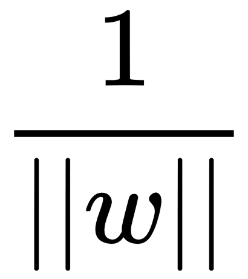

) from its nearest points in each of segregated spaces to the hyperplane
itself is maximized. Such optimal *w* and *b* can be learned and solved
by the following optimization problem:

-   Minimizing ‖*w*‖
-   Subject to *wx^(i)^+b≥*1 *if y^(i)^*=1 and *wx^(i)^+b≤*1 *if
    y^(i)^*=-1, given a training set of (*x^(1)^,y^(1)^*),
    (*x^(2)^,y^(2)^*),… (*x^(i)^,y^(i)^*)…, (*x^(m)^,y^(m)^*).

In SVR, our goal is to find a hyperplane (defined by a slope vector *w*
and intercept *b*) so that two hyperplanes, *wx+b=-ε* and *wx+b=ε,* that
are a distance away from itself covers most training data. In other
words, most of data points are bounded in the ε bands of the optimal
hyperplane. And at the same time, the optimal hyperplane is as flat as
possible, which means ‖*w*‖ is as small as possible, as shown in the
following diagram:

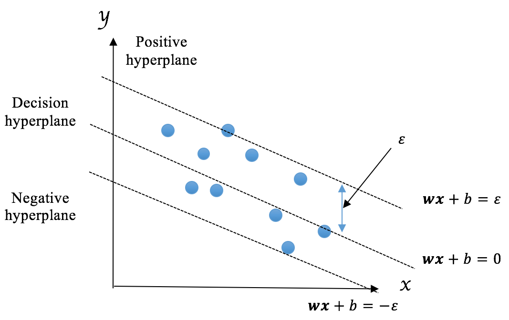

This translates into deriving the optimal *w* and *b* by solving the
following optimization problem:

-   Minimizing ‖*w*‖
-   Subject to *|y^(i)^-(wx^(i)^+b)| ≤ ε* , given a training set of
    (*x^(1)^,y^(1)^*), (*x^(2)^,y^(2)^*),… (*x^(i)^,y^(i)^*)…,
    (*x^(m)^,y^(m)^*)

### Implementing SVR

Again to solve the preceding optimization problem, we need to resort to
quadratic programming techniques, which are beyond the scope of our
learning journey. Therefore, we won't cover the computation methods in
detail and will implement the regression algorithm using
the `SVR` package from scikit-learn.

Important techniques of SVC, such as penalty as a trade off between bias
and variance, kernel (RBF, for example) handling linear non-separation,
are transferable to SVR. The `SVR` package from scikit-learn
also supports these techniques.

 

Let's solve the previous house price prediction problem with
`SVR` this time:

```
from sklearn.svm import SVR
regressor = SVR(C=0.1, epsilon=0.02, kernel='linear')
regressor.fit(X_train, y_train)
predictions = regressor.predict(X_test)
print(predictions)
[ 14.59908201 19.32323741 21.16739294 18.53822876 20.1960847
  23.74076575 22.65713954 26.98366295 25.75795682 22.69805145]
```

Estimating with neural networks 
-------------------------------

* * * * *

Here comes our fourth model, **artificial neural networks** (**ANNs**)
or more often we just call them **neural networks**. The neural network
is probably the most frequently mentioned model in the media. It has
been (falsely) considered equivalent to machine learning or artificial
intelligence by the general public. Regardless, it is one of the most
important machine learning models and has been rapidly evolving along
with the revolution of **deep learning** (**DL**). Let's first
understand how neural networks works.

### Demystifying neural networks

A simple neural network is composed of three layers, the
****`Input layer`****, ****`Hidden layer`****, and
****`Output layer`**** as shown in the following diagram:

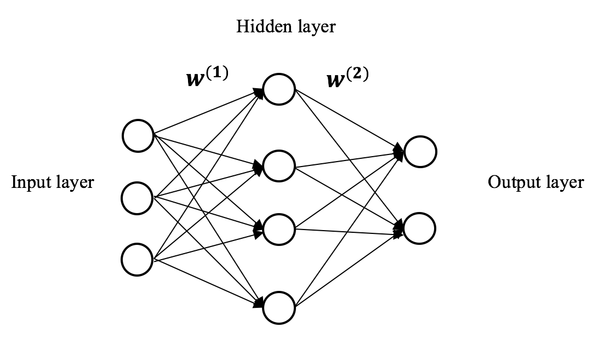

A layer is a conceptual collection of **nodes** (also called **units**),
which simulate neurons in a biological brain. The input layer represents
the input features ***x*** and each node is a predictive feature *x*.
The output layer represents the target variable(s). In binary
classification, the output layer contains only one node, whose value
is the probability of the positive class. In multiclass classification,
the output layer consists of *n* nodes where *n* is the number of
possible classes and the value of each node is the probability of
predicting that class. In regression, the output layer contains only one
node the value of which is the prediction result. The hidden layer can
be considered a composition of latent information extracted from the
previous layer. There can be more than one hidden layer. Learning with a
neural network with two or more hidden layers is called DL. We will
focus on one hidden layer to begin with.

Two adjacent layers are connected by conceptual edges, sort of like the
synapses in a biological brain, which transmit signal from one neuron in
a layer to another neuron in the next layer. The **edges** are
parameterized by the weights ***W*** of the model. For example,
*W^(1) ^*in the preceding diagram connects the input and hidden layers
and *W^(2)^* connects the hidden and output layers.

In a standard neural network, data are conveyed only from the input
layer to the output layer, through hidden layer(s). Hence, this kind of
network is called **feed-forward** neural network. Basically, logistic
regression is a feed-forward neural network with no hidden layer where
the output layer connects directly with the input. Neural networks with
one or more hidden layer between the input and output layer should be
able to learn more about the the underneath relationship between the
input data and target.

Suppose input ***x*** is of *n* dimension and the hidden layer is
composed of *H* hidden units, the weight matrix *W^(1)^* connecting the
input and hidden layer is of size *n* by *H* where each column ~~

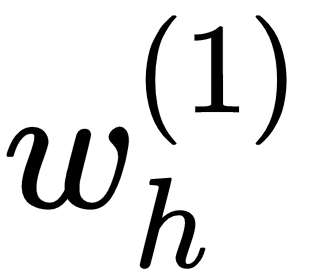

 represents the coefficients associating the input with the *h*-th
hidden unit. The output (also called **activation**) of the hidden layer
can be expressed mathematically as follows:

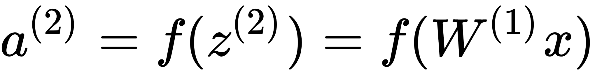

Here *f(z)* is an **activation function**. As its name implies, the
activation function checks how activated each neuron is simulating the
way our brains work. Typical activation functions include the logistic
function (more often called the **sigmoid** function in neural networks)
and the **tanh** function, which is considered a re-scaled version of
logistic function, as well as **ReLU** (short for **Rectified Linear
Unit**), which is often used in DL:

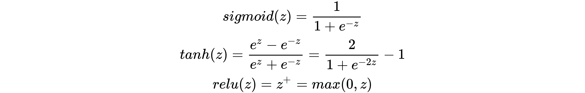

We plot the following three activation functions as follows:

-   The **logistic** (**sigmoid**) function plot is as follows: 

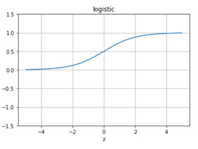

-   The **tanh **function plot is as follows:

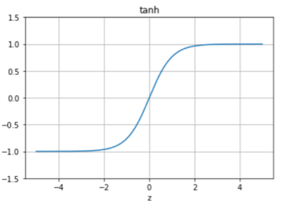

-   The **relu **function plot is as follows:

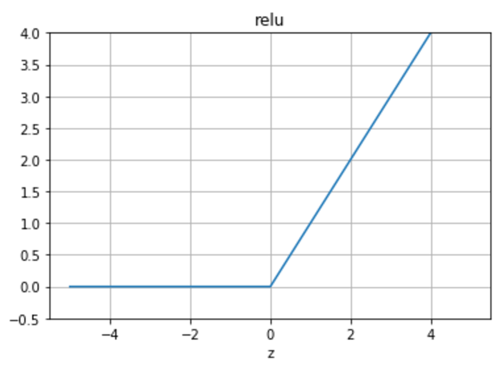

As for the output layer, let's assume there's one output unit
(regression or binary classification) and the weight matrix *W^(2)^*
connecting the hidden layer to the output layer is of the size *H* by
*1*. In regression, the output can be expressed mathematically as
follows (for consistency, we here denote it as *a^(3)^* instead of *y*):

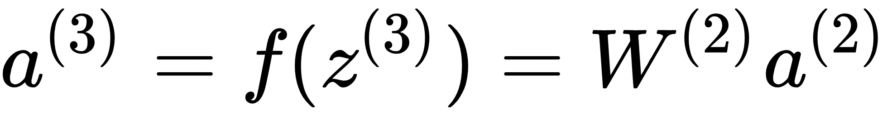

So, how can we obtain the optimal weights *W =* {*W^(1)^, W^(2)^*} of
the model? Similar to logistic regression, we learn all weights using
gradient descent with the goal of minimizing the MSE cost *J(**W**)*.
The difference is that the gradients Δ*W* are computed through
**backpropagation**. In a single-layer network, the detailed steps of
backpropagation are as follows:

1.  We travel through the network from the input to output and compute
    the output values *a^(2)^* of the hidden layer as well as the output
    layer *a^(3)^*. This is the feedforward step.
2.  For the last layer, we calculate the derivative of the cost function
    with regards to the input to the output layer:

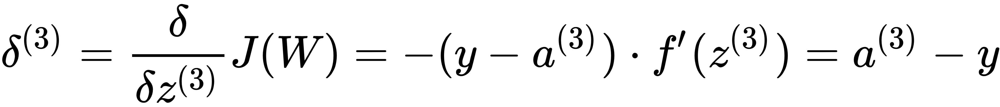

3.  For the hidden layer, we compute the derivative of the cost function
    with regards to the input to the hidden layer:

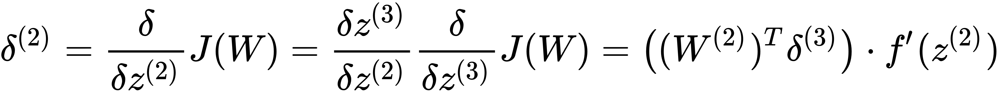

4.  We compute the gradients by applying the **chain rule**:

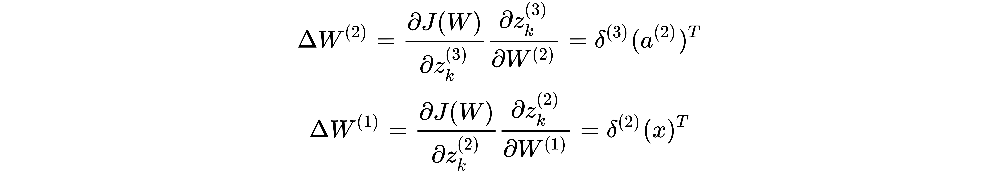

5.  We update the weights with the computed gradients and learning rate
    ***a***:

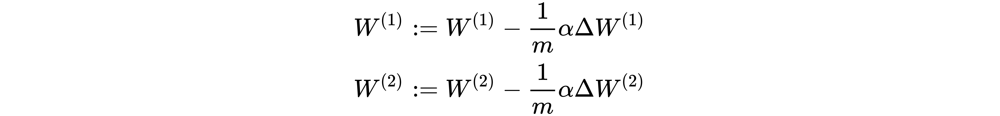

6.  We repeatedly update all weights by taking these steps with the
    latest weights until the cost function converges or it goes through
    enough iterations.

This might not be easy to digest at first glance, so let's implement it
from scratch, which will help you to understand neural networks better.

### Implementing neural networks

We herein use sigmoid as the activation function as an example. We first
need to define the `sigmoid` function and its derivative
function:

```
def sigmoid(z):
    return 1.0 / (1 + np.exp(-z))
def sigmoid_derivative(z):
    return sigmoid(z) * (1.0 - sigmoid(z))
```

You can derive the derivative yourselves if you want to verify it.

We then define the training function, which takes in the training
dataset, the number of units in the hidden layer (we only use one hidden
layer as an example), and the number of iterations:

```
def train(X, y, n_hidden, learning_rate, n_iter):
    m, n_input = X.shape
    W1 = np.random.randn(n_input, n_hidden)
    b1 = np.zeros((1, n_hidden))
    W2 = np.random.randn(n_hidden, 1)
    b2 = np.zeros((1, 1))
    for i in range(1, n_iter+1):
        Z2 = np.matmul(X, W1) + b1
        A2 = sigmoid(Z2)
        Z3 = np.matmul(A2, W2) + b2
        A3 = Z3
        dZ3 = A3 - y
        dW2 = np.matmul(A2.T, dZ3)
        db2 = np.sum(dZ3, axis=0, keepdims=True)
        dZ2 = np.matmul(dZ3, W2.T) * sigmoid_derivative(Z2)
        dW1 = np.matmul(X.T, dZ2)
        db1 = np.sum(dZ2, axis=0)
        W2 = W2 - learning_rate * dW2 / m
        b2 = b2 - learning_rate * db2 / m
        W1 = W1 - learning_rate * dW1 / m
        b1 = b1 - learning_rate * db1 / m
        if i % 100 == 0:
            cost = np.mean((y - A3) ** 2)
            print('Iteration %i, training loss: %f' % (i, cost))
    model = {'W1': W1, 'b1': b1, 'W2': W2, 'b2': b2}
    return model
```

Note besides weights **`W`**, we also employ bias
**`b`**. Before training, we first randomly initialize weights
and biases. In each iteration, we feed all layers of the network with
the latest weights and biases, then calculate the gradients using the
backpropagation algorithm, and finally update the weights and biases
with the resulting gradients. For training performance inspection, we
print out the loss and the MSE for every `100` iterations.

Again, we use Boston house prices as the toy dataset. As a reminder,
data normalization is usually recommended whenever gradient descent is
used. Hence, we standardize the input data by removing the mean and
scaling to unit variance:

```
boston = datasets.load_boston()
num_test = 10 # the last 10 samples as testing set
from sklearn import preprocessing
scaler = preprocessing.StandardScaler()
X_train = boston.data[:-num_test, :]
X_train = scaler.fit_transform(X_train)
y_train = boston.target[:-num_test].reshape(-1, 1)
X_test = boston.data[-num_test:, :]
X_test = scaler.transform(X_test)
y_test = boston.target[-num_test:]
```

With the scaled dataset, we can now train a one-layer neural network
with `20` hidden units, a `0.1` learning rate, and
`2000` iterations:

```
n_hidden = 20
learning_rate = 0.1
n_iter = 2000
model = train(X_train, y_train, n_hidden, learning_rate, n_iter)
Iteration 100, training loss: 13.500649
Iteration 200, training loss: 9.721267
Iteration 300, training loss: 8.309366
Iteration 400, training loss: 7.417523
Iteration 500, training loss: 6.720618
Iteration 600, training loss: 6.172355
Iteration 700, training loss: 5.748484
Iteration 800, training loss: 5.397459
Iteration 900, training loss: 5.069072
Iteration 1000, training loss: 4.787303
Iteration 1100, training loss: 4.544623
Iteration 1200, training loss: 4.330923
Iteration 1300, training loss: 4.141120
Iteration 1400, training loss: 3.970357
Iteration 1500, training loss: 3.814482
Iteration 1600, training loss: 3.673037
Iteration 1700, training loss: 3.547397
Iteration 1800, training loss: 3.437391
Iteration 1900, training loss: 3.341110
Iteration 2000, training loss: 3.255750
```

Then, we define a `prediction` function, which takes in a
model and produces regression results:

```
def predict(x, model):
    W1 = model['W1']
    b1 = model['b1']
    W2 = model['W2']
    b2 = model['b2']
    A2 = sigmoid(np.matmul(x, W1) + b1)
    A3 = np.matmul(A2, W2) + b2
    return A3
```

Finally, we apply the trained model on the testing set:

```
predictions = predict(X_test, model)
print(predictions)
[[16.28103034]
 [19.98591039]
 [22.17811179]
 [19.37515137]
 [20.5675095 ]
 [24.90457042]
 [22.92777643]
 [26.03651277]
 [25.35493394]
 [23.38112184]]
print(y_test)
[19.7 18.3 21.2 17.5 16.8 22.4 20.6 23.9 22. 11.9]
```

 

 

 

 

 

 

After successfully building a neural network model from scratch, we move
on with the implementation with `scikit-learn`. We utilize
the `MLPRegressor` class (**MLP** stands for **multi-layer
perceptron**, a nickname of neural networks):

```
from sklearn.neural_network import MLPRegressor
nn_scikit = MLPRegressor(hidden_layer_sizes=(20, 8), 
                        activation='logistic', solver='lbfgs',
                        learning_rate_init=0.1, random_state=42, 
                        max_iter=2000)
```

The `hidden_layer_sizes`hyperparameter represents the
number(s) of hidden neurons. In our previous example, the network
contains two hidden layers with `20` and `8` nodes
respectively.

We fit the neural network model on the training set and predict on the
testing data:

```
nn_scikit.fit(X_train, y_train)
predictions = nn_scikit.predict(X_test)
print(predictions)
[14.73064216 19.77077071 19.77422245 18.95256283 19.73320899 24.15010593 19.78909311 28.36477319 24.17612634 19.80954273]
```

Neural networks are often implemented with TensorFlow, which is one of
the most popular deep learning (multilayer neural network) frameworks.

First, we specify parameters of the model, including two hidden layers
with `20` and `8` nodes respectively,
`2000` iterations, and a `0.1` learning rate:

```
n_features = int(X_train.shape[1])
n_hidden_1 = 20
n_hidden_2 = 8
learning_rate = 0.1
n_iter = 2000
```

Then, we define placeholders and construct the network from input to
hidden layers to output:

```
x = tf.placeholder(tf.float32, shape=[None, n_features])
y = tf.placeholder(tf.float32, shape=[None, 1])
layer_1 = tf.nn.sigmoid(tf.layers.dense(x, n_hidden_1))
layer_2 = tf.nn.sigmoid(tf.layers.dense(layer_1, n_hidden_2))
pred = tf.layers.dense(layer_2, 1)
```

 

 

 

 

 

 

After assembling the components for the model, we define the loss
function, the MSE, and a gradient descent optimizer that searches for
the best coefficients by minimizing the loss:

```
cost = tf.losses.mean_squared_error(labels=y, predictions=pred)
optimizer = 
 tf.train.GradientDescentOptimizer(learning_rate).minimize(cost)
```

Now we can initialize the variables and start a TensorFlow session:

```
init_vars = tf.initialize_all_variables()
sess = tf.Session()
sess.run(init_vars)
```

Finally, we start the training process and print out the loss after
every 100 iterations:

```
for i in range(1, n_iter+1):
    _, c = sess.run([optimizer, cost], 
                       feed_dict={x: X_train, y: y_train})
    if i % 100 == 0:
        print('Iteration %i, training loss: %f' % (i, c))
Iteration 100, training loss: 12.995015
Iteration 200, training loss: 8.587905
Iteration 300, training loss: 6.319847
Iteration 400, training loss: 5.524787
Iteration 500, training loss: 5.200356
Iteration 600, training loss: 4.217351
Iteration 700, training loss: 4.070641
Iteration 800, training loss: 3.825407
Iteration 900, training loss: 3.301410
Iteration 1000, training loss: 3.124229
Iteration 1100, training loss: 3.220546
Iteration 1200, training loss: 2.895406
Iteration 1300, training loss: 2.680367
Iteration 1400, training loss: 2.504926
Iteration 1500, training loss: 2.362953
Iteration 1600, training loss: 2.257992
Iteration 1700, training loss: 2.154428
Iteration 1800, training loss: 2.170816
Iteration 1900, training loss: 2.052284
Iteration 2000, training loss: 1.971042
```

We apply the trained model on the testing set:

```
predictions = sess.run(pred, feed_dict={x: X_test})
print(predictions)
[[16.431433]
 [17.861343]
 [20.286907]
 [17.6935 ]
 [18.380125]
 [22.405527]
 [19.216259]
 [24.333553]
 [23.02146 ]
 [18.86538 ]]
```

A bonus section is its implementation in Keras
([https://keras.io/](https://keras.io/)), another popular package for
neural networks. Keras is a high-level API written on top of TensorFlow
and two other deep learning frameworks. It was developed for fast
prototyping and experimenting neural network models. We can install
Keras using PyPI:

```
pip install keras
```

We import the necessary modules after installation as follows:

```
from keras import models
from keras import layers
```

Then, we initialize a `Sequential` model of Keras:

```
model = models.Sequential()
```

We add layer by layer, from the first hidden layer (20 units), to the
second hidden layer (8 units), then the output layer:

```
model.add(layers.Dense(n_hidden_1, activation="sigmoid", 
                          input_shape=(n_features, )))
model.add(layers.Dense(n_hidden_2, activation="sigmoid"))
model.add(layers.Dense(1))
```

It's quite similar to building **LEGO**. We also need an optimizer,
which we define as follows with a `0.01` learning rate:

```
from keras import optimizers
sgd = optimizers.SGD(lr=0.01)
```

Now we can compile the model by specifying the loss function and
optimizer:

```
model.compile(loss='mean_squared_error', optimizer=sgd)
```

Finally, we fit the model on the training set, with `100`
iterations, and validate the performance on the testing set:

```
model.fit(
    X_train, y_train,
    epochs=100,
    validation_data=(X_test, y_test)
)
Train on 496 samples, validate on 10 samples
Epoch 1/100
496/496 [==============================] - 0s 356us/step - loss: 255.7313 - val_loss: 10.7765
Epoch 2/100
496/496 [==============================] - 0s 24us/step - loss: 83.0557 - val_loss: 21.5385
Epoch 3/100
496/496 [==============================] - 0s 25us/step - loss: 70.7806 - val_loss: 22.5854
Epoch 4/100
496/496 [==============================] - 0s 24us/step - loss: 58.7843 - val_loss: 25.0963
Epoch 5/100
496/496 [==============================] - 0s 27us/step - loss: 51.1305 - val_loss: 20.6070
……
……
Epoch 96/100
496/496 [==============================] - 0s 21us/step - loss: 6.4766 - val_loss: 18.2094
Epoch 97/100
496/496 [==============================] - 0s 21us/step - loss: 6.2356 - val_loss: 13.1832
Epoch 98/100
496/496 [==============================] - 0s 21us/step - loss: 6.0728 - val_loss: 13.2538
Epoch 99/100
496/496 [==============================] - 0s 21us/step - loss: 6.0512 - val_loss: 14.1940
Epoch 100/100
496/496 [==============================] - 0s 23us/step - loss: 6.2514 - val_loss: 13.1176
```

In each iteration, the training loss and validation loss are displayed.

As usually, we obtain the prediction of the testing set using the
trained model:

```
predictions = model.predict(X_test)
print(predictions)
[[16.521835]
 [18.425688]
 [19.65961 ]
 [19.23118 ]
 [18.676624]
 [21.917233]
 [21.794016]
 [25.537102]
 [24.175468]
 [22.05365 ]]
```

Evaluating regression performance 
---------------------------------

* * * * *

So far, we've covered in depth four popular regression algorithms and
implemented them from scratch and by using several prominent libraries.
Instead of judging how well a model works on testing sets by printing
out the prediction, we need to evaluate its performance by the following
metrics which give us better insight:

-   The MSE, as we mentioned, measures the squared loss corresponding to
    the expected value. Sometimes the square root is taken on top of the
    MSE in order to convert the value back into the original scale of
    the target variable being estimated. This yields the **root mean
    squared error** (**RMSE**).
-   The **mean absolute error** (**MAE**) on the other hand measures the
    absolute loss. It uses the same scale as the target variable and
    gives an idea of how close predictions are to the actual values.

### Note

For both the MSE and MAE, the smaller value, the better regression
model.

-   **R^2^** (pronounced as r squared) indicates the goodness of the fit
    of a regression model. It ranges from 0 to 1, meaning from no fit to
    perfect prediction. 

Let's compute these three measurements on a linear regression model
using corresponding functions from scikit-learn:

1.  We re-work on the diabetes dataset and fine-tune the parameters of
    linear regression model using the grid search technique:

```
diabetes = datasets.load_diabetes()
num_test = 30 # the last 30 samples as testing set
X_train = diabetes.data[:-num_test, :]
y_train = diabetes.target[:-num_test]
X_test = diabetes.data[-num_test:, :]
y_test = diabetes.target[-num_test:]
param_grid = {
    "alpha": [1e-07, 1e-06, 1e-05],
    "penalty": [None, "l2"],
    "eta0": [0.001, 0.005, 0.01],
    "n_iter": [300, 1000, 3000]
}
from sklearn.model_selection import GridSearchCV
regressor = SGDRegressor(loss='squared_loss', 
                             learning_rate='constant')
grid_search = GridSearchCV(regressor, param_grid, cv=3)
```

2.  We obtain the optimal set of parameters:

```
grid_search.fit(X_train, y_train)
print(grid_search.best_params_)
{'penalty': None, 'alpha': 1e-05, 'eta0': 0.01, 'n_iter': 300}
regressor_best = grid_search.best_estimator_
```

3.  We predict the testing set with the optimal model:

```
predictions = regressor_best.predict(X_test)
```

4.  We evaluate the performance on testing sets based on the MSE, MAE,
    and R^2^metrics:

```
from sklearn.metrics import mean_squared_error, 
    mean_absolute_error, r2_score
mean_squared_error(y_test, predictions)
1862.0518552093429
mean_absolute_error(y_test, predictions)
34.605923224169558
r2_score(y_test, predictions)
0.63859162277753756
```

Predicting stock price with four regression algorithms 
------------------------------------------------------

* * * * *

Now that we've learned four (or five, you could say) commonly used and
powerful regression algorithms and performance evaluation metrics, let's
utilize each of them to solve our stock price prediction problem.

We generated features based on data from 1988 to 2016 earlier, and we'll
now continue with constructing the training set with data from 1988 to
2015 and the testing set with data from 2016:

```
data_raw = pd.read_csv('19880101_20161231.csv', index_col='Date')
data = generate_features(data_raw)
start_train = '1988-01-01'
end_train = '2015-12-31'
start_test = '2016-01-01'
end_test = '2016-12-31'
data_train = data.ix[start_train:end_train]
X_train = data_train.drop('close', axis=1).values
y_train = data_train['close'].values
print(X_train.shape)
(6804, 37)
print(y_train.shape)
(6804,)
```

All fields in the `dataframe` data except `'close'`
are feature columns, and `'close'` is the target column. We
have 6,553 training samples and each sample is 37-dimensional. And we
have `252` testing samples:

```
print(X_test.shape)
(252, 37)
```

We first experiment with SGD-based linear regression. Before we train
the model, we should realize that SGD-based algorithms are sensitive to
data with features at largely different scales, for example, in our
case, the average value of the `open` feature is around 8,856,
while that of the `moving_avg_365` feature is 0.00037 or so.
Hence, we need to normalize features into the same or a comparable
scale. We do so by removing the mean and rescaling to unit variance:

```
from sklearn.preprocessing import StandardScaler
scaler = StandardScaler()
```

We rescale both sets with `scaler` taught by the training set:

```
X_scaled_train = scaler.fit_transform(X_train)
X_scaled_test = scaler.transform(X_test)
```

Now we can search for the SGD-based linear regression with the optimal
set of parameters. We specify `l2` regularization and 1,000
iterations and tune the regularization term
multiplier, `alpha`, and initial learning
rate, `eta0`:

```
param_grid = {
    "alpha": [1e-5, 3e-5, 1e-4],
    "eta0": [0.01, 0.03, 0.1],
}
lr = SGDRegressor(penalty='l2', n_iter=1000)
grid_search = GridSearchCV(lr, param_grid, cv=5, scoring='r2')
grid_search.fit(X_scaled_train, y_train)
```

 

 

Select the best linear regression model and make predictions of the
testing samples:

```
print(grid_search.best_params_)
{'alpha': 3e-05, 'eta0': 0.03}
lr_best = grid_search.best_estimator_
predictions_lr = lr_best.predict(X_scaled_test)
```

Measure the prediction performance via the MSE, MAE, and R^2^:

```
print('MSE: {0:.3f}'.format(
             mean_squared_error(y_test, predictions_lr)))
MSE: 18934.971
print('MAE: {0:.3f}'.format(
             mean_absolute_error(y_test, predictions_lr))
MAE: 100.244
print('R^2: {0:.3f}'.format(r2_score(y_test, predictions_lr)))
R^2: 0.979
```

We achieve `0.979` R^2^ with a fine-tuned linear regression
model.

Similarly, we experiment with random forest, where we specify 500 trees
to ensemble and tune the the maximum depth of the
tree, `max_depth`; the minimum number of samples required to
further split a node, `min_samples_split`; and the number of
features used for each tree, as well as the following:

```
param_grid = {
    'max_depth': [50, 70, 80],
    'min_samples_split': [5, 10],
    'max_features': ['auto', 'sqrt'],
    'min_samples_leaf': [3, 5]
}
rf = RandomForestRegressor(n_estimators=500, n_jobs=-1)
grid_search = GridSearchCV(rf, param_grid, cv=5, scoring='r2', 
                                                         n_jobs=-1)
grid_search.fit(X_train, y_train)
```

Note this may take a while, hence we use all available CPU cores for
training.

Select the best regression forest model and make predictions of the
testing samples:

```
print(grid_search.best_params_)
{'max_depth': 70, 'max_features': 'auto', 'min_samples_leaf': 3, 'min_samples_split': 5}
rf_best = grid_search.best_estimator_
predictions_rf = rf_best.predict(X_test)
```

 

 

 

 

 

 

 

 

 

 

Measure the prediction performance as follows:

```
print('MSE: {0:.3f}'.format(mean_squared_error(y_test, 
          predictions_rf)))
MSE: 260349.365
print('MAE: {0:.3f}'.format(mean_absolute_error(y_test, 
           predictions_rf)))
MAE: 299.344
print('R^2: {0:.3f}'.format(r2_score(y_test, predictions_rf)))
R^2: 0.706
```

An R^2^ of `0.706` is obtained with a tweaked forest
regressor.

Next, we work with SVR with linear and RBF kernel and leave the penalty
parameter `C` and ε as well as the kernel coefficient of RBF
for fine tuning. Similar to SGD-based algorithms, SVR doesn't work well
on data with feature scale disparity:

```
param_grid = [
    {'kernel': ['linear'], 'C': [100, 300, 500], 
            'epsilon': [0.00003, 0.0001]},
    {'kernel': ['rbf'], 'gamma': [1e-3, 1e-4],
             'C': [10, 100, 1000], 'epsilon': [0.00003, 0.0001]}
]
```

Again, to work around this, we use the rescaled data to train the
`SVR` model:

```
svr = SVR()
grid_search = GridSearchCV(svr, param_grid, cv=5, scoring='r2')
grid_search.fit(X_scaled_train, y_train)
```

Select the best `SVR` model and make predictions of the
testing samples:

```
print(grid_search.best_params_)
{'C': 500, 'epsilon': 3e-05, 'kernel': 'linear'}
svr_best = grid_search.best_estimator_ 
predictions_svr = svr_best.predict(X_scaled_test)
print('MSE: {0:.3f}'.format(mean_squared_error(y_test, predictions_svr)))
MSE: 17466.596
print('MAE: {0:.3f}'.format(mean_absolute_error(y_test, predictions_svr)))
MAE: 95.070
print('R^2: {0:.3f}'.format(r2_score(y_test, predictions_svr)))
R^2: 0.980
```

 

 

With SVR, we're able to achieve R^2^`0.980` on the testing
set.

Finally, we experiment with the neural network where we fine-tune from
the following options for hyperparameters including a list of hidden
layer sizes, activation function, optimizer, learning rate, penalty
factor, and mini-batch size:

```
param_grid = {
    'hidden_layer_sizes': [(50, 10), (30, 30)],
    'activation': ['logistic', 'tanh', 'relu'],
    'solver': ['sgd', 'adam'],
    'learning_rate_init': [0.0001, 0.0003, 0.001, 0.01],
    'alpha': [0.00003, 0.0001, 0.0003],
    'batch_size': [30, 50]
}
nn = MLPRegressor(random_state=42, max_iter=2000)
grid_search = GridSearchCV(nn, param_grid, cv=5, scoring='r2', 
                               n_jobs=-1)
grid_search.fit(X_scaled_train, y_train)
```

Select the best neural network model and make predictions of the testing
samples:

```
print(grid_search.best_params_)
{'activation': 'relu', 'alpha': 0.0003, 'hidden_layer_sizes': (50, 10), 'learning_rate_init': 0.001, 'solver': 'adam'}
nn_best = grid_search.best_estimator_
predictions_nn = nn_best.predict(X_scaled_test)
print('MSE: {0:.3f}'.format(mean_squared_error(y_test, 
          predictions_nn)))
MSE: 19619.618
print('MAE: {0:.3f}'.format(mean_absolute_error(y_test, 
          predictions_nn)))
MAE: 100.956
print('R^2: {0:.3f}'.format(r2_score(y_test, predictions_nn)))
R^2: 0.978
```

We're able to achieve a `0.978` R^2^ with a fine-tuned neural
network model.

We'll also plot the prediction generated by each of the three
algorithms, along with the ground truth:

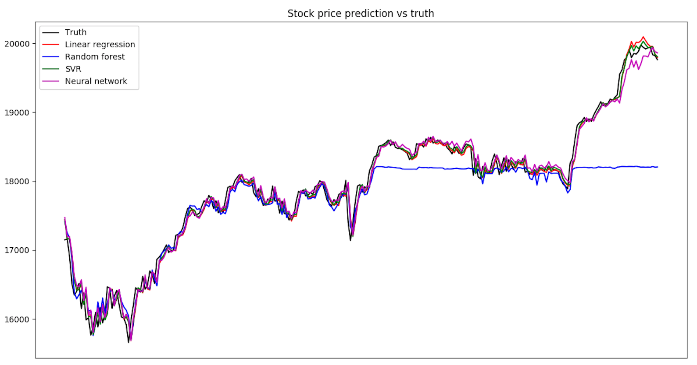


# Summary
In this chapter, we worked on the last project of this entire book, predicting stock (specifically stock index) prices using machine learning regression techniques. We started with a short introduction to the stock market and factors that influence trading prices. To tackle this billion dollar problem, we investigated machine learning regression, which estimates a continuous target variable, as opposed to discrete output in classification. We followed with an in-depth discussion of three popular regression algorithms, linear regression, regression tree and regression forest, and SVR as well as neural networks. We covered the definition, mechanics, and implementation from scratch and with several popular frameworks including scikit-learn, tensorflow, and keras, along with their applications on toy datasets. We also learned the metrics used to evaluate a regression model. Finally, we applied what we learned in this whole chapter to solve our stock price prediction problem.