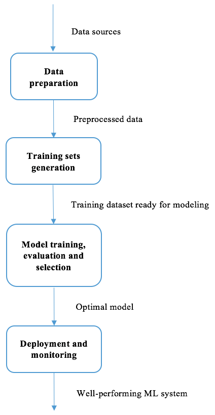
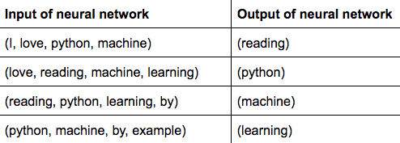
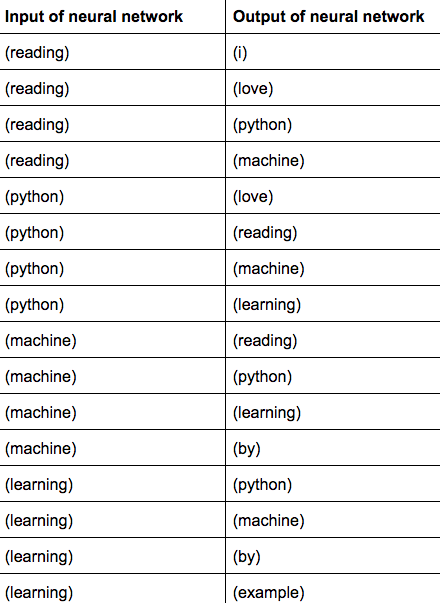
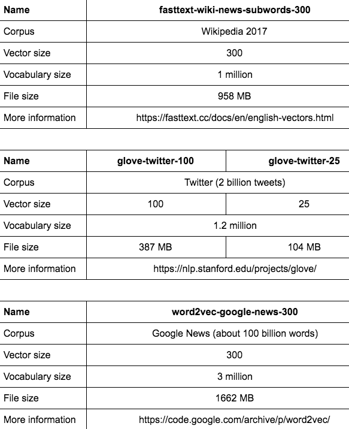
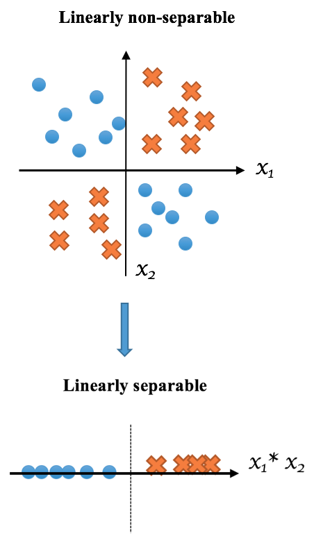
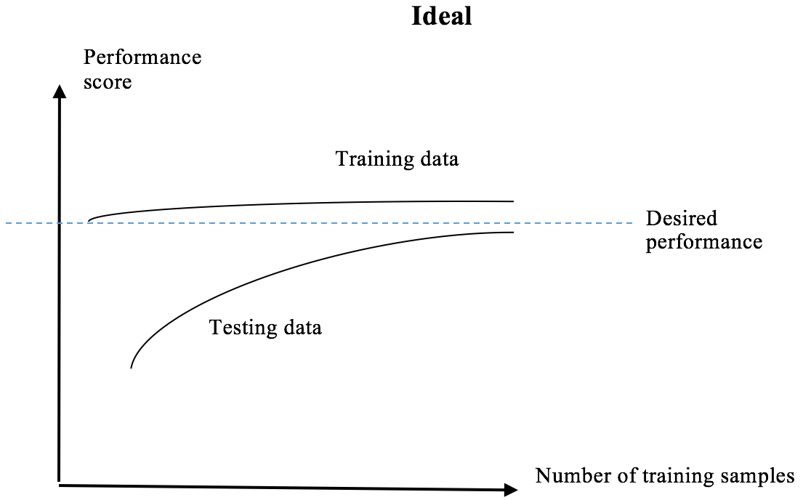
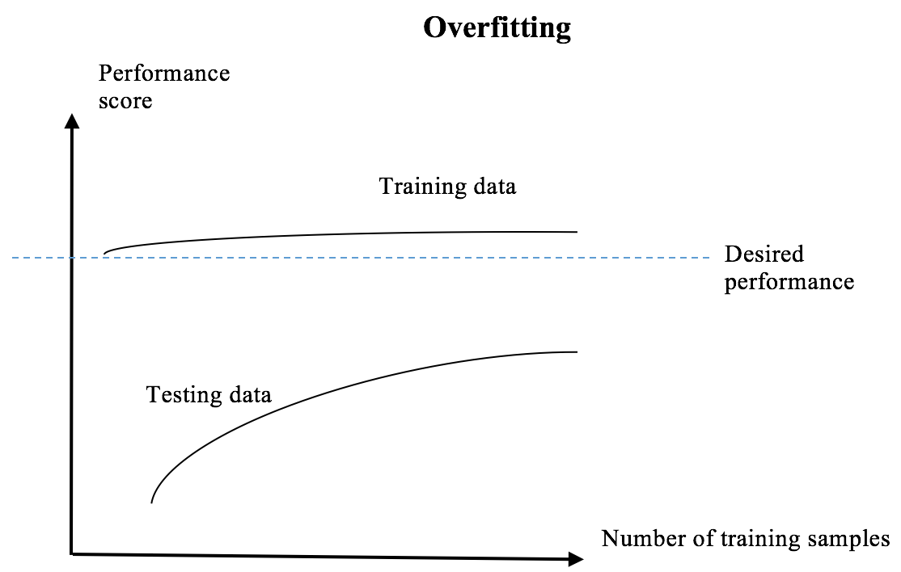
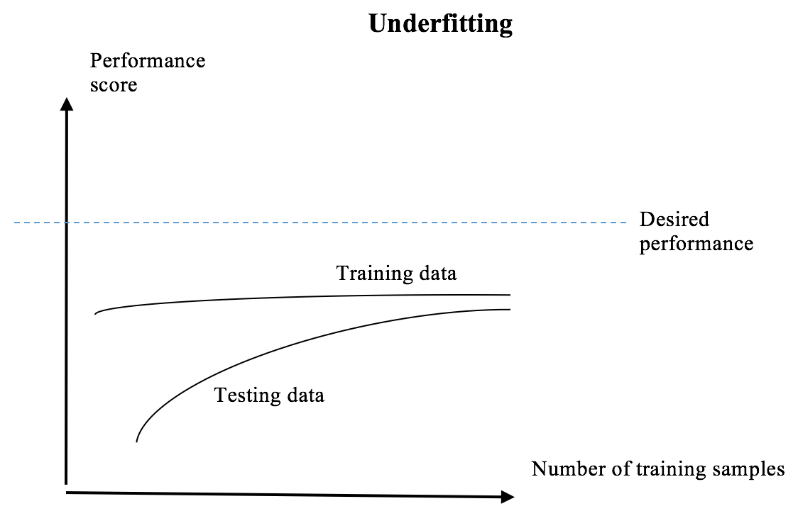

Lab : Machine Learning Best Practices
-------------------------------------------

After working on multiple projects covering important machine learning
concepts, techniques, and widely used algorithms, we have gathered a
broad picture of the machine learning ecosystem, as well as solid
experience in tackling practical problems using machine learning
algorithms and Python. However, there will be issues once we start
working on projects from scratch in the real world. This chapter aims to
get us ready for it with 21 best practices to follow throughout the
entire machine learning solution workflow.

We will cover the following topics in this chapter:

-   Machine learning solution workflow
-   Tasks in the data preparation stage
-   Tasks in the training sets generation stage
-   Tasks in the algorithm training, evaluation, and selection stage
-   Tasks in the system deployment and monitoring stage
-   Best practices in the data preparation stage
-   Best practices in the training sets generation stage
-   Word embedding
-   Best practices in the model training, evaluation, and selection
    stage
-   Best practices in the system deployment and monitoring stage

#### Pre-reqs:
- Google Chrome (Recommended)

#### Lab Environment
Notebooks are ready to run. All packages have been installed. There is no requirement for any setup.

**Note:** Elev8ed Notebooks (powered by Jupyter) will be accessible at the port given to you by your instructor. Password for jupyterLab : `1234`

All Notebooks are present in `work/python-machine-learning-by-example` folder.

You can access jupyter lab at `<host-ip>:<port>/lab/workspaces/lab9_Machine_Learning

Machine learning solution workflow
----------------------------------

* * * * *

In general, the main tasks involved in solving a machine learning
problem can be summarized into four areas, as follows:

-   Data preparation
-   Training sets generation
-   Model training, evaluation, and selection
-   Deployment and monitoring

Starting from data sources to the final machine learning system, a
machine learning solution basically follows the following paradigm:


 

In the following sections, we will be learning about the typical tasks,
common challenges, and best practices for each of these four stages.


Best practices in the data preparation stage
--------------------------------------------

* * * * *

No machine learning system can be built without data. Therefore, **data
collection** should be our first focus.

### Best practice 1 – completely understanding the project goal

Before starting to collect data, we should make sure that the goal of
the project and the business problem, is completely understood, as this
will guide us on what data sources to look into, and where sufficient
domain knowledge and expertise is also required. For example, in the
previous chapter, [Chapter
9](https://subscription.packtpub.com/book/big_data_and_business_intelligence/9781789616729/9),
*Stock Price Prediction with Regression Algorithms*, our goal was to
predict the future prices of the DJIA index, so we first collected data
of its past performance, instead of past performance of an irrelevant
European stock. In [Chapter
6](https://subscription.packtpub.com/book/big_data_and_business_intelligence/9781789616729/6),
*Predicting Online Ads Click-through with Tree-Based Algorithms,* and
[Chapter
7](https://subscription.packtpub.com/book/big_data_and_business_intelligence/9781789616729/7),
*Predicting Online Ads Click-through with Logistic Regression,* the
business problem was to optimize advertising targeting efficiency
measured in click-through rate, so we collected the clickstream data of
who clicked or did not click on what ad on what page, instead of merely
how many ads were displayed in a web domain.

### Best practice 2 – collecting all fields that are relevant

With a set goal in mind, we can narrow down potential data sources to
investigate. Now the question becomes: is it necessary to collect the
data of all fields available in a data source, or is a subset of
attributes enough? It would be perfect if we knew in advance which
attributes were key indicators or key predictive factors. However, it is
in fact very difficult to ensure that the attributes hand-picked by a
domain expert will yield the best prediction results. Hence, for each
data source, it is recommended to collect **all** of the fields that are
related to the project, especially in cases where recollecting the data
is time consuming, or even impossible.

 

 

For example, in the stock price prediction example, we collected the
data of all fields including **open**, **high**, **low**, and
**volume**, even though we were initially not certain of how useful
**high** and **low** predictions would be. Retrieving the stock data is
quick and easy, however. In another example, if we ever want to collect
data ourselves by scraping online articles for topic classification, we
should store as much information as possible. Otherwise, if any piece of
information is not collected but is later found valuable, such as
hyperlinks in an article, the article might be already removed from the
web page; if it still exists, rescraping those pages can be costly.

After collecting the datasets that we think are useful, we need to
assure the data quality by inspecting its **consistency** and
**completeness**. Consistency refers to how the distribution of data is
changing over time. Completeness means how much data is present across
fields and samples. They are explained in detail in the following two
practices.

### Best practice 3 – maintaining the consistency of field values

In a dataset that already exists, or in one we collect from scratch,
oftentimes we see different values representing the same meaning. For
example, there are American, US, and U.S.A in the country field, and
male and M in the gender field. It is necessary to unify or standardize
values in a field. For example, we can only keep M and F in the gender
field and replace other alternatives. Otherwise it will mess up the
algorithms in later stages as different feature values will be treated
differently even if they have the same meaning. It is also a great
practice to keep track of what values are mapped to the default value of
a field.

In addition, the format of values in the same field should also be
consistent. For instance, in the *age* field, there are true age values,
such as 21 and 35, and incorrect age values, such as 1990 and 1978; in
the *rating* field, both cardinal numbers and English numerals are
found, such as 1, 2, and 3, and *one*, *two*, and *three*.
Transformation and reformatting should be conducted in order to ensure
data consistency.

### Best practice 4 – dealing with missing data

Due to various reasons, datasets in the real world are rarely completely
clean and often contain missing or corrupted values. They are usually
presented as blanks, *Null*, *-1*, *999999*, *unknown*, or any other
placeholder. Samples with missing data not only provide incomplete
predictive information, but also confuse the machine learning model as
it can not tell whether *-1* or *unknown* holds a meaning. It is
important to pinpoint and deal with missing data in order to avoid
jeopardizing the performance of models in later stages.

 

Here are three basic strategies that we can use to tackle the missing
data issue:

-   Discarding samples containing any missing value
-   Discarding fields containing missing values in any sample

-   Inferring the missing values based on the known part from the
    attribute. This process is called **missing data imputation**.
    Typical imputation methods include replacing missing values with
    mean or median value of the field across all samples, or the most
    frequent value for categorical data.

The first two strategies are simple to implement; however, they come at
the expense of the data lost, especially when the original dataset is
not large enough. The third strategy doesn't abandon any data, but does
try to fill in the blanks.

Let's look at how each strategy is applied in an example where we have a
dataset (age, income) consisting of six samples (30, 100), (20, 50),
(35, *unknown*), (25, 80), (30, 70), and (40, 60):

-   If we process this dataset using the first strategy, it becomes (30,
    100), (20, 50), (25, 80), (30, 70), and (40, 60)
-   If we employ the second strategy, the dataset becomes (30), (20),
    (35), (25), (30), and (40), where only the first field remains
-   If we decide to complete the unknown value instead of skipping it,
    the sample (35, *unknown*) can be transformed into (35, 72) with the
    mean of the rest values in the second field, or (35, 70), with the
    median value in the second field

In `scikit-learn`, the `Imputer` class provides a
nicely written imputation transformer. We herein use it for the
following small example:


```
>>> import numpy as np
>>> from sklearn.preprocessing import Imputer
```

Represent the unknown value by `np.nan` in `numpy`,
as detailed in the following:


```
>>> data_origin = [[30, 100],
...                [20, 50],
...                [35, np.nan],
...                [25, 80],
...                [30, 70],
...                [40, 60]]
```

 

 

Initialize the imputation transformer with the mean value and obtain
such information from the original data:


```
>>> imp_mean = Imputer(missing_values='NaN', strategy='mean')
>>> imp_mean.fit(data_origin)
```

Complete the missing value as follows:


```
>>> data_mean_imp = imp_mean.transform(data_origin)
>>> print(data_mean_imp)
[[ 30. 100.]
 [ 20. 50.]
 [ 35. 72.]
 [ 25. 80.]
 [ 30. 70.]
 [ 40. 60.]]
```

Similarly, initialize the imputation transformer with the median value,
as detailed in the following:


```
>>> imp_median = Imputer(missing_values='NaN', strategy='median')
>>> imp_median.fit(data_origin)
>>> data_median_imp = imp_median.transform(data_origin)
>>> print(data_median_imp)
[[ 30. 100.]
 [ 20. 50.]
 [ 35. 70.]
 [ 25. 80.]
 [ 30. 70.]
 [ 40. 60.]]
```

When new samples come in, the missing values (in any attribute) can be
imputed using the trained transformer, for example, with the mean value,
as shown here:


```
>>> new = [[20, np.nan],
...        [30, np.nan],
...        [np.nan, 70],
...        [np.nan, np.nan]]
>>> new_mean_imp = imp_mean.transform(new)
>>> print(new_mean_imp)
[[ 20. 72.]
 [ 30. 72.]
 [ 30. 70.]
 [ 30. 72.]]
```

Note that `30` in the age field is the mean of those six age
values in the original dataset.

 

 

Now that we have seen how imputation works as well as its
implementation, let's explore how the strategy of imputing missing
values and discarding missing data affects the prediction results
through the following example:

1.  First we load the diabetes dataset and simulate a corrupted dataset
    with missing values, as shown here:


```
>>> from sklearn import datasets
>>> dataset = datasets.load_diabetes()
>>> X_full, y = dataset.data, dataset.target
```

2.  Simulate a corrupted dataset by adding 25% missing values:


```
>>> m, n = X_full.shape
>>> m_missing = int(m * 0.25)
>>> print(m, m_missing)
442 110
```

3.  Randomly select the `m_missing` samples, as follows:


```
>>> np.random.seed(42)
>>> missing_samples = np.array([True] * m_missing + 
                               [False] * (m - m_missing))
>>> np.random.shuffle(missing_samples)
```

4.  For each missing sample, randomly select 1 out of `n`
    features:


```
>>> missing_features = np.random.randint(low=0, high=n, 
                                         size=m_missing)
```

5.  Represent missing values by `nan`, as shown here:


```
>>> X_missing = X_full.copy()
>>> X_missing[np.where(missing_samples)[0], missing_features] = 
                                                          np.nan
```

6.  Then we deal with this corrupted dataset by discarding the samples
    containing a missing value:


```
>>> X_rm_missing = X_missing[~missing_samples, :]
>>> y_rm_missing = y[~missing_samples]
```

 

 

7.  Measure the effects of using this strategy by estimating the
    averaged regression score, *R^2^*, with a regression forest model in
    a cross-validation manner. Estimate *R^2^*on the dataset with the
    missing samples removed, as follows:


```
>>> from sklearn.ensemble import RandomForestRegressor
>>> from sklearn.model_selection import cross_val_score
>>> regressor = RandomForestRegressor(random_state=42, 
                                  max_depth=10, n_estimators=100)
>>> score_rm_missing = cross_val_score(regressor, X_rm_missing, 
                                             y_rm_missing).mean()
>>> print('Score with the data set with missing samples removed: 
                                 {0:.2f}'.format(score_rm_missing))
Score with the data set with missing samples removed: 0.39
```

8.  Now we approach the corrupted dataset differently by imputing
    missing values with the mean, shown here:


```
>>> imp_mean = Imputer(missing_values='NaN', strategy='mean')
>>> X_mean_imp = imp_mean.fit_transform(X_missing)
```

9.  Similarly, measure the effects of using this strategy by estimating
    the averaged *R^2^*, as follows:


```
>>> regressor = RandomForestRegressor(random_state=42, 
                                 max_depth=10, n_estimators=100)
>>> score_mean_imp = cross_val_score(regressor, X_mean_imp, 
                                                   y).mean()
>>> print('Score with the data set with missing values replaced by 
                             mean: {0:.2f}'.format(score_mean_imp))
Score with the data set with missing values replaced by mean: 0.42
```

10. An imputation strategy works better than discarding in this case.
    So, how far is the imputed dataset from the original full one? We
    can check it again by estimating the averaged regression score on
    the original dataset, as follows:


```
>>> regressor = RandomForestRegressor(random_state=42, 
                                  max_depth=10, n_estimators=500)
>>> score_full = cross_val_score(regressor, X_full, y).mean()
>>> print 'Score with the full data set: 
                             {0:.2f}'.format(score_full)
Score with the full data set: 0.44
```

It turns out that little information is comprised in the completed
dataset.

However, there is no guarantee that an imputation strategy always works
better, and sometimes dropping samples with missing values can be more
effective. Hence, it is a great practice to compare the performances of
different strategies via cross-validation as we have done previously.

### Best practice 5 – storing large-scale data

With the ever-growing size of data, oftentimes we can't simply fit the
data in our single local machine and need to store it on the cloud or
distributed filesystems. As this is mainly a book on machine learning
with Python, we will just touch on some basic areas that you can look
into. The two main strategies of storing big data are **scale-up** and
**scale-out**:

-   A scale-up approach increases storage capacity if data exceeds the
    current system capacity, such as by adding more disks. This is
    useful in fast-access platforms.
-   In a scale-out approach, storage capacity grows incrementally with
    additional nodes in a storage cluster. Apache Hadoop
    ([https://hadoop.apache.org/](https://hadoop.apache.org/)) is used
    to store and process big data on scale-out clusters, where data is
    spread across hundreds or even thousands of nodes. Also, there are
    cloud-based distributed file services, such as S3 in Amazon Web
    Services ([https://aws.amazon.com/s3/](https://aws.amazon.com/s3/)),
    and Google Cloud Storage in Google Cloud
    ([https://cloud.google.com/storage/](https://cloud.google.com/storage/)).
    They are massively scalable and are designed for secure and durable
    storage.

Best practices in the training sets generation stage
----------------------------------------------------

* * * * *

With well-prepared data, it is safe to move on with the training sets
generation stage. Typical tasks in this stage can be summarized into two
major categories: **data preprocessing** and **feature engineering**.

To begin, data preprocessing usually involves categorical feature
encoding, feature scaling, feature selection, and dimensionality
reduction.

### Best practice 6 – identifying categorical features with numerical values

In general, categorical features are easy to spot, as they convey
qualitative information, such as risk level, occupation, and interests.
However, it gets tricky if the feature takes on a discreet and countable
(limited) number of numerical values, for instance, 1 to 12 representing
months of the year, and 1 and 0 indicating true and false. The key to
identifying whether such a feature is categorical or numerical is
whether it provides a mathematical or ranking implication: if so, it is
a numerical feature, such as a product rating from 1 to 5; otherwise, it
is categorical, such as the month, or day of the week.

### Best practice 7 – deciding on whether or not to encode categorical features

If a feature is considered categorical, we need to decide whether we
should encode it. This depends on what prediction algorithm(s) we will
use in later stages. Naïve Bayes and tree-based algorithms can directly
work with categorical features, while other algorithms in general
cannot, in which case, encoding is essential.

As the output of the feature generation stage is the input of the model
training stage, steps taken in the feature generation stage should be
compatible with the prediction algorithm. Therefore, we should look at
two stages of feature generation and predictive model training as a
whole, instead of two isolated components. The following practical tips
also emphasize this point.

### Best practice 8 – deciding on whether or not to select features, and if so, how to do so

We have seen in [Chapter
7](https://subscription.packtpub.com/book/big_data_and_business_intelligence/9781789616729/7),
*Predicting Online Ads Click-through with Logistic Regression,* where
feature selection was performed using L1-based regularized logistic
regression and random forest. The benefits of feature selection include
the following:

-   Reducing the training time of prediction models, as redundant, or
    irrelevant features are eliminated
-   Reducing overfitting for the preceding same reason
-   Likely improving performance as prediction models will learn from
    data with more significant features

 

 

Note we used the word *likely* because there is no absolute certainty
that feature selection will increase prediction accuracy. It is
therefore good practice to compare the performances of conducting
feature selection and not doing so via cross-validation. For example, by
executing the following steps, we can measure the effects of feature
selection by estimating the averaged classification accuracy with an
`SVC` model in a cross-validation manner:

1.  First, we load the handwritten digits dataset from
    `scikit-learn`, as follows:


```
>>> from sklearn.datasets import load_digits
>>> dataset = load_digits()
>>> X, y = dataset.data, dataset.target
>>> print(X.shape)
(1797, 64)
```

2.  Next, estimate the accuracy of the original dataset, which is 64
    dimensional, as detailed here:


```
>>> from sklearn.svm import SVC
>>> from sklearn.model_selection import cross_val_score
>>> classifier = SVC(gamma=0.005)
>>> score = cross_val_score(classifier, X, y).mean()
>>> print('Score with the original data set: 
                                {0:.2f}'.format(score))
Score with the original data set: 0.88
```

3.  Then conduct feature selection based on random forest and sort the
    features based on their importance scores:


```
>>> from sklearn.ensemble import RandomForestClassifier
>>> random_forest = RandomForestClassifier(n_estimators=100, 
                                      criterion='gini', n_jobs=-1)
>>> random_forest.fit(X, y)
>>> feature_sorted = 
               np.argsort(random_forest.feature_importances_)
```

4.  Now select a different number of top features to construct a new
    dataset, and estimate the accuracy on each dataset, as follows:


```
>>> K = [10, 15, 25, 35, 45]
>>> for k in K:
...     top_K_features = feature_sorted[-k:]
...     X_k_selected = X[:, top_K_features]
...     # Estimate accuracy on the data set with k 
          selected features
...     classifier = SVC(gamma=0.005)
...     score_k_features = 
               cross_val_score(classifier, X_k_selected, y).mean()
...     print('Score with the data set of top {0} features: 
                            {1:.2f}'.format(k, score_k_features))
...
Score with the data set of top 10 features: 0.88
Score with the data set of top 15 features: 0.93
Score with the data set of top 25 features: 0.94
Score with the data set of top 35 features: 0.92
Score with the data set of top 45 features: 0.88
```

### Best practice 9 – deciding on whether or not to reduce dimensionality, and if so, how to do so

Feature selection and dimensionality are different in the sense that the
former chooses features from the original data space, while the latter
does so from a projected space from the original space. Dimensionality
reduction has the following advantages that are similar to feature
selection, as follows:

-   Reducing the training time of prediction models, as redundant, or
    correlated features are merged into new ones
-   Reducing overfitting for the same reason as previously
-   Likely improving performance as prediction models will learn from
    data with less redundant or correlated features

Again, it is not guaranteed that dimensionality reduction will yield
better prediction results. In order to examine its effects, integrating
dimensionality reduction in the model training stage is recommended.
Reusing the preceding handwritten digits example, we can measure the
effects of **principal component analysis** (**PCA**)-based
dimensionality reduction, where we keep a different number of top
components to construct a new dataset, and estimate the accuracy on each
dataset:


```
>>> from sklearn.decomposition import PCA
>>> # Keep different number of top components
>>> N = [10, 15, 25, 35, 45]
>>> for n in N:
...     pca = PCA(n_components=n)
...     X_n_kept = pca.fit_transform(X)
...     # Estimate accuracy on the data set with top n components
...     classifier = SVC(gamma=0.005)
...     score_n_components = 
                   cross_val_score(classifier, X_n_kept, y).mean()
...     print('Score with the data set of top {0} components: 
                         {1:.2f}'.format(n, score_n_components))
Score with the data set of top 10 components: 0.95
Score with the data set of top 15 components: 0.95
Score with the data set of top 25 components: 0.91
Score with the data set of top 35 components: 0.89
Score with the data set of top 45 components: 0.88
```

### Best practice 10 – deciding on whether or not to rescale features

As seen in [Chapter
9](https://subscription.packtpub.com/book/big_data_and_business_intelligence/9781789616729/9),
*Stock Price Prediction with Regression Algorithms,*SGD-based linear
regression, SVR, and the neural network model require features to be
standardized by removing the mean and scaling to unit variance. So, when
is feature scaling needed and when is it not?

In general, Naïve Bayes and tree-based algorithms are not sensitive to
features at different scales, as they look at each feature
independently.

In most cases, an algorithm that involves any form of distance (or
separation in spaces) of samples in learning requires
scaled/standardized inputs, such as SVC, SVR, k-means clustering, and
k-nearest neighbors (KNN) algorithms. Feature scaling is also a must for
any algorithm using SGD for optimization, such as linear or logistic
regression with gradient descent, and neural networks.

We have so far covered tips regarding data preprocessing and will next
discuss best practices of feature engineering as another major aspect of
training sets generation. We will do so from two perspectives.

### Best practice 11 – performing feature engineering with domain expertise

If we are lucky enough to possess sufficient domain knowledge, we can
apply it in creating domain-specific features; we utilize our business
experience and insights to identify what is in the data and to formulate
what from the data correlates to the prediction target. For example, in
[Chapter
9](https://subscription.packtpub.com/book/big_data_and_business_intelligence/9781789616729/9),
*Stock Price Prediction with Regression Algorithms,* we designed and
constructed feature sets for the prediction of stock prices based on
factors that investors usually look at when making investment decisions.

 

 

While particular domain knowledge is required, sometimes we can still
apply some general tips in this category. For example, in fields related
to customer analytics, such as market and advertising, the time of the
day, day of the week, and month are usually important signals. Given a
data point with the value 2017/02/05 in the date column and 14:34:21 in
the time column, we can create new features including afternoon, Sunday,
and February. In retail, information over a period of time is usually
aggregated to provide better insights. The number of times a customer
visits a store for the past three months, or the average number of
products purchased weekly for the previous year, for instance, can be
good predictive indicators for customer behavior prediction.

### Best practice 12 – performing feature engineering without domain expertise

If we unfortunately have very little domain knowledge, how can we
generate features? Don't panic. There are several generic approaches
that you can follow:

-   **Binarization**: This is the process of converting a numerical
    feature to a binary one with a preset threshold. For example, in
    spam email detection, for the feature (or term) *prize*, we can
    generate a new feature *whether prize occurs*: any term frequency
    value greater than 1 becomes 1, otherwise it is 0. The feature
    *number of visits per week* can be used to produce a new feature *is
    frequent visitor* by judging whether the value is greater than or
    equal to 3. We implement such binarization using
    `scikit-learn`, as follows:


```
>>> from sklearn.preprocessing import Binarizer
>>> X = [[4], [1], [3], [0]]
>>> binarizer = Binarizer(threshold=2.9)
>>> X_new = binarizer.fit_transform(X)
>>> print(X_new)
[[1]
 [0]
 [1]
 [0]]
```

-   **Discretization**: This is the process of converting a numerical
    feature to a categorical feature with limited possible values.
    Binarization can be viewed as a special case of discretization. For
    example, we can generate an *age group* feature: *"18-**24"* for age
    from 18 to 24, *"25-34"* for age from 25 to 34, *"34-54"*, and
    *"55+"*.
-   **Interaction**: This includes the sum, multiplication, or any
    operations of two numerical features, joint condition check of two
    categorical features. For example, *the number of visits per week*
    and *the number of products purchased per week* can be used to
    generate *the number of products purchased per visit* feature;
    *interest* and *occupation*, such as *sports* and *engineer*, can
    form *occupation AND interest*, such as *engineer interested in
    sports*.
-   **Polynomial transformation**: This is a process of generating
    polynomial and interaction features. For two features, *a* and *b*,
    the two degree of polynomial features generated are *a^2^*, *ab*,
    and *b^2^*. In `scikit-learn`, we can use the
    `PolynomialFeatures` class to perform polynomial
    transformation, as follows:


```
>>> from sklearn.preprocessing import PolynomialFeatures
>>> X = [[2, 4],
...      [1, 3],
...      [3, 2],
...      [0, 3]]
>>> poly = PolynomialFeatures(degree=2)
>>> X_new = poly.fit_transform(X)
>>> print(X_new)
[[ 1. 2. 4. 4. 8. 16.]
 [ 1. 1. 3. 1. 3. 9.]
 [ 1. 3. 2. 9. 6. 4.]
 [ 1. 0. 3. 0. 0. 9.]]
```

Note the resulting new features consist of 1 (bias, intercept), *a*,
*b*, *a^2^*, *ab*, and *b^2^*.

### Best practice 13 – documenting how each feature is generated

We have covered the rules of feature engineering with domain knowledge
and in general, there is one more thing worth noting: documenting how
each feature is generated. It sounds trivial, but oftentimes we just
forget about how a feature is obtained or created. We usually need to go
back to this stage after some failed trials in the model training stage
and attempt to create more features with the hope of improving
performance. We have to be clear on what and how features are generated,
in order to remove those that do not quite work out, and to add new ones
that have more potential.

 

### Best practice 14 – extracting features from text data

We have worked intensively with text data in [Chapter
2](https://subscription.packtpub.com/book/big_data_and_business_intelligence/9781789616729/2), *Exploring
the 20 Newsgroups Dataset with Text Analysis Techniques,*[Chapter
3](https://subscription.packtpub.com/book/big_data_and_business_intelligence/9781789616729/3),
*Mining the 20 Newsgroups Dataset with Clustering, and Topic Modeling
Algorithms,*[Chapter
4](https://subscription.packtpub.com/book/big_data_and_business_intelligence/9781789616729/4),
*Detecting Spam Email with Naive Bayes,* and [Chapter
5](https://subscription.packtpub.com/book/big_data_and_business_intelligence/9781789616729/5), *Classifying
News Topics with a Support Vector Machine,* where we extracted features
from text based on **term frequency** (**tf**) and **term
frequency-inverse document frequency** (**tf-idf**). Both methods
consider each document of words (terms) a collection of words, or a
**bag of words** (**BoW**), disregarding the order of words, but keeping
multiplicity. A tf approach simply uses the counts of tokens, while
tf-idf extends tf by assigning each tf a weighting factor that is
inversely proportional to the document frequency. With the idf factor
incorporated, tf-idf diminishes the weight of common terms (such as
*get*, *make*) that occur frequently, and emphasizes terms that rarely
occur, but convey important meaning. Hence, oftentimes features
extracted from tf-idf are more representative than those from tf.

As you may remember, a document is represented by a very sparse vector
where only present terms have non-zero values. And its dimensionality is
usually high, which is determined by the size of vocabulary and the
number of unique terms. Also, such one-hot encoding approaching treats
each term as an independent item and does not consider the relationship
across words (referred to as "context" in linguistics).

On the contrary, another approach, called **word embedding**, is able to
capture the meanings of words and their context. In this approach, a
word is represented by a vector of float numbers. Its dimensionality is
a lot lower than the size of vocabulary and is usually several hundreds
only. For example, the word **machine** can be represented as [1.4, 2.1,
10.3, 0.2, 6.81]. So, how can we embed a word into a vector? One
solution is `word2vec`, which trains a shallow neural network
to predict a word given other words around it (called **CBOW**) or to
predict words around a word (called **skip-gram**). The coefficients of
the trained neural network are the embedding vectors for corresponding
words.

**CBOW** is short for **Continuous Bag of Words**. Given a sentence *I
love reading Python machine learning by example* in a corpus, and 5 as
the size of word window, we can have the following training sets for the
CBOW neural network:



Of course, the inputs and outputs of the neural network are one-hot
encoding vectors, where values are either 1 for present words, or 0 for
absent words. And we can have millions of training samples constructed
from a corpus sentence by sentence. After the network is trained, the
weights that connect the input layer and hidden layer embed individual
input words.  A skip-gram-based neural network embeds words in a similar
way. But its input and output is an inverse version of CBOW. Given the
same sentence *I love reading Python machine learning by example* and 5
as the size of word window, we can have the following training sets for
the skip-gram neural network:



The embedding vectors are of real values where each dimension encodes an
aspect of meaning for words in the vocabulary. This helps reserve the
semantics information of words, as opposed to discarding it as in the
dummy one-hot encoding approach using tf or td-idf. An interesting
phenomenon is that vectors from semantically similar words are proximate
to each other in geometric space. For example, both the word
*clustering* and *grouping* refer to unsupervised clustering in the
context of machine learning, hence their embedding vectors are close
together.

 

 

Training a word embedding neural network can be time-consuming and
computationally expensive. Fortunately, there are several big tech
companies that have trained word embedding models on different kinds of
corpora and open sourced them. We can simply use these **pre-trained**
models to map words to vectors. Some popular pretrained word embedding
models are as follows:



 

 

Once we have embedding vectors for individual words, we can represent a
document sample by averaging all of the vectors of present words in this
document. The resulting vectors of document samples are then consumed by
downstream predictive tasks, such as classification, similarity ranking
in search engine, and clustering. 

Now let's play around with `gensim`, a popular NLP package
with powerful word embedding modules. If you have not installed the
package in [Chapter
2](https://subscription.packtpub.com/book/big_data_and_business_intelligence/9781789616729/2),
*Exploring the 20 Newsgroups Dataset with Text Analysis Techniques,* you
can do so using `pip`. 

First, we import the package and load a pretrained
model, `glove-twitter-25`, as follows:


```
>>> import gensim.downloader as api
>>> model = api.load("glove-twitter-25")
[==================================================] 100.0% 
104.8/104.8MB downloaded
```

You will see the process bar if you first run this line of code. The
`glove-twitter-25` model is one of the smallest ones so the
download will not take very long.

We can obtain the embedding vector for a word (`computer`, for
example), as follows:


```
>>> vector = model.wv['computer']
>>> print('Word computer is embedded into:\n', vector)
Word computer is embedded into:
[ 0.64005 -0.019514 0.70148 -0.66123 1.1723 -0.58859 0.25917
-0.81541 1.1708 1.1413 -0.15405 -0.11369 -3.8414 -0.87233
  0.47489 1.1541 0.97678 1.1107 -0.14572 -0.52013 -0.52234
 -0.92349 0.34651 0.061939 -0.57375 ]
```

The result is a 25-dimension float vector as expected.

We can also get the top 10 words that are most contextually relevant to
`computer` using the *most\_similar* method, as follows:


```
>>> similar_words = model.most_similar("computer")
>>> print('Top ten words most contextually relevant to computer:\n', 
           similar_words)
Top ten words most contextually relevant to computer:
 [('camera', 0.907833456993103), ('cell', 0.891890287399292), ('server', 0.8744666576385498), ('device', 0.869352400302887), ('wifi', 0.8631256818771362), ('screen', 0.8621907234191895), ('app', 0.8615544438362122), ('case', 0.8587921857833862), ('remote', 0.8583616018295288), ('file', 0.8575270771980286)]
```

The result looks promising.

Finally, we demonstrate how to generate representing vectors for a
document with a simple example, as follows:


```
>>> doc_sample = ['i', 'love', 'reading', 'python', 'machine', 
                 'learning', 'by', 'example']
>>> import numpy as np
>>> doc_vector = np.mean([model.wv[word] for word in doc_sample], 
                                                           axis=0)
>>> print('The document sample is embedded into:\n', doc_vector)
The document sample is embedded into:
 [-0.17100249 0.1388764 0.10616798 0.200275 0.1159925 -0.1515975
  1.1621187 -0.4241785 0.2912 -0.28199488 -0.31453252 0.43692702
 -3.95395 -0.35544625 0.073975 0.1408525 0.20736426 0.17444688
  0.10602863 -0.04121475 -0.34942 -0.2736689 -0.47526264 -0.11842456
 -0.16284864]
```

The resulting vector is the average of embedding vectors of eight input
words.

In traditional NLP applications, such as text classification and topic
modeling, tf or td-idf is still an outstanding solution for feature
extraction. In more complicated areas, such as text summarization,
machine translation, named entity resolution, question answering, and
information retrieval, word embedding is used extensively and extracts
far better features than the two traditional approaches.

Best practices in the model training, evaluation, and selection stage
---------------------------------------------------------------------

* * * * *

Given a supervised machine learning problem, the first question many
people ask is usually *what is the best classification or regression
algorithm to solve it*. However, there is no one-size-fits-all
solution, or no free lunch. No one could know which algorithm will work
the best before trying multiple ones and fine-tuning the optimal one. We
will be looking into best practices around this in the following
sections.

### Best practice 15 – choosing the right algorithm(s) to start with

Due to the fact that there are several parameters to tune for an
algorithm, exhausting all algorithms and fine-tuning each one can be
extremely time-consuming and computationally expensive. We should
instead shortlist one to three algorithms to start with using the
general guidelines that follow (note we herein focus on classification,
but the theory transcends in regression and there is usually a
counterpart algorithm in regression).

There are several things we need to be clear about before shortlisting
potential algorithms, as described in the following:

-   Size of the training dataset
-   Dimensionality of the dataset
-   Whether the data is linearly separable
-   Whether features are independent
-   Tolerance and trade-off of bias and variance
-   Whether online learning is required

#### Naïve Bayes

This is a very simple algorithm. For a relatively small training
dataset, if features are independent, Naïve Bayes will usually perform
well. For a large dataset, Naïve Bayes will still work well as feature
independence can be assumed in this case, regardless of the truth. The
training of Naïve Bayes is usually faster than any other algorithms due
to its computational simplicity. However, this may lead to a high bias
(but a low variance).

#### Logistic regression

This is probably the most widely used classification algorithm, and the
first algorithm that a machine learning practitioner usually tries when
given a classification problem. It performs well when data is linearly
separable or approximately **linearly separable**. Even if it is not
linearly separable, it might be possible to convert the linearly
non-separable features into separable ones and apply logistic regression
afterward.

In the following instance, data in the original space is not linearly
separable, but they become separable in a transformed space created from
the interaction of two features:



Also, logistic regression is extremely scalable to large datasets with
SGD optimization, which makes it efficient in solving big data problems.
Plus, it makes online learning feasible. Although logistic regression is
a low-bias, high-variance algorithm, we overcome the potential
overfitting by adding L1, L2, or a mix of two regularizations.

#### SVM

This is versatile enough to adapt to the linear separability of data.
For a separable dataset, SVM, with linear kernel, performs comparably to
logistic regression. Beyond this, SVM also works well for a
non-separable one, if equipped with a non-linear kernel, such as RBF.
For a high-dimensional dataset, the performance of logistic regression
is usually compromised, while SVM still performs well. A good example of
this can be in news classification, where the feature dimensionality is
in the tens of thousands. In general, very high accuracy can be achieved
by SVM with the right kernel and parameters. However, this might be at
the expense of intense computation and high memory consumption.

#### Random forest (or decision tree)

Linear separability of data does not matter to the algorithm. And it
works directly with categorical features without encoding, which
provides great ease of use. Also, the trained model is very easy to
interpret and explain to non-machine learning practitioners, which
cannot be achieved with most other algorithms. Additionally, random
forest boosts decision tree, which might lead to overfitting by
ensembling a collection of separate trees. Its performance is comparable
to SVM, while fine-tuning a random forest model is less difficult
compared to SVM and neural networks.

#### Neural networks

These are extremely powerful, especially with the development of deep
learning. However, finding the right topology (layers, nodes, activation
functions, and so on) is not easy, not to mention the time-consuming
model of training and tuning. Hence, they are not recommended as an
algorithm to start with.

### Best practice 16 – reducing overfitting

We've touched on ways to avoid overfitting when discussing the pros and
cons of algorithms in the last practice. We herein formally summarize
them, as follows:

-   Cross-validation, a good habit that we have built over all of the
    chapters in this book.
-   Regularization. It adds penalty terms to reduce the error caused by
    fitting the model perfectly on the given training set.
-   Simplification, if possible. The more complex the mode is, the
    higher chance of overfitting. Complex models include a tree or
    forest with excessive depth, a linear regression with high degree
    polynomial transformation, and an SVM with a complicated kernel.
-   Ensemble learning, combining a collection of weak models to form a
    stronger one.

### Best practice 17 – diagnosing overfitting and underfitting

So, how can we tell whether a model suffers from overfitting, or the
other extreme, underfitting? A **learning curve** is usually used to
evaluate the bias and variance of a model. A learning curve is a graph
that compares the cross-validated training and testing scores over a
various number of training samples.

For a model that fits well on the training samples, the performance of
training samples should be above desire. Ideally, as the number of
training samples increases, the model performance on testing samples
improves; eventually the performance on testing samples becomes close to
that on training samples.

When the performance on testing samples converges at a value far from
the performance on training samples, overfitting can be concluded. In
this case, the model fails to generalize to instances that are not seen.

For a model that does not even fit well on the training samples,
underfitting is easily spotted: both performances on training and
testing samples are below desire in the learning curve.

Here is an example of the learning curve in an ideal case:



An example of the learning curve for an overfitted model is shown in the
following diagram:



The learning curve for an underfitted model may look like the following
diagram:



To generate the learning curve, we can utilize the
`learning_curve` package from `scikit-learn`, and
the `plot_learning_curve` function defined in
[http://scikit-learn.org/stable/auto\_examples/model\_selection/plot\_learning\_curve.html](http://scikit-learn.org/stable/auto_examples/model_selection/plot_learning_curve.html).

### Best practice 18 – modeling on large-scale datasets

We have gained experience working with large datasets in [Chapter
8](https://subscription.packtpub.com/book/big_data_and_business_intelligence/9781789616729/8),
*Scaling Up Prediction to Terabyte Click Logs*. There are a few tips
that can help you model on large-scale data more efficiently.

First, start with a small subset, for instance, a subset that can fit on
your local machine. This can help speed up early experimentation.
Obviously, you don't want to train on the entire dataset just to find
out whether SVM or random forest works better. Instead, you can randomly
sample data points and quickly run a few models on the selected set.  

The second tip is choosing scalable algorithms, such as logistic
regression, linear SVM, and SGD-based optimization. This is quite
intuitive.


Once you figure out which model works best, you can fine-tune it using
more data points and eventually train on the entire dataset. After that,
don't forget to save the trained model. This is the third tip. Training
on a large dataset takes a long time, which you would want to avoid
redoing, if possible. We will explore saving and loading models in
detail in the *Best practice 19 – saving, loading, and reusing* section
later in this chapter.

Best practices in the deployment and monitoring stage
-----------------------------------------------------

* * * * *

After performing all of the processes in the previous three stages, we
now have a well-established data preprocessing pipeline and a correctly
trained prediction model. The last stage of a machine learning system
involves saving those resulting models from previous stages and
deploying them on new data, as well as monitoring the performance, and
updating the prediction models regularly.

### Best practice 19 – saving, loading, and reusing models

When machine learning is deployed, new data should go through the same
data preprocessing procedures (scaling, feature engineering, feature
selection, dimensionality reduction, and so on) as in previous stages.
The preprocessed data is then fed in the trained model. We simply cannot
rerun the entire process and retrain the model every time new data comes
in. Instead, we should save the established preprocessing models and
trained prediction models after corresponding stages have been
completed. In deployment mode, these models are loaded in advance, and
are used to produce the prediction results of the new data.

We illustrate it via the diabetes example where we standardize the data
and employ an `SVR` model, as follows:


```
>>> dataset = datasets.load_diabetes()
>>> X, y = dataset.data, dataset.target
>>> num_new = 30 # the last 30 samples as new data set
>>> X_train = X[:-num_new, :]
>>> y_train = y[:-num_new]
>>> X_new = X[-num_new:, :]
>>> y_new = y[-num_new:]
```

 

 

Preprocess the training data with scaling, as shown in the following
commands:


```
>>> from sklearn.preprocessing import StandardScaler
>>> scaler = StandardScaler()
>>> scaler.fit(X_train)
```

Now save the established standardizer, the `scaler` object
with `pickle`, as follows:


```
>>> import pickle
>>> pickle.dump(scaler, open("scaler.p", "wb" ))
```

This generates the `scaler.p` file.

Move on with training a `SVR` model on the scaled data, as
follows:


```
>>> X_scaled_train = scaler.transform(X_train)
>>> from sklearn.svm import SVR
>>> regressor = SVR(C=20)
>>> regressor.fit(X_scaled_train, y_train)
```

Save the trained `regressor` object with `pickle`,
as follows:


```
>>> pickle.dump(regressor, open("regressor.p", "wb"))
```

This generates the `regressor.p` file.

In the deployment stage, we first load the saved standardizer and
`regressor` object from the preceding two files, as follows:


```
>>> my_scaler = pickle.load(open("scaler.p", "rb" ))
>>> my_regressor = pickle.load(open("regressor.p", "rb"))
```

Then preprocess the new data using the standardizer and make prediction
with the `regressor` object just loaded, as follows:


```
>>> X_scaled_new = my_scaler.transform(X_new)
>>> predictions = my_regressor.predict(X_scaled_new)
```

We also demonstrate how to save and restore models in TensorFlow as a
bonus session. As an example, we train a simple logistic regression
model on the cancer dataset, as follows:


```
>>> import tensorflow as tf
>>> from sklearn import datasets
>>> cancer_data = datasets.load_breast_cancer()
>>> X = cancer_data.data
>>> Y = cancer_data.target
>>> n_features = int(X.shape[1])
>>> learning_rate = 0.005
>>> n_iter = 200
>>> x = tf.placeholder(tf.float32, shape=[None, n_features])
>>> y = tf.placeholder(tf.float32, shape=[None])
>>> W = tf.Variable(tf.zeros([n_features, 1]), name='W')
>>> b = tf.Variable(tf.zeros([1]), name='b')
>>> logits = tf.add(tf.matmul(x, W), b)[:, 0]
>>> cost = tf.reduce_mean(
         tf.nn.sigmoid_cross_entropy_with_logits(labels=y, logits=logits))
>>> optimizer = tf.train.AdamOptimizer(learning_rate).minimize(cost)
>>> sess = tf.Session()
>>> sess.run(tf.global_variables_initializer())
>>> for i in range(1, n_iter+1):
...     _, c = sess.run([optimizer, cost], feed_dict={x: X, y: Y})
...     if i % 10 == 0:
...         print('Iteration %i, training loss: %f' % (i, c))
Iteration 10, training loss: 0.744104
Iteration 20, training loss: 0.299996
Iteration 30, training loss: 0.278439
...
...
...
Iteration 180, training loss: 0.189589
Iteration 190, training loss: 0.186912
Iteration 200, training loss: 0.184381
```

Hopefully, these all look familiar to you. If not, feel free to review
our TensorFlow implementation of logistic regression in [Chapter
7](https://subscription.packtpub.com/book/big_data_and_business_intelligence/9781789616729/7),
*Predicting Online Ads Click-through with Logistic Regression.* Now here
comes the model saving part. Let's see how it is done by performing the
following steps:

1.  First we create a `saver` object in TensorFlow, as
    follows:


```
>>> saver = tf.train.Saver()
```

2.  Save the model (or more specifically, the weight and bias variables)
    in a local file, as follows:


```
>>> file_path = './model_tf'
>>> saved_path = saver.save(sess, file_path)
>>> print('model saved in path: {}'.format(saved_path))
model saved in path: ./model_tf
```

3.  Then we can restore the saved model. Before that, let's delete the
    current graph so it is more clear that we are actually loading a
    model from a file, as follows:


```
>>> tf.reset_default_graph()
```

4.  Now we import the graph and see all tensors in the graph, as
    follows:


```
>>> imported_graph = tf.train.import_meta_graph(file_path+'.meta')
```

5.  Finally, run a session and restore the model, as follows:


```
>>> with tf.Session() as sess:
...     imported_graph.restore(sess, file_path)
...     W_loaded, b_loaded = sess.run(['W:0','b:0'])
...     print('Saved W = ', W_loaded)
...     print('Saved b = ', b_loaded)
Saved W = [[ 7.76923299e-02]
 [ 1.78780090e-02]
 [ 6.56032786e-02]
 [ 1.02017745e-02]
...
...
...
 [-2.42149338e-01]
 [ 1.18054114e-02]
 [-1.14070164e-04]]
Saved b = [0.13216525]
```

We print out the weight and bias of the trained and saved model.

### Best practice 20 – monitoring model performance

The machine learning system is now up and running. To make sure
everything is on the right track, we need to conduct a performance check
on a regular basis. To do so, besides making a prediction in real time,
we should record the ground truth at the same time.

Continue the previous diabetes example with a performance check as
follows:


```
>>> from sklearn.metrics import r2_score
>>> print('Health check on the model, R^2: 
                 {0:.3f}'.format(r2_score(y_new, predictions)))
Health check on the model, R^2: 0.613
```

We should log the performance and set an alert for a decayed
performance.

 
### Best practice 21 – updating models regularly

If the performance is getting worse, chances are that the pattern of
data has changed. We can work around this by updating the model.
Depending on whether online learning is feasible or not with the model,
the model can be modernized with the new set of data (online updating),
or retrained completely with the most recent data.


# Summary
The purpose of the last chapter of this book is to prepare ourselves for real-world machine learning problems. We started with the general workflow that a machine learning solution follows: data preparation, training sets generation, algorithm training, evaluation and selection, and finally, system deployment and monitoring. We then went through in depth the typical tasks, common challenges, and best practices for each of these four stages.

Practice makes perfect. The most important best practice is practice itself. Get started with a real-world project to deepen your understanding and apply what we have learned throughout the entire book.