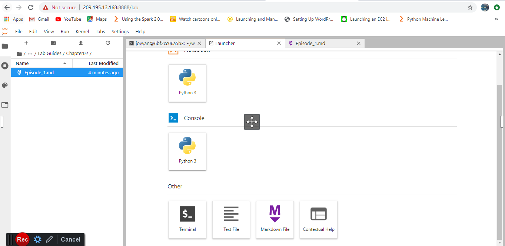

# Python machine learning by example

#### Pre-reqs:
- Docker

#### Lab Environment
We will run Jupyter Notebook as a Docker container. This setup will take some time because of the size of the image. Run the following commands one by one:

`docker run -d --user root -p 8888:8888 --name jupyter -e GRANT_SUDO=yes fenago/python-machine-learning-by-example start-notebook.sh`

#### Login

Open Jupyter Lab at port 8888 and use password `1234` to login.

#### Checkout Notebooks

Open terminal and run following command to download notebooks in `work` folder.

`cd work && git clone https://github.com/athertahir/python-machine-learning-by-example.git`

All Notebooks are downloaded in `work` folder.

